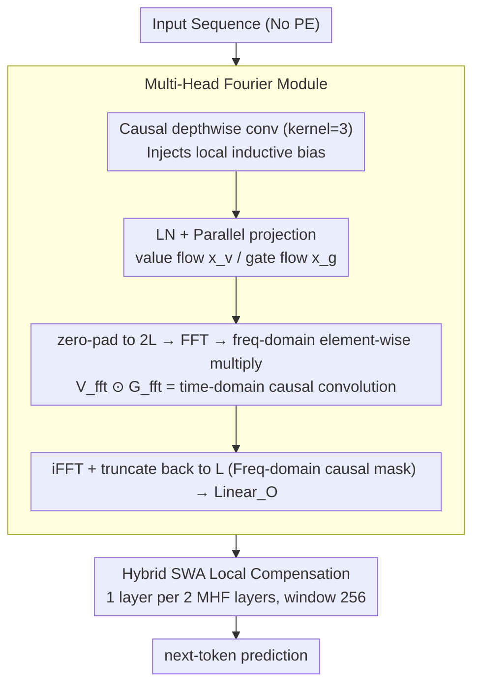

# Caracal: Causal Architecture via Spectral Mixing

**Conference**: ICML 2026  
**arXiv**: [2605.00292](https://arxiv.org/abs/2605.00292)  
**Code**: See Appendix E of the paper  
**Area**: LLM Efficiency / Sequence Modeling / Long Context  
**Keywords**: FFT, Attention Alternative, Causal Modeling, Long Sequence, SSM Comparison

## TL;DR
Caracal replaces the $\mathcal{O}(L^2)$ attention in Transformers with an $\mathcal{O}(L \log L)$ Multi-Head Fourier (MHF) module. It achieves strict causal masking in the frequency domain via a "pad-FFT-multiply-iFFT-truncate" mechanism and completely removes positional embeddings. Using only standard FFT operators (without relying on custom CUDA kernels like Mamba), it matches the performance of Llama, Mamba, Mamba-2, and Jamba across scales from Tiny to Large.

## Background & Motivation
**Background**: Long-context modeling follows two main paths: Transformer attention (strong expressivity but $\mathcal{O}(L^2)$ complexity and requiring positional embeddings) and SSMs like Mamba (linear complexity but dependent on custom CUDA kernels, leading to poor portability). Spectral methods (FNet, AFNO, SPECTRE) offer $\mathcal{O}(L \log L)$ complexity but are mostly restricted to encoder-only architectures due to the difficulty of implementing causal masking in the frequency domain.

**Limitations of Prior Work**: (1) Sparse attention (Longformer/BigBird) sacrifices information coverage; (2) Positional embeddings like RoPE/YaRN/ALiBi are "patches" with limited extrapolation capabilities; (3) Mamba-like models require SSD-style operators, which are difficult to debug and behave inconsistently across GPUs; (4) Existing spectral methods (FNet, Hyena) are either non-causal or use static position-based filters, lacking data-dependent mixing.

**Key Challenge**: The causal constraint of autoregressive generation naturally conflicts with the "global atomic operation" of the FFT. While attention can zero out the upper-triangle of a weight matrix, FFT has no explicit weight matrix to mask. Achieving causality by running a length-$t$ FFT for each step $t$ would result in $\mathcal{O}(L^2 \log L)$ complexity, slower than $\mathcal{O}(L^2)$.

**Goal**: (1) Enable FFT-based mixing to maintain strict causality in a single parallel forward pass during autoregressive training; (2) Remove positional embeddings while maintaining extrapolation; (3) Use only standard torch/numpy FFT operators without hardware dependencies; (4) Introduce data-dependent gating to compensate for the expressivity limitations of static FFT weights.

**Key Insight**: Starting from the equivalence where "frequency domain multiplication = time domain causal convolution," the input is padded to $2L$ → FFT → element-wise multiply → iFFT → truncate back to $L$. This pipeline is mathematically equivalent to a strict causal convolution, but all steps are completed using parallel FFTs.

**Core Idea**: The architecture replaces attention with a unified module combining "content-adaptive convolution kernels, FFT acceleration, and frequency-domain causality," while retaining a small amount of sliding-window attention for local precision.

## Method

### Overall Architecture
Caracal addresses the long-standing problem of maintaining strict causality in $\mathcal{O}(L \log L)$ FFT mixing for autoregresson. It keeps the GPT-2 structure largely intact (Feed-forward, LN, and residuals are preserved for ecosystem compatibility) but makes two changes: it replaces global masked multi-head attention with the frequency-domain mixing MHF module and removes positional embeddings entirely. To compensate for the FFT's weakness in local precision, a Sliding-Window Attention (SWA) layer with a window of 256 is inserted after every two MHF layers, resulting in an overall complexity of $\mathcal{O}(L \log L + L \cdot W)$.

### Key Designs

**1. Multi-Head Fourier Module: $\mathcal{O}(L \log L)$ Content-Adaptive Mixing via Frequency Domain Multiplication**

The essence of attention is a "data-dependent weight sum calculated by query/key," but it is $\mathcal{O}(L^2)$ and requires positional embeddings. MHF reformulates this as a "data-dependent weight sum where the gate stream acts as the convolution kernel," preserving selectivity while avoiding the serial scan of SSMs and using only standard FFT operators. The pipeline consists of 4 steps: first, a causal depthwise 1D conv (kernel=3) injects local inductive bias to recover local patterns lost by removing PE; next, after LayerNorm, parallel projections create the value flow $x_v = \text{Linear}_V(x_{norm})$ and the gate flow $x_g = \text{Conv1d}_{G2}(\sigma(\text{Linear}_{G1}(x_{norm})))$, where the gate flow uses group convolution by $n_{head}$ for intra-head channel interaction; then, the sequence is zero-padded to $N=2L$ for FFT to obtain $V_{fft}$ and $G_{fft}$, which are multiplied element-wise $X_{fft} = V_{fft} \odot G_{fft}$ (equivalent to the time-domain causal convolution $r_t = \sum_{j=0}^{t} v_j g_{t-j}$); finally, iFFT and truncation back to length $L$ are followed by $\text{Linear}_O$. The dynamic convolution kernel generated from the input upgrades the "static Fourier filter" to content-aware mixing.

**2. Frequency Domain Causal Masking: The Geometry of pad-FFT-multiply-iFFT-truncate**

Achieving causality with pure FFT is mathematically difficult because there is no explicit weight matrix to mask. The authors bypass this using a DSP technique: by zero-padding a sequence of length $L$ to $2L$ on the right, performing FFT, multiplying by the gate, and iFFT, only the first $L$ elements are retained. While a $2L$ FFT normally corresponds to circular convolution, truncating to the first $L$ dimensions causes it to degenerate into a linear convolution $r_t = \sum_{j=0}^{t} v_j g_{t-j}$, where dependence on future tokens is automatically removed. This uses $2\times$ sequence length to achieve "causal convolution in a single parallel forward pass," converting the causality problem into a geometric arrangement of padding and truncation.

**3. No PE + Hybrid SWA Local Compensation: Built-in Position Awareness**

Caracal removes all modern positional embeddings (RoPE, YaRN, ALiBi) since the FFT basis $e^{-i \frac{2\pi}{L} tj}$ inherently contains sequence position information. Theoretically, this makes the architecture more suitable for arbitrary context lengths. However, since pure MHF is weaker in local resolution (as seen in ARC-c drops), SWA is inserted at a 2:1 ratio (MHF:SWA) with a window of 256. Implemented via FlashAttention, SWA captures phrase-level local patterns, complementing the global long-range dependencies of MHF.

### Loss & Training
The model uses standard next-token prediction CE loss without auxiliary losses. Training follows GPT-3 style hyperparameter settings, sweeping scales from Tiny (63M) to Large (724M). For fairness, all baselines use their respective hardware-optimized kernels (Mamba uses `mamba_ssm`, Llama uses `FlashAttention`).

## Key Experimental Results

### Main Results
Evaluation on 9 zero-shot common-sense reasoning and LM tasks (LMB, Hellaswag, ARC-e/c, Wino, BoolQ, PIQA, SIQA) across 4 sizes:

| Size | Model | LMB ppl↓ | Avg acc↑ |
|------|-------|----------|----------|
| Tiny | Llama (64M) | 164.19 | 40.87 |
| Tiny | Mamba (66M) | 129.88 | 41.12 |
| Tiny | **Caracal (63M)** | 219.90 | **41.14** |
| Small | Llama (124M) | 79.94 | 43.02 |
| Small | Mamba (129M) | 86.33 | 43.60 |
| Small | Mamba2 (125M) | 100.76 | 42.64 |
| Small | **Caracal (120M)** | 92.05 | 43.35 |
| Medium | Llama (360M) | 32.65 | 47.07 |
| Medium | **Caracal (345M)** | 38.50 | 46.47 |
| Large | Llama (757M) | 24.92 | 48.73 |
| Large | **Caracal (724M)** | 29.39 | 49.01 |

Ours matches the average accuracy of Llama, Mamba, and Jamba across all sizes, slightly exceeding Llama (49.01 vs 48.73) at the Large scale.

### Ablation Study
Alignment with broader baselines under 345M parameters, 15B tokens, and 4096 context length:

| Model | LMB ppl↓ | Avg acc↑ |
|-------|----------|----------|
| Transformer++ | 41.08 | 42.92 |
| RetNet | 49.73 | 42.54 |
| GLA | 43.02 | 44.09 |
| Mamba | 40.21 | 43.59 |
| Gated DeltaNet | 30.94 | 45.42 |
| Moneta | 29.31 | 46.45 |
| Yaad | 29.11 | 45.94 |

Caracal performs in the top tier alongside Mamba and DeltaNet, significantly outperforming early Transformer++ and RetNet.

### Key Findings
- **Algorithmic "Middle Ground" replaces hardware tricks**: Replacing SSM's $\mathcal{O}(L)$ with $\mathcal{O}(L \log L)$ maintains performance while significantly reducing implementation complexity.
- **High LMB ppl on Tiny (219.90)** is a weakness of Caracal, likely due to insufficient dynamic gating fit at small capacities; however, Avg acc remains competitive, suggesting ppl $\neq$ task performance.
- **Removing PE does not cause performance drops**, indicating the implicit positional information in FFT bases is sufficient, leaving room for long-context extrapolation.
- **SWA is essential**: Ablations show pure MHF is weak on ARC-c; adding SWA at a 2:1 ratio recovers local capabilities.

## Highlights & Insights
- **Mathematically Elegant Causal Trick**: The pad-2L → FFT → multiply → iFFT → truncate pipeline is a classic DSP technique applied effectively for the first time in generative LMs with data-dependent gating.
- **Unified Vision of "Content-Adaptive Kernels"**: Attention, SSM, and FFT are viewed as different weight sources for $r_t = \sum_j w_{tj} v_j$. Attention uses query/key, S4 uses static weights, Mamba uses input-dependent states, and Caracal uses gate-generated content-aware filters.
- **Hardware Agnostic** value: It can be deployed on any hardware supporting FFT (including TPUs and NPUs) without being locked into NVIDIA GPUs.
- The approach is transferable to other causal + long-context tasks such as speech autoregression, long video generation, and protein sequence modeling.

## Limitations & Future Work
- **Theoretical complexity $\mathcal{O}(L \log L)$ is slower than SSM**: This may become a disadvantage at extreme context lengths (100k+); the paper lacks million-token experiments.
- **Lack of explicit length extrapolation experiments**: The claim that "FFT bases naturally carry position" is theoretically sound but not tested via 50k→200k zero-shot stretching.
- **2L padding wastes half the computation**: Real-world throughput against FlashAttention depends on the FFT implementation; the paper does not report speed comparisons for short contexts (1k–4k).
- Future Work: (a) Use RFFT (real FFT) to halve computation; (b) Explore aggressive MHF:SWA ratios (e.g., 4:1); (c) Apply to image autoregression for sub-quadratic ViT.

## Related Work & Insights
- **vs Mamba/Mamba-2**: Caracal is an attention alternative that doesn't require hardware kernels, offering better portability with similar performance at small-to-medium scales.
- **vs Hyena**: Hyena uses FFT with position-based filters (generated by MLP), whereas Caracal uses input-generated gate streams, closer to Mamba's selectivity.
- **vs FNet / FNO / AFNO**: These are encoder-only and non-causal; Caracal is among the first strictly causal FFT replacements.
- **vs Monarch Mixer**: Monarch uses GEMM for convolution approximations for hardware efficiency; Caracal uses standard FFT for simplicity.

## Rating
- Novelty: ⭐⭐⭐⭐
- Experimental Thoroughness: ⭐⭐⭐
- Writing Quality: ⭐⭐⭐⭐⭐
- Value: ⭐⭐⭐⭐

<!-- RELATED:START -->

## Related Papers

- [\[ICML 2026\] Spectral Guidance for Flexible and Efficient Control of Diffusion Models](spectral_guidance_for_flexible_and_efficient_control_of_diffusion_models.md)
- [\[ICML 2026\] Local Hessian Spectral Filtering for Robust Intrinsic Dimension Estimation](local_hessian_spectral_filtering_for_robust_intrinsic_dimension_estimation.md)
- [\[ICML 2026\] Learning General Causal Structures with Hidden Dynamic Process for Climate Analysis](learning_general_causal_structures_with_hidden_dynamic_process_for_climate_analy.md)
- [\[ICML 2026\] AG-REPA: Causal Layer Selection for Representation Alignment in Audio Flow Matching](ag-repa_causal_layer_selection_for_representation_alignment_in_audio_flow_matchi.md)
- [\[ICLR 2026\] VMDiff: Visual Mixing Diffusion for Limitless Cross-Object Synthesis](../../ICLR2026/image_generation/vmdiff_visual_mixing_diffusion_for_limitless_cross-object_synthesis.md)

<!-- RELATED:END -->
