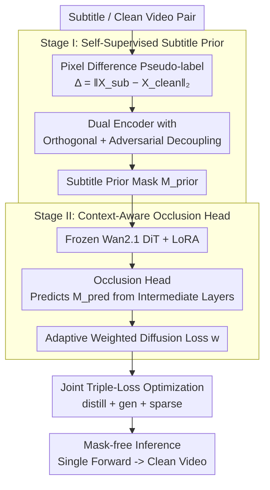

# CLEAR: Context-Aware Learning with End-to-End Mask-Free Inference for Adaptive Video Subtitle Removal

**Conference**: ICML 2026 Spotlight  
**arXiv**: [2603.21901](https://arxiv.org/abs/2603.21901)  
**Code**: https://github.com/silent-commit/CLEAR (Available)  
**Area**: Video Generation / Video Inpainting / Subtitle Removal  
**Keywords**: Video Subtitle Removal, Diffusion Models, LoRA, Self-Supervised Prior, Mask-Free Inference

## TL;DR
This paper proposes CLEAR for video subtitle removal: a two-stage training approach (Stage I learns self-supervised subtitle prior masks using a dual encoder with orthogonal decoupling; Stage II adds LoRA and an occlusion head to the Wan2.1 video diffusion model for adaptive weighting). The inference requires no masks or text detectors. By training only 0.77% of parameters, it achieves a PSNR of 26.80 dB on a Chinese test set (+6.77 dB over the strongest baseline) and demonstrates zero-shot generalization to six languages.

## Background & Motivation
**Background**: Current video subtitle removal mainly relies on mask-guided video diffusion inpainting (DiffuEraser, EraserDiT, MiniMax-Remover), which depends on external text detectors or segmentors to provide precise binary masks for every frame.

**Limitations of Prior Work**: (L1) Low training efficiency—full parameter fine-tuning plus frame-by-frame mask annotation, which requires heavy manual labor or specialized segmentation models; (L2) Fragile inference—reliance on continuous text detection/tracking, where failure leads to flickering, artifacts, or drifting; (L3) Static prior utilization—auxiliary priors (heatmaps, optical flow) are weighted uniformly, ignoring the reliability variance of subtitles across different frames and regions.

**Key Challenge**: Video subtitles exhibit temporal continuity, diverse positions/fonts, and complex coupling with camera or object motion. This requires (K1) parameter efficiency without mask annotations, (K2) fully mask-free end-to-end inference, and (K3) adaptive balancing of prior quality. Existing methods fail on all three counts.

**Goal**: Construct a framework that can learn subtitle priors in a **self-supervised** manner from subtitle/clean video pairs during training, perform **mask-free** inference, and dynamically weight subtitle regions.

**Key Insight**: Utilize the pixel difference between "subtitled frames - clean frames" as a weak-supervision pseudo-label (noisy but cheap). Isolate subtitle information via dual encoders and orthogonal constraints, then allow the diffusion model to calibrate this prior on-the-fly using an occlusion head.

**Core Idea**: Explicitly distill the "subtitle mask identification" capability into the intermediate layers of a LoRA-tuned DiT during training. This enables inference by simply feeding the subtitled video—implicitly generating $\mathcal{M}^{pred}$ internally while remaining completely mask-free externally.

## Method

### Overall Architecture
CLEAR addresses the dependency on external masks by internalizing "subtitle localization" into a video diffusion model during training. The process is divided into two stages: Stage I generates a self-supervised subtitle prior mask $\mathcal{M}^{prior}$ using pixel differences as weak supervision. Stage II freezes the Wan2.1-Fun-V1.1-1.3B video DiT, adds LoRA and a lightweight occlusion head to implicitly predict $\mathcal{M}^{pred}$ from intermediate layers, and adaptively weights the diffusion loss. The final model performs subtitle removal in a single forward pass without any external detectors.

### Key Designs

**1. Stage I Self-Supervised Subtitle Prior: Replacing Manual Masks with Pixel Differences and Orthogonal Decoupling**

To avoid expensive frame-by-frame annotations, CLEAR uses pixel difference $\Delta_t=\|\mathbf{X}^{sub}_t-\mathbf{X}^{clean}_t\|_2$ with per-frame mean+std thresholds as cheap pseudo-labels. To combat noise from lighting, transparency, and motion blur, CLEAR employs dual ResNet-50 encoders ($E_{\text{sub}},E_{\text{content}}$) to extract features $F^{sub}$ and $F^{content}$. An orthogonal loss $\mathcal{L}_{\text{ortho}}=\frac{1}{T H' W'}\sum\langle F^{sub}, F^{content}\rangle^2$ ensures the two branches are uncorrelated, while an adversarial loss $\mathcal{L}_{\text{adv}}$ prevents leakage. By requiring $F^{sub}$ to generate $\mathcal{M}^{prior}$ and $F^{content}$ to reconstruct the clean frame, the model learns abstract "occlusion patterns" rather than specific fonts, enabling zero-shot generalization across languages.

**2. Stage II Context-Aware Occlusion Head: Adaptive Weighting and Self-Calibration**

Instead of using the Stage I prior as a hard condition, CLEAR attaches a 2.1M parameter occlusion head $\mathcal{H}(\mathbf{h}_{enc})=\mathrm{Conv}^1_{1\times 1}(\mathrm{SiLU}(\mathrm{Conv}^{64}_{3\times 3}(\mathbf{h}_{enc})))$ to the DiT encoder's intermediate layers. It calculates $\mathcal{M}^{pred}=\sigma(\mathcal{H}(\mathbf{h}_{enc}))$ using latent noise, DiT semantics, and time steps to calibrate the prior. This prediction modulates the diffusion loss weights $w_{i,j,t}=(1+\alpha(k)\cdot\mathcal{M}^{pred}_{i,j,t})\cdot(\epsilon^{gen}_{i,j,t}+\delta)^\gamma$. The first part emphasizes spatial subtitle areas, while the second part (inspired by Focal Loss in RetinaNet) weights high-error regions. Crucially, the gradient of $\mathcal{L}_{\text{gen}}$ flows back through $\mathcal{M}^{pred}$, creating a self-correcting loop without GT masks.

**3. Joint Triple-Loss Optimization: Embedding Knowledge into LoRA for Mask-Free Inference**

To prevent inheriting Stage I noise or collapsing to trivial solutions, Stage II uses: $\mathcal{L}_{stage2}=\mathcal{L}_{distill}+\mathcal{L}_{gen}+0.1\cdot\mathcal{L}_{sparse}$. $\mathcal{L}_{distill}$ uses SmoothL1 to align $\mathcal{M}^{pred}\approx\mathcal{M}^{prior}$ with a tolerance margin. $\mathcal{L}_{gen}$ handles generation quality via $w$-weighting. $\mathcal{L}_{sparse}$ combines L1 sparsity with $D_{KL}(\mathcal{M}^{pred}\|\mathcal{M}^{prior})$ to prevent the mask from becoming uniform or drifting. This process bakes the subtitle removal logic into the LoRA-augmented attention (rank=64). During inference (Alg.1), the model directly outputs a clean video from a subtitled input without any external modules, eliminating cascading errors.

### Loss & Training
Stage I: $\mathcal{L}_{stage1}=\mathcal{L}_{ortho}+0.5\mathcal{L}_{adv}+\mathcal{L}_{region}+0.1\mathcal{L}_{recon}$, using AdamW (lr=$2\times 10^{-5}$) for 1 epoch (~70 min).  
Stage II: Optimized via $\mathcal{L}_{stage2}$ using AdamW (lr=$1\times 10^{-4}$, gradient clipping=1.0) for 1 epoch (~1 day on 8×A800). LoRA rank=64 is applied to q, k, v, o and ffn.0/2; $\gamma=0.8, \delta=10^{-6}$. Stage II data consists of 500 videos × 81 consecutive frames.

## Key Experimental Results

### Main Results (Chinese Subtitle Test Set, 400 Samples)

| Method | PSNR↑ | SSIM↑ | LPIPS↓ | VFID↓ | TWE↓ | Flow Var↓ | s/frame↓ |
|--------|-------|-------|--------|-------|------|-----------|---------|
| ProPainter | 17.24 | 0.658 | 0.329 | 98.46 | 1.286 | 0.885 | 2.36 |
| MiniMax-Remover | 20.03 | 0.773 | 0.166 | 95.39 | 4.222 | 0.415 | 4.90 |
| DiffuEraser | 17.85 | 0.672 | 0.458 | 72.51 | 1.523 | 0.630 | 3.47 |
| **CLEAR (mask-free)** | **26.80** | **0.894** | **0.101** | **20.37** | **1.227** | **0.029** | 4.86 |

Ours achieves PSNR +6.77 dB, VFID -74.7%, and Flow Variance -93.0% compared to Prev. SOTA. Notably, all baselines require external masks, while CLEAR is input-only.

### Ablation Study

| Configuration | PSNR↑ | VFID↓ | TWE↓ |
|---------------|-------|-------|------|
| Baseline (LoRA-only) | 21.62 | 34.74 | 1.320 |
| + M1: Stage I prior + focal weighting | 23.11 | 38.21 | 1.303 |
| + M2: Context Distillation | 24.72 | 31.73 | 1.279 |
| + M3: Context-Aware Adaptation | 25.09 | 31.56 | 1.257 |
| + M4: Context Consistency (CLEAR) | **26.80** | **20.37** | **1.227** |

| Inference setting | PSNR↑ | VFID↓ | s/frame |
|-------------------|-------|-------|---------|
| steps=5 (default) | 26.80 | 20.37 | 4.86 |
| steps=10 | 29.43 | 35.70 | 9.92 |
| cfg=1.2 | 29.65 | 40.71 | 4.86 |
| lora_scale=0.5 | 25.17 | 63.02 | 4.86 |
| lora_scale=1.5 | 27.94 | 42.16 | 4.86 |

### Key Findings
- A cumulative 5.18 dB PSNR gain is attributed to the combination of the four modules. Consistency regularization (M4) alone provides the largest VFID reduction (-35.5%), proving that preventing $\mathcal{M}^{pred}$ degradation is vital for perceptual quality.
- While steps=10 improves PSNR, VFID worsens (35.70 vs 20.37), suggesting more denoising steps introduce artifacts; 5 steps is the optimal default.
- Zero-shot performance: Although trained only on Chinese subtitles, the model successfully removes subtitles in English, Korean, French, Japanese, Russian, and German, validating the learning of abstract occlusion patterns.

## Highlights & Insights
- **Pixel Difference + Orthogonal Decoupling**: Replacing expensive mask annotations with pixel differences and using orthogonal/adversarial constraints to isolate subtitle information is an efficient data strategy.
- **Gradient Flow through $\mathcal{M}^{pred}$**: Unlike methods that detach masks, CLEAR allows gradients from the diffusion loss to flow back to the head. This creates a feedback loop where high-error regions naturally increase $\mathcal{M}^{pred}$ weights.
- **Engineering Value of Mask-Free Inference**: Eliminating dependencies on text detection/segmentation removes fragile sub-pipelines (OCR failures, tracking drift). Combined with 0.77% parameter efficiency, this is highly suitable for production deployment.

## Limitations & Future Work
- Quantitative generalization to other languages has not been fully quantified, only visualized.
- Inference speed of 4.86 s/frame (1280×720) is still far from real-time. Real-time optimization remains a future direction.
- Portability to other backbones like HunyuanVideo or Sora-based models is yet to be verified.
- The robustness of self-supervised priors against stylized, animated, or extremely translucent subtitles requires further stress testing.

## Related Work & Insights
- **Comparison with DiffuEraser / MiniMax-Remover**: CLEAR removes the need for external masks and full parameter tuning, achieving significantly higher PSNR (+6.77 dB) with only 0.77% parameters.
- **Comparison with ProPainter**: ProPainter's flow-based approach (PSNR 17.24) is significantly outperformed, indicating that modern video diffusion priors are essential for high-frequency local occlusions like subtitles.
- **Transferability**: The dual encoder + orthogonal decoupling pipeline could be extended to other localized occlusion removal tasks such as watermark or logo removal.

## Rating
- Novelty: ⭐⭐⭐⭐
- Experimental Thoroughness: ⭐⭐⭐⭐
- Writing Quality: ⭐⭐⭐⭐
- Value: ⭐⭐⭐⭐

<!-- RELATED:START -->

## Related Papers

- [\[ICML 2026\] End-to-End Autoregressive Image Generation with 1D Semantic Tokenizer](end-to-end_autoregressive_image_generation_with_1d_semantic_tokenizer.md)
- [\[ICML 2026\] AdaEraser: Training-Free Object Removal via Adaptive Attention Suppression](adaeraser_training-free_object_removal_via_adaptive_attention_suppression.md)
- [\[ICCV 2025\] End-to-End Multi-Modal Diffusion Mamba](../../ICCV2025/image_generation/end-to-end_multi-modal_diffusion_mamba.md)
- [\[NeurIPS 2025\] LinEAS: End-to-end Learning of Activation Steering with a Distributional Loss](../../NeurIPS2025/image_generation/lineas_end-to-end_learning_of_activation_steering_with_a_distributional_loss.md)
- [\[CVPR 2026\] DeCo: Frequency-Decoupled Pixel Diffusion for End-to-End Image Generation](../../CVPR2026/image_generation/deco_frequency-decoupled_pixel_diffusion_for_end-to-end_image_generation.md)

<!-- RELATED:END -->
