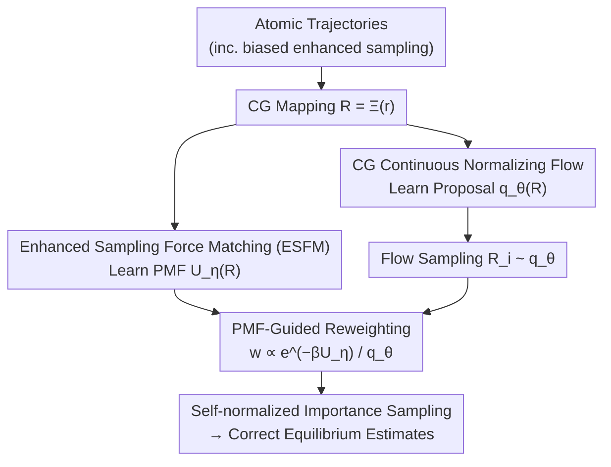

# Coarse-Grained Boltzmann Generators

**Conference**: ICML 2026  
**arXiv**: [2602.10637](https://arxiv.org/abs/2602.10637)  
**Code**: https://github.com/tummfm/cg-bg  
**Area**: Scientific Computing / Molecular Simulation  
**Keywords**: Boltzmann Generator, Coarse-grained modeling, Importance sampling, Potential of Mean Force (PMF), Normalizing Flows  

## TL;DR
The authors propose Coarse-Grained Boltzmann Generators (CG-BGs), which combine normalizing flow generative models with learned Potential of Mean Force (PMF) in coarse-grained coordinate space for importance sampling. This achieves asymptotically correct equilibrium sampling at a significantly lower computational cost compared to all-atom BGs.

## Background & Motivation

**Background**: Sampling equilibrium molecular configurations from a Boltzmann distribution is a fundamental challenge in statistical physics. Boltzmann Generators (BGs) address this by combining exact-likelihood generative models with importance sampling, generating proposal samples that are reweighted for unbiased estimation. Coarse-grained (CG) methods handle larger systems by reducing degrees of freedom.

**Limitations of Prior Work**: All-atom BGs face two bottlenecks as dimensionality increases: (1) the overlap between the generated and target distributions decreases, causing importance weight variance to explode and reweighting to fail; (2) the computational cost of the Jacobian determinant scales poorly with dimension. Conversely, Boltzmann Emulators improve scalability via CG dimensionality reduction but omit reweighting, failing to correct distribution bias, and rely on hard-to-obtain long unbiased simulation data for training.

**Key Challenge**: BGs possess a reweighting mechanism but lack scalability; CG Emulators are scalable but lack a correction mechanism—the strengths of both are complementary but have not been integrated.

**Goal**: Implement generative modeling with importance sampling in coarse-grained coordinate space, while learning the target energy function from rapidly converging enhanced sampling data.

**Key Insight**: The marginal distribution $p(\mathbf{R})$ in coarse-grained coordinates can also be expressed in Boltzmann form $p(\mathbf{R}) \propto e^{-\beta U(\mathbf{R})}$, where $U(\mathbf{R})$ is the Potential of Mean Force (PMF). If the PMF can be learned, the BG importance sampling framework can be repurposed in the low-dimensional CG space.

**Core Idea**: Use Enhanced Sampling Force Matching (ESFM) to learn the PMF from rapidly converging biased trajectories, use normalizing flows to generate proposal distributions in CG space, and use the learned PMF for importance reweighting to form the complete CG-BG framework.

## Method

### Overall Architecture
CG-BG resolves the conflict between reweighting and scalability by operating the entire BG framework in a low-dimensional coarse-grained coordinate space. Atomic trajectories (including biased enhanced sampling data) are first mapped to CG coordinates via $\mathbf{R} = \Xi(\mathbf{r})$. Two components are then trained in parallel: a Continuous Normalizing Flow $q_\theta(\mathbf{R})$ responsible for generating proposal configurations, and a neural network PMF $U_\eta(\mathbf{R})$ providing the target energy. During inference, the flow model samples configurations, the PMF calculates importance weights $w(\mathbf{R}) \propto e^{-\beta U_\eta(\mathbf{R})} / q_\theta(\mathbf{R})$, and self-normalized importance sampling converts biased proposals into asymptotically correct equilibrium estimates.

### Key Designs

**1. Enhanced Sampling Force Matching (ESFM): Learning PMF from Biased Data**

Standard force matching requires converged unbiased equilibrium trajectories, which transition slowly between metastable states and are expensive to collect. ESFM bypasses this using fiber distribution invariance: applying an arbitrary bias potential $V(\mathbf{R})$ in CG coordinates does not change the atomic conditional distribution given $\mathbf{R}$, i.e., $p_V(\mathbf{r}|\mathbf{R}) = p(\mathbf{r}|\mathbf{R})$. Since the conditional distribution remains unchanged, the conditional mean of projected forces (the mean force) is invariant under biased sampling. The training loss is $\mathcal{L}_{\mathrm{ESFM}}(\eta) = \mathbb{E}_{\mathbf{r} \sim \mathcal{D}_{\mathrm{bias}}}[\|\nabla_{\mathbf{R}} U_\eta(\Xi(\mathbf{r})) + \mathcal{F}_{\mathrm{proj}}(\mathbf{r})\|^2]$, where projected forces are recalculated from the unbiased atomic potential. This allows training PMFs using data from fast-converging methods like well-tempered metadynamics.

**2. CG Space Continuous Normalizing Flow: Low-Dimensional Proposal Generation**

The proposal distribution must closely match the target marginal distribution to prevent weight variance explosion. CG-BG uses Flow Matching to train a neural vector field $v_\theta(t, \mathbf{x})$ along a linear interpolation path $\mathbf{x}_t = (1-t)\mathbf{x}_0 + t\mathbf{x}_1$ to learn $q_\theta(\mathbf{R})$. Operating in CG space significantly reduces dimensionality—for example, alanine hexapeptide is reduced from 72 atoms to a few beads. This reduction improves overlap between generated and target distributions, resulting in higher Effective Sample Size (ESS) and lower computational costs for Jacobian calculations.

**3. PMF-Guided Importance Reweighting: Correcting Proposals**

Unlike Boltzmann Emulators that estimate observables directly from $q_\theta$, CG-BG treats the learned PMF as the target energy. For each sample $\mathbf{R}_i \sim q_\theta$, it calculates importance weights $w(\mathbf{R}_i) \propto e^{-\beta U_\eta(\mathbf{R}_i)} / q_\theta(\mathbf{R}_i)$. Observables are then calculated using self-normalized estimators. Quality is measured by normalized Effective Sample Size $\mathrm{ESS} = (\sum w_i)^2 / (B \sum w_i^2)$. Since the PMF is learned from explicit solvent data, it captures solvent-mediated effects that implicit solvent models cannot, allowing CG-BG to exceed the accuracy limits of typical all-atom BGs.

### Loss & Training
The two components are trained independently: the PMF network via ESFM loss on biased or unbiased atomic trajectories, and the normalizing flow via Conditional Flow Matching on CG coordinate data. These processes can be executed in parallel.

## Key Experimental Results

### Main Results

Evaluations were performed on alanine dipeptide (22 atoms), tripeptide (42 atoms), and hexapeptide (72 atoms), using explicit solvent MD as reference.

| Model | JS Divergence (↓) | PMF Error (↓) | ESS (↑) |
|------|------------|-------------|---------|
| CG-BG Heavy Atom | 0.0048 | 0.2005 | 0.5112 |
| CG-BG Heavy Atom (Biased) | 0.0063 | 0.2277 | 0.4115 |
| CG-BG Core Beta | 0.0052 | 0.2210 | 0.5528 |
| CG-BG Core Beta (Biased) | 0.0057 | 0.2093 | 0.4818 |
| Implicit Solvent GB (OBC1) | 0.0157 | 0.3709 | — |
| Implicit Solvent GB (OBC2) | 0.0182 | 0.4028 | — |

### Efficiency Comparison (Alanine Dipeptide, $10^4$ samples)

| CG Mapping | Training Time | Inference Time | Total Time |
|---------|---------|---------|--------|
| Core Beta | 0.45h | 0.95min | 0.47h |
| Heavy Atom | 0.80h | 3.78min | 0.86h |
| All Atom (Solute only) | 2.55h | 14.91min | 2.80h |

### Larger System Validation (Tripeptide & Hexapeptide)

| Model | Tripeptide JS (↓) | Tripeptide PMF (↓) | Tripeptide ESS (↑) | Hexapeptide JS (↓) | Hexapeptide PMF (↓) | Hexapeptide ESS (↑) |
|------|------------|-------------|-------------|------------|-------------|-------------|
| CG-BG Core Beta | 0.0060 | 0.2112 | 0.4212 | 0.0100 | 0.3646 | 0.1231 |
| CG-BG Heavy Atom | 0.0056 | 0.1957 | 0.3201 | — | — | — |
| Implicit Solvent GB (OBC2) | 0.0932 | 1.0274 | — | 0.1652 | 1.8401 | — |

### Key Findings
- Reweighted CG-BG significantly outperforms implicit solvent baselines, with the gap widening in larger systems (e.g., hexapeptide JS divergence 0.0100 vs 0.1652).
- There is a precision-efficiency trade-off in CG resolution: Core Beta mapping offers higher ESS (better overlap) but slightly lower accuracy after reweighting than Heavy Atom mapping.
- CG-BG trained on 10ns biased data achieves accuracy comparable to models trained on 500ns unbiased data, proving ESFM's data efficiency.
- CG-BG breaks the implicit solvent accuracy ceiling that limits traditional all-atom BGs.

## Highlights & Insights
- **Clever Use of Fiber Distribution Invariance**: The equivalence of force matching targets under biased sampling allows the replacement of expensive unbiased trajectories with rapidly converging enhanced sampling data.
- **Simulation-free PMF Evaluation**: Once a proposal distribution is learned, multiple candidate CG force fields can be evaluated by simply switching the target PMF for reweighting, significantly accelerating CG force field development.
- **Complementary CG + Reweighting Design**: Coarse-graining addresses dimensionality to keep ESS manageable, while reweighting corrects distribution bias to ensure asymptotic correctness.

## Limitations & Future Work
- Dependency on pre-defined collective variables (CG mapping and enhanced sampling CVs); selection may be difficult for complex systems.
- Experimental validation is limited to small peptides (≤72 atoms); performance on large protein systems remains to be tested.
- ESS for hexapeptide drops to 0.1231, suggesting efficiency may decrease further with system size.
- Future directions include automated CV discovery, transferrable generative architectures, and exploring energy-based training as an alternative to Flow Matching.

## Related Work & Insights
- **Boltzmann Generator** (Noé et al., 2019): Original all-atom framework using flows and reweighting, limited by dimension.
- **Boltzmann Emulator** (Lewis et al., 2025): CG generative model lacking reweighting, dependent on converged data.
- **ESFM** (Chen et al., 2026): Theoretical foundation for force matching equivalence under bias.
- **TarFlow / ECNF++** (Tan et al., 2025b): Advanced all-atom BG architectures still limited by implicit solvent accuracy.

<!-- RELATED:START -->

## Related Papers

- [\[NeurIPS 2025\] BoltzNCE: Learning Likelihoods for Boltzmann Generation with Stochastic Interpolants](../../NeurIPS2025/image_generation/boltznce_learning_likelihoods_for_boltzmann_generation_with_stochastic_interpola.md)
- [\[NeurIPS 2025\] Flatten Graphs as Sequences: Transformers are Scalable Graph Generators](../../NeurIPS2025/image_generation/flatten_graphs_as_sequences_transformers_are_scalable_graph_generators.md)
- [\[NeurIPS 2025\] Progressive Inference-Time Annealing of Diffusion Models for Sampling from Boltzmann Densities](../../NeurIPS2025/image_generation/progressive_inference-time_annealing_of_diffusion_models_for_sampling_from_boltz.md)
- [\[CVPR 2025\] Community Forensics: Using Thousands of Generators to Train Fake Image Detectors](../../CVPR2025/image_generation/community_forensics_using_thousands_of_generators_to_train_fake_image_detectors.md)
- [\[CVPR 2026\] SliderEdit: Continuous Image Editing with Fine-Grained Instruction Control](../../CVPR2026/image_generation/slideredit_continuous_image_editing_with_fine-grained_instruction_control.md)

<!-- RELATED:END -->
