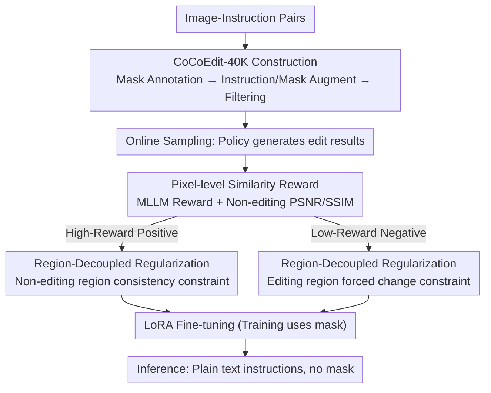

# CoCoEdit: Content-Consistent Image Editing via Region Regularized Reinforcement Learning

**Conference**: ICML 2026  
**arXiv**: [2602.14068](https://arxiv.org/abs/2602.14068)  
**Code**: https://github.com/CoCoEdit (Available)  
**Area**: Image Generation / Instructive Image Editing / RL Post-training  
**Keywords**: Content-consistent editing, pixel-level similarity reward, regional regularization, DiffusionNFT, FLUX/Qwen-Image-Edit

## TL;DR
This paper addresses the issue where "editing models often make unintended changes in regions that should remain static." It constructs the CoCoEdit-40K local editing dataset, proposes a pixel-level similarity reward to supplement the MLLM reward, and designs a region-regularized RL objective (where high-reward samples constrain non-editing region consistency and low-reward samples force changes in editing regions). These methods improve both FLUX.1 Kontext and Qwen-Image-Edit in terms of editing scores and PSNR/SSIM, breaking the existing trade-off where enhancing editing capability typically compromises consistency.

## Background & Motivation
**Background**: Modern instructive editing models (FLUX.1 Kontext, Qwen-Image-Edit, Step1X-Edit, BAGEL, OmniGen2) have achieved strong instruction understanding through massive data and powerful generation backbones. Recently, works like Edit-R1 and MotionNFT have further pushed editing scores using RL (DPO/PPO/GRPO/DiffusionNFT) with MLLM rewards for post-training.

**Limitations of Prior Work**: (i) While editing models perform well in target regions, **non-editing regions** are often modified unintentionally—for example, a background pillow might disappear while editing a foreground person. (ii) Current RL post-training relies solely on MLLM rewards, which are insensitive to fine-grained pixel differences in non-editing regions. This pushes models toward "drastic image modifications to achieve higher scores," leading to significant PSNR drops (e.g., Edit-R1 reduces FLUX's PSNR by 5.15 dB).

**Key Challenge**: Editing capability (MLLM Score) and content consistency (PSNR) are in conflict under existing training objectives. MLLM rewards are spatially agnostic scalars insensitive to small changes; using them for RL inevitably sacrifices consistency.

**Goal**: Construct a post-training framework that simultaneously drives (i) accurate editing and (ii) strict preservation of non-editing regions without requiring additional masks during inference (maintaining a fair comparison with baselines), and modify benchmarks to make consistency quantitatively evaluable.

**Key Insight**: (a) Use MLLM + SAM2 for offline annotation of editing masks and rewritten instructions for each training sample; (b) Supplement the reward end with a pixel-level similarity reward (masked PSNR/SSIM) to quantify detailed differences invisible to MLLMs; (c) At the loss end, use masks to decouple latents into editing and non-editing regions, applying region-level regularization to positive and negative samples, respectively.

**Core Idea**: Inject "non-editing region consistency" into RL post-training as **both** a reward and a region-aware regularizer. High-reward samples (successful edits) preserve non-editing regions, while low-reward samples (under-edited) are forced to make changes in the editing region—forming a bidirectional correction loop for positive and negative samples.

## Method

### Overall Architecture
To solve the "unintended modifications of non-editing regions," which stems from RL post-training focusing only on spatially agnostic MLLM scalar rewards, CoCoEdit incorporates consistency into both the reward and regularization. It employs a three-step RL cycle per iteration: upgrading image-instruction data into masked triplets offline, sampling online, scoring with "MLLM + pixel" rewards, and applying spatial constraints via regional regularization. Masks are used only during training; inference remains pure text-to-image via LoRA.

### Key Designs

**1. CoCoEdit-40K: RL-Friendly Data Filtered by "Condition Signal Quality" Rather Than "GT Quality"**

The subsequent pixel reward and regional regularization depend on accurate masks. Since OmniEdit/ImgEdit only provide image-instruction pairs, the first step is an offline pipeline to upgrade them into (image, mask, refined instruction) triplets. This involves three steps: Mask Annotation (Qwen2.5-VL for bbox, SAM2 for mask); Instruction & Mask Augmentation (expanding short instructions into refined ones with spatial/attribute details and dilating masks for generative edits); and Data Filtering based on instruction clarity, mask accuracy, and target prominence.

The key difference lies in the filtering criteria: traditional datasets for SFT filter based on "how good the ground-truth edited image looks." However, RL does not learn from ground-truth pixels but explores via rewards. What is truly needed are "clear instructions + accurate masks." This strategy is coupled with RL objectives, which is why it shows little gain under SFT in ablation studies.

**2. Pixel-level Similarity Reward $r_{sim}$: Quantifying Invisible Non-editing Region Drift**

MLLM rewards are spatial scalars that might give similar scores to images with the same pose but different background details (e.g., a missing pillow). Consequently, non-editing regions drift during RL. CoCoEdit adds a pixel-level similarity term: given input $\hat c_I$, output $\hat x_0$, and mask $m$, it calculates $\mathrm{PSNR}_m$ and $\mathrm{SSIM}_m$ specifically for **non-editing regions**. After normalizing PSNR to $[0,1]$, the mean is taken as $r_{sim}$. The final reward is $r=\mathrm{op}(\lambda_{mllm}\, r_{mllm}+\lambda_{sim}\, r_{sim})$, where $\mathrm{op}(\cdot)$ is an optimality transformation. This makes preservation a differentiable optimization target.

However, weights must lean toward the MLLM: defaults are $\lambda_{mllm}=0.8, \lambda_{sim}=0.2$. If $\lambda_{sim}$ is increased to $0.5$, the model may stop editing altogether to maximize the consistency score.

**3. Region-Decoupled Regularization $L_{ner}^+$ and $L_{er}^-$: Avoiding Goal Conflicts via Sample Partitioning**

Scalar rewards lack spatial information and cannot simultaneously enforce "change the editing region" and "keep the non-editing region identical." These goals conflict in a single loss. Using the $x$-prediction formula from DiffusionNFT, CoCoEdit obtains positive policy output $x_\theta^+(x_t\mid c)$ and negative policy output $x_\theta^-(x_t\mid c)$. Lower-sampled mask $\tilde m$ defines two projection operators $P_{ner}(z)=z\odot\tilde m$ and $P_{er}(z)=z\odot(1-\tilde m)$. For **high-reward (positive) samples**, $L_{ner}^+=\max(0,\, d(x_\theta^+, c_I)_{\tilde m}-\tau^+)$ forces similarity in non-editing regions with a hinge threshold $\tau^+$. For **low-reward (negative) samples**, $L_{er}^-=\max(0,\, \tau^- - d(x_\theta^-, c_I)_{1-\tilde m})$ forces a difference in editing regions greater than $\tau^-$ to prevent under-editing.

This partitioning works because the same loss transmits gradients in opposite directions for different samples: positive samples learn "don't destroy elsewhere," while negative samples learn "change what needs to be changed." This fits naturally with NFT’s implicit positive/negative policy framework.

### Loss & Training
The total objective is weighted by reward: $\mathcal{L}(\theta)=\mathbb{E}[r\cdot(\mathcal{L}^+ + \lambda_{ner}L_{ner}^+)+(1-r)\cdot(\mathcal{L}^- + \lambda_{er}L_{er}^-)]$, where the base terms are $\mathcal{L}^\pm=\|x_\theta^\pm-x_0\|_2^2$ and $v_\theta^\pm = (1\mp\beta)v^{old}\pm\beta v_\theta$. Training uses LoRA (rank=32) on FLUX.1 Kontext and Qwen-Image-Edit for 1K steps with 8×A800 (batch 3, group 12). VRAM ≈ 70 GB, and iteration time is ≈ 12 min.

## Key Experimental Results

### Main Results (GEdit-Bench-EN, including PSNR/SSIM/LPIPS/DINO + Rank)

| Method | Overall↑ | PSNR↑ | SSIM↑ | LPIPS↓ | DINO↑ | Human Rank↓ |
|--------|---------|-------|-------|--------|-------|-------------|
| FLUX.1 Kontext | 6.286 | 24.168 | 0.825 | 0.150 | 0.871 | 2.1 |
| w/ Edit-R1 | 7.113 | 19.013 | 0.716 | 0.214 | 0.804 | 2.6 |
| **w/ CoCoEdit** | 6.939 | **25.331** | **0.874** | **0.139** | **0.882** | **1.6** |
| Qwen-Image-Edit | 7.560 | 19.488 | 0.662 | 0.185 | 0.831 | 2.7 |
| w/ Edit-R1 | 7.746 | 18.441 | 0.639 | 0.214 | 0.804 | 3.3 |
| w/ MotionNFT | 7.711 | 18.709 | 0.642 | 0.201 | 0.813 | 2.9 |
| **w/ CoCoEdit** | **7.754** | **22.283** | **0.774** | **0.162** | **0.852** | **1.4** |

On Qwen-Image-Edit, CoCoEdit achieves the highest editing score (7.754) and highest PSNR (22.283, +2.8 dB), while Edit-R1/MotionNFT sacrifice PSNR for score. Similar gains are seen on ImgEdit-Bench (+1.16 dB / +1.49 dB).

### Ablation Study

| Setting | GEdit Overall↑ | GEdit PSNR↑ | ImgEdit Overall↑ | ImgEdit PSNR↑ |
|---------|--------------|-------------|-----------------|----------------|
| Qwen-Image-Edit (base) | 7.560 | 19.488 | 3.70 | 17.635 |
| w/ SFT on 40K (incl. consistency loss) | 7.219 | 20.293 | 3.61 | 18.048 |
| w/ RL on 120K | 7.723 | 22.204 | 3.79 | 19.201 |
| **w/ RL on 40K (CoCoEdit)** | **7.754** | 22.283 | 3.79 | 19.125 |

| Reward Ratio | Observation |
|------------|------|
| $\lambda_{mllm}=0.5,\lambda_{sim}=0.5$ | Score collapses, PSNR surges → Model stops editing |
| $\lambda_{mllm}=0.8,\lambda_{sim}=0.2$ | Editing rises steadily; consistency has an upper bound |
| + Region Regularization | Further score improvement + faster convergence |

### Key Findings
- 40K high-quality data is sufficient for RL convergence; scaling to 120K yields negligible gain, confirming RL values quality over scale.
- SFT with consistency loss only slightly improves PSNR while Overall scores drop. This shows CoCoEdit targets RL algorithms rather than data fitting.
- Edit-R1 slashes PSNR by 5.15 dB on FLUX and 1.04 dB on Qwen, verifying that current RL post-training over-prioritizes capability at the cost of consistency.
- Global edits (style/tone) remain competitive; structure-preserving style transfers actually benefit from the pixel-consistency training.

## Highlights & Insights
- **Dual Philosophy (Reward & Regularizer)**: MLLM rewards guide broad direction, pixel rewards handle details, and regional regularization enforces spatial constraints. These signals complement each other across dimensions, preventing any single signal from causing side effects (e.g., pure pixel rewards causing zero editing).
- **Partitioned Regional Regularization**: Placing "non-editing consistency" on positive samples and "forced editing" on negative samples leverages the implicit policy structure of DiffusionNFT to achieve an automatic trade-off.
- **Transferable Data Strategy**: Shifting from filtering by "GT image quality" (SFT-centric) to "condition signal quality" (RL-centric) provides a roadmap for other RL post-training tasks like video or 3D editing.
- **Training with Masks, Inference without**: Unlike methods like FireEdit that require masks at runtime, CoCoEdit allows for a fair comparison with base models—a crucial design choice for practical deployment.

## Limitations & Future Work
- Validated only on FLUX.1 Kontext and Qwen-Image-Edit; generalizability to models like Step1X-Edit or OmniGen2 requires further testing.
- Training data is localized; global style/tone edits show no major degradation but also no significant improvement.
- Regional regularization thresholds $\tau^\pm$ are adaptive but require type-specific tuning; very large edits (e.g., 90% replacement) may cause the regularizer to fail as masks degrade to all ones.
- Training costs remain high due to MLLM-as-reward servers.

## Related Work & Insights
- **vs Edit-R1 (UniWorld-V2)**: Both use DiffusionNFT for editing RL, but Edit-R1 uses generation datasets and only MLLM rewards. CoCoEdit uses editing data + pixel rewards + regional regularization, outperforming Edit-R1 in PSNR by 6.3 dB on FLUX.
- **vs MotionEdit / MotionNFT**: MotionNFT improves motion editing scores; CoCoEdit provides a more general consistency framework and matches MotionNFT while leading in other categories.
- **vs DPO / PPO / GRPO**: CoCoEdit uses DiffusionNFT to avoid policy gradients. This suggests that in "noisy reward + strong spatial awareness" scenarios like image editing, positive/negative strategy comparison is more stable than pure PG.
- **vs SeedEdit / Step1X-Edit**: These are powerful baselines trained on massive data. CoCoEdit shows that Top-tier models can be further improved with only 40K samples and 1K RL iterations, making it highly resource-friendly.

## Rating
- Novelty: ⭐⭐⭐⭐ The combination of pixel-level rewards and sample-partitioned regional regularization is a first for this sub-direction.
- Experimental Thoroughness: ⭐⭐⭐⭐ Strong coverage across two base models, two benchmarks, multiple baselines, and human evaluation.
- Writing Quality: ⭐⭐⭐⭐ Clear explanation of the three-step cycle and natural derivation of motivations.
- Value: ⭐⭐⭐⭐⭐ Extremely high industrial value as it solves a major pain point in deploying editing models and can be applied as a plug-and-play enhancement to existing SOTA models.

<!-- RELATED:START -->

## Related Papers

- [\[CVPR 2026\] Leveraging Verifier-Based Reinforcement Learning in Image Editing](../../CVPR2026/image_generation/leveraging_verifier-based_reinforcement_learning_in_image_editing.md)
- [\[ICML 2026\] Path-Coupled Bellman Flows for Distributional Reinforcement Learning](path-coupled_bellman_flows_for_distributional_reinforcement_learning.md)
- [\[ICML 2026\] Offline Multi-agent Reinforcement Learning via Sequential Score Decomposition](offline_multi-agent_reinforcement_learning_via_sequential_score_decomposition.md)
- [\[ECCV 2024\] RegionDrag: Fast Region-Based Image Editing with Diffusion Models](../../ECCV2024/image_generation/regiondrag_fast_region-based_image_editing_with_diffusion_models.md)
- [\[ICML 2026\] Content-Style Identification via Differential Independence](content-style_identification_via_differential_independence.md)

<!-- RELATED:END -->
