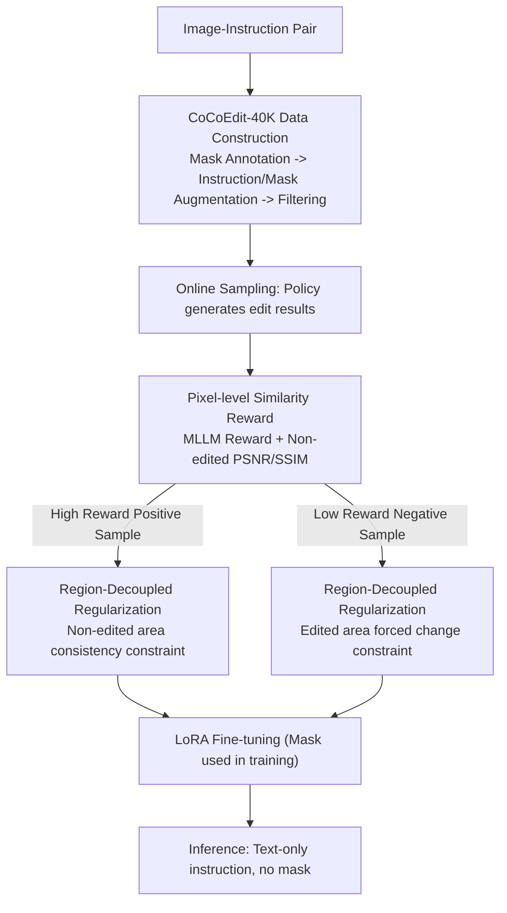

# CoCoEdit: Content-Consistent Image Editing via Region Regularized Reinforcement Learning

**Conference**: ICML 2026  
**arXiv**: [2602.14068](https://arxiv.org/abs/2602.14068)  
**Code**: https://github.com/CoCoEdit (Available)  
**Area**: Image Generation / Instructed Image Editing / RL Post-training  
**Keywords**: Content-consistent editing, pixel-level similarity reward, region regularization, DiffusionNFT, FLUX/Qwen-Image-Edit

## TL;DR
To address the issue where "editing models often make unintended changes in non-edited regions," this paper constructs the CoCoEdit-40K local editing dataset, proposes a pixel-level similarity reward to complement MLLM rewards, and designs a region-regularized RL objective (constraining consistency in non-edited regions for high-reward samples and forcing changes in edited regions for low-reward samples). This improves both FLUX.1 Kontext and Qwen-Image-Edit in edit scores and PSNR/SSIM, breaking the existing trade-off where "improving editing capability inevitably hurts consistency."

## Background & Motivation
**Background**: Modern instructed editing models (FLUX.1 Kontext, Qwen-Image-Edit, Step1X-Edit, BAGEL, OmniGen2) have achieved strong instruction following through massive data and powerful backbones. Recently, works like Edit-R1 and MotionNFT have used RL (DPO/PPO/GRPO/DiffusionNFT) with MLLM rewards for post-training to further push editing scores.

**Limitations of Prior Work**: (i) Editing models perform well in target regions but often modify **non-edited regions** unintentionally—for instance, a background pillow might disappear while editing a foreground person. (ii) Existing RL post-training relies solely on MLLM rewards, which are insensitive to fine-grained pixel differences in non-edited regions. This pushes models to "radically alter images for higher scores," leading to a significant drop in PSNR (e.g., Edit-R1 reduces FLUX's PSNR by 5.15 dB).

**Key Challenge**: Editing capability (MLLM Score) and content consistency (PSNR) are in conflict under current training objectives: MLLM rewards are spatial-agnostic scalars insensitive to small changes, and using them for RL inevitably sacrifices consistency.

**Goal**: Construct a post-training framework that simultaneously drives (i) accurate editing and (ii) strict preservation of non-edited regions, without requiring extra masks at inference time (to maintain fairness with baselines), along with modified benchmarks for quantifiable consistency evaluation.

**Key Insight**: (a) Use MLLM + SAM2 for offline annotation of editing masks and refined instructions for each training sample; (b) Supplement the reward side with a pixel-level similarity reward (masked PSNR/SSIM) to quantify detail differences invisible to MLLMs; (c) Use masks to decouple the latent into edited and non-edited regions at the loss side, applying region-level regularization separately for positive and negative samples.

**Core Idea**: Inject "non-edited region consistency" into RL post-training as both a reward and a region-aware regularizer. High-reward samples (successful edits) are used to preserve non-edited regions, while low-reward samples (under-edited) force changes in the edited regions—forming a dual-directional correction loop.

## Method

### Overall Architecture
The core issue is unintended modifications to non-edited regions caused by spatial-agnostic MLLM scalar rewards. CoCoEdit embeds "non-edited consistency" into both the reward and regularization components through a three-step RL loop per iteration: upgrade standard image-instruction data to mask-aware triples offline, perform online sampling scored by "MLLM reward + pixel reward," apply spatial constraints via region regularization to positive/negative samples, and finally use LoRA for training while keeping inference mask-free.

### Key Designs

**1. CoCoEdit-40K: RL-friendly data filtered by "condition signal quality" rather than "GT quality"**

The subsequent pixel rewards and region regularization rely on accurate masks. Since OmniEdit/ImgEdit only provide image-instruction pairs, the first step is an offline pipeline to upgrade them to (image, mask, refined instruction) triples. The process includes Mask Annotation (Qwen2.5-VL-72B for bboxes, SAM2 for masks), Instruction & Mask Augmentation (expanding short prompts to include spatial and attribute details, and dilating masks for replace/motion edits), and Data Filtering (scoring by instruction clarity, mask accuracy, and target prominence).

The key difference lies in the filtering criteria: traditional datasets for SFT filter based on "how good the GT edited image looks," but RL does not learn the ground-truth pixels; it explores via rewards. It requires "clear instructions + accurate masks." This strategy is coupled with RL objectives, which is why it provides little gain under SFT in ablation studies.

**2. Pixel-level similarity reward $r_{sim}$: Turning invisible drifts into optimizable signals**

MLLM rewards give similar scores to images with the same pose but slightly different background details (e.g., Fig.5 where a pillow disappears but the MLLM score doesn't drop). CoCoEdit adds a pixel-level similarity term: for input $\hat c_I$, output $\hat x_0$, and mask $m$, compute $\mathrm{PSNR}_m$ and $\mathrm{SSIM}_m$ only for the **non-edited region**. Normalizing PSNR to $[0,1]$ and averaging it with SSIM yields $r_{sim}$. The final reward is $r=\mathrm{op}(\lambda_{mllm}\, r_{mllm}+\lambda_{sim}\, r_{sim})$, where $\mathrm{op}(\cdot)$ is an optimality transform. This makes "preserving non-edited regions" a differentiable objective.

Weights are biased toward the MLLM: defaults are $\lambda_{mllm}=0.8, \lambda_{sim}=0.2$. Setting $\lambda_{sim}=0.5$ leads to cases where the model stops editing entirely to maximize consistency rewards.

**3. Region-decoupled regularization $L_{ner}^+$ and $L_{er}^-$: Using positive/negative sample treatment to avoid conflicting goals**

Scalar rewards lack spatial information and cannot simultaneously enforce "change the edit region" and "keep the non-edited region." CoCoEdit adopts the DiffusionNFT $x$-prediction formula to obtain positive policy output $x_\theta^+(x_t\mid c)$ and negative policy output $x_\theta^-(x_t\mid c)$. Using downsampled mask $\tilde m$ and projection operators $P_{ner}(z)=z\odot\tilde m$ and $P_{er}(z)=z\odot(1-\tilde m)$, constraints are assigned to different samples. For **high-reward (positive) samples**, $L_{ner}^+=\max(0,\, d(x_\theta^+, c_I)_{\tilde m}-\tau^+)$ forces similarity to the input in non-edited regions with a hinge threshold $\tau^+$. For **low-reward (negative) samples**, $L_{er}^-=\max(0,\, \tau^- - d(x_\theta^-, c_I)_{1-\tilde m})$ forces the edited region to differ from the input by at least $\tau^-$, preventing under-editing.

This works because the same loss transmits opposite gradients across different samples: positive samples "don't break other areas," and negative samples "start changing the target area." This fits naturally with the implicit policy framework of NFT.

### Loss & Training
The total objective weights positive and negative branches by reward: $\mathcal{L}(\theta)=\mathbb{E}[r\cdot(\mathcal{L}^+ + \lambda_{ner}L_{ner}^+)+(1-r)\cdot(\mathcal{L}^- + \lambda_{er}L_{er}^-)]$, where $\mathcal{L}^\pm=\|x_\theta^\pm-x_0\|_2^2$. Training uses LoRA rank=32 for FLUX.1 Kontext and Qwen-Image-Edit. Hardware: 8×A800, batch 3, group 12, 1K steps, VRAM ≈ 70 GB, ≈ 12 min per step (2 min slower than Edit-R1).

## Key Experimental Results

### Main Results (GEdit-Bench-EN, including PSNR/SSIM/LPIPS/DINO + Rank)

| Method | Overall↑ | PSNR↑ | SSIM↑ | LPIPS↓ | DINO↑ | Human Rank↓ |
|--------|---------|-------|-------|--------|-------|-------------|
| FLUX.1 Kontext | 6.286 | 24.168 | 0.825 | 0.150 | 0.871 | 2.1 |
| w/ Edit-R1 | 7.113 | 19.013 | 0.716 | 0.214 | 0.804 | 2.6 |
| **w/ CoCoEdit** | 6.939 | **25.331** | **0.874** | **0.139** | **0.882** | **1.6** |
| Qwen-Image-Edit | 7.560 | 19.488 | 0.662 | 0.185 | 0.831 | 2.7 |
| w/ Edit-R1 | 7.746 | 18.441 | 0.639 | 0.214 | 0.804 | 3.3 |
| w/ MotionNFT | 7.711 | 18.709 | 0.642 | 0.201 | 0.813 | 2.9 |
| **w/ CoCoEdit** | **7.754** | **22.283** | **0.774** | **0.162** | **0.852** | **1.4** |

On Qwen-Image-Edit, CoCoEdit achieves the highest edit score (7.754) and highest PSNR (22.283, +2.8 dB), whereas Edit-R1/MotionNFT show improved edit scores but decreased PSNR.

### Ablation Study

| Setting | GEdit Overall↑ | GEdit PSNR↑ | ImgEdit Overall↑ | ImgEdit PSNR↑ |
|---------|--------------|-------------|-----------------|----------------|
| Qwen-Image-Edit (base) | 7.560 | 19.488 | 3.70 | 17.635 |
| w/ SFT on 40K (with consistency loss) | 7.219 | 20.293 | 3.61 | 18.048 |
| w/ RL on 120K | 7.723 | 22.204 | 3.79 | 19.201 |
| **w/ RL on 40K (CoCoEdit)** | **7.754** | 22.283 | 3.79 | 19.125 |

### Key Findings
- 40K high-quality samples are sufficient for RL convergence; scaling to 120K yielded negligible gains, confirming RL values quality over quantity.
- SFT with consistency loss shows minor PSNR gains but lower overall scores (7.219 < 7.560), indicating the benefit comes primarily from the RL algorithm and region regularizers.
- Edit-R1 drops PSNR by 5.15 dB on FLUX and 1.04 dB on Qwen, verifying the motivation that current RL post-training sacrifices consistency for edit capability.
- Global editing (style/tone) remains competitive, with Style even seeing slight gains, suggesting pixel consistency benefits structure-preserving global transformations.

## Highlights & Insights
- **Dual-pronged philosophy of reward and regularizer**: MLLM rewards guide the macro direction, pixel rewards oversee details, and region regularization handles spatial constraints. These complement each other to avoid side effects (like refusing to edit or radical corruption).
- **Region-decoupled regularization for positive/negative samples**: Placing consistency on positive samples and forced change on negative samples utilizes the implicit policy pairs in DiffusionNFT efficiently, allowing gradients to trade off automatically.
- **Transferable data strategy**: Instead of "GT quality," filtering by "condition signal quality" aligns data selection with the RL paradigm, a strategy applicable to video or 3D editing.
- **Alignment with training vs. inference**: Unlike methods requiring masks during inference (e.g., FireEdit), CoCoEdit infers with pure text instructions, allowing fair comparisons with baselines while maintaining deployment simplicity.

## Limitations & Future Work
- Validated only on FLUX.1 Kontext and Qwen-Image-Edit; generalizability to other models like Step1X-Edit or OmniGen2 remains to be tested.
- Training data is focused on local editing; global style/tone see no significant boost, though they do not degrade.
- Region regularization thresholds $\tau^\pm$ are adaptive but require type-specific tuning (Appendix B.3). For massive edits (90% area replacement), the regularizer may fail as the mask approaches unity.
- Training requires MLLM-as-reward (e.g., Qwen2.5-VL-32B), maintaining a high computational cost.

## Related Work & Insights
- **vs Edit-R1 (UniWorld-V2)**: Both use DiffusionNFT for editing RL, but CoCoEdit adds pixel rewards and region regularization, improving FLUX PSNR by 6.3 dB (25.33 vs 19.01).
- **vs MotionEdit / MotionNFT**: MotionNFT improves motion editing with specific rewards; CoCoEdit provides a more general framework, matching Motion scores (7.758 vs 7.760) while leading in other categories.
- **vs DPO / PPO / GRPO**: By avoiding policy gradients through the DiffusionNFT framework, CoCoEdit proves more stable for "noisy reward + strong spatial awareness" scenarios.
- **vs SeedEdit / Step1X-Edit**: These are large-scale trained baselines. CoCoEdit pushes existing top-tier models further with only 40K samples and 1K RL iterations, making it efficient for resource-constrained research.

## Rating
- Novelty: ⭐⭐⭐⭐ The combination of pixel-level rewards and region-decoupled regularization is a first for this sub-direction.
- Experimental Thoroughness: ⭐⭐⭐⭐ Coverage across two base models, two benchmarks, multiple baselines, and human evaluation.
- Writing Quality: ⭐⭐⭐⭐ Clear "three-step loop" flow and natural motivation for the positive/negative sample treatment.
- Value: ⭐⭐⭐⭐⭐ Solves the practical "background corruption" pain point for large editing models and is plug-and-play for SOTA models.

<!-- RELATED:START -->

## Related Papers

- [\[CVPR 2026\] Leveraging Verifier-Based Reinforcement Learning in Image Editing](../../CVPR2026/image_generation/leveraging_verifier-based_reinforcement_learning_in_image_editing.md)
- [\[ICML 2026\] Path-Coupled Bellman Flows for Distributional Reinforcement Learning](path-coupled_bellman_flows_for_distributional_reinforcement_learning.md)
- [\[CVPR 2026\] PaCo-RL: Advancing Reinforcement Learning for Consistent Image Generation with Pairwise Reward Modeling](../../CVPR2026/image_generation/paco-rl_advancing_reinforcement_learning_for_consistent_image_generation_with_pa.md)
- [\[ICML 2026\] Offline Multi-agent Reinforcement Learning via Sequential Score Decomposition](offline_multi-agent_reinforcement_learning_via_sequential_score_decomposition.md)
- [\[ICLR 2026\] FlowAlign: Trajectory-Regularized, Inversion-Free Flow-based Image Editing](../../ICLR2026/image_generation/flowalign_trajectory-regularized_inversion-free_flow-based_image_editing.md)

<!-- RELATED:END -->
