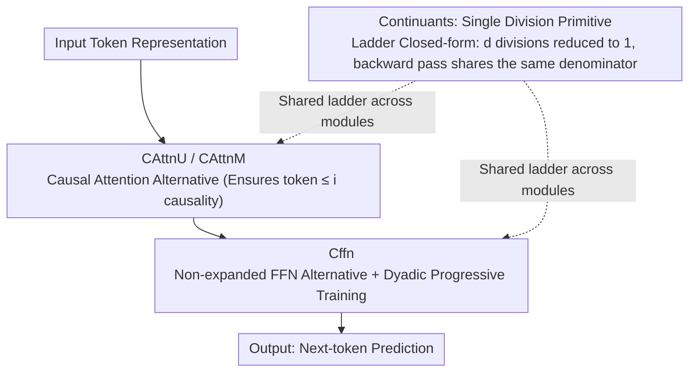

# CoFrGeNet: Continued Fraction Architectures for Language Generation

**Conference**: ICML 2026  
**arXiv**: [2601.21766](https://arxiv.org/abs/2601.21766)  
**Code**: Not publicly available (IBM Research)  
**Area**: Efficient LLM Architectures / Language Generation / Transformer Alternatives  
**Keywords**: Continued Fractions, CoFrNet, Attention Substitutes, FFN Substitutes, Parameter-efficient

## TL;DR
This paper introduces "continued fractions," a class of functions known for optimal rational approximation, into generative Transformers. The authors design CoFrNet replacement modules (CAttnU/CAttnM/Cffn) for multi-head attention and FFN. By utilizing "continuants" in a closed-form derivation, they reduce $d$ divisions to 1, achieving comparable or superior downstream performance on GPT2-xl and Llama-3.2B using only $\frac{2}{3}\sim\frac{1}{2}$ of the parameters.

## Background & Motivation
**Background**: Transformers are the mainstream for language models, but the quadratic complexity of attention and the 4-8× parameter expansion of FFN drive rapid growth in model scale. Numerous improvements exist: Linformer/Synthesizer linearize attention, Multi-Query/GQA reduce KV heads, Slim Attention removes value matrices, and Sparse Attention restricts token spans. However, **nearly all these methods still operate by subtracting within the "attention" or "standard MLP" function classes**. SSM/Mamba takes a different path but remains a linear recurrence of hidden states.

**Limitations of Prior Work**: (1) Most methods aim for acceleration while maintaining similar parameter counts, either sacrificing expressivity (linear attention performance drops) or requiring complex tuning (MoE/sparse); (2) **No systematic change of the function class has been attempted**—all variants are essentially combinations of matrix multiplication + softmax + ReLU/GELU, i.e., "polynomials + element-wise non-linearities."

**Key Challenge**: To significantly reduce parameters without dropping model quality, relying solely on existing function classes (polynomials + activations) is difficult—**polynomial approximations have a clear upper bound on expressivity for a fixed degree**. In contrast, **continued fractions (rational functions) can more tightly approximate any function at the same degree** (a classic result in number theory: truncated fractions are closer to true values than any other rational numbers with the same denominator).

**Goal**: To extend CoFrNet (Puri et al. 2021) from **supervised learning to generative modeling** by addressing three new challenges: (a) multi-dimensional outputs, (b) sequence causality constraints, and (c) reducing the $d$ divisions of the $1/x$ non-linearity (as division is significantly slower than multiplication on hardware).

**Key Insight**: Express the continued fraction using "continuant polynomials" $\tilde f(a) = K_{d-1}(a_2,\dots,a_d) / K_d(a_1,\dots,a_d)$. This collapses the entire ladder into a "ratio of two polynomials." Furthermore, the gradient can be expressed as a ratio of continuants, meaning regardless of depth $d$, only one calculation of $1/K_d$ is required.

**Core Idea**: **Replace the QKV matrix multiplications and expanded FFN hidden layers with "sets of continued fraction ladders + continuant closed-form computation."** This mathematically shifts the function class and reduces the number of divisions to $O(1)$ in engineering.

## Method

### Overall Architecture
CoFrGeNet aims for massive parameter reduction without performance loss by replacing the two parameter-heavy components in a Transformer block: causal multi-head attention is replaced by CAttnU or CAttnM ladder implementations, and FFN is replaced by a non-expanding Cffn. All replacement modules share the same ladder set form $y = Ux + Vz,\ z_j = \tilde f(W^{(j)} x)$ (Eq. 8): each ladder $j$ uses parameters $W^{(j)}$ to project the input into $d$-dimensional partial denominators, the CF layer uses continuant recurrence to calculate the continued fraction value $z_j = K_{d-1}/K_d$, and these are linearly combined for the output. Both forward and backward passes are encapsulated in a custom `autograd.Function`.

### Key Designs

**1. "Single Division" Implementation via Continuants: Solving the Division Bottleneck**

Modern GPUs process division 5-20× slower than multiplication. Standard continued fraction implementations require $d$ divisions for $d$ layers. This paper rewrites the ladder using continuant polynomials: following the recurrence $K_k(a_{d-k+1},\dots,a_d) = a_{d-k+1} K_{k-1} + K_{k-2}$ requires only $O(d)$ additions and multiplications to calculate all continuants. The value $\tilde f(a) = K_{d-1}/K_d$ then requires only one division. More importantly, Proposition 1 provides a closed-form gradient $\partial \tilde f / \partial a_k = (-1)^k \big(K_{d-k}(a_{k+1},\dots,a_d) / K_d(a_1,\dots,a_d)\big)^2$, where all partial derivatives share the same denominator $K_d$. During implementation, $K_*$ and $1/K_d$ are cached for the backward pass, and a single clamping $\text{sgn}(K_d)\max(|K_d|,\epsilon)$ is applied to $K_d$ to prevent divergence. Consequently, inference latency drops from 5898 μs (naive implementation) to 628 μs, making deep ladders practical.

**2. Causal Attention Substitution (CAttnU / CAttnM): Mixing Tokens while Maintaining Causality**

Replacing attention requires maintaining causality (token $i$ only attends to $\le i$). CAttnU follows an MLP-Mixer approach: it transposes the tensor over the embedding and sequence dimensions, utilizes **univariate ladders** so each output only consumes single-dimensional information from the same token, and uses two ensembles outputting $y_1$ and $y_2$. These are fed into **upper triangular linear layers** $U_1, U_2$ to restrict the receptive field, and the final output $O = U_1 y_1 \odot U_2 y_2$ uses element-wise multiplication to recover inter-dimensional interactions. CAttnM is a "lightweight attention": it uses $L$ $p$-variate ladders to calculate $y_1, y_2$, followed by a causal softmax to obtain attention weights $A = \text{Csoftmax}([y_1, y_2] F)$. These methods reduce parameters from $4p^2$ to $l(2d+l+1)$ (CAttnU) and $L(p+l)+p^2$ (CAttnM).

**3. Non-expanding Cffn and Dyadic Progressive Training: Eliminating FFN Expansion**

Standard FFNs contribute the majority of parameters via $\alpha\sim 4\times$ hidden layer expansion. Cffn eliminates this by using $L$ $p$-variate ladders with a gated, non-expanded ($\alpha=1$) representation. To handle the sharp gradients of rational functions near $K_d \to 0$, a **dyadic schedule** is employed: only the linear backbone is updated initially, with depth-1 ladders enabled after $t/2$ steps, depth-2 after $3t/4$, and so on. This curriculum allows the model to converge to a polynomial solution before releasing high-order rational corrections. Table 5 shows that without dyadic scheduling, Wikitext2 PPL degrades from 17.12 to 26.71.

### Loss & Training
The model maintains native GPT2-xl / Llama next-token cross-entropy. Optimizer: Adam. Learning rate for GPT2-xl: $6\times 10^{-4}$ for pre-training, $0.125\times 10^{-4}$ for CoFrGeNet fine-tuning. Weight decay: 0.1, no dropout. Pole protection $\epsilon = 0.01$. Ladder depth $d$ and width $L$ are selected from $\{1,3,5,7\}$.

## Key Experimental Results

### Main Results
GPT2-xl (1.5B) vs. CoFrGeNet variants on GLUE fine-tuning:

| Data | Model | Params | MNLI | QQP | QNLI | SST2 | COLA | MRPC | RTE |
|------|------|------|------|-----|------|------|------|------|-----|
| OWT | GPT2-xl | 1.5B | 86.89 | 88.93 | 91.35 | 93.56 | 81.78 | 79.83 | 60.27 |
| OWT | **CoFrGeNet-F** | **985M** | **87.26** | **89.95** | **91.89** | **94.16** | **82.59** | **80.21** | **61.35** |
| OWT | CoFrGeNet (Dual) | **798M** | 87.11 | 89.36 | 91.79 | 93.91 | 81.97 | 79.93 | 61.25 |
| OWT | Synthesizer-D | 1.2B | 84.93 | 86.82 | 90.13 | 91.34 | 80.15 | 77.95 | 59.83 |
| OWT | Sparse Attn | 1.21B | 85.27 | 86.38 | 90.93 | 92.72 | 80.76 | 77.42 | 59.36 |

Downstream Perplexity (trained on OWT):

| Model | Params | PTB | Wikitxt2 | Lbda | AgNews | LM1B | Wikitxt103 |
|------|------|-----|---------|------|--------|------|-----------|
| GPT2-xl | 1.5B | 30.12 | 18.30 | 8.66 | 37.13 | 41.20 | 17.50 |
| **CoFrGeNet-F** | **985M** | **29.89** | **17.12** | **8.12** | **35.72** | **40.14** | **16.14** |

### Ablation Study

| Config | Key Metric | Description |
|------|---------|------|
| Continuants vs Naive | Inference 628 vs 5898 μs | **10× speedup**, validaties continuant necessity. |
| Continuants Training Time | 178 hr vs 203 hr | Trained 12-13% faster than naive; Dual replacement faster than GPT2-xl. |
| w/o dyadic schedule | Wikitext2 PPL 17.12 → 26.71 | Crucial for stability; 50%+ degradation without it. |
| FFN only vs Attn only | F variant is consistently superior | FFN replacement provides more gain than attention replacement. |

### Key Findings
- **FFN is more replaceable than attention**: CoFrGeNet-F (FFN replacement) achieves the best results with the fewest parameters, suggesting that Transformer "parameter redundancy" resides primarily in the expanded FFN.
- **Continuants are essential for engineering**: Without them, continued fractions are impractical due to division costs. Continuants make deep ladders virtually overhead-free.
- **Effective for small models**: On Llama-3.2B, CoFrGeNet remains competitive or superior across 8 open-domain QA and reasoning tasks.

## Highlights & Insights
- **Innovation in function classes is rare**: This paper is one of the few to systematically prove that "non-polynomial + non-element-wise activation" function classes (rational functions/continued fractions) can be competitive in generative models.
- **Translation of number theory into engineering efficiency**: Using the property that the gradient of a continuant is a ratio of continuants to reduce hardware overhead is an elegant approach that can extend to ODE networks or diffusion.
- **"Plug-in" friendliness**: Since ladders replace MHA/FFN, existing pipelines (data, tokenizers, KV cache) require no changes, making industrial adoption feasible.
- **Dyadic progressive training** is a versatile trick for rational networks, analogous to progressive growing in GANs.

## Limitations & Future Work
- **Lack of open-source code**: Limits independent verification; the study focuses on GPT2-xl and Llama-3.2B, lacking evidence for 7B/13B+ scales.
- **Integration with modern attention stacks**: CAttnM still requires $l \times l$ causal softmax, potentially complicating compatibility with FlashAttention.
- **Numerical stability**: While $\epsilon$ prevents poles, the behavior of the model near poles in late-stage training is not fully analyzed.
- **Comparison with modern SOTA**: Direct comparisons with SSM-based models like Mamba or RWKV are missing, and some baselines are relatively old.

## Related Work & Insights
- **vs Synthesizer-D / Sparse Attention**: CoFrGeNet outperforms these with fewer parameters, suggesting function class changes are more effective than pruning or architectural tweaks.
- **vs Multi-Query / GQA**: These decrease parameters by sharing heads; CoFrNet replaces the structure. They are orthogonal and can be combined.
- **vs original CoFrNets (2021)**: This work marks the first successful adaptation to generative modeling, solving output dimensionality and causality issues.

## Rating
- Novelty: ⭐⭐⭐⭐⭐ 
- Experimental Thoroughness: ⭐⭐⭐⭐ 
- Writing Quality: ⭐⭐⭐⭐ 
- Value: ⭐⭐⭐⭐ 

<!-- RELATED:START -->

## Related Papers

- [\[ICML 2025\] Representative Language Generation](../../ICML2025/image_generation/representative_language_generation.md)
- [\[ICML 2026\] Esoteric Language Models: A Family of Any-Order Diffusion LLMs](esoteric_language_models_a_family_of_any-order_diffusion_llms.md)
- [\[CVPR 2026\] VecGlypher: Unified Vector Glyph Generation with Language Models](../../CVPR2026/image_generation/vecglypher_unified_vector_glyph_generation_with_language_models.md)
- [\[CVPR 2025\] Language-Guided Image Tokenization for Generation](../../CVPR2025/image_generation/language-guided_image_tokenization_for_generation.md)
- [\[ACL 2026\] Multimodal Large Language Models for Multi-Subject In-Context Image Generation](../../ACL2026/image_generation/multimodal_large_language_models_for_multi-subject_in-context_image_generation.md)

<!-- RELATED:END -->
