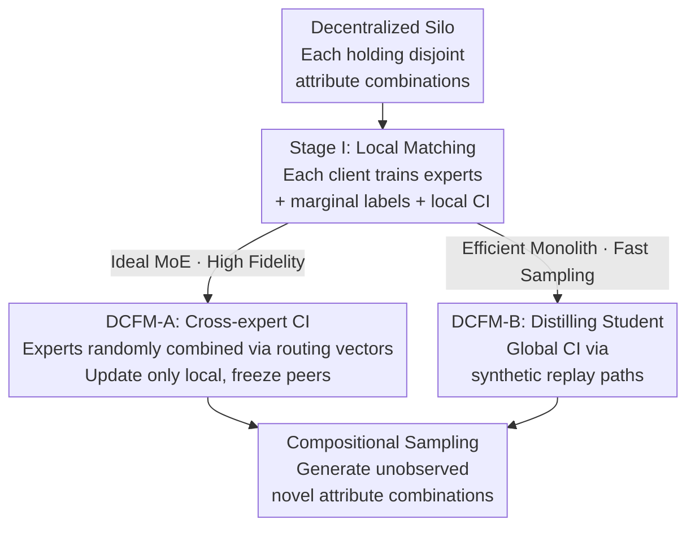

# Compositional Generative Modeling from Decentralized Data

**Conference**: ICML 2026  
**arXiv**: [2606.10153](https://arxiv.org/abs/2606.10153)  
**Code**: To be confirmed  
**Area**: Image Generation / Diffusion Models / Flow Matching / Federated Learning  
**Keywords**: Compositional Generalization, Decentralized Generation, Flow Matching, Conditional Independence, Knowledge Distillation

## TL;DR
When generative factors are partitioned across multiple clients that do not share raw data, this paper proposes **DCFM (Decentralized Compositional Flow Matching)** to enforce global conditional independence constraints on attributes. This allows the model to generate attribute combinations never observed by any single client, significantly outperforming federated learning and mixture-of-experts baselines across conditional image generation, robotic spatial planning, and chest X-ray disease co-occurrence tasks.

## Background & Motivation
**Background**: In real-world scenarios, training data is often decentralized—multiple robots, hospitals, or devices lock data locally and cannot exchange raw samples $\mathbf{x}$. To learn generative models on such silos, the mainstream approaches are to train a global model using **federated learning** (FedAvg) or to train local experts at each client and combine them using **mixture-of-experts / product-of-experts** during inference.

**Limitations of Prior Work**: These methods focus on building the **union** of the siloed data but ignore the **novel combinations** implicit in the collective data. The paper provides a clear example: Robot 1 has only seen rainy days, Robot 2 has only seen high winds, and Robot 3 has only seen rugged terrain. No single robot has seen "rain + wind + rugged terrain"—precisely the scenario that must be handled reliably during deployment. Federated learning assumes that averaging parameters/gradients can assemble a coherent global model, a hypothesis that fails when local data consists of disjoint and highly skewed attribute combinations. Expert composition lacks structural guarantees on how different experts should interact (e.g., a shared latent space), resulting in misaligned score fields from independently trained experts.

**Key Challenge**: The true difficulty is not just decentralization itself, but rather that when **factors required for composition are scattered throughout isolated data sources**, the "global conditional independence of attributes" cannot be guaranteed. The authors prove that even if every local model $p^{(a)}(\mathbf{y}\mid\mathbf{x})$ satisfies conditional independence, the global mixture $p^*(\mathbf{y}\mid\mathbf{x})=\sum_a w_a p^{(a)}(\mathbf{y}\mid\mathbf{x})$ might not. Thus, applying local CI patches cannot recover missing combinations under non-IID conditions.

**Goal + Key Insight**: The goal is to allow generative models to recover combinations that "no single data source can support independently" without exchanging any raw data. The key observation is that for compositional sampling to hold, attributes must satisfy **global** conditional independence $p(\mathbf{y}\mid\mathbf{x})=\prod_i p(y_i\mid\mathbf{x})$ (Eq. 1), rather than just local conditional independence at each client.

**Core Idea**: Elevate CI constraints from the "local" level to a "global attribute space across all clients." This is achieved through two methods: either by having local experts constrain each other during training (DCFM-A) or by distilling all experts into a single global CI-compliant student model (DCFM-B).

## Method

### Overall Architecture
DCFM is built upon **flow matching** (FM). Flow matching learns a time-dependent velocity field $\mathbf{v}_\theta(\mathbf{x}_t,t,\mathbf{y})$ that pushes Gaussian noise $\mathbf{x}_0\sim\mathcal{N}(\mathbf{0},\mathbf{I})$ along a probability path toward the data distribution. Generation involves integrating along the velocity field $G_\theta(\mathbf{z},\mathbf{y})=\mathbf{x}_0+\int_0^1\mathbf{v}_\theta(\mathbf{x}_t,t,\mathbf{y})\,dt$. This paper adapts the "weighted marginal conditional combination" sampling (Eq. 4) known in diffusion to flow matching velocities, yielding a compositional velocity field:

$$\hat{\mathbf{v}}_\theta(\mathbf{x}_t,\mathbf{y})=\mathbf{v}_\theta(\mathbf{x}_t)+\sum_{i=1}^k w_i\big(\mathbf{v}_\theta(\mathbf{x}_t,y_i)-\mathbf{v}_\theta(\mathbf{x}_t)\big)$$

This is equivalent to performing classifier-free guidance for each attribute $y_i$ individually and aggregating them, assuming attribute conditional independence.

The pipeline consists of three steps: **Stage I** trains experts on local data (learning marginal labels and local CI constraints); then, one chooses either **DCFM-A** (enforcing CI between local experts pair-wise for high fidelity but expensive sampling) or **DCFM-B** (distilling all experts into a global CI-compliant student for efficient sampling). Both use the same CI penalty as the unifying mechanism.

### Key Designs

**1. Global Conditional Independence as the Prerequisite for Compositional Generalization**

The paper uses a 2D Gaussian mixture toy example to expose flaws in existing methods: two clients $\{D_1,D_2\}$ each have samples with horizontal (left/right) and vertical (up/down) attributes, but the combination $\mathbf{y}=(2,1)$ **never appears** in the data. Federated Flow (FedAvg) struggles to converge under non-IID conditions and cannot fill missing patterns even under IID. MoE methods like DDM and DFD can cover known regions but pull the missing "top-right" pattern back toward observed data density. The authors argue that the root cause is the violation of global CI in $p(\mathbf{y}\mid\mathbf{x})$, and **local CI patches are insufficient under non-IID conditions** because $p^{(a)}\nsim p^{(b)}$. The unified CI penalty forces the joint velocity to approximate the marginal compositional velocity: $\mathcal{L}_{\text{CI}}(\theta)=\mathbb{E}\,\|\mathbf{v}_\theta(\mathbf{x}_t,\mathbf{y})-\hat{\mathbf{v}}_\theta(\mathbf{x}_t,\mathbf{y})\|^2$ (Eq. 7, with $w_i=1$). The paper also defines a lower bound for **minimum compositional coverage** $\mathcal{C}\ge\mathcal{C}_{\min}=\frac{1+\sum_i(|\mathcal{Y}_i|-1)}{|\mathcal{Y}|}$ (Eq. 2), characterizing the minimum number of joint combinations required to decouple attribute main effects.

**2. Stage I Local Matching: Enabling Marginal Adjustability and Local CI**

Standard flow matching only observes full joint labels $\mathbf{y}$ and unconditional labels, but compositional sampling (Eq. 4, 5) requires **marginal labels** $y_i$. Thus, a random binary mask $\mathbf{m}\in\{0,1\}^k$ is used during training to construct $\mathbf{y}_\mathbf{m}=\mathbf{y}\odot\mathbf{m}$. Training uses mixing weights $p(\mathbf{m})$ (Eq. 8) to provide full labels with probability $\pi_{\text{full}}$, single attribute marginal labels $(\emptyset,\dots,y_i,\dots,\emptyset)$ with $\pi_{\text{marg}}$, and purely unconditional labels with $\pi_{\text{uncond}}$. The total local loss is $\mathcal{L}_{\text{total}}^{(a)}=\mathcal{L}_{\text{FM}}^{(a)}+\lambda\,\mathcal{L}_{\text{CI}}^{(a)}$ (Eq. 11). This ensures that each expert can respond to single-attribute queries and is decoupled within its local scope. After Stage I, experts are shared with a trusted server or among each other (parameters only).

**3. DCFM-A: Cross-Expert CI (Ideal but Iterative)**

DCFM-A performs an all-gather of experts $\{\mathbf{v}_\theta^{(a)}\}$. It introduces a **routing vector** $\mathbf{r}=(r_0,r_1,\dots,r_k)$, where $r_i$ assigns an expert to the $i$-th marginal attribute and $r_0$ assigns the unconditional expert. The CI penalty is generalized to "arbitrary expert combinations" (Eq. 12). A key technique is **StopGrad** (Eq. 13): only the current client $a$'s model is trainable in the assembly, while peer experts are frozen ($\bar{\mathbf{v}}_\theta^r=\delta_{r,a}\mathbf{v}_\theta^{(a)}+(1-\delta_{r,a})\text{StopGrad}(\mathbf{v}_\theta^{(r)})$). This ensures the experts satisfy CI both locally and across peers. However, because experts are trained against **frozen** versions of peers, mismatch occurs when peers update, requiring several rounds ($R\sim 2$) for convergence.

**4. DCFM-B: Distillation into a Global CI Monolithic Student**

DCFM-B avoids multi-round mismatch. The observation is that while the discriminator input space $\mathcal{X}$ is hard to handle, the generative input space $\mathcal{Z}$ (Gaussian noise) is **tractable** for every client. Thus, experts are distilled into a single student using a **peer matching loss** $\mathcal{L}_{\text{student}}=\mathbb{E}\,\|\mathbf{v}_\theta(\hat{\mathbf{x}}_t,t,\mathbf{y}\odot\mathbf{m})-\bar{\mathbf{v}}_\theta^{(r)}(\hat{\mathbf{x}}_t,\mathbf{y})\|^2$ (Eq. 15), where $\hat{\mathbf{x}}_t$ is a "synthetic replay path" integrated via ODE from frozen teachers. To enable generalization, a **student CI penalty** $\mathcal{L}_{\text{studentCI}}$ (Eq. 16) is added, forcing the student's joint velocity to match its own marginal composition (without relying on frozen models). The total objective is $\mathcal{L}_{\text{DCFM-B}}=\mathcal{L}_{\text{student}}+\lambda\,\mathcal{L}_{\text{studentCI}}$ (Eq. 17). This results in an efficient sampler with constant communication cost of 2.

### Loss & Training
- **Local**: $\mathcal{L}_{\text{FM}}^{(a)}+\lambda\mathcal{L}_{\text{CI}}^{(a)}$, using linear flow matching paths with target velocity $\mathbf{u}_t=\mathbf{x}_1-\mathbf{x}_0$.
- **DCFM-A**: $\mathcal{L}_{\text{FM}}^{(a)}+\lambda\mathcal{L}_{\text{peerCI}}^{(a)}$, updating only local experts via StopGrad across $R\sim 2$ rounds.
- **DCFM-B**: $\mathcal{L}_{\text{student}}+\lambda\mathcal{L}_{\text{studentCI}}$, distilled one-time on synthetic replay paths.

## Key Experimental Results
Evaluations are conducted across three decentralized benchmarks, distinguishing between **seen combinations** (superscript $o$) and **novel combinations** (superscript $*$) not observed by any single client.

### Main Results
**Colored MNIST** ($n=10$ clients, coverage $\mathcal{C}=1/2$): FID on novel combinations (FID$^*$) is the key metric.

| Method | IID FID$^o$↓ | IID FID$^*$↓ | Non-IID FID$^o$↓ | Non-IID FID$^*$↓ |
|------|------|------|------|------|
| FedFlow | 9.41 | 20.83 | 15.02 | 20.02 |
| DDM+L | 9.03 | 16.38 | 7.99 | 18.84 |
| DFD+L | 9.58 | 19.13 | 8.17 | 31.36 |
| **DCFM-A (Ours)** | 8.53 | **11.41** | 7.33 | **9.29** |
| **DCFM-B (Ours)** | 9.32 | 12.24 | 8.49 | 9.15 |

DFD is strong at recovering known data but fails significantly on novel combinations (FID$^*$ of 31.36 under non-IID), exposing its tendency to pull samples back to known density regions. DCFM drastically narrows the gap between seen and novel combinations.

**Robotic Spatial Planning** (OGBench cube-single-play, $n=2$, coverage $3/4$, missing diagonal象限 moves): Success Rate (SR) reported.

| Method | Partition | SR$^o$ | SR$^*$ (Novel) |
|------|-----------|--------|--------|
| DFD+L | Non-IID | **68.67** | 18.33 |
| DDM+L | Non-IID | 67.67 | 29.67 |
| **DCFM-A** | Non-IID | 68.33 | 53.0 |
| **DCFM-B** | Non-IID | 65.67 | **54.67** |

For novel combinations (diagonal movement), DCFM improves the success rate from 18–30% in baselines to 53–55% without degrading performance on seen combinations.

**Chest X-ray Disease Co-occurrence** (NIH ChestX-ray14, $k=14$ binary disease attributes): FID measures image quality, and "Utility U" (recall of combinations measured by a classifier trained on synthetic data, Eq. 18) measures the usability of rare combinations. DCFM maintains image quality while providing higher sensitivity to disease co-occurrences, indicating it decouples disease entanglements caused by training correlations.

### Communication & Computation Costs

| Method | Communication Cost per Client |
|------|------|
| FL (Federated) | $2T$ ($T\ge 100$ rounds) |
| DDM / DFD | $N-1$ |
| DCFM-A | $RN$ ($R\sim 2$) |
| **DCFM-B** | **Constant 2** |

FedAvg requires hundreds of rounds. DCFM-B requires only 2 (upload local model + retrieve distilled model), minimizing communication overhead for decentralized generation.

### Key Findings
- **Global CI is the Key**: Toy experiments prove only DCFM recovers missing patterns in both IID and non-IID; local patches are ineffective under non-IID.
- **A vs B Trade-off**: DCFM-A offers higher fidelity (recall/diversity) but is expensive; DCFM-B has slightly lower diversity (novel recall) due to reliance on synthetic data but is efficient.
- **DFD Failure Mode**: Energy routing in non-IID novel combinations systematically pushes samples toward observed density, yielding the worst novel combination FID.

## Highlights & Insights
- **Attributing compositional failure to "Global Conditional Independence" rather than just decentralization**—supported by clear toy Gaussian experiments. This is the most significant "Aha!" moment of the paper.
- **StopGrad Routing Constraints (DCFM-A)**: Using Kronecker delta + StopGrad to update one's own model among shared experts without polluting gradients is a clever "mutual constraint without interference" technique.
- **Tractable Generative Input Space → Synthetic Replay Distillation (DCFM-B)**: Leveraging the Gaussian nature of $\mathcal{Z}$ to distill along self-generated ODE paths reduces communication to a constant factor of 2, which is practical for privacy-sensitive or bandwidth-limited deployments.
- **Unified CI Penalty**: The same CI penalty is applied across local, cross-expert, and student levels, providing a unified and consistent framework.

## Limitations & Future Work
- **DCFM-A Communications**: While $R\sim 2$ is low, all-gathering the full set of experts can be expensive for many clients; DCFM-B mitigates this at the cost of diversity.
- **Dependence on Minimum Coverage**: The method assumes global satisfaction of $\mathcal{M}_i=1$ and $\mathcal{C}\ge\mathcal{C}_{\min}$. If an attribute never appears anywhere in the system, composition is impossible—a hard constraint of generalization.
- **Boundary of the CI Hypothesis**: In reality, some attributes have causal dependencies (e.g., certain diseases are strongly correlated). Enforcing decoupling might not always align with data truth, though medical experiments suggest a net benefit.
- **Distillation Bias**: DCFM-B relies on synthetic paths generated by teachers, potentially inheriting teacher biases and leading to the observed drop in novel recall.

## Related Work & Insights
- **vs Federated Learning (FedAvg / Tun et al. 2023)**: FedAvg assumes averaging handles the global distribution, which fails under disjoint attributes. DCFM explicitly enforces global CI to support composition.
- **vs Mixture of Experts (DDM / DFD)**: Existing experts are trained independently and combined at inference without structural compatibility guarantees. DCFM uses CI penalties to enforce cross-expert compatibility.
- **vs CoInD (Gaudi et al. 2025)**: While CoInD uses CI penalties for centralized data, DCFM extends this to decentralized settings without sharing raw data and resolves misalignment issues between experts.

## Rating
- Novelty: ⭐⭐⭐⭐⭐ Precisely attributes compositional failure to "Global CI" and provides two decentralized implementations.
- Experimental Thoroughness: ⭐⭐⭐⭐ Three heterogeneous benchmarks (Image/Robot/Medical) + IID/non-IID + cost analysis. Real-world large-scale deployment is missing.
- Writing Quality: ⭐⭐⭐⭐ Clear progression from toy experiments to theory and methods. Formulations are dense and may be challenging for non-generative model experts.
- Value: ⭐⭐⭐⭐ Highly relevant for privacy-sensitive data silos; DCFM-B's constant communication is particularly practical.

<!-- RELATED:START -->

<!-- RELATED:END -->

## Related Papers

- [\[ICML 2025\] Compositional Scene Understanding through Inverse Generative Modeling](../../ICML2025/image_generation/compositional_scene_understanding_through_inverse_generative_modeling.md)
- [\[CVPR 2026\] Heterogeneous Decentralized Diffusion Models](../../CVPR2026/image_generation/heterogeneous_decentralized_diffusion_models.md)
- [\[ICML 2026\] Adapting Noise to Data: Generative Flows from Learned 1D Processes](adapting_noise_to_data_generative_flows_from_1d_processes.md)
- [\[CVPR 2025\] Decentralized Diffusion Models](../../CVPR2025/image_generation/decentralized_diffusion_models.md)
- [\[ICLR 2026\] GenCP: Towards Generative Modeling Paradigm of Coupled Physics](../../ICLR2026/image_generation/gencp_towards_generative_modeling_paradigm_of_coupled_physics.md)

<!-- RELATED:END -->
