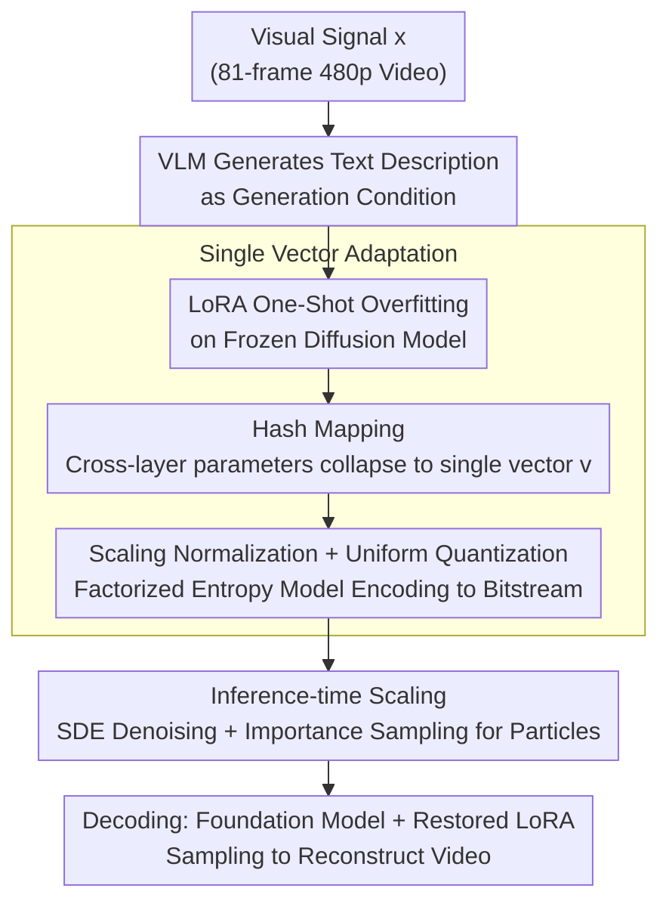

# Compression as Adaptation: Implicit Visual Representation with Diffusion Foundation Models

**Conference**: ICML 2026  
**arXiv**: [2603.07615](https://arxiv.org/abs/2603.07615)  
**Code**: Yes (Official)  
**Area**: Image Generation/Visual Compression  
**Keywords**: Implicit Representation, Diffusion Models, Visual Compression, LoRA, Inference-time Scaling  

## TL;DR
Visual signals are encoded as Low-Rank Adaptation (LoRA) parameters on a frozen diffusion foundation model and compressed into a single compact vector via hash mapping, achieving high perceptual quality video compression at extremely low bitrates while supporting inference-time scaling and generative editing.

## Background & Motivation

**Background**: Large-scale visual generative models (e.g., Wan-2.1, Qwen) have acquired rich visual knowledge through massive data training. However, visual signals themselves still exist as external explicit representations such as pixels, latent variables, or tokens, failing to directly utilize the internal prior knowledge learned by the models. Traditional video compression (H.265/H.266) and neural codecs encode signals into explicit latent codes via VAEs, where signal-specific information is entirely stored in the latent codes, and the decoder is shared across signals but contains no signal-specific information.

**Limitations of Prior Work**: Although Implicit Neural Representations (INR) can parameterize signals into small MLPs, these networks are trained from scratch and are completely decoupled from the high-level visual knowledge of large-scale pre-trained models, leading to limited compression capability. Even recent works combining INR with diffusion processes fail to truly leverage the high-level semantic priors encoded in foundation models.

**Key Challenge**: Explicit representations separate "what the signal is" from "what the model knows," resulting in representation redundancy—the model already "knows" what natural images/videos look like, but this knowledge cannot be exploited during compression.

**Goal**: Instead of compressing "what the visual signal is," the objective is to compress "how to generate the visual signal"—representing the visual signal as the generative function of a diffusion model, and using minimal parameter deviations to describe the adaptation process from the pre-trained model to the target signal.

**Core Idea**: One-shot fine-tuning is performed on a frozen diffusion model using LoRA. The adaptation parameters are mapped to a single vector $\mathbf{v} \in \mathbb{R}^{1 \times k}$ through a pseudo-random hash mapping, followed by quantization with entropy constraints, enabling the compression of an 81-frame video into one compact vector.

## Method

### Overall Architecture
The work addresses perceptual video compression at extremely low bitrates. The core shift is no longer compressing "what the visual signal is," but rather "how to make an existing diffusion foundation model generate this signal." Given a visual signal $x$ (e.g., an 81-frame 480p video), a VLM first generates a text description as a condition. One-shot overfitting of a set of LoRA parameters is then performed on a frozen video diffusion model. These parameters are subsequently hash-compressed into a single vector, quantized, and entropy-coded into a bitstream. At the decoder side, the video is reconstructed by sampling using the same foundation model combined with the restored LoRA weights.

### Key Designs

**1. Single Vector Adaptation: Compressing the entire LoRA into one vector**

The adaptation process itself introduces new parameters; if these parameters are too numerous, the purpose of compression is defeated. This is a primary bottleneck for the practical deployment of implicit representations. For each pre-trained weight matrix $\mathbf{W}_0 \in \mathbb{R}^{m \times n}$, LoRA introduces low-rank updates $\Delta\mathbf{W} = \mathbf{AB}$ ($r \ll \min(m,n)$). However, given the many layers in large models, the total parameter count after accumulation remains significant. Drawing inspiration from the hashing trick (Chen et al., 2015), a fixed random projection generated by a PRNG is used to map LoRA parameters from all layers into a single shared vector $\mathbf{v} \in \mathbb{R}^{1 \times k}$. This forces cross-layer parameter sharing, collapsing the information required for transmission into this single vector. Subsequently, a learnable scaling parameter $s$ is introduced for normalization before uniform quantization (replacing rounding with additive uniform noise during training to maintain differentiability). A factorized entropy model estimates the bitrate, constraining each parameter to 1-3 bits. Consequently, an 81-frame video is represented by only one vector, with the overhead of the caption and entropy model parameters accounting for less than 1% of the total bitrate, achieving extreme bitrate compression.

**2. Inference-time Scaling: Improving quality with computation after encoding**

Once an explicit bitstream is fixed, it cannot be further optimized. However, the representation in this work is part of the generative process, providing a unique opportunity to regulate the output after encoding. Specifically, SDE denoising is used at the encoder, where $M$ candidate particles are generated at each step via a shared PRNG. Since the encoder holds the original signal $x$, it can calculate the optimal denoising kernel $p^*(x_{t_{n-1}}|x_{t_n})$ and perform importance sampling on the model's predicted kernel $p(x_{t_{n-1}}|x_{t_n})$, selecting the particle with the largest weight $w^{(m)} \propto p^*(x_{t_{n-1}}^{(m)})/p(x_{t_{n-1}}^{(m)})$. Only the selection index for each step needs to be transmitted as side information, allowing the decoder to replicate the same sampling trajectory using the same PRNG. Scaling can be expanded along two axes: the number of candidates per step (increasing only encoder computation) and the number of denoising steps (increasing both encoder and decoder computation). This process is equivalent to Relative Entropy Coding (Diff-C), where the adapted diffusion model acts as a stronger prior, further reducing encoding complexity.

**3. Minimum Description Length Perspective: Training naturally seeks the simplest generative function**

The rationale for "encoding only the deviation from the pre-trained model" is explained through information theory. The pre-trained model defines a path measure $\mathbb{P}$ on the SDE trajectory space, while the adapted model defines $\mathbb{P}'$. The ideal goal of compression is to minimize $D_{\text{KL}}[\mathbb{P}' \| \mathbb{P}]$ subject to the terminal state constraint $x_0 = x$. The optimal solution is exactly the Doob's-$h$ transform of $\mathbb{P}$ conditioned on the terminal state. When the pre-trained model is sufficiently strong, minimizing the flow-matching objective $\mathcal{L}_{\text{FM}}(\theta) = \mathbb{E}_{t,\epsilon}[\|v_\theta(x_t, t) - (\epsilon - x)\|^2]$ precisely recovers this solution. In other words, the training process automatically identifies the generative function with the minimal deviation from the pre-trained model, thereby maximizing the reuse of existing visual priors. This provides theoretical support for "compression as adaptation."

## Key Experimental Results

### Main Results: UVG Perceptual Video Compression

| Method | Bitrate (bpp) | DISTS ↓ | FVD ↓ | PSNR ↑ |
|--------|---------------|---------|-------|--------|
| H.265/HM | ~0.015 | Higher | Higher | ~30 |
| H.266/VTM | ~0.015 | Medium | Medium | ~32 |
| DCVC-RT (MSE) | ~0.012 | Medium | Medium | ~31 |
| GLC-Video (Perceptual) | ~0.012 | Medium | Medium | ~28 |
| **VOV (Ours)** | ~0.011 | **Best** | **Best** | ~24 |
| **VOV + Scaling** | ~0.011 | **Better** | **Better** | ~26 |

> VOV significantly outperforms all baselines on perceptual metrics like DISTS and FVD, with visual quality far exceeding traditional codecs especially at extremely low bitrates. The lower PSNR is attributed to the fact that generative reconstruction prioritizes perceptual quality over exact pixel alignment.

### Ablation Study: Inference-time Scaling Strategies

| Scaling Config | Denoising Steps | Candidates per Step | DISTS ↓ | Effect |
|----------------|-----------------|---------------------|---------|--------|
| No Scaling (ODE) | 50 | 1 | Baseline | No improvement |
| Step Increase Only | 100 | 1 | ≈ Baseline | Nearly ineffective |
| Multi-particle + Few Steps | 100 | $2^{18}$ | Significant Gain | Computation increase at encoder only |
| Multi-particle + Many Steps | 1000 | $2^{10}$ | Significant Gain | Computation increase at both ends |

### Key Findings
- **Non-intuitive interaction between vector dimension $k$ and LoRA rank**: When the vector size is fixed, increasing the LoRA rank actually leads to a decrease in reconstruction quality. High-rank adaptation introduces more densely entangled parameter updates that are difficult to preserve under a fixed-size hashing scheme.
- **Interchangeable paths for inference-time scaling**: The gain from increasing the candidate count per step from $2^{10}$ to $2^{18}$ is comparable to the gain from doubling the denoising steps, though the latter requires more network evaluations.
- **Pure scaling (without adaptation) can also compress**: Using the original pre-trained model directly with inference-time scaling can achieve strong compression, but at a much higher codec cost. LoRA adaptation makes decoding lightweight.
- **Unification of compression and generation**: The adapted model allows for personalized editing (changing colors, merging images, changing resolution) by modifying text prompts, though it may introduce training data biases (e.g., changes in facial features when altering hair color).

## Highlights & Insights
- **Paradigm shift of "Compression as Adaptation"**: Redefining the compression problem as minimal deviation adaptation on a pre-trained model naturally exploits the visual priors of foundation models. This approach is transferable to any modality with strong pre-trained models (audio, 3D, etc.).
- **Controllability of functional representation**: Unlike fixed bitstreams, the implicit representation can still regulate output quality through inference-time scaling and early stopping after encoding, enabling "encode once, decode at multiple qualities."
- **Extreme compression via hash mapping**: Using a fixed random projection generated by a PRNG to map thousands of LoRA parameters to a single vector is conceptually simple yet surprisingly effective—transforming an 81-frame video into a single vector.

## Limitations & Future Work
- **Dependence on foundation model capability**: Semantic mismatches occasionally occur during reconstruction (especially with text in videos); the model capacity directly dictates the compression upper bound.
- **Slow encoding speed**: One-shot overfitting coupled with inference-time scaling leads to high encoding costs, a common bottleneck for INR-based methods.
- **Limitations of hash mapping**: Random projections may fail to effectively capture correlations between adaptation parameters. Learned amortized encoders/decoders (vector $\leftrightarrow$ LoRA) represent a clear direction for improvement.
- **Biases in personalized editing**: Modifying prompts may introduce statistical biases from the training data (e.g., ethnic associations), requiring better decoupling methods.

## Related Work & Insights
- **INR Compression**: Works like NVRC use small MLPs to parameterize signals. This work replaces the "network" with adaptation parameters on a large model, inheriting the functional advantages of INR while introducing pre-trained priors.
- **LoRA Personalized Generation**: DreamBooth and Custom Diffusion use LoRA for concept customization. This work discovers that the same mechanism is an effective compression tool, revealing a deep unification between generation and compression.
- **Diff-C / Relative Entropy Coding**: The inference-time scaling algorithm is equivalent to Diff-C, using the adapted diffusion model as a stronger prior to reduce encoding costs.
- **Amortized Inference**: Learning an amortized decoder from vectors to LoRA is a key future direction, potentially accelerating encoding and enhancing compression rates simultaneously.

<!-- RELATED:START -->

## Related Papers

- [\[ICML 2026\] Visual Implicit Autoregressive Modeling](visual_implicit_autoregressive_modeling.md)
- [\[ICLR 2026\] AlignTok: Aligning Visual Foundation Encoders to Tokenizers for Diffusion Models](../../ICLR2026/image_generation/aligntok_aligning_visual_foundation_encoders_to_tokenizers_for_diffusion_models.md)
- [\[CVPR 2026\] CoD: A Diffusion Foundation Model for Image Compression](../../CVPR2026/image_generation/cod_a_diffusion_foundation_model_for_image_compression.md)
- [\[ECCV 2024\] Implicit Concept Removal of Diffusion Models](../../ECCV2024/image_generation/implicit_concept_removal_of_diffusion_models.md)
- [\[ICML 2026\] DynaDiff: Generative Adaptation of Dynamics to Environmental Shifts via Weight-space Diffusion](generative_adaptation_of_dynamics_to_environmental_shifts_via_weight-space_diffu.md)

<!-- RELATED:END -->
