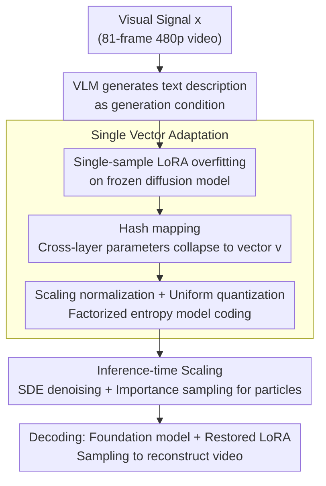

# Compression as Adaptation: Implicit Visual Representation with Diffusion Foundation Models

**Conference**: ICML 2026  
**arXiv**: [2603.07615](https://arxiv.org/abs/2603.07615)  
**Code**: Available (Official)  
**Area**: Image Generation/Visual Compression  
**Keywords**: Implicit Representation, Diffusion Models, Visual Compression, LoRA, Inference-time Scaling  

## TL;DR
Visual signals are encoded as Low-Rank Adaptation (LoRA) parameters on a frozen diffusion foundation model and compressed into a single compact vector via hash mapping. This achieves high perceptual quality video compression at extremely low bitrates while supporting inference-time scaling and generative editing.

## Background & Motivation

**Background**: Large-scale visual generative models (e.g., Wan-2.1, Qwen) have acquired rich visual knowledge through massive data training. However, visual signals themselves still exist as external explicit representations such as pixels, latent variables, or tokens, failing to directly leverage the internal priors learned by the model. Traditional video compression (H.265/H.266) and neural codecs use VAEs to encode signals into explicit latent codes, where signal-specific information is stored entirely in the latent code, and the decoder is shared across signals without containing signal-specific information.

**Limitations of Prior Work**: Although Implicit Neural Representations (INR) can parameterize signals into small MLPs, these networks are trained from scratch and are completely decoupled from the visual knowledge of large-scale pre-trained models, resulting in limited compression capacity. Even recent works combining INR with diffusion processes fail to truly utilize high-level semantic priors encoded in foundation models.

**Key Challenge**: Explicit representations separate "what the signal is" from "what the model knows," leading to representation redundancy—the model already "knows" what natural images/videos look like, but cannot utilize this knowledge during compression.

**Goal**: Instead of compressing "what the visual signal is," this work compresses "how to generate that visual signal"—representing the visual signal as a generation function of the diffusion model, using minimal parameter deviations to describe the adaptation process from the pre-trained model to the target signal.

**Core Idea**: Perform single-sample fine-tuning of a frozen diffusion model using LoRA. The adaptation parameters are mapped to a single vector $\mathbf{v} \in \mathbb{R}^{1 \times k}$ via a pseudo-random hash and then quantized under entropy constraints, enabling an 81-frame video to be compressed into one compact vector.

## Method

### Overall Architecture
The objective is to address perceptual video compression at extremely low bitrates. The core shift is no longer compressing "what the visual signal is," but rather "how to make an existing diffusion foundation model generate this signal." Given a visual signal $x$ (e.g., an 81-frame 480p video), a VLM is first used to generate a text description as a condition. Single-sample overfitting is then performed on a set of LoRA parameters over the frozen video diffusion model. These parameters are hash-compressed into a single vector, quantized, and entropy-coded into a bitstream. At the decoder side, the video is reconstructed by sampling from the same foundation model combined with the restored LoRA weights.

### Key Designs

**1. Single-Vector Adaptation: Compressing the entire LoRA into one vector**

The adaptation process itself introduces new parameters; if these parameters are too numerous, the compression benefit is lost. This is a primary bottleneck for INR deployment. For each pre-trained weight matrix $\mathbf{W}_0 \in \mathbb{R}^{m \times n}$, LoRA introduces low-rank updates $\Delta\mathbf{W} = \mathbf{AB}$ ($r \ll \min(m,n)$). However, given the many layers in large models, the total parameter count remains substantial. Borrowing the hashing trick (Chen et al., 2015), this work uses a PRNG to generate a fixed random projection, mapping all LoRA parameters across layers to a single shared vector $\mathbf{v} \in \mathbb{R}^{1 \times k}$. This forces cross-layer parameter sharing, collapsing the information required for transmission into this single vector. Subsequently, a learnable scaling parameter $s$ is introduced for normalization followed by uniform quantization (replacing rounding with additive uniform noise during training for differentiability). A factorized entropy model estimates the bitrate, constraining each parameter to 1-3 bits. An 81-frame video is ultimately represented by a single vector, with the overhead for captions and entropy model parameters accounting for less than 1% of the total bitrate.

**2. Inference-time Scaling: Post-encoding computation for quality**

Once an explicit bitstream is written, it cannot be further optimized. In contrast, this representation is part of the generation process, which offers a unique opportunity to adjust the output post-encoding. Specifically, the encoder employs SDE denoising, generating $M$ candidate particles at each step via a shared PRNG. Since the encoder possesses the original signal $x$, it can calculate the optimal denoising kernel $p^*(x_{t_{n-1}}|x_{t_n})$ and use it for importance sampling against the model's predicted kernel $p(x_{t_{n-1}}|x_{t_n})$. The particle with the highest weight $w^{(m)} \propto p^*(x_{t_{n-1}}^{(m)})/p(x_{t_{n-1}}^{(m)})$ is selected. Only the selection indices per step need to be transmitted as side information; the decoder can then reproduce the same sampling trajectory using the same PRNG. Scaling can be expanded along two axes: candidate count per step (increasing only encoder computation) and denoising steps (increasing both encoder and decoder computation). This process is equivalent to relative entropy coding (Diff-C), where the adapted diffusion model serves as a stronger prior to further reduce coding complexity.

**3. Minimum Description Length Perspective: Training naturally finds the simplest generation function**

The paper provides an information-theoretic explanation for why "encoding only the deviation from the pre-trained model" is justified. The pre-trained model defines a path measure $\mathbb{P}$ over SDE trajectories, while the adapted model defines $\mathbb{P}'$. The ideal compression goal is to minimize $D_{\text{KL}}[\mathbb{P}' \| \mathbb{P}]$ subject to the terminal state $x_0 = x$. The optimal solution is exactly the Doob's-$h$ transform of $\mathbb{P}$ conditioned on the terminal state. When the pre-trained model is sufficiently strong, minimizing the flow-matching objective $\mathcal{L}_{\text{FM}}(\theta) = \mathbb{E}_{t,\epsilon}[\|v_\theta(x_t, t) - (\epsilon - x)\|^2]$ recovers this solution. In other words, the training process automatically seeks the generative function with the minimal deviation from the pre-trained model, thereby maximizing the reuse of existing visual priors.

## Key Experimental Results

### Main Results: UVG Perceptual Video Compression

| Method | Bitrate (bpp) | DISTS ↓ | FVD ↓ | PSNR ↑ |
|------|-----------|---------|-------|--------|
| H.265/HM | ~0.015 | Higher | Higher | ~30 |
| H.266/VTM | ~0.015 | Moderate | Moderate | ~32 |
| DCVC-RT (MSE) | ~0.012 | Moderate | Moderate | ~31 |
| GLC-Video (Perceptual) | ~0.012 | Moderate | Moderate | ~28 |
| **VOV (Ours)** | ~0.011 | **Best** | **Best** | ~24 |
| **VOV + Scaling** | ~0.011 | **Better** | **Better** | ~26 |

> VOV significantly outperforms all baselines on perceptual metrics (DISTS and FVD). At extremely low bitrates, its visual quality far exceeds traditional codecs. Lower PSNR is attributed to generative reconstruction prioritizing perceptual quality over pixel-wise alignment.

### Ablation Study: Inference-time Scaling Strategy

| Scaling Config | Denoising Steps | Candidates/Step | DISTS ↓ | Effect |
|----------|---------|-----------|---------|------|
| No Scaling (ODE) | 50 | 1 | Baseline | No Improvement |
| Steps only | 100 | 1 | ≈Baseline | Nearly Ineffective |
| Many Candidates + Few Steps | 100 | $2^{18}$ | Significant Gain | Increased Encoder Compute Only |
| Many Candidates + Many Steps | 1000 | $2^{10}$ | Significant Gain | Increased Encoder & Decoder Compute |

### Key Findings
- **Non-intuitive interaction between vector dimension $k$ and LoRA rank**: With a fixed vector size, increasing the LoRA rank can lead to degraded reconstruction quality. High-rank adaptation introduces more densely entangled parameter updates that are difficult to preserve under a fixed-size hashing scheme.
- **Interchangeable scaling paths**: The gain from increasing candidates per step from $2^{10}$ to $2^{18}$ is comparable to doubling the denoising steps, though the latter requires more network evaluations.
- **Pure scaling (no adaptation) can compress**: Inference-time scaling using the original pre-trained model alone can achieve strong compression, but the encoding/decoding costs are much higher; LoRA adaptation makes decoding lightweight.
- **Unity of compression and generation**: The adapted model allows for personalized editing via text prompt modification (e.g., changing colors, merging images, altering resolution), though it may introduce biases from the training data.

## Highlights & Insights
- **"Compression as Adaptation" Paradigm Shift**: Redefining compression as minimal-deviation adaptation on pre-trained models naturally leverages foundation model priors. This concept is transferable to any modality with strong pre-trained models (Audio, 3D, etc.).
- **Controllability of Functional Representation**: Unlike fixed bitstreams, implicit representations allow for post-encoding adjustment of output quality via inference-time scaling and early stopping, enabling "encode once, decode at multiple qualities."
- **Hash Mapping for Extreme Compression**: Using a fixed random projection from a PRNG to map multi-thousand dimensional LoRA parameters to a single vector is conceptually simple yet surprisingly effective—transforming an 81-frame video into one vector.

## Limitations & Future Work
- **Dependency on Foundation Model Capability**: Semantic mismatches occasionally occur during reconstruction (especially with text in videos); the model capacity directly dictates the compression upper bound.
- **Slow Encoding Speed**: Single-sample overfitting combined with inference-time scaling results in high encoding costs, a common bottleneck for INR-based methods.
- **Limitations of Hash Mapping**: Random projections may fail to effectively capture correlations between adaptation parameters. Learned amortized encoders/decoders (Vector ↔ LoRA) represent a clear direction for improvement.
- **Biases in Personalized Editing**: Modifying prompts may introduce statistical biases (e.g., racial associations) from the training data, necessitating better decoupling methods.

## Related Work & Insights
- **INR Compression**: Works like NVRC use small MLPs to parameterize signals. This work replaces the "network" with adaptation parameters on a large model, inheriting the functional advantages of INR while introducing pre-trained priors.
- **LoRA for Personalized Generation**: DreamBooth/Custom Diffusion use LoRA for concept customization. This work demonstrates that the same mechanism is an effective compression tool, revealing a deep unification of generation and compression.
- **Diff-C / Relative Entropy Coding**: The inference-time scaling algorithm is equivalent to Diff-C, using the adapted diffusion model as a stronger prior to reduce coding costs.
- **Amortized Inference**: Learning an amortized decoder from vectors to LoRA is a key future direction to simultaneously accelerate encoding and enhance compression ratios.

<!-- RELATED:START -->

## Related Papers

- [\[ICML 2026\] Visual Implicit Autoregressive Modeling](visual_implicit_autoregressive_modeling.md)
- [\[ICLR 2026\] AlignTok: Aligning Visual Foundation Encoders to Tokenizers for Diffusion Models](../../ICLR2026/image_generation/aligntok_aligning_visual_foundation_encoders_to_tokenizers_for_diffusion_models.md)
- [\[CVPR 2026\] CoD: A Diffusion Foundation Model for Image Compression](../../CVPR2026/image_generation/cod_a_diffusion_foundation_model_for_image_compression.md)
- [\[ICLR 2026\] Aligning Visual Foundation Encoders to Tokenizers for Diffusion Models](../../ICLR2026/image_generation/aligning_visual_foundation_encoders_to_tokenizers_for_diffusion_models.md)
- [\[ECCV 2024\] Implicit Concept Removal of Diffusion Models](../../ECCV2024/image_generation/implicit_concept_removal_of_diffusion_models.md)

<!-- RELATED:END -->
