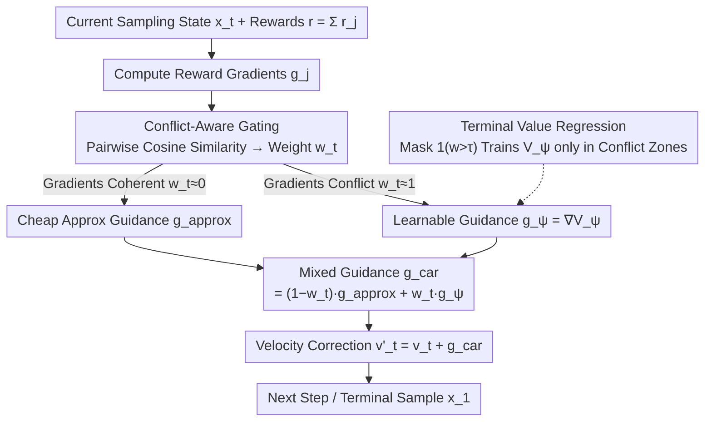

# Conflict-Aware Additive Guidance for Flow Models under Compositional Rewards

**Conference**: ICML2026  
**arXiv**: [2605.20758](https://arxiv.org/abs/2605.20758)  
**Code**: https://github.com/yuxuehui/CAR-guidance  
**Area**: Image Generation  
**Keywords**: Inference-time guidance, flow matching, compositional rewards, gradient conflict, off-manifold drift

## TL;DR

To address the off-manifold drift issue in flow models during inference-time guidance under multi-objective compositional rewards, this paper proposes Conflict-Aware Additive Guidance (CAR). By detecting gradient conflicts and dynamically switching to learnable value gradient corrections, it improves identity preservation by 25.4% and planning success rate by 38.75% with minimal additional computational overhead.

## Background & Motivation

**Background**: Continuous-time flow models (Rectified Flow, Flow Matching) have become a powerful generation paradigm. Inference-time guidance achieves controllable generation without fine-tuning by superimposing a gradient term $g_t(x_t,t)$ onto the base vector field.

**Limitations of Prior Work**: Approximate guidance methods (e.g., $g^{\text{cov-G}}$) are computationally efficient but prone to off-manifold drift when composing multiple reward functions. Generated samples deviate from the data manifold into low-density regions, causing image distortion or hallucinated jumps in planning trajectories. While exact guidance methods (Guidance Matching, GLASS-FKS) avoid drift, the former requires ground-truth samples satisfying all constraints, while the latter incurs over $3\times$ higher computational costs.

**Key Challenge**: When the gradient directions of multiple reward functions conflict, the error of approximate guidance scales sharply with gradient misalignment $(1 - \cos\phi)$ and the number of reward functions $G$. This forms "energy traps" that capture trajectories outside the manifold.

**Goal**: Eliminate off-manifold drift in compositional reward scenarios while maintaining the computational efficiency of approximate guidance.

**Key Insight**: Starting from measure transport theory, the approximation error is decomposed into three attributable terms: coupling shift, gradient misalignment, and local approximation. Gradient misalignment is identified as the primary cause of error in compositional settings.

**Core Idea**: Dynamically detect gradient conflict regions using a conflict-aware gate and activate lightweight learnable guidance only in high-conflict areas for correction.

## Method

### Overall Architecture

CAR aims to prevent approximate guidance from pushing samples off the data manifold when superimposing multiple rewards in flow models. Instead of using a uniform guidance method throughout, it dynamically determines the guidance calculation at each sampling step based on whether the gradients conflict. Given a pre-trained flow model $v_t(x_t,t)$ and compositional rewards $r(x_1) = \sum_{j=1}^G r_j(x_1)$, the velocity field during inference is rewritten as $v'_t = v_t + g^{\text{car}}$. The guidance term is a mixture of cheap approximate guidance $g^{\text{approx}}$ and learnable guidance $g_\psi$: $g^{\text{car}} = (1 - w_t) g^{\text{approx}} + w_t g_\psi$, where the mixture weight $w_t$ is determined by the degree of gradient conflict.

### Key Designs

**1. Three-term Approximation Error Decomposition: Why Compositional Guidance Drifts**

The starting point is a theoretical inquiry into why approximate guidance works for single rewards but fails for compositions. From a measure transport perspective, CAR decomposes the $W_2^2$ error between the exact target distribution and its approximate implementation into: (A) Coupling shift error, arising from the approximation $\mathcal{P}(z) \approx 1$; (B) Gradient misalignment error, with a magnitude proportional to $G(G-1)\mu^2(1-\cos\phi)$; (C) Local approximation error. The key conclusion lies in term (B): it grows quadratically with the number of rewards $G$ and is proportional to the angular misalignment $(1-\cos\phi)$. This explains why approximate guidance is sufficient for single rewards (no misalignment term), but for multiple constraints, conflicting directions amplify the error via $G$ and $\cos\phi$, pulling trajectories into low-density "energy traps." This decomposition guides the design: correction is needed only in regions with severe gradient misalignment.

**2. Conflict-Aware Gating: Spending Computation Only on Gradient Conflicts**

Since misalignment is the primary error source, CAR uses a gate to automatically judge whether to deploy heavy-duty correction at each sampling step. It first calculates the average pairwise cosine similarity between all reward gradients to obtain a raw conflict score:

$$w_{\text{raw}} = 1 - \frac{2}{G(G-1)} \sum_{j<k} \frac{\langle g_j, g_k \rangle}{\|g_j\|\|g_k\| + \varepsilon},$$

which is then mapped to $(0,1)$ as the mixture weight $w_t$. When gradient directions are consistent ($w_t \approx 0$), the guidance relies almost entirely on cheap approximation with zero extra overhead. When gradients conflict ($w_t \approx 1$), it switches to learnable guidance for refinement. Unlike methods like PCGrad that project gradients to resolve conflicts—a technique with marginal gains throughout—this gating provides "on-demand correction," allocating extra computation only to necessary spatial-temporal regions. Consequently, the average inference time on synthetic data is reduced to approximately 1.65ms.

**3. Terminal Value Regression: Stable Training of Learnable Guidance**

The $g_\psi$ used in conflict zones must be learned. CAR parameterizes it as the gradient of a scalar value function $V_\psi(x_t,t)$: $g_\psi = \nabla_{x_t} V_\psi$. Training value functions is often unstable; conventional Fitted Value Evaluation can diverge due to the "deadly triad" (function approximation + off-policy + bootstrapping). Leveraging the deterministic ODE dynamics of flow models, CAR skips bootstrapping and makes $V_\psi$ directly regress the terminal reward $r(x_1)$:

$$\mathcal{L}(\psi) = \mathbb{E}\big[\mathbb{I}_t \cdot (r(x_1) - V_\psi(x_t,t))^2\big],$$

where a mask $\mathbb{I}_t = \mathbf{1}(w(x_t) > \tau)$ ensures training only occurs in high-conflict regions. Eliminating bootstrapping removes the most critical part of the deadly triad, ensuring convergence; the mask focuses capacity on the regions where the gate will actually activate.

## Key Experimental Results

### Main Results — Synthetic Dataset (2D GMM)

| Method | Posterior Coverage (PC) ↑ | Constraint Satisfaction (CS) ↑ | Inference Time (ms) ↓ | Training Data Size |
|------|-----------------|-----------------|-----------------|-----------|
| $g^{\text{cov-G}}$ | 71.70% | 89.56% | 0.38 | — |
| PCGrad | 75.20% | 92.45% | 0.42 | — |
| GM | 84.50% | 99.99% | 2.81 | 10,240k |
| GLASS-FKS | 90.80% | 99.71% | 296 | — |
| **CAR (Ours)** | **93.80%** | **100.00%** | 4.20 | 1,574k |

> Under conflicting constraints [1,0], $g^{\text{cov-G}}$ causes nearly 30% of samples to drift off-manifold; CAR reduces the drift rate to 6.2% with only 1/70th of the computation required by GLASS-FKS.

### Ablation Study

| Task | Method | Violations ↓ | Success Rate ↑ | Key Improvement |
|------|------|---------|---------|---------|
| ManiSkill2 StackCube (Static Obs) | $g^{\text{cov-G}}$ | 1.2 | 12% | — |
| ManiSkill2 StackCube (Static Obs) | **CAR** | **0.1** | **72%** | Success Rate +60% |
| ManiSkill2 StackCube (Mixed Cons) | $g^{\text{cov-G}}$ | 1.8 | 9% | — |
| ManiSkill2 StackCube (Mixed Cons) | **CAR** | **0.4** | **61%** | Violation Rate -78% |
| Maze2D (Dynamic Obs) | $g^{\text{cov-G}}$ | 0.9 | 42% | — |
| Maze2D (Dynamic Obs) | **CAR** | **0.2** | **61%** | Success Rate +19% |
| CelebA-HQ Image Editing | $g^{\text{cov-G}}$ | ID=0.543 | — | — |
| CelebA-HQ Image Editing | **CAR** | **ID=0.681** | — | Identity Preservation +25.4% |

## Highlights & Insights

- Solid theoretical contribution: The three-term error decomposition clearly identifies the root cause of failure in compositional guidance. The quadratic growth relative to $G(G-1)(1-\cos\phi)$ explains why multi-constraint scenarios are significantly harder than single-constraint ones.
- Pragmatic "on-demand correction" design: The conflict-aware gate ensures zero overhead when there is no conflict, while focusing computation only on conflict regions. The average inference time of 1.65ms on synthetic data is far lower than exact methods.
- Stable convergence: TVR uses terminal rewards for direct regression, eliminating bootstrapping and theoretically ensuring convergence under the deterministic ODE properties of flow models.
- Extensive cross-domain validation: The method is consistently effective across 2D synthetic data, pixel-space image editing, and 3D point cloud robotic manipulation.

## Limitations & Future Work

- CLIP reward signals are non-smooth, which can lead to instability in $g_\psi$ training during high-dimensional image editing, potentially producing adversarial artifacts.
- Online rollouts are still required to collect training data (approx. 10 minutes for Maze2D), meaning it is not strictly plug-and-play.
- The conflict threshold $\tau$ requires manual setting (0.20 or 0.50 in experiments) and requires tuning for different tasks.

## Related Work & Insights

- **Guidance Matching** (Feng et al., 2025): Precise guidance that requires ground-truth samples; CAR approaches its performance with much less data.
- **GLASS-FKS** (Holderrieth et al., 2026): A sampling-based exact method with high variance and high computational cost.
- **PCGrad** (Yu et al., 2020): A multi-task gradient projection method for de-conflicting, which shows limited improvement in inference-time guidance scenarios.

## Rating

- Novelty: ⭐⭐⭐⭐ (Combining gradient conflict detection with value gradient correction in guided sampling is novel)
- Experimental Thoroughness: ⭐⭐⭐⭐⭐ (Comprehensive coverage across 4 domains + theory + ablation + visualization)
- Writing Quality: ⭐⭐⭐⭐ (Clear theoretical derivation and systematic experimental organization)
- Value: ⭐⭐⭐⭐ (Compositional constraints are a real pain point in deployment; the method is highly practical)

<!-- RELATED:START -->

## Related Papers

- [\[ICLR 2026\] Uni-X: Mitigating Modality Conflict with a Two-End-Separated Architecture for Unified Multimodal Models](../../ICLR2026/image_generation/uni-x_mitigating_modality_conflict_with_a_two-end-separated_architecture_for_uni.md)
- [\[ICLR 2026\] Translate Policy to Language: Flow Matching Generated Rewards for LLM Explanations](../../ICLR2026/image_generation/translate_policy_to_language_flow_matching_generated_rewards_for_llm_explanation.md)
- [\[NeurIPS 2025\] Entropy Rectifying Guidance for Diffusion and Flow Models](../../NeurIPS2025/image_generation/entropy_rectifying_guidance_for_diffusion_and_flow_models.md)
- [\[CVPR 2026\] Frequency-Aware Flow Matching for High-Quality Image Generation](../../CVPR2026/image_generation/freqflow_frequency_aware_flow_matching.md)
- [\[NeurIPS 2025\] Value Gradient Guidance for Flow Matching Alignment](../../NeurIPS2025/image_generation/value_gradient_guidance_for_flow_matching_alignment.md)

<!-- RELATED:END -->
