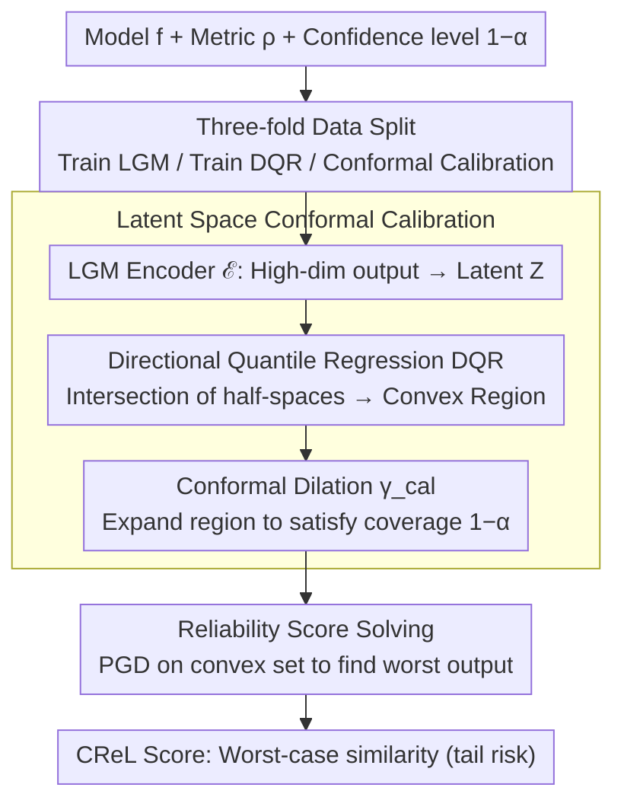

# Conformal Reliability: A New Evaluation Metric for Conditional Generation

**Conference**: ICML2026  
**arXiv**: [2605.30807](https://arxiv.org/abs/2605.30807)  
**Code**: https://ggc29.github.io/CReL/ (Yes)  
**Area**: Image Generation  
**Keywords**: Reliability Evaluation, Conformal Prediction, Conditional Generation, Worst-case Analysis, Uncertainty Quantification  

## TL;DR
The authors propose CReL, a reliability score based on Conformal Prediction. By constructing convex prediction sets in a latent space and optimizing for worst-case metric performance, CReL achieves uncertainty-aware evaluation for conditional generative models. It reveals differences in model reliability for image-to-text and text-to-image tasks that traditional single-output metrics fail to capture.

## Background & Motivation

**Background**: Conditional generative models (e.g., text-to-image, image-to-text) have made significant progress. Current mainstream evaluation metrics like CLIP Score, BERT-SIM, and FID typically assess only the quality of a single generated output, reflecting the "average performance" of the model.

**Limitations of Prior Work**: Generative models possess inherent stochasticity—the same input can produce drastically different outputs under different sampling seeds. A model might have a high average score but still possess a non-negligible probability of producing catastrophic failures. For instance, in image-to-text tasks, a model usually generates "a person playing guitar" correctly, but under certain seeds, it might produce "a person holding a gun." In safety-critical scenarios, single-output evaluation cannot quantify this tail risk.

**Key Challenge**: Existing metrics measure "how good a model can be," whereas reliability should measure "how bad a model can be at its worst." However, directly constructing prediction sets in high-dimensional output spaces and optimizing worst-case metrics faces the dual challenges of the curse of dimensionality and non-convex optimization.

**Goal**: Define a reliability score that accounts for uncertainty, quantifying the worst-case performance of a model at a given confidence level $1-\alpha$, and provide an efficient computational framework.

**Key Insight**: The high-dimensional output is mapped to a low-dimensional latent space. Directional Quantile Regression (DQR) is used to construct a convex prediction region, followed by conformal calibration to ensure coverage guarantees. Convexity allows the worst-case optimization to be solved via Projected Gradient Descent (PGD).

**Core Idea**: Construct a convex prediction set in latent space that satisfies coverage guarantees, transforming the originally intractable high-dimensional non-convex reliability optimization problem into a solvable optimization problem over convex constraints.

## Method

### Overall Architecture
CReL aims to answer "how bad a conditional generative model can be in the worst case." The inputs are the model $f$ to be evaluated, a user-specified similarity metric $\rho$, and a confidence level $1-\alpha$. The difficulty lies in the fact that enumerating all possible outputs in a high-dimensional space to find the worst one is bogged down by both the curse of dimensionality and non-convexity. CReL's strategy is to compress the high-dimensional output into a low-dimensional latent space, construct a convex prediction set with coverage guarantees there, and thus reduce "finding the worst output" to a solvable problem of PGD over a convex set.

### Key Designs

**1. Latent Space Conformal Calibration: Moving Intractable High-Dim Calibration to Low-Dim Convex Regions**

The first obstacle to worst-case evaluation is constructing a "set of outputs that the model is truly likely to produce at confidence level $1-\alpha$." Doing this in the original output space requires grid discretization, with computational costs expanding exponentially with dimensionality. CReL splits the training data into three folds: $\mathcal{I}_{\text{lgm}}$ to train a VAE encoder/decoder, $\mathcal{I}_{\text{dqr}}$ to train Directional Quantile Regression (DQR), and $\mathcal{I}_{\text{cal}}$ for conformal calibration. The encoder $\mathcal{E}$ first compresses the output $\hat{Y}$ into a latent variable $Z \in \mathbb{R}^r$. DQR estimates an $\alpha$-quantile half-space $\mathbb{H}_u^+(x)$ for each direction $\mathbf{u} \in \mathbb{S}^{r-1}$. The intersection of all half-spaces yields a convex region $R_\mathcal{Z}(x) = \bigcap_{\mathbf{u}} \mathbb{H}_u^+(x)$.

Intersecting multiple directions causes the actual coverage to drop below $1-\alpha$, requiring conformal calibration to "inflate" the region: the projection distance $E_i^+$ from each sample in the calibration set to $R_\mathcal{Z}$ is calculated, and the $\lceil(|\mathcal{D}_{\text{cal}}|+1)(1-\alpha)\rceil$ quantile is taken as the dilation amount $\gamma_{\text{cal}}$, expanding the region to $S^{\gamma_{\text{cal}}}(x)$. This step is efficient because convex regions in latent space allow projection distances to be calculated via linear programming rather than grid searches.

**2. Reliability Score Definition and Solving: Finding the Worst Output in a Convex Prediction Set**

With the calibrated convex prediction set $C_\mathcal{Z}$, the reliability score is defined as the score of the output within the set that performs worst according to the metric:

$$\text{CReL} = \min_{z \in C_\mathcal{Z}(X_{n+1})} \rho\big(\mathcal{D}ec(z; X_{n+1}), \text{GT}_{n+1}\big)$$

This involves selecting the result from all "reasonably possible" outputs that is least similar to the ground truth—a lower score indicates higher tail risk. In the original problem, the metric $\rho$ and the constraint set $C_\mathcal{Y}$ are non-convex in the output space; after moving to latent space, the constraints become convex. Although the objective may remain non-convex, it can be solved using PGD. The projection operator itself reduces to linear programming: first solve $y^* = \arg\min_{y_1 \in R_\mathcal{Z}(x)} \|y_1 - y\|_2$, then translate by $\gamma_{\text{cal}}$ along the vector. Running PGD with 50 random starting points mitigates non-convex local optima, yielding stable results with a standard deviation of only 0.00027.

**3. Coverage Guarantee: Calibration in Latent Space, Guarantee in Output Space**

For the reliability score to be trustworthy, the prediction set must cover the true output with probability $1-\alpha$. Based on exchangeability, CReL first proves that $\mathbb{P}(Z_{n+1} \in S^{\gamma_{\text{cal}}}) \geq 1-\alpha$ in latent space. It then argues that when the LGM accurately recovers the conditional distribution $\hat{Y}|X$, the decoder mapping does not decrease coverage, thus $\mathbb{P}(\hat{Y}_{n+1} \in C_\mathcal{Y}(X_{n+1})) \geq 1-\alpha$ holds. The upper bound for coverage is $1-\alpha + 1/(1+|\mathcal{D}_{\text{cal}}|)$, which approaches the target as the calibration set grows. Compared to direct calibration in output space (e.g., Feldman et al.), latent space calibration is slightly more conservative due to decoder expansion but makes the optimization problem "solvable," a trade-off CReL finds acceptable.

## Key Experimental Results

### Calibration Results on Synthetic Data

| Method | $\alpha$ | Coverage-$\mathcal{Z}$ | Coverage-$\mathcal{Y}$ | Region Area |
|------|----------|----------------------|----------------------|----------|
| Ours (CReL) | 0.10 | 0.8953 | 0.8915 | **232.7** |
| Feldman | 0.10 | — | 0.8940 | 234.5 |
| DQR | 0.10 | 0.8823 | 0.9145 | 287.4 |
| Ours (CReL) | 0.02 | 0.9770 | 0.9760 | **398.5** |
| DQR | 0.02 | 0.9818 | 0.9872 | 749.1 |

### Reliability Evaluation for Image-to-Text ($\alpha=0.1$)

| Model | CLIP-SIM | CReL-CLIP | BERT-SIM | CReL-BERT |
|------|----------|-----------|----------|-----------|
| BLIP-base | 0.2330 (4th) | **0.0070 (1st)** | 0.8349 (3rd) | 0.6335 (3rd) |
| BLIP-large | 0.2453 (3rd) | −0.0074 (4th) | 0.8106 (4th) | 0.5631 (4th) |
| GIT-base | 0.2511 (2nd) | −0.0021 (2nd) | **0.8620 (2nd)** | **0.6474 (1st)** |
| GIT-large | 0.2550 (1st) | −0.0043 (3rd) | **0.8649 (1st)** | 0.6459 (2nd) |

### Key Findings
- **Ranking Inversion**: BLIP-base ranks lowest in average CLIP-SIM (0.2330) but first in CReL-CLIP (0.0070) because its score distribution is more concentrated, leading to better worst-case performance.
- **Region Area Advantage**: The area of CReL's prediction set (232.7) is significantly smaller than DQR (287.4) and comparable to Feldman (234.5), indicating that joint calibration produces more compact information sets.
- **Scalability**: Unlike Feldman’s grid method, which grows exponentially in high dimensions, CReL’s latent space calibration runtime grows linearly with dimensionality.
- Similar inversions were observed in **text-to-image tasks**: SD3-M ranked third in CLIP-SIM but first in CReL-CLIP, while Kandinsky-2.2 had the highest average but ranked third in reliability.

## Highlights & Insights
- **Redefining Reliability as a Worst-case Problem**: By moving beyond traditional average metrics and using the conformal prediction framework to quantify tail risks, CReL provides a concise concept directly valuable for generating models in safety-critical scenarios (medical, autonomous driving).
- **Latent Convexification Strategy**: Converting non-convex high-dimensional problems into convex-constrained low-dimensional optimizations via LGM+DQR is an elegant balance between engineering and theory. Reducing the projection operator to linear programming makes the framework practically viable.
- **Discovery of Model Ranking Inversion**: This provides practical guidance, showing that models with high average scores are not necessarily reliable. Distributional concentration is a key feature of reliability, applicable to any scenario requiring evaluation of generative consistency.

## Limitations & Future Work
- LGM requires additional training (VAE encoder/decoder), increasing evaluation costs, and the coverage guarantee depends on the assumption of LGM reconstruction quality.
- Evaluation is currently limited to image-to-text tasks on MS-COCO, excluding more complex conditional generation scenarios like video generation or 3D reconstruction.
- Conformal prediction provides marginal coverage guarantees rather than conditional coverage, which might not be sufficiently strict for specific difficult inputs.
- Potential for extension to many-to-many mapping scenarios (video, robot control), but this requires new joint latent representations and calibration strategies.

## Related Work & Insights
- Feldman et al. (2023) calibrate multi-output quantile regression in the output space; non-convexity makes optimization difficult. CReL gains convexity by shifting to the latent space.
- Directional Quantile Regression (DQR; Kong & Mizera, 2012) provides the foundation for convex prediction sets but is overly conservative in high dimensions.
- PCP (Wang et al., 2022b) constructs prediction sets for conditional generative models, but its coordinate-wise calibration may be more conservative than joint latent space calibration (Area 854.24 vs 232.70).

<!-- RELATED:START -->

## Related Papers

- [\[ICML 2026\] Conf-Gen: Conformal Uncertainty Quantification for Generative Models](conf-gen_conformal_uncertainty_quantification_for_generative_models.md)
- [\[CVPR 2026\] SHOE: Semantic HOI Open-Vocabulary Evaluation Metric](../../CVPR2026/image_generation/shoe_semantic_hoi_open-vocabulary_evaluation_metric.md)
- [\[ICLR 2026\] PolyGraph Discrepancy: a classifier-based metric for graph generation](../../ICLR2026/image_generation/polygraph_discrepancy_a_classifier-based_metric_for_graph_generation.md)
- [\[ICML 2026\] AtelierEval: Agentic Evaluation of Humans & LLMs as Text-to-Image Prompters](ateliereval_agentic_evaluation_of_humans_llms_as_text-to-image_prompters.md)
- [\[ICML 2026\] HoloFair: Unified T2I Fairness Evaluation and Fair-GRPO Debiasing](holofair_unified_t2i_fairness_evaluation_and_fair-grpo_debiasing.md)

<!-- RELATED:END -->
