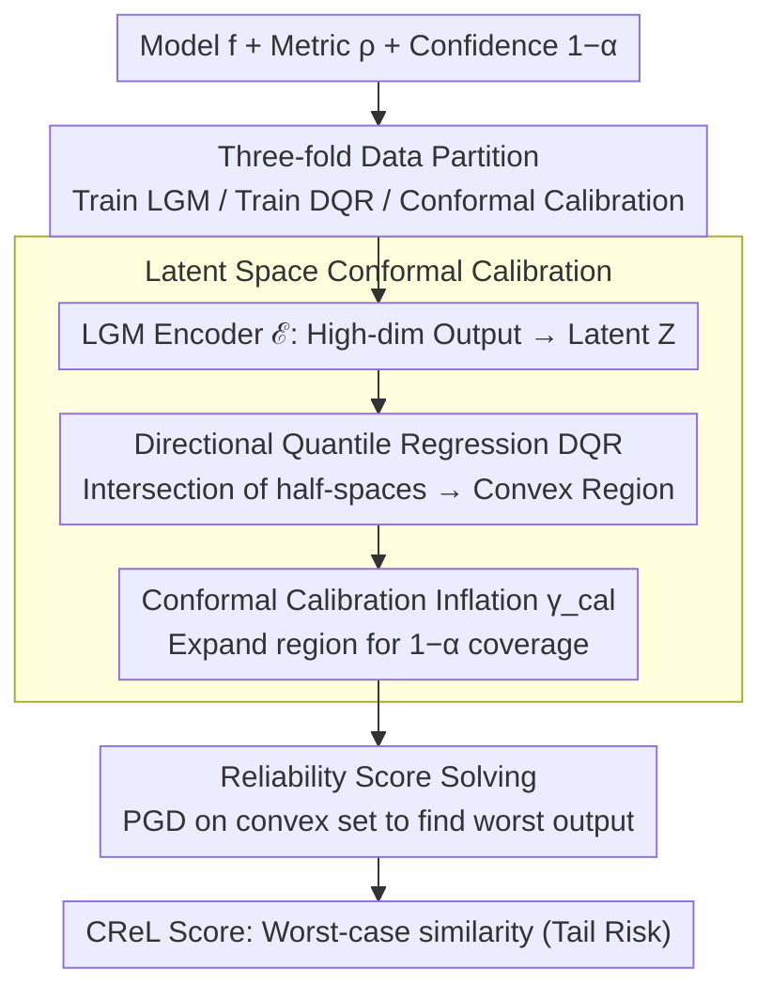

# Conformal Reliability: A New Evaluation Metric for Conditional Generation

**Conference**: ICML2026  
**arXiv**: [2605.30807](https://arxiv.org/abs/2605.30807)  
**Code**: https://ggc29.github.io/CReL/ (Available)  
**Area**: Image Generation  
**Keywords**: Reliability Evaluation, Conformal Prediction, Conditional Generation, Worst-case Analysis, Uncertainty Quantification  

## TL;DR
The paper proposes CReL, a reliability score based on Conformal Prediction. By constructing convex prediction sets in latent space and optimizing for worst-case metric performance, it achieves uncertainty-aware evaluation for conditional generative models. Experiments on image-to-text and text-to-image tasks reveal reliability differences that traditional single-output metrics fail to capture.

## Background & Motivation

**Background**: Conditional generative models (text-to-image, image-to-text, etc.) have made significant progress. Current mainstream evaluation metrics such as CLIP Score, BERT-SIM, and FID typically evaluate only the quality of a single generation output, reflecting the "average performance" of the model.

**Limitations of Prior Work**: Generative models possess inherent stochasticity—the same input can produce drastically different outputs under different sampling seeds. A model might have a high average score but still possess a non-negligible probability of producing catastrophic failures. For instance, in an image-to-text task, a model usually generates "a person playing the guitar," but might generate "a person holding a gun" under certain seeds. In safety-critical scenarios, single-output evaluation cannot quantify this tail risk.

**Key Challenge**: Existing metrics measure "how good a model can be," whereas reliability should measure "how bad a model can be at its worst." However, directly constructing prediction sets in high-dimensional output spaces and optimizing for worst-case metrics face the dual difficulties of the curse of dimensionality and non-convex optimization.

**Goal**: Define a reliability score that accounts for uncertainty, quantifying the worst-case performance of a model at a given confidence level $1-\alpha$, while providing an efficient computational framework.

**Key Insight**: High-dimensional outputs are mapped to a low-dimensional latent space. Directional Quantile Regression (DQR) is used to construct a convex prediction region, followed by conformal calibration to ensure coverage guarantees. Convexity allows the worst-case optimization to be solved via Projected Gradient Descent (PGD).

**Core Idea**: Construct convex prediction sets in latent space that satisfy coverage guarantees, transforming the originally intractable high-dimensional non-convex reliability optimization into a solvable optimization problem over convex constraints.

## Method

### Overall Architecture
CReL aims to answer "how bad a conditional generative model can be in the worst case." The inputs are the model $f$ to be evaluated, a user-specified similarity metric $\rho$, and a confidence level $1-\alpha$. The difficulty lies in the fact that enumerating all possible outputs in high-dimensional space to find the worst one is computationally expensive and non-convex. CReL addresses this by compressing high-dimensional outputs into a low-dimensional latent space, constructing a convex prediction set with coverage guarantees there. Consequently, "finding the worst output" reduces to a solvable projected gradient descent problem on a convex set.

### Key Designs

**1. Latent Space Conformal Calibration: Moving Intractable High-dim Calibration to Low-dim Convex Regions**

The first hurdle in worst-case evaluation is constructing a "set of outputs that the model is truly likely to produce at confidence level $1-\alpha$." Doing this in the original output space requires grid discretization, with computational costs expanding exponentially with dimensionality. CReL splits training data into three folds: $\mathcal{I}_{\text{lgm}}$ to train a VAE encoder/decoder, $\mathcal{I}_{\text{dqr}}$ to train Directional Quantile Regression (DQR), and $\mathcal{I}_{\text{cal}}$ for conformal calibration. The encoder $\mathcal{E}$ compresses the output $\hat{Y}$ into a latent variable $Z \in \mathbb{R}^r$. DQR estimates an $\alpha$-quantile half-space $\mathbb{H}_u^+(x)$ for each direction $\mathbf{u} \in \mathbb{S}^{r-1}$. The intersection of all half-spaces yields a convex region $R_\mathcal{Z}(x) = \bigcap_{\mathbf{u}} \mathbb{H}_u^+(x)$.

Since intersecting multiple directions causes the actual coverage to fall below $1-\alpha$, conformal calibration is used to "inflate" the region: the projection distance $E_i^+$ of each sample in the calibration set to $R_\mathcal{Z}$ is calculated, and the $\lceil(|\mathcal{D}_{\text{cal}}|+1)(1-\alpha)\rceil$-th quantile is taken as the inflation amount $\gamma_{\text{cal}}$, expanding the region to $S^{\gamma_{\text{cal}}}(x)$. This step is efficient because convex regions in latent space allow for calculating projection distances via linear programming rather than grid-searching in the original space.

**2. Definition and Solving of the Reliability Score: Finding the Worst Output in Convex Prediction Sets**

With the calibrated convex prediction set $C_\mathcal{Z}$, the reliability score is defined as the score of the output within the set that performs worst according to the metric:

$$\text{CReL} = \min_{z \in C_\mathcal{Z}(X_{n+1})} \rho\big(\mathcal{D}ec(z; X_{n+1}), \text{GT}_{n+1}\big)$$

This involves picking the result least similar to the ground truth from all "reasonably possible" model outputs—a lower score indicates higher tail risk. In the original problem, the metric $\rho$ and constraint set $C_\mathcal{Y}$ are non-convex in the output space. By moving to latent space, the constraints become convex. Although the objective remains non-convex, it can be approached using Projected Gradient Descent (PGD). The projection operator itself is reduced to linear programming: first solving $y^* = \arg\min_{y_1 \in R_\mathcal{Z}(x)} \|y_1 - y\|_2$, then translating by $\gamma_{\text{cal}}$ along the direction. In practice, PGD is run with 50 random starts to mitigate non-convex local optima, yielding stable results with a standard deviation of only 0.00027.

**3. Theoretical Coverage Guarantees: Calibrating in Latent Space, Guaranteeing in Output Space**

For the reliability score to be trustworthy, the prediction set must cover the true output with probability $1-\alpha$. Based on exchangeability, CReL first proves that $\mathbb{P}(Z_{n+1} \in S^{\gamma_{\text{cal}}}) \geq 1-\alpha$ in the latent space. It then argues that if the LGM accurately recovers the conditional distribution $\hat{Y}|X$, the decoder mapping will not decrease the coverage, ensuring $\mathbb{P}(\hat{Y}_{n+1} \in C_\mathcal{Y}(X_{n+1})) \geq 1-\alpha$. The upper bound for coverage is $1-\alpha + 1/(1+|\mathcal{D}_{\text{cal}}|)$, approaching the target as the calibration set grows. Compared to direct calibration in output space (e.g., Feldman et al.), latent space calibration is slightly more conservative due to decoder expansion, but it transforms the entire optimization problem from "intractable" to "solvable."

## Key Experimental Results

### Calibration Results on Synthetic Data

| Method | $\alpha$ | Coverage-$\mathcal{Z}$ | Coverage-$\mathcal{Y}$ | Region Area |
|------|----------|----------------------|----------------------|----------|
| CReL (Ours) | 0.10 | 0.8953 | 0.8915 | **232.7** |
| Feldman | 0.10 | — | 0.8940 | 234.5 |
| DQR | 0.10 | 0.8823 | 0.9145 | 287.4 |
| CReL (Ours) | 0.02 | 0.9770 | 0.9760 | **398.5** |
| DQR | 0.02 | 0.9818 | 0.9872 | 749.1 |

### Reliability Evaluation for Image-to-Text ($\alpha=0.1$)

| Model | CLIP-SIM | CReL-CLIP | BERT-SIM | CReL-BERT |
|------|----------|-----------|----------|-----------|
| BLIP-base | 0.2330 (4th) | **0.0070 (1st)** | 0.8349 (3rd) | 0.6335 (3rd) |
| BLIP-large | 0.2453 (3rd) | −0.0074 (4th) | 0.8106 (4th) | 0.5631 (4th) |
| GIT-base | 0.2511 (2nd) | −0.0021 (2nd) | **0.8620 (2nd)** | **0.6474 (1st)** |
| GIT-large | 0.2550 (1st) | −0.0043 (3rd) | **0.8649 (1st)** | 0.6459 (2nd) |

### Key Findings
- **Ranking Inversion**: BLIP-base has the lowest average CLIP-SIM (0.2330) but ranks first in CReL-CLIP (0.0070). This is because its score distribution is more concentrated, leading to better worst-case performance.
- **Region Area Advantage**: CReL's prediction set area (232.7) is significantly smaller than DQR's (287.4) and comparable to Feldman's (234.5), indicating that joint calibration generates more compact information sets.
- **Scalability**: Unlike Feldman's grid-based method, which grows exponentially with dimensionality, CReL's latent space calibration runtime scales linearly with dimensionality.
- **Text-to-Image Tasks**: Similar inversions are observed; SD3-M ranks third in CLIP-SIM but first in CReL-CLIP, while Kandinsky-2.2 has the highest average but ranks third in reliability.

## Highlights & Insights
- **Redefining Reliability as a Worst-case Problem**: Breaking away from traditional average metrics, the paper uses a conformal prediction framework to quantify tail risks of generative models. This concept is concise and applicable to any user-specified metric $\rho$.
- **Latent Space Convexification Strategy**: Combining LGM and DQR to transform high-dimensional non-convex problems into low-dimensional convex-constrained optimization is an elegant balance of engineering and theory.
- **Discovery of Model Ranking Inversion**: This provides practical guidance, showing that models with high average scores are not necessarily reliable. Distributional concentration is a key characteristic of reliability.

## Limitations & Future Work
- LGM requires additional training (VAE encoder/decoder), increasing evaluation costs, and coverage guarantees rely on the assumption of LGM reconstruction quality.
- Currently only evaluated on MS-COCO for image-text tasks; more complex scenarios like video generation or 3D reconstruction are not yet addressed.
- Conformal prediction provides marginal coverage guarantees rather than conditional coverage, which may not be strict enough for specific difficult inputs.
- Potential for expansion to many-to-many mapping scenarios (video, robot control) would require new joint latent space representations and calibration strategies.

## Related Work & Insights
- Feldman et al. (2023) calibrate multi-output quantile regression in output space; non-convexity makes optimization difficult. CReL gains convexity by moving to latent space.
- Directional Quantile Regression (DQR) (Kong & Mizera, 2012) provides the foundation for convex prediction sets but is overly conservative in high dimensions.
- PCP (Wang et al., 2022b) constructs prediction sets for conditional generative models, but its coordinate-wise calibration is more conservative than joint latent space calibration (Area 854.24 vs 232.70).

## Related Papers

- [\[ICML 2026\] Conf-Gen: Conformal Uncertainty Quantification for Generative Models](conf-gen_conformal_uncertainty_quantification_for_generative_models.md)
- [\[ICLR 2026\] PolyGraph Discrepancy: a classifier-based metric for graph generation](../../ICLR2026/image_generation/polygraph_discrepancy_a_classifier-based_metric_for_graph_generation.md)
- [\[CVPR 2026\] Markovian Scale Prediction: A New Era of Visual Autoregressive Generation](../../CVPR2026/image_generation/markovian_scale_prediction_a_new_era_of_visual_autoregressive_generation.md)
- [\[ICML 2026\] AtelierEval: Agentic Evaluation of Humans & LLMs as Text-to-Image Prompters](ateliereval_agentic_evaluation_of_humans_llms_as_text-to-image_prompters.md)
- [\[ICML 2026\] HoloFair: Unified T2I Fairness Evaluation and Fair-GRPO Debiasing](holofair_unified_t2i_fairness_evaluation_and_fair-grpo_debiasing.md)

<!-- RELATED:END -->

<!-- RELATED:START -->

## Related Papers

- [\[ICML 2026\] From Talking to Singing: A New Challenge for Audio-Visual Deepfake Detection](from_talking_to_singing_a_new_challenge_for_audio-visual_deepfake_detection.md)
- [\[ICML 2026\] Conf-Gen: Conformal Uncertainty Quantification for Generative Models](conf-gen_conformal_uncertainty_quantification_for_generative_models.md)
- [\[ICML 2026\] Escaping Mode Collapse in LLM Generation via Geometric Regulation](escaping_mode_collapse_in_llm_generation_via_geometric_regulation.md)
- [\[ICML 2026\] Skipping the Zeros in Diffusion Models for Sparse Data Generation](skipping_the_zeros_in_diffusion_models_for_sparse_data_generation.md)
- [\[ICML 2026\] Unified Masked Diffusion Models with Diverse Generation Orders](unifying_masked_diffusion_models_with_various_generation_orders_and_beyond.md)

<!-- RELATED:END -->
