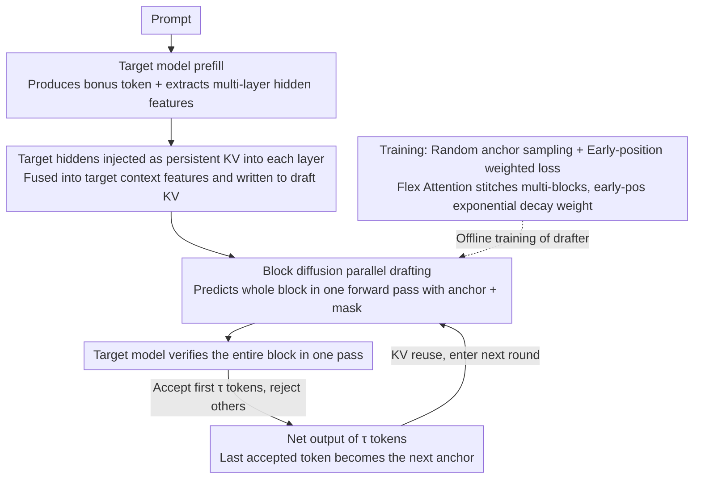

# DFlash: Block Diffusion for Flash Speculative Decoding

**Conference**: ICML 2026  
**arXiv**: [2602.06036](https://arxiv.org/abs/2602.06036)  
**Code**: https://dflash.z-lab.ai (Available, including GitHub + HuggingFace)  
**Area**: LLM Efficiency / Speculative Decoding / Diffusion Language Models  
**Keywords**: Speculative Decoding, Block Diffusion, Draft Model, KV Injection, Parallel Drafting

## TL;DR
DFlash replaces autoregressive drafters like EAGLE-3 with a lightweight "Block Diffusion" drafter. By injecting multi-layer hidden features of the target model as KV into every layer of the draft model, it enables parallel drafting of an entire block of tokens in a single forward pass, achieving up to 6× lossless acceleration—approximately 2.5× faster than EAGLE-3.

## Background & Motivation

**Background**: Autoregressive LLM inference is limited by "token-by-token serial" generation, leading to extremely low GPU utilization. Speculative decoding has become the mainstream acceleration scheme by having a "small draft model quickly guess a segment and a large target model verify in parallel." EAGLE-3 is the current SOTA, but its drafter remains autoregressive—just with fewer layers and shorter sequences.

**Limitations of Prior Work**: Autoregressive drafting faces two inherent issues: (1) Drafting latency $T_{\text{draft}}=\gamma\cdot t_{\text{step}}$ grows linearly with the speculative budget $\gamma$, forcing the drafter to use extremely shallow structures (e.g., 1-layer Transformer); (2) Shallow models lack capacity, causing the acceptance length $\tau$ to saturate quickly. These factors cap overall acceleration at a 2–3× ceiling.

**Key Challenge**: The "quality" and "latency" of the drafting phase are strongly coupled via $\gamma$. Achieving a larger $\tau$ requires a larger $\gamma$, which in turn causes the drafting time to explode.

**Existing Diffusion Drafting Attempts**: DiffuSpec / SpecDiff-2 utilize 7B dLLMs as drafters; while quality is high, the parameter count is too large, and drafting latency negates the acceleration. PARD trains small models to mimic diffusion-style parallel generation, but its capacity is too small to achieve high acceptance lengths. Thus, "diffusion drafting" sounds promising but falls into the "either too large or too weak" dilemma in practice.

**Goal**: Develop a diffusion drafter that is both lightweight (5-layer Transformer), capable of achieving long acceptance lengths ($\tau\!\ge\!6$), and deeply conditioned on the target model.

**Key Insight**: The authors observe that the hidden features of the target model already "implicitly" encode information about multiple future tokens (echoing Samragh et al. 2025). Therefore, the drafter does not need to "reason from scratch" but only needs to act as a lightweight "diffusion adapter" to translate the hidden features computed by the target model during prefill into future block tokens.

**Core Idea**: Use block diffusion for parallel drafting and inject multi-layer hidden features of the target model as KV directly into every layer of the draft model. This allows "drafting time to remain nearly independent of $\gamma$" and "acceptance length to scale stably with the number of draft layers" to occur simultaneously.

## Method

### Overall Architecture
DFlash addresses the dilemma where autoregressive drafters bind "quality" and "latency" through the speculative budget $\gamma$. It replaces only the draft side of the standard speculative decoding loop, leaving the verification side unchanged. Given a prompt, the target model first performs prefill to produce the first bonus token while extracting hidden features from several intermediate layers as "future token hints." These are fused and injected into the KV cache of each layer in a lightweight draft model. The draft model then uses block diffusion to produce the entire block in a single parallel forward pass, which is then passed back to the target model for one-time verification. Drafting quality comes from deep conditioning on target features, and speed comes from a single parallel forward pass.

### Key Designs

**1. Target Hidden Features as Persistent KV in Every Layer: Allowing Drafter Depth to Increase Acceptance Length**

EAGLE-3 also uses target hiddens but concatenates features with draft token embeddings only at the input layer. As the draft model deepens, this conditioning signal is diluted through layers, preventing the acceptance length $\tau$ from scaling. DFlash instead extracts hidden states from uniformly sampled layers of the target model (default 5 layers, from the 2nd to the 3rd-to-last layer). These are fused via a projection layer into a compact "target context feature," which is then **independently projected into the Key/Value matrices of each draft Transformer layer** and written to the KV cache, reused across multiple drafting rounds. This way, every attention layer directly accesses the target features. This is the foundation for DFlash using 5-layer or even 8-layer drafters—Table 9 shows that under a 5-layer drafter, input fusion yields GSM8K $\tau$=3.5, while KV injection increases it to 4.2.

**2. Block Diffusion Parallel Drafting Replacing Autoregressive Drafting: Decoupling Drafting Time from Speculative Budget**

The cost of autoregressive drafting is $T_{\text{draft}}=\gamma\cdot t_{\text{step}}$, which grows linearly with the speculative budget, forcing drafters into 1-layer shallow structures. DFlash's draft model is block-diffusion style: given an anchor in the block (the bonus token from the previous target step), the remaining $\text{block\_size}-1$ positions are initialized as mask tokens. All mask positions are predicted in a single forward pass. Thus, drafting time is approximately $T_{\text{draft}}\!\approx\!t_{\text{parallel}}$, which is nearly independent of the block size—Figure 3 shows that a 5-layer DFlash drafting 16 tokens is faster than 1-layer EAGLE-3 drafting 8 tokens. Once drafting time is decoupled, "deeper/stronger draft models" and "longer draft blocks" can coexist, pushing the speed-quality Pareto front to the top-right.

**3. Random Anchor Sampling + Early-Position Weighted Loss: Aligning Training with Inference and Optimizing Bottleneck Tokens**

During inference, the drafter starts from an arbitrary bonus token as an anchor at a random position. Thus, training cannot use fixed blocks like standard block diffusion. DFlash randomly samples anchor tokens from the response; each anchor acts as the first position of a block with subsequent positions masked. The draft model predicts the following $\text{block\_size}-1$ tokens. Multiple blocks are stitched into one sequence using Flex Attention and trained simultaneously with sparse masks (bidirectional visibility within blocks, visibility of target features, no visibility between blocks). This exposes the drafter to diverse target context features. For the loss, an exponential decay weight $w_k=\exp(-\tfrac{k-1}{\gamma})$ is applied to position $k$ within the block, as speculative decoding success is determined by the "first rejected position." Errors at early positions render the entire subsequent block wasted. Table 13 reports that this strategy significantly improves acceptance length and speedup.

### Mechanism Example
Take Qwen3-8B, block size 16, and a 5-layer drafter: After the target model prefills the prompt, it provides bonus token $x_0$ and extracts hiddens from 5 layers, fused into target context features and written to the drafter's KV. The drafter treats $x_0$ as an anchor, masks the next 15 positions, and predicts candidates $\hat{x}_1\dots\hat{x}_{15}$ in one forward pass. The target model verifies these 16 positions in one parallel pass. If the first 6 are accepted and the 7th is rejected, 6 tokens are produced. The 6th accepted token becomes the new bonus/anchor, and the target context feature is reused in the KV without re-extraction. The round cost is one draft forward pass + one target verification.

### Loss & Training
The base objective is cross-entropy with the aforementioned $w_k=\exp(-\tfrac{k-1}{\gamma})$ position weights. Drafter token embeddings and the LM head are **shared and frozen** with the target model; only the draft Transformer layers are trained, reinforcing the "lightweight diffusion adapter" role. Training data includes ~800K samples (NVIDIA Nemotron Post-Training V2 + CodeAlpaca), with responses regenerated by the target model to align distributions. For long context, 1.6K LongAlign samples are fine-tuned for 3 epochs to extend from 4K to 32K.

## Key Experimental Results

### Main Results

| Model / Task | Method | Speedup | $\tau$ |
|---|---|---|---|
| Qwen3-8B GSM8K (T=0) | EAGLE-3 (tree=16) | 1.94× | 3.23 |
| Qwen3-8B GSM8K (T=0) | EAGLE-3 (tree=60) | 2.23× | 3.71 |
| Qwen3-8B GSM8K (T=0) | **DFlash (block=16)** | **5.15×** | **6.54** |
| Qwen3-8B HumanEval (T=0) | EAGLE-3 (tree=60) | 2.17× | 3.65 |
| Qwen3-8B HumanEval (T=0) | **DFlash (block=16)** | **5.14×** | **6.50** |
| Qwen3-4B Avg 8 Tasks (T=0) | EAGLE-3 (tree=16) | 1.81× | 3.05 |
| Qwen3-4B Avg 8 Tasks (T=0) | **DFlash (block=16)** | **4.91×** | **6.54** |
| Qwen3-8B Math500 SGLang(B200) C=1 | Baseline → DFlash | **5.1×** | 8.01 |
| Qwen3-Coder-30B-A3B HumanEval SGLang C=32 | DFlash | **3.1×** | 8.09 |

Key Points: Under equal drafting budgets (EAGLE-3 tree=16 vs DFlash block=16), DFlash's $\tau$ nearly doubles and speedup increases by 2.4–2.7×. Even when EAGLE-3 is relaxed to tree=60, DFlash maintains a total lead. On production-grade SGLang + FA4 backends on a single B200, it consistently achieves 4–5×.

### Ablation Study

| Configuration | Key Observation | Description |
|---|---|---|
| Draft Layers 3 / 5 / 8 (Table 6) | speedup 4.69× / 4.71× / 4.64× | 8 layers have highest $\tau$ but slower draft; 5 is optimal |
| Target Hiddens 3 / 5 (Table 7) | Math500 $\tau$ 5.38 → 5.64 | More target layers improve $\tau$ at the cost of training cache |
| Train BS 16 / Test BS 8 (Table 8) | speedup 3.87× vs 3.97× | Models trained on large blocks generalize to smaller blocks |
| Input fusion vs KV Injection (Table 9) | GSM8K $\tau$ 3.5 → 4.2 | KV injection is key to deepening the drafter effectively |

### Key Findings
- The real differentiator for DFlash over EAGLE-3 is not "diffusion" itself but the combination of **KV Injection + Block Parallelism**: Ablations replacing diffusion with autoregression + KV injection (DFlash-AR) still exceed EAGLE-3-5L in $\tau$ but fail to match DFlash's speedup. KV injection provides quality; block diffusion provides speed.
- The hardware reality that drafting time is nearly independent of block size (Figure 3) allows the drafter to grow both deep ($\tau$) and wide (block length), breaking the autoregressive Pareto front.
- 4K base training + 3 epochs of LongAlign fine-tuning supports 32K context, suggesting target hiddens already possess long-context representations; the drafter only needs short-range adaptation.

## Highlights & Insights
- **Redefining Diffusion Language Models**: Rather than competing with autoregressive LLMs on end-to-end generation, dLLMs are positioned as "parallel accelerators dedicated to drafting." This framing justifies minimal diffusion steps (even 1 step) and relies on verification for quality.
- **Portability of KV Injection**: Scenarios where "small models are conditioned on large model hiddens" (distillation drafting, parallel heads, early-exit validation) can benefit from putting conditional info into KV rather than input to prevent signal dilution in deep small models.
- **Targeted Weighted Loss for Acceptance Length**: By identifying that overall success is limited by the first error, attacking this bottleneck with exponential decay weights is a simple yet effective training trick for prefix-dependent parallel generation tasks.

## Limitations & Future Work
- Lack of direct code-level comparisons with some diffusion draft methods (e.g., DiffuSpec / TiDAR) due to missing open-source implementations; SOTA claims are primarily against EAGLE-3.
- Training costs are non-trivial: ~800K samples with target model regeneration and hidden feature caching that grows linearly with layers. Storage and compute overhead for 70B+ target models would be significant.
- Block size selection is currently offline. While smaller blocks are better for large batch/compute-bound scenarios, an online scheduler that dynamically adjusts block size based on history is left for future work.
- Speedup on open-ended chat tasks (MT-Bench) is significantly lower than on code/math (2.75× vs 5.14×), suggesting the assumption that target hiddens contain future token info is weaker in open generation.

## Related Work & Insights
- **vs EAGLE-3**: Both use target hiddens, but EAGLE-3 fuses them only at the input layer and uses autoregressive drafting. DFlash uses KV injection in every layer and block diffusion, doubling $\tau$ and providing >2.4× speedup under fair settings.
- **vs PARD**: PARD uses small autoregressive models to mimic diffusion; DFlash uses true diffusion + deep KV injection, raising the acceleration ceiling from 3× to 6×.
- **vs DiffuSpec / SpecDiff-2**: These use ~7B dLLMs, where drafting latency offsets $\tau$ gains. DFlash uses a ~30M parameter diffusion adapter, shifting from "self-reliant quality" to "conditioned quality" to make the drafter lightweight.
- **vs Samragh et al. (LoRA Parallel Draft)**: Both observe that target hiddens contain future info. However, Samragh et al. use LoRA to make the target model draft itself; DFlash decouples this to an independent drafter, which is more modular and allows for more thorough KV injection.

## Rating
- Novelty: ⭐⭐⭐⭐ Block diffusion for drafting isn't entirely new, but the "KV Injection + Block Parallel + Weighted Loss" combo makes it production-ready.
- Experimental Thoroughness: ⭐⭐⭐⭐⭐ Covers Qwen3-4B/8B/30B, LLaMA-3.1-8B, multiple domains (Math/Code/Chat), T=0/1, and varied backends (SGLang/vLLM).
- Writing Quality: ⭐⭐⭐⭐ Clear narrative flow from autoregressive bottlenecks to DFlash solutions.
- Value: ⭐⭐⭐⭐⭐ Provides 6× lossless acceleration and integrates into SGLang; offers a new answer for the role of dLLMs in the LLM pipeline.

<!-- RELATED:START -->

## Related Papers

- [\[ICML 2026\] Speculative Coupled Decoding for Training-Free Lossless Acceleration of Autoregressive Visual Generation](speculative_coupled_decoding_for_training-free_lossless_acceleration_of_autoregr.md)
- [\[AAAI 2026\] Annealed Relaxation of Speculative Decoding for Faster Autoregressive Image Generation](../../AAAI2026/image_generation/annealed_relaxation_of_speculative_decoding_for_faster_autor.md)
- [\[ICCV 2025\] Grouped Speculative Decoding for Autoregressive Image Generation](../../ICCV2025/image_generation/grouped_speculative_decoding_for_autoregressive_image_generation.md)
- [\[CVPR 2026\] Multi-Scale Local Speculative Decoding for Image Generation](../../CVPR2026/image_generation/multi-scale_local_speculative_decoding_for_image_generation.md)
- [\[CVPR 2026\] SJD-PAC: Accelerating Speculative Jacobi Decoding via Proactive Drafting and Adaptive Continuation](../../CVPR2026/image_generation/sjd-pac_accelerating_speculative_jacobi_decoding_via_proactive_drafting_and_adap.md)

<!-- RELATED:END -->
