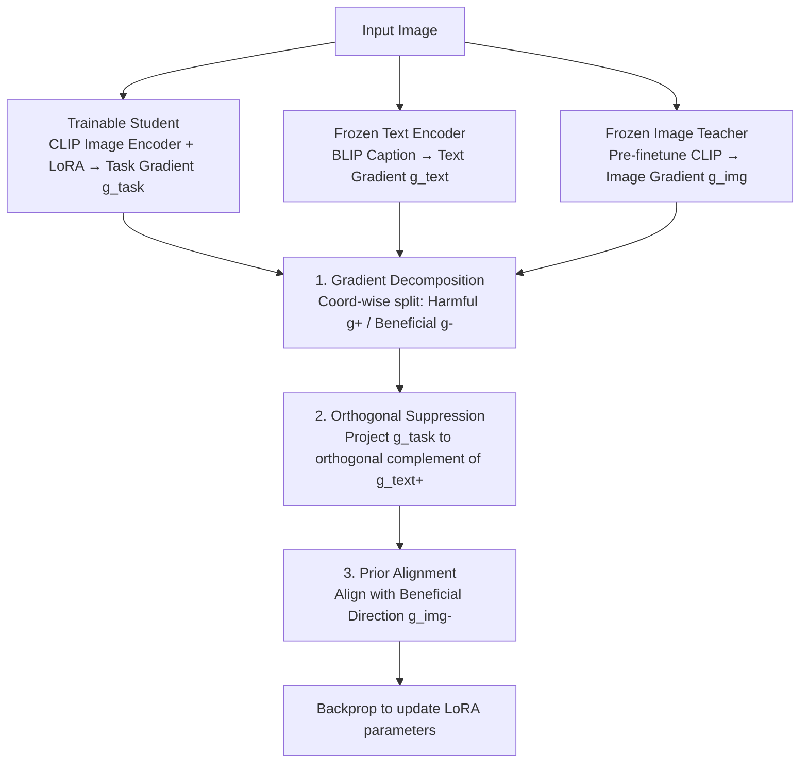

# DGS-Net: Distillation-Guided Gradient Surgery for CLIP Fine-Tuning in AI-Generated Image Detection

**Conference**: ICML 2026 Spotlight  
**arXiv**: [2511.13108](https://arxiv.org/abs/2511.13108)  
**Code**: https://horizontel.github.io/DGS-Net/  
**Area**: AI-Generated Image Detection / CLIP Fine-Tuning / Gradient Manipulation  
**Keywords**: AIGI Detection, CLIP LoRA, Catastrophic Forgetting, Orthogonal Gradient Projection, Distillation Alignment

## TL;DR
To address the issue where "fine-tuning CLIP for AI-generated image detection causes catastrophic forgetting that destroys transferable priors," this paper proposes DGS-Net. It decomposes the classification loss gradient by coordinates into harmful positive components $g^+$ and beneficial negative components $g^-$. The image gradients of the training network are first orthogonally projected onto the complement space of the **harmful directions of frozen CLIP text gradients** (Orthogonal Suppression, removing task-irrelevant semantics), and then aligned with the **beneficial directions of frozen CLIP image gradients** (Prior Alignment, preserving pre-trained priors). This achieves an average detection accuracy 6.6% higher than the SOTA across 50 generative models.

## Background & Motivation
**Background**: Large-scale multi-modal pre-trained models like CLIP provide competitive "open-set" general features for AI-generated image (AIGI) detection. UnivFD achieves decent generalization results on many generators by simply freezing CLIP and training a linear head. Subsequent works (C2P-CLIP, Effort, NS-Net, etc.) use LoRA fine-tuning to inject forgery-specific features.

**Limitations of Prior Work**: Through t-SNE visualization (Fig. 1) on four datasets (ProGAN, R3GAN, SDXL, SimSwap), the authors found that: (1) Frozen CLIP maintains a complete geometric structure but cannot distinguish real/fake; (2) LoRA fine-tuning separates real/fake but collapses the original CLIP geometric manifold, causing significant performance drops in cross-generator generalization. In other words, "fine-tuning" is a double-edged sword that captures detection signals while destroying transferable priors.

**Key Challenge**: Only **a portion** of pre-trained knowledge is useful for detection (directions related to forgery artifacts), while another portion (related to semantic content) is irrelevant or even serves as an interference. Traditional feature distillation uses global alignment, which pulls both parts together, failing to preserve truly useful priors while retaining a large amount of task-irrelevant semantic burden.

**Goal**: (1) Restrict the update direction of the training network to a "task-harmless" subspace; (2) Selectively pull back "task-beneficial" pre-trained priors using a distillation mechanism; (3) Avoid imprecise global feature alignment.

**Key Insight**: The authors interpret the direction via first-order Taylor expansion: for a classification loss $\mathcal{L}(u, y)$, the **positive component** $g^+=[\nabla_u \mathcal{L}]_+$ of the gradient $\nabla_u \mathcal{L}$ indicates that "increasing features along these coordinates increases the loss," representing **harmful directions**; the **negative component** $g^- = [\nabla_u \mathcal{L}]_-$ indicates that "increasing features along these coordinates decreases the loss," representing **beneficial directions**. This coordinate-level decomposition provides a metric for "knowledge value." A control experiment in Fig. 3 shows that a classifier trained purely on BLIP-generated captions achieves ~60% accuracy, indicating that semantic information is partially correlated with labels but mostly acts as interference—providing empirical evidence that the positive component of text gradients represents semantic interference.

**Core Idea**: Perform "knowledge preservation/suppression" surgery in the **gradient space**. The harmful direction of the text gradient identifies what should be suppressed, and the beneficial direction of the image teacher gradient identifies what should be reinforced. The former is removed via orthogonal projection, and the latter is injected into the descent direction via a distillation loss.

## Method

### Overall Architecture
DGS-Net addresses the dilemma where fine-tuning CLIP for AIGI detection gains task signals at the expense of transferable priors by performing surgery in the **gradient space**. During training, three branches (frozen/trainable) are executed: the trainable student (CLIP image encoder + LoRA), the frozen CLIP text encoder, and the frozen image teacher (a copy of CLIP before fine-tuning). Each branch calculates its own loss and gradients at the feature layer. The student gradient is then modified by projecting out semantic interference using the text gradient's "harmful direction" and compensating with pre-trained benefits using the image teacher's "beneficial direction." Finally, only LoRA parameters are updated.

### Key Designs

**1. Gradient Positive-Negative Decomposition: A Coordinate-level Metric for Knowledge Value**

Both subsequent components are built on the observation that gradients of classification loss at the feature level can be split into two halves of opposing value based on coordinate signs. Based on the first-order expansion $\mathcal{L}(u+\varepsilon e, y) \approx \mathcal{L}(u, y) + \varepsilon\langle \nabla_u \mathcal{L}, e\rangle$, a positive perturbation along coordinate $e_j$ increases loss if and only if $\partial \mathcal{L}/\partial u_j > 0$. Gradients are split element-wise: $g^+ \triangleq [\nabla_u \mathcal{L}]_+$ is the **harmful direction** where increasing features increases loss, and $g^- \triangleq [\nabla_u \mathcal{L}]_-$ is the **beneficial direction** where increasing features decreases loss. This allows **coordinate-level** granularity—unlike traditional distillation which ignores direction, or PCGrad which only considers alignment between full vectors.

**2. Orthogonal Suppression: Text Gradients as Semantic Filters**

This addresses the issue whereby fine-tuning drifts along task-irrelevant semantic dimensions. By using a frozen text encoder to compute the text gradient $g_{\text{text}}$, its positive component $g_{\text{text}}^+$ is extracted. Since CLIP visual-text features are well-aligned, the text gradient serves as a proxy for the semantic subspace, and its harmful direction marks local loss increases caused by semantic dimensions. The student's task gradient $g_{\text{task}}$ is projected onto the orthogonal complement of $g_{\text{text}}^+$:

$$\tilde{g}_{\text{task}} = g_{\text{task}} - \langle g_{\text{task}}, \hat{g}_{\text{text}}^+\rangle\, \hat{g}_{\text{text}}^+$$

where $\hat{g}_{\text{text}}^+$ is the normalized harmful direction. This ensures the image encoder updates only in subspaces that are semantic-neutral yet classification-effective.

**3. Prior Alignment: Selectively Distilling Beneficial Directions**

Beyond suppression, beneficial priors washed away by fine-tuning must be restored without using global feature distillation $\|f - f^T\|^2$, which would pull in irrelevant semantics and cause geometric collapse. Here, the frozen image teacher $E_{\text{img}}^T$ computes $g_{\text{img}}$ via a forward pass on the same image-label pair. Only its negative component $g_{\text{img}}^-$ (the beneficial direction) is used as a lightweight distillation target to bias the student's update direction. This ensures the teacher only preserves knowledge that is "already in pre-training and useful for detection," achieving selective prior preservation.

### Loss & Training
The student backbone is a CLIP image encoder with LoRA. The text side uses BLIP to automatically generate captions for each image. Three branches use independent linear heads to calculate BCEWithLogits losses $\mathcal{L}_{\text{img}}, \mathcal{L}_{\text{text}}, \mathcal{L}_{\text{img}}^T$, from which gradients $g_{\text{task}}, g_{\text{text}}, g_{\text{img}}$ are derived at the feature layer. During backpropagation, the student gradient is modified by the two surgery steps before updating LoRA parameters $\theta$. The teacher encoder is a fixed CLIP copy used only for providing $g_{\text{img}}^-$.

## Key Experimental Results

### Main Results
Cross-model detection accuracy on AIGCDetectBench (Partial excerpt, mAcc = average of Real + 17 generators):

| Method | Real | ProGAN | StyleGAN2 | SD v1.4 | ADM | GLIDE | Midjourney | DALLE2 | mAcc |
| :--- | :--- | :--- | :--- | :--- | :--- | :--- | :--- | :--- | :--- |
| CNN-Spot | 99.0 | 95.3 | 22.0 | 55.9 | 1.8 | 4.8 | 5.2 | 4.5 | 29.0 |
| UnivFD (Frozen CLIP) | 92.3 | 98.9 | 48.7 | 96.3 | 12.7 | 75.6 | 61.2 | 62.3 | 72.7 |
| FreqNet | 89.9 | 99.4 | 67.5 | 99.9 | 37.7 | 78.9 | 80.8 | 88.8 | 71.7 |
| **Ours (DGS-Net)** | **99.3** | **98.9** | **58.7** | **100.0** | **26.5** | **69.2** | **71.0** | **89.8** | **79.3** |

Average detection accuracy across 50 generative models is **6.6%** higher than the SOTA. t-SNE shows DGS-Net distinguishes real/fake while maintaining CLIP's original geometric manifold.

### Ablation Study

| Configuration | Description |
| :--- | :--- |
| Full DGS-Net | Both Orthogonal Suppression and Prior Alignment enabled. |
| w/o Orthogonal Suppression | No removal of harmful text directions → drop in cross-generator generalization. |
| w/o Prior Alignment | No injection of teacher's beneficial directions → loss of CLIP priors and geometric collapse. |
| Global feature distill | Traditional distillation of entire features → traps task-irrelevant semantics. |

### Key Findings
- **Positive/negative gradient components = varying value**: Semantic information is a weak correlate for labels (60% accuracy); suppressing the positive part of text gradients effectively removes these non-generalizable cues.
- **CLIP's intrinsic geometry is critical for generalization**: Schemes that fail to preserve manifold geometry (direct LoRA fine-tuning) perform poorly on new generators.
- **Cross-modal gradients as proxies**: Using BLIP + CLIP text encoder allows for zero-cost identification of "harmful semantic directions."

## Highlights & Insights
- **Gradient-space Distillation**: Unlike traditional KD aligning $f$, this method aligns "descent directions," providing higher selectivity and less geometric damage.
- **Coordinate-level Surgery**: Finer granularity than vector-level alignment (e.g., PCGrad), making it suitable for multi-modal scenarios with separable knowledge subspaces.
- **Interpretable Visualization**: t-SNE results demonstrate that the common trade-off between "prior manifold preservation" and "real/fake separability" can be resolved.

## Limitations & Future Work
- Dependency on the multi-modal alignment quality of the CLIP backbone.
- Reliability of $g_{\text{text}}$ is tied to BLIP caption quality.
- Sign-based coordinate splitting is a first-order simplification; higher-order dimension coupling is not explored.
- Increased training cost due to three forward passes and additional gradient computations.

## Related Work & Insights
- **vs UnivFD**: UnivFD preserves priors but lacks discriminative power; DGS-Net achieves both via selective distillation and fine-tuning.
- **vs LoRA fine-tuning**: DGS-Net prevents the manifold collapse typical of direct fine-tuning through gradient surgery.
- **vs Multi-task Gradient Surgery**: DGS-Net operates at coordinate-sign granularity rather than full-vector alignment, targeting knowledge protection within a single task.

## Rating
- Novelty: ⭐⭐⭐⭐ Combines gradient-based selectivity with cross-modal regularization.
- Experimental Thoroughness: ⭐⭐⭐⭐ Extensive testing across 50 generators and multiple families (GAN/Diffusion/Deepfake).
- Writing Quality: ⭐⭐⭐⭐ Clear progression from motivation to methodology.
- Value: ⭐⭐⭐⭐ Significant mAcc gain (+6.6%) and a framework transferable to other fine-tuning tasks requiring prior preservation.

<!-- RELATED:START -->

## Related Papers

- [\[ICML 2026\] OmniAID: Decoupling Semantic and Artifacts for Universal AI-Generated Image Detection in the Wild](omniaid_decoupling_semantic_and_artifacts_for_universal_ai-generated_image_detec.md)
- [\[AAAI 2026\] Aggregating Diverse Cue Experts for AI-Generated Image Detection](../../AAAI2026/image_generation/aggregating_diverse_cue_experts_for_ai-generated_image_detec.md)
- [\[ICLR 2026\] Diffusion Fine-Tuning via Reparameterized Policy Gradient of the Soft Q-Function](../../ICLR2026/image_generation/diffusion_fine-tuning_via_reparameterized_policy_gradient_of_the_soft_q-function.md)
- [\[ECCV 2024\] Zero-Shot Detection of AI-Generated Images](../../ECCV2024/image_generation/zero-shot_detection_of_ai-generated_images.md)
- [\[AAAI 2026\] Beyond Semantic Features: Pixel-Level Mapping for Generalized AI-Generated Image Detection](../../AAAI2026/image_generation/beyond_semantic_features_pixel-level_mapping_for_generalized_ai-generated_image_.md)

<!-- RELATED:END -->
