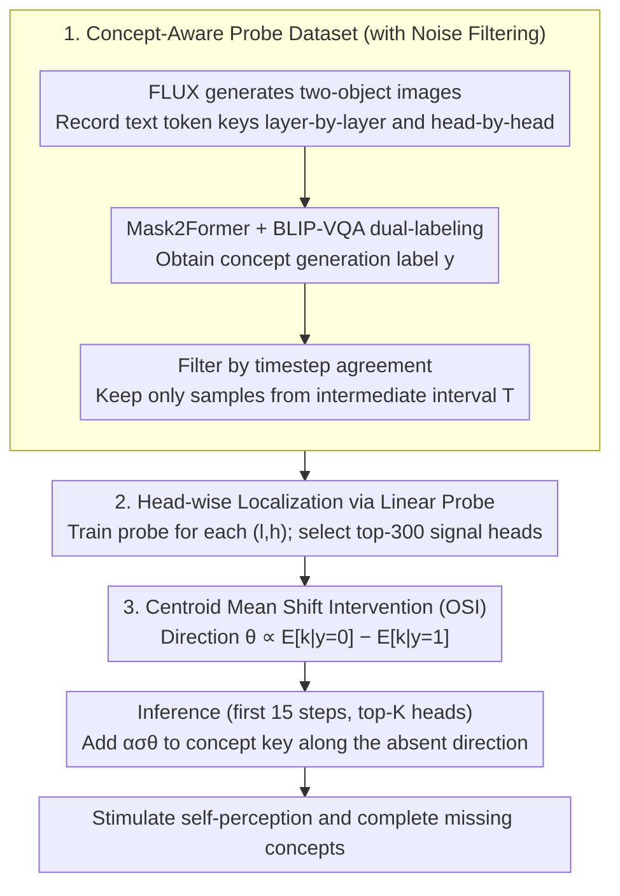

# Diagnosing and Correcting Concept Omission in Multimodal Diffusion Transformers

**Conference**: ICML 2026  
**arXiv**: [2605.14270](https://arxiv.org/abs/2605.14270)  
**Code**: No public repository link provided in the paper  
**Area**: Diffusion Models / Text-to-Image Generation / Representation Intervention  
**Keywords**: MM-DiT, Concept Omission, Linear Probe, Attention Key Intervention, Training-free Guidance

## TL;DR
The paper utilizes linear probes to discover that in the intermediate layers of MM-DiT (FLUX / SD3.5), the key vectors of text tokens naturally encode a binary signal indicating "whether the target concept will appear." Based on this, the authors propose Omission Signal Intervention (OSI): during inference, the mean difference direction of "omission class - existence class" is injected into the key vectors of the Top-K heads with an intensity of $\alpha\sigma\boldsymbol{\theta}$. This stimulates the model's "self-awareness" of missing concepts to complete the generation. On FLUX, the GenEval 6-object accuracy improves from 0.18 to 0.40 without any fine-tuning.

## Background & Motivation
**Background**: T2I diffusion models have largely transitioned to the MM-DiT architecture (FLUX, SD3, SD3.5), which concatenates text tokens and image patch tokens into a single sequence for joint attention. This is more suitable for learning cross-modal semantic alignment compared to the unidirectional injection of U-Net + cross-attention.

**Limitations of Prior Work**: Despite architectural progress, concept omission (e.g., requesting a "cat, dog, and book" but missing the book) remains a persistent issue in MM-DiT. Existing mitigation solutions either add optimization constraints to visual attention maps (Attend-and-Excite, A-STAR, Rassin et al.) or require additional training (GLIGEN, reward fine-tuning), both of which entail high inference costs or disrupt the original model distribution.

**Key Challenge**: Existing research focuses primarily on visual embeddings. How text embeddings encode the signal of "whether a concept will appear" **internally** within diffusion models remains a black box. Although Chen et al. (2024) analyzed CLIP text outputs, they did not trace the signal to the internal attention heads of the diffusion model. In other words, the model might "know" what it has missed, but there are no tools to query it.

**Goal**: (1) Use probing tools to check if internal text tokens in MM-DiT truly carry "omission status" information; (2) If they do, identify the specific layers, heads, and timesteps carrying this signal; (3) Use minimal inference-time intervention to amplify this signal and force the model to generate the missing concepts.

**Key Insight**: The joint attention in MM-DiT allows text tokens to receive visual feedback from image tokens at every layer. Thus, the key/value of a text token is no longer a "static text description" but a dynamic reflection of what has already been generated in the current latent. In intermediate layers (where image tokens carry semantics but generation is incomplete), the key vector of a text token may encode "has the concept I correspond to appeared in the noisy latent?"

**Core Idea**: First, use a linear probe to explicitly extract this "omission signal" from the attention keys (the mean difference direction from "absent → present"). Then, use mass mean shift during inference to move the key towards the **inverse absent direction**, effectively making the model "perceive the omission as more severe," thereby triggering it to remedy the missing concepts.

## Method

### Overall Architecture
The paper addresses concept omission in MM-DiT by extracting the latent signal of "whether the model already knows a concept is missing" and amplifying it during inference to force compensation. The process consists of two stages: The **Diagnose** stage runs GenEval two-object generation on FLUX.1-Dev, using Mask2Former + BLIP-VQA dual-labeling to obtain binary labels $y\in\{0,1\}$ for each concept token. Text token key vectors $\mathbf{k}_c^{(t,l,h)}$ are collected from intermediate timesteps to train a linear probe for each $(l,h)$ to distinguish absent/present states, thereby locating the heads encoding the signal. The **Correct (OSI)** stage calculates the "absent direction" from these heads and, during the early stages of generation, pushes the key vectors of concept tokens along this direction in the top-K reliable heads. This causes the model to "mistakenly believe the omission is more severe," triggering its internal mechanism to render the missing concepts.

### Key Designs

**1. Concept-Aware Probe Dataset with Noise Filtering: Ensuring Probes Learn the Current "Awareness"**

The prerequisite for a valid probe is that the data truly reflects the token's "awareness state" at any given moment. The authors generate samples using the template "a photo of {obj1} and {obj2}" and record text token key vectors $\mathbf{k}^{(t,l,h)}$. Labels are derived from the final image using Mask2Former and BLIP-VQA; samples are only accepted if both annotators agree. Crucially, two types of misaligned samples are removed: early timesteps where the object has not appeared (steps 1-3) but eventually succeeds ($y=1$), and late timesteps where omission signals have vanished. Table 1 quantifies this, showing that agreement between intermediate intervals and final labels reaches 0.965. This "filtering by generation dynamics" embeds the temporal structure of the diffusion model into the probe design.

**2. Head-wise Localization via Linear Probes: Identifying Specialist Heads among 1368 Candidates**

Signals are sparse—not every head encodes omission. The authors train an individual linear classifier for each $(l,h)$. Fig. 2(a) shows that probe accuracy peaks at intermediate timesteps, while Fig. 2(b) reveals a counter-intuitive layer distribution: early layers are near random (text tokens haven't absorbed visual feedback), intermediate layers rise sharply (up to 91.0% accuracy), and late layers drop off. Based on this, the top-300 heads are selected as "omission signal heads." Fig. 3-4 visualize the probe's "present" probability climbing in sync with the visual objects becoming visible in $\hat{x}_0$, providing a dynamic visualization of "model self-perception."

**3. Centroid Mean Shift Intervention (OSI): Steering Keys to Trigger Compensation**

OSI performs surgical intervention in a training-free manner. For each top-K head, the centroid mean shift direction is calculated as $\boldsymbol{\delta}^{(l,h)} = \mathbb{E}[\mathbf{k}^{(t,l,h)}|y=0] - \mathbb{E}[\mathbf{k}^{(t,l,h)}|y=1]$ (absent minus present), normalized to $\boldsymbol{\theta}^{(l,h)}$. During inference:

$$\mathbf{k}_c \leftarrow \mathbf{k}_c + \alpha\,\sigma^{(l,h)}\,\boldsymbol{\theta}^{(l,h)}$$

The concept token key is modified, where $\sigma^{(l,h)}$ is the standard deviation for adaptive scaling and $\alpha$ is a scalar (5.0 for FLUX, 7.5 for SD3.5). Intervention is active during the first 15 steps (total 30). Counter-intuitively, it adds the "absent direction" rather than the "present direction"—making the model "think" it has missed the object more severely to trigger a stronger correction.

### Loss & Training
OSI is training-free for the main model. Only 1368 lightweight linear probes (parameters much smaller than the main model) are trained using BCE loss. Key settings: 30 steps sampling, CFG=3.5 (FLUX) / 7.0 (SD3.5), top-K=300 (FLUX) / 100 (SD3.5), $\alpha=5.0/7.5$, $t_{\text{stop}}=0.78/0.76$. For token selection, GenEval uses template rules, while T2I-CompBench uses Llama-3.1-8B to extract object spans.

## Key Experimental Results

### Main Results
GenEval Multi-object (2-6 obj) and T2I-CompBench non-spatial subset:

| Backbone | Method | 2-obj | 3-obj | 4-obj | 5-obj | 6-obj | Avg | T2I non-spatial |
|----------|--------|-------|-------|-------|-------|-------|-----|-----------------|
| FLUX | Base | 0.81 | 0.63 | 0.44 | 0.29 | 0.18 | 0.47 | 0.3069 |
| FLUX | TACA | 0.89 | 0.68 | 0.56 | 0.31 | 0.20 | 0.53 | 0.3078 |
| FLUX | PLADIS | 0.87 | 0.71 | 0.56 | 0.31 | 0.20 | 0.53 | 0.3075 |
| FLUX | **OSI** | **0.92** | **0.71** | **0.64** | **0.40** | **0.40** | **0.61** | **0.3083** |
| SD3.5 | Base | 0.82 | 0.72 | 0.59 | 0.38 | 0.24 | 0.55 | 0.3155 |
| SD3.5 | TACA | 0.87 | 0.74 | 0.55 | 0.47 | 0.26 | 0.58 | 0.3164 |
| SD3.5 | **OSI** | **0.89** | **0.80** | **0.68** | 0.46 | **0.35** | **0.64** | 0.3159 |

Attribute neglect (T2I-CompBench attribute binding):

| Backbone | Method | Color | Shape | Texture |
|----------|--------|-------|-------|---------|
| FLUX | Base | 0.7923 | 0.4995 | 0.6419 |
| FLUX | TACA | 0.7742 | 0.5118 | 0.6493 |
| FLUX | **OSI** | **0.8014** | **0.5819** | **0.7039** |
| SD3.5 | Base | 0.7955 | 0.5820 | 0.7305 |
| SD3.5 | **OSI** | **0.8048** | **0.6119** | **0.7480** |

The 6-object performance more than doubles (0.18 → 0.40), proving OSI's efficacy in difficult scenarios where the baseline fails.

### Ablation Study
Direction, head selection, and token-specificity (FLUX):

| Setting | 2-obj | 3-obj | 4-obj | 5-obj | 6-obj |
|---------|-------|-------|-------|-------|-------|
| Base | 0.81 | 0.63 | 0.44 | 0.29 | 0.18 |
| Direction = Opposite ($-\boldsymbol{\theta}$) | 0.72 | 0.40 | 0.15 | 0.06 | 0.02 |
| Direction = Random | 0.84 | 0.65 | 0.53 | 0.32 | 0.30 |
| Heads = Bottom-K | 0.81 | 0.60 | 0.47 | 0.22 | 0.15 |
| Heads = Random K | 0.82 | 0.67 | 0.55 | 0.31 | 0.17 |
| Heads = All 1368 | 0.90 | 0.74 | 0.50 | 0.33 | 0.32 |
| **Ours (top-K + θ)** | **0.92** | **0.71** | **0.64** | **0.40** | **0.40** |

Token-specific intervention (100 FLUX failure cases):

| Method | Accuracy (omitted obj) | Probe Prob (omitted obj) |
|--------|------------------------|---------------------------|
| FLUX (no OSI) | 0.00 | 0.292 |
| OSI on omitted token | **0.70** | **0.658** |
| OSI on present token | 0.14 | 0.298 |

Intervention duration ($t_{\text{stop}}$):

| Step | 0 | 5 | 10 | **15 (Ours)** | 20 | 25 | 30 |
|------|---|---|----|---------------|----|----|---|
| Accuracy | 0.82 | 0.88 | 0.91 | **0.92** | 0.92 | 0.92 | 0.91 |
| MANIQA | 0.473 | 0.479 | 0.480 | **0.480** | 0.481 | 0.480 | 0.480 |

### Key Findings
- **Direction is everything**: Opposite intervention drops 6-obj accuracy from 0.18 to 0.02, proving the mass mean shift direction precisely corresponds to the "concept realization" semantic axis.
- **Surgical intervention on top heads is necessary**: Random heads or bottom-K heads are ineffective. Intervention on All heads is strong but surpassed by top-K, validating the probe-based head selection.
- **Token-specificity**: Applying the same intervention to already present tokens yields minimal gains (0.14 vs 0.70), proving OSI specifically targets omission signals.
- **Early steps yield primary gains**: Intervention during just the first 5 steps ($t_{\text{stop}}=0.95$) reaches 0.88 accuracy, confirming that concept formation occurs early in denoising.

## Highlights & Insights
- **The discovery that "models know what they missed" is significant**: Quantifying this internal awareness with 91% accuracy and amplifying it into a controllable steering signal completes a "diagnosis → intervention → verification" loop.
- **Training-free and zero overhead**: Operating only on Top-K heads' key vectors during early steps makes the overhead negligible, representing a major engineering advantage over fine-tuning.
- **Counter-intuitive "magnifying absence" design**: The precision of steering toward the absent direction to trigger internal correction mechanisms is a clever insight.
- **Universal Diffusion Steering Recipe**: The combination of Mass Mean Shift + Probe can potentially be extended to style control, composition correction, and other controllability issues in MM-DiT.

## Limitations & Future Work
- **Over-generation side effects**: OSI can sometimes generate too many objects (e.g., three instead of one). It currently lacks a closed-loop stopping criterion.
- Dependency on binary labels makes it hard to apply to subjective or fuzzy concepts (e.g., aesthetic style, relative quantities).
- Reliance on empirical values for Top-K and $\alpha$ necessitates recalibration for different backbones.
- Dynamic intervention based on real-time probe monitoring might be more effective than a static time window.

## Related Work & Insights
- **vs. Attend-and-Excite / A-STAR**: These require backpropagation at every step, whereas OSI is forward-only and faster.
- **vs. TACA / PLADIS**: OSI is lighter as it does not modify the attention calculation process.
- **vs. ITI**: This work transfers the mass mean shift paradigm from LLMs to Diffusion key vectors, identifying intermediate layers/timesteps as signal-rich zones.

## Rating
- Novelty: ⭐⭐⭐⭐⭐ First systematic transfer of ITI/mass mean shift to MM-DiT keys with an effective "magnifying absence" strategy.
- Experimental Thoroughness: ⭐⭐⭐⭐⭐ Extensive coverage across backbones, object densities, and attribute types.
- Writing Quality: ⭐⭐⭐⭐⭐ Clear narrative and excellent visualizations of probe dynamics.
- Value: ⭐⭐⭐⭐⭐ Training-free, zero overhead, and significant performance gains for industrial T2I deployment.

<!-- RELATED:START -->

## Related Papers

- [\[ICCV 2025\] Rethinking Cross-Modal Interaction in Multimodal Diffusion Transformers](../../ICCV2025/image_generation/rethinking_cross-modal_interaction_in_multimodal_diffusion_transformers.md)
- [\[ICCV 2025\] Exploring Multimodal Diffusion Transformers for Enhanced Prompt-based Image Editing](../../ICCV2025/image_generation/exploring_multimodal_diffusion_transformers_for_enhanced_prompt-based_image_edit.md)
- [\[AAAI 2026\] Laytrol: Preserving Pretrained Knowledge in Layout Control for Multimodal Diffusion Transformers](../../AAAI2026/image_generation/laytrol_preserving_pretrained_knowledge_in_layout_control_fo.md)
- [\[ICML 2026\] Krause Synchronization Transformers](krause_synchronization_transformers.md)
- [\[ICML 2026\] Forget-It-All: Multi-Concept Machine Unlearning via Concept-Aware Neuron Masking](forget-it-all_multi-concept_machine_unlearning_via_concept-aware_neuron_masking.md)

<!-- RELATED:END -->
