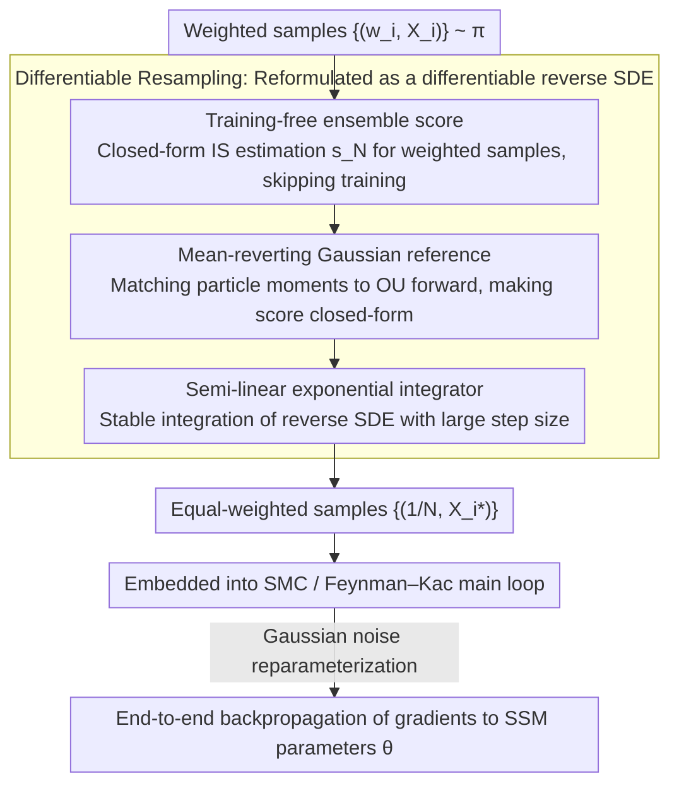

# Diffusion Differentiable Resampling

**Conference**: ICML 2026  
**arXiv**: [2512.10401](https://arxiv.org/abs/2512.10401)  
**Code**: https://github.com/zgbkdlm/diffres (Available)  
**Area**: Scientific Computing / Sequential Monte Carlo / Particle Filtering / Differentiable Sampling  
**Keywords**: Diffusion Models, Particle Filtering, SMC, Differentiable Resampling, State-Space Models

## TL;DR
This paper proposes **diffusion resampling**: a **training-free** diffusion process that serves as a naturally differentiable reparameterization replacement for the resampling step in Sequential Monte Carlo (SMC). It proves consistent convergence relative to the number of samples $N$ under the Wasserstein distance and outperforms existing differentiable resampling methods such as OT, Gumbel-Softmax, and Soft/Resampling-on-weights across multiple particle filtering and parameter estimation benchmarks.

## Background & Motivation

**Background**: Particle filtering / SMC is a core tool for inference in State-Space Models (SSMs), where **resampling** is a critical step to mitigate particle degeneracy. The most common approach, multinomial resampling, re-selects particles via categorical sampling $I_i \sim \mathrm{Categorical}(w_1,\dots,w_N)$.

**Limitations of Prior Work**: Multinomial resampling is a **discrete** operation, making pathwise derivatives $\partial X_i^{\theta,*}/\partial\theta$ undefined. When SSM parameters (or neuralized dynamics/decoders) need to be learned via gradients, automatic differentiation libraries silently drop these gradients, leading to **incorrect gradient estimation**.

**Key Challenge**: Existing differentiable resampling methods face a trade-off between "unbiasedness/consistency" and "differentiability/computational cost":
- **REINFORCE-type** (Score-based / Ścibior–Wood stop-gradient) suffers from high variance;
- **Soft / Gumbel-Softmax** are biased interpolations between multinomial and uninformative resampling, requiring manual tuning of coefficients;
- **OT-based** (Corenflos et al., 2021) is consistent and differentiable but requires solving Sinkhorn iterations, resulting in $O(N^2)$ complexity and **exponential** dependence on the entropy parameter $1/\varepsilon$; linear transport maps also struggle with complex distribution manifolds;
- **Neuralized** / **deterministic** resampling approaches introduce unavoidable bias.

**Goal**: To construct a resampling method that is (i) naturally differentiable, (ii) non-disruptive to existing SMC/SSM structures, (iii) consistent in convergence, (iv) computationally manageable, and (v) capable of adaptively injecting prior information using the sequential structure of SMC.

**Key Insight**: The core of OT resampling is "solving for a transport map $X_i^* = N\sum_j P_{i,j}^\varepsilon X_j$." The key insight of the authors is that **this map does not need to be "solved"; it can be "specified."** If a Langevin SDE is used to smoothly push the target $\pi$ toward a user-selected reference $\pi_{\mathrm{ref}}$ (forward) and then inverted (reverse SDE) to sample from $\pi_{\mathrm{ref}}$ back to $\pi$, the only source of randomness in the entire sampling chain is Gaussian noise, making it **naturally reparameterizable**.

**Core Idea**: Replace the Sinkhorn-derived transport matrix with a **training-free diffusion model** + **weighted-sample-driven ensemble score approximation**, expressing SMC resampling as a differentiable SDE simulation.

## Method

### Overall Architecture
The method addresses the inherent non-differentiability of the resampling step: given a set of weighted samples $\{(w_i, X_i)\}_{i=1}^N \sim \pi$, the goal is to output equal-weighted samples $\{(\frac{1}{N}, X_i^*)\}$ such that the mapping from input to output is differentiable with respect to SSM parameters $\theta$. The authors reformulate "resampling" as a "diffusion sampling" process: a Langevin forward SDE is specified to push the target $\pi$ toward a Gaussian reference $\pi_{\mathrm{ref}}$, and the corresponding reverse SDE is simulated to sample back. The unique source of randomness is Gaussian noise, enabling reparameterization. The required scores for the reverse SDE are estimated on-the-fly using weighted samples without training. This differentiable SDE simulation is integrated into the Feynman–Kac / SMC loop to achieve end-to-end gradient backpropagation.

### Key Designs

**1. Training-free ensemble score: Translating discrete categorical sampling into continuous differentiable scores**

The necessary component for the reverse SDE is the score $\nabla\log p_t$. Conventional approaches require training a diffusion model, which is slow and introduces bias. Instead, the authors use importance sampling to write it as a closed-form combination of existing weighted samples: $s_N(x,t) \coloneqq \sum_i \alpha_i(x,t)\,\nabla\log p_{t|0}(x|X_i)$, where weights $\alpha_i = w_i\, p_{t|0}(x|X_i) / \sum_j w_j\, p_{t|0}(x|X_j)$. This is exactly a self-normalized IS with $\pi$ as the proposal and the forward transition $p_{t|0}(\cdot|x_0)$ as the likelihood. Thus, the score can be calculated directly from the current SMC particles $\{(w_i, X_i)\}$.

The justification for this substitution is provided in Remark 1 via the Doob $h$-function: $s_N = \nabla\log\sum_i h_i$ implies that this diffusion is effectively a **continuous differentiable reparameterization** of multinomial resampling. The non-differentiable operation of "discretely picking particles by weights $w_i$" is replaced by a flow along an SDE driven by Gaussian noise. This also allows for lower variance than multinomial resampling due to the implicit encoding of transport costs by the reference $\pi_{\mathrm{ref}}$.

**2. Mean-reverting Gaussian reference: Minimizing diffusion "distance" and injecting posterior information**

A poor choice of reference can hinder convergence: using a fixed $\mathrm{N}(0, I_d)$ requires a large $T$ if $\pi$ is geometrically distant. The authors use weighted moment estimates $\mu_N, \Sigma_N$ to construct a Gaussian reference tailored to the current posterior, setting $\nabla\log\pi_{\mathrm{ref}}(x) = -\Sigma_N^{-1}(x-\mu_N)$, which corresponds to an OU-type forward SDE $dX = -b^2\Sigma_N^{-1}(X-\mu_N)\,dt + \sqrt{2}\,b\,dW$. This design (i) ensures the reference is already close to the destination, minimizing the required diffusion time, and (ii) allows the forward transition $p_{t|0}(x_t|x_0)$ to have an analytical form (involving $e^{-b^2\Sigma_N^{-1}t}$), making the ensemble score closed-form without numerical approximation.

**3. Semi-linear exponential integrator: Stable integration of reverse SDE under large steps**

The Lipschitz constant of the ensemble score can explode as $t\to 0$. Standard Euler–Maruyama requires very small steps to avoid divergence, necessitating a large number of discrete steps $K$. Leveraging the semi-linear structure $dU = (AU + f(U,t))\,dt + \sqrt{2}\,b\,dW$ provided by the Gaussian reference (where $A = b^2\Sigma_N^{-1}$ is the linear rigid term), the authors use a Jentzen–Kloeden exponential integrator to **exactly integrate** the rigid part: $U_{t_k} = e^{A\Delta_k}U_{t_{k-1}} + A^{-1}(e^{A\Delta_k}-I_d)f(U_{t_{k-1}}) + B_k$. The Wiener integral $B_k\sim \mathrm{N}(0,\, \Sigma_N(e^{2A\Delta_k}-I_d))$ is also sampled in closed form. This allows stable simulation with fewer steps $K$.

### Loss & Training
Ours **does not introduce new loss functions or training objectives**; it is a plug-and-play module within the SMC loop. During learning, the negative log-marginal likelihood $-\log L(\theta)$ estimated by Feynman–Kac (where $L(\theta) = \prod_j L_j(\theta)$) is minimized. Gradients flow through (i) Gaussian noise reparameterization and (ii) SDE solver adjoints or discretize-then-differentiate methods.

The convergence analysis (Section 3) yields Proposition 1:

$$\mathsf{W}_2^2(\widetilde{q}_t, q_t) \le \mathsf{W}_2^2(p_T, \pi_{\mathrm{ref}})\, e^{b^2(C_{\mathrm{ref}}-2C_p)t} + 2b^2 N^{-r} \overline{C}_e(t, T)$$

The error is decomposed into the score approximation term (decaying at rate $r=1/2$ as $N \to \infty$) and the finite-time bias term for $p_T \approx \pi_{\mathrm{ref}}$. Corollary 1 proves that there exists a linear mapping $t \mapsto T(t)$ such that $\mathsf{W}_2(\widetilde{q}_t, q_t) \to 0$. Remark 2 notes that under a Gaussian reference, $N$ only needs to grow **polynomially with $T$**, which is superior to the **exponential** dependence on $1/\varepsilon$ in OT.

## Key Experimental Results

### Main Results (Gaussian mixture importance resampling, $N{=}10{,}000$, 100 runs)

| Method | SWD ($\times 10^{-1}$) ↓ | Resampling Var ($\times 10^{-2}$) ↓ |
|------|--------------------------|------------------------------------|
| **Diffusion ($T{=}3, K{=}128$)** | **0.80 ± 0.21** | 3.74 ± 2.99 |
| OT ($\varepsilon{=}0.3$) | 0.84 ± 0.22 | 3.42 ± 3.26 |
| OT ($\varepsilon{=}0.6$) | 0.97 ± 0.20 | **3.41 ± 3.29** |
| Multinomial | 0.82 ± 0.25 | 3.78 ± 4.43 |
| Soft (0.9) | 0.83 ± 0.24 | 3.75 ± 3.77 |
| Gumbel-Softmax (0.1) | 1.40 ± 0.24 | 3.92 ± 3.74 |

Linear Gaussian SSM Particle Filtering ($N{=}32$, 128 steps, mean of 100 runs):

| Method | $\|L-\hat L\|_2$ | Filtering KL ($\times 10^{-1}$) | $\|\theta-\hat\theta\|_2$ ($\times 10^{-1}$) |
|------|------------------|---------------------------------|------------------------------------------------|
| **Diffusion ($T{=}3, K{=}8$)** | **2.55 ± 1.89** | **4.26 ± 4.49** | 1.58 ± 0.75 |
| Diffusion ($T{=}1, K{=}4$) | 2.61 ± 2.08 | 4.94 ± 6.92 | **1.28 ± 0.70** |
| OT ($\varepsilon{=}0.4$) | 2.64 ± 2.13 | 5.07 ± 6.21 | 1.53 ± 1.16 |
| Multinomial | 2.80 ± 1.84 | 5.49 ± 6.87 | NaN (Diverged) |
| Soft (0.9) | 2.85 ± 1.80 | 4.66 ± 5.68 | NaN |
| Gumbel-Softmax (0.1) | 2.79 ± 2.14 | 4.83 ± 5.76 | NaN |

### Ablation Study

| Configuration / Phenomenon | Observation | Description |
|-------------|------|------|
| Diffusion w/ $K{=}8$ vs $K{=}128$ | SWD: 1.64 → 0.80 | Integration steps directly determine accuracy; fine discretization is required. |
| Computational cost (increasing $N$) | Intersection of Diffusion vs OT shifts left | Diffusion resampling becomes **cheaper than OT** with large sample sizes. |
| Computational cost ($K$ vs $1/\varepsilon$) | Crosses at $K \approx 6/\varepsilon$ for $N{=}8192$ | Costs are comparable; Diffusion lacks the exponential dependency of OT. |
| Lokta–Voltera neural dynamics | Diffusion achieves lowest RMSE and stable loss | Outperforms OT / Soft / Gumbel / REINFORCE (Ścibior–Wood). |
| 32×32 Image-based pendulum | SSIM / PSNR on par or better than SOTA | Validates stability in complex SMC pipelines with **high-dimensional visual observations**. |

### Key Findings
- **Diffusion resampling is a superior resampler even without considering differentiability**—it outperforms multinomial, OT, and Soft methods in LGSSM settings, primarily because utilizing the posterior particles for the reference is more informative than the predictive samples used in OT.
- **Gradient stability is crucial for downstream optimization**: Multinomial, Soft, and Gumbel methods produce noisy gradients that cause NaN errors in L-BFGS-B; Diffusion and OT are the only methods that consistently support second-order optimizers.
- **Diffusion resampling is sensitive to $K$**: In Gaussian mixtures, $K{=}8$ is performed poorly compared to OT, requiring $K{=}128$ for SOTA performance. However, $K$ scales linearly, which is more manageable than OT's exponential $1/\varepsilon$.
- The **mean-reverting Gaussian reference** is the most cost-effective component: it prevents required $T$ from exploding and enables the exponential integrator.

## Highlights & Insights
- **"Do not solve the transport map, specify it"** is the fundamental conceptual shift. The computational effort Corenflos et al. spend on Sinkhorn is bypassed using a closed-form SDE, reducing complexity towards $O(N\log N \cdot K)$.
- Explaining the ensemble score via the Doob $h$-function as a **continuous differentiable reparameterization of multinomial resampling** provides an elegant perspective shift, potentially inspiring research on other discrete structures (e.g., categorical tokens, trees).
- Using the current SMC step's posterior as a reference is a valuable heuristic for amortized inference/latent SDE learning: **information sources should adapt over time** rather than using static priors.
- The convergence proof **explicitly decouples the errors** of $N$ vs $T$, showing that $N$ only requires polynomial growth to match any $T$, which offers direct guidance for practical SMC + differentiable sampling designs.

## Limitations & Future Work
- Backpropagating through diffusion resampling is **sensitive to the choice of SDE solver**; the exponential integrator can still be unstable near $t \to 0$ where scores explode.
- The ensemble score evaluation is $O(N)$ per step; for extremely large particle counts, this remains a bottleneck, requiring parallelization or tree-reductions to reach $O(\log N)$.
- The reference assumes a Gaussian / moment-matching approach, which may fail for **strongly multimodal** targets.
- Visual experiments were conducted on 32×32 grayscale images; **grid-scale variance stability under real-world image observations** (higher resolution/RGB) remains an open question.
- Potential improvement: Using forward-backward Gibbs chains (Corenflos et al., 2025) to replace the finite-$T$ bias with chain correlation.

## Related Work & Insights
- **vs OT resampling (Corenflos et al., 2021)**: The core difference is "computed vs specified" transport maps. Ours bypasses Sinkhorn, replacing $1/\varepsilon$ exponential dependence with $T$ polynomial dependence, and uses a more informative posterior reference.
- **vs Soft / Gumbel-Softmax (Karkus 2018 / Jang 2017)**: Those are biased interpolations of multinomial resampling; ours is a **consistent** reparameterization, which is theoretically cleaner and empirically more stable (especially avoiding NaNs with L-BFGS-B).
- **vs Score-based / REINFORCE (Poyiadjis 2011 / Ścibior–Wood 2021)**: These follow the expected gradient path with high variance; ours uses the pathwise route, leveraging the low-variance advantage of reparameterization.
- **vs Wan & Zhao (2025)**: They **train** a conditional diffusion, which introduces bias and lacks consistency. Ours is training-free.
- **vs Gourevitch et al. (2026, concurrent)**: They use stochastic interpolants for **discrete one-hot** categorical reparameterization; ours targets $\mathbb{R}^d$ continuous samples and focuses on $N \to \infty$ convergence properties.

## Rating
- Novelty: ⭐⭐⭐⭐⭐ Specifying an SDE as a transport map instead of computing it is a clean paradigm shift.
- Experimental Thoroughness: ⭐⭐⭐⭐ Covers GMM, LGSSM, Lokta–Voltera, and vision-pendulum, though visual resolution is limited to 32×32.
- Writing Quality: ⭐⭐⭐⭐⭐ Motivations, theorems, and algorithms are clearly structured; the Doob $h$-function explanation in the Remarks is particularly insightful.
- Value: ⭐⭐⭐⭐⭐ Provides a plug-and-play differentiable resampling module for probabilistic programming and latent SDEs with high engineering value.

<!-- RELATED:START -->

## Related Papers

- [\[ICML 2025\] FlexTok: Resampling Images into 1D Token Sequences of Flexible Length](../../ICML2025/image_generation/flextok_resampling_images_into_1d_token_sequences_of_flexible_length.md)
- [\[CVPR 2025\] Reward Fine-Tuning Two-Step Diffusion Models via Learning Differentiable Latent-Space Surrogate Reward](../../CVPR2025/image_generation/reward_fine-tuning_two-step_diffusion_models_via_learning_differentiable_latent-.md)
- [\[ICML 2026\] Recovering Hidden Reward in Diffusion-Based Policies](recovering_hidden_reward_in_diffusion-based_policies.md)
- [\[ICML 2026\] Stage-wise Distortion-Perception Traversal in Zero-shot Inverse Problems with Diffusion Models](stage-wise_distortion-perception_traversal_in_zero-shot_inverse_problems_with_di.md)
- [\[ICML 2026\] A Unified Framework for Diffusion Model Unlearning with f-Divergence](a_unified_framework_for_diffusion_model_unlearning_with_f-divergence.md)

<!-- RELATED:END -->
