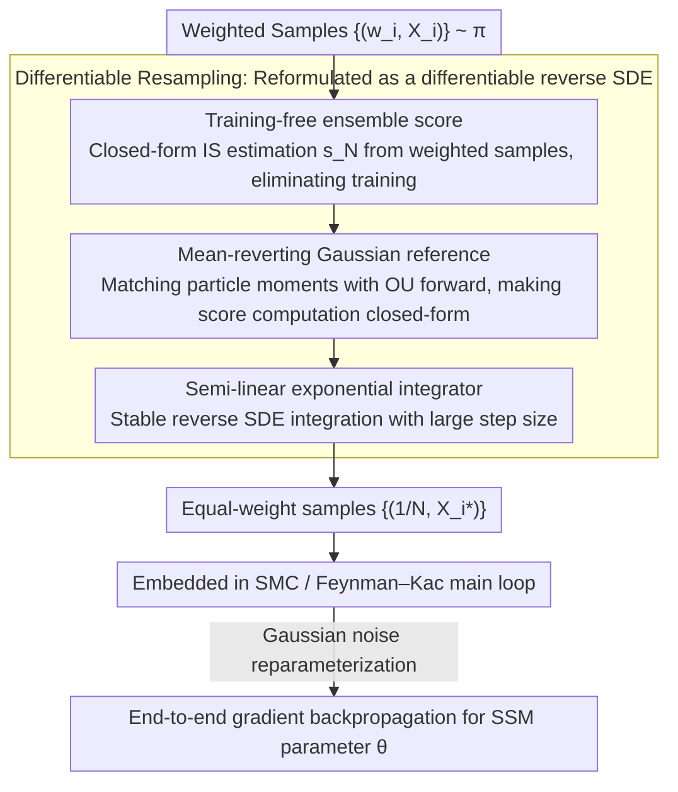

# Diffusion Differentiable Resampling

**Conference**: ICML 2026  
**arXiv**: [2512.10401](https://arxiv.org/abs/2512.10401)  
**Code**: https://github.com/zgbkdlm/diffres (Available)  
**Area**: Scientific Computing / Sequential Monte Carlo / Particle Filtering / Differentiable Sampling  
**Keywords**: Diffusion models, Particle Filtering, SMC, Differentiable Resampling, State Space Models

## TL;DR
This paper proposes **diffusion resampling**: a **training-free** diffusion process providing a naturally differentiable reparameterization alternative for the Sequential Monte Carlo (SMC) resampling step. It proves consistent convergence relative to sample size $N$ under Wasserstein distance and outperforms existing differentiable resampling methods such as OT / Gumbel-Softmax / Soft on multiple particle filtering and parameter estimation benchmarks.

## Background & Motivation

**Background**: Particle filtering / SMC is a primary tool for State Space Model (SSM) inference, where **resampling** is a critical step to alleviate particle degeneracy. The most commonly used multinomial resampling selects particles via categorical sampling $I_i \sim \mathrm{Categorical}(w_1,\dots,w_N)$.

**Limitations of Prior Work**: Multinomial resampling is a **discrete** operation, meaning the path derivative $\partial X_i^{\theta,*}/\partial\theta$ is undefined. When downstream tasks require learning SSM parameters (or even neuralized dynamics/decoders) via gradients, automatic differentiation libraries silently drop these gradients, leading to **incorrect gradient estimation**.

**Key Challenge**: Existing differentiable resampling methods face a trade-off between "unbiasedness/consistency" and "differentiability/computation cost":
- **REINFORCE-based** (Score-based / Ścibior–Wood stop-gradient) methods suffer from high variance;
- **Soft / Gumbel-Softmax** methods are biased interpolations between multinomial and uninformative sampling, requiring manual adjustment of coefficients;
- **OT-based** (Corenflos et al., 2021) methods are consistent and differentiable but require solving Sinkhorn, with a computational cost of $O(N^2)$ and an **exponential** dependence on the entropy parameter $1/\varepsilon$; linear transport maps also struggle with complex distribution manifolds;
- **Neural-networked** / **deterministic** resampling approaches introduce irreducible bias.

**Goal**: Construct a resampling method that is (i) naturally differentiable, (ii) does not disrupt existing SMC / SSM structures, (iii) consistently converges, (iv) has manageable computational costs, and (v) adaptively injects prior information using the sequential structure of SMC.

**Key Insight**: The core of OT resampling is "solving for a transport map $X_i^* = N\sum_j P_{i,j}^\varepsilon X_j$". The key insight of the authors is that **this map does not need to be "solved"; it can be "specified"**. If a Langevin SDE is used to smoothly push the target $\pi$ toward a user-selected reference $\pi_{\mathrm{ref}}$ (forward), and then inverted (reverse SDE) to sample from $\pi_{\mathrm{ref}}$ back to $\pi$, the only source of randomness in the sampling chain is Gaussian noise, which is **naturally reparameterizable**.

**Core Idea**: Replace the Sinkhorn-derived transport matrix with a **training-free diffusion model** + **weighted sample-driven ensemble score approximation**, expressing SMC resampling as a differentiable SDE simulation.

## Method

### Overall Architecture
The method addresses the inherent non-differentiability of the resampling step. Given weighted samples $\{(w_i, X_i)\}_{i=1}^N \sim \pi$, the goal is to output equal-weighted samples $\{(\frac{1}{N}, X_i^*)\}$ while ensuring the mapping is differentiable with respect to SSM parameters $\theta$. The method reframes "resampling" as "diffusion sampling": it specifies a Langevin forward SDE to push target $\pi$ toward a user-selected reference $\pi_{\mathrm{ref}}$, then inverts this SDE to sample from $\pi_{\mathrm{ref}}$ back to $\pi$. The only randomness in the chain is Gaussian noise, which is naturally reparameterizable. The scores needed for the reverse SDE are estimated on-the-fly from weighted samples without training. This differentiable SDE simulation is integrated into the Feynman–Kac / SMC main loop for end-to-end gradient backpropagation.

### Key Designs

**1. Training-free ensemble score: Translating discrete categorical sampling into continuous differentiable scores**

The reverse SDE requires scores $\nabla\log p_t$ at each time step. Conventional approaches require training a diffusion model, which is slow and introduces bias. Instead, the authors use importance sampling to write the score as a closed-form combination of existing weighted samples $s_N(x,t) \coloneqq \sum_i \alpha_i(x,t)\,\nabla\log p_{t|0}(x|X_i)$, where weights $\alpha_i = w_i\, p_{t|0}(x|X_i) / \sum_j w_j\, p_{t|0}(x|X_j)$. This is exactly a self-normalized IS using $\pi$ as the proposal and $p_{t|0}(\cdot|x_0)$ as the likelihood. Thus, $s_N$ can be calculated directly from the current SMC particles $\{(w_i,X_i)\}$, eliminating all training.

This substitution is justified by the Doob $h$-function interpretation in Remark 1: $s_N = \nabla\log\sum_i h_i$ implies that this diffusion is a **continuous differentiable reparametrisation** of multinomial resampling. The non-differentiable operation of "picking particles discretely" is equivalently rewritten as a "flow along an SDE driven by Gaussian noise." In terms of cost, naive evaluation per step is $O(N)$, but it can be parallelized. Furthermore, the reference $\pi_{\mathrm{ref}}$ implicitly encodes transport costs and Rao–Blackwellisation conditions, resulting in lower variance than multinomial sampling.

**2. Mean-reverting Gaussian reference: Shortening the diffusion path and injecting SMC posterior information**

A poorly chosen reference collapses convergence: if a fixed $\mathrm{N}(0, I_d)$ is used and $\pi$ is distant, the forward diffusion requires a very large $T$, making inversion expensive. The authors use weighted moment estimates $\mu_N, \Sigma_N$ to fit a Gaussian reference tailored to the current posterior, setting $\nabla\log\pi_{\mathrm{ref}}(x) = -\Sigma_N^{-1}(x-\mu_N)$. This corresponds to an OU-type forward SDE $dX = -b^2\Sigma_N^{-1}(X-\mu_N)\,dt + \sqrt{2}\,b\,dW$. This design achieves two things: first, the reference is already near the target, minimizing the diffusion distance; second, the transition kernel $p_{t|0}(x_t|x_0) = \mathrm{N}(x_t; m_t(x_0), V_t)$ has an analytical form, allowing ensemble scores to be calculated in closed form without numerical approximation.

**3. Semi-linear exponential integrator: Stable reverse SDE integration with large step sizes**

The ensemble score's Lipschitz constant explodes near $t\to 0$. Standard Euler–Maruyama requires extremely small step sizes $K$ to avoid divergence. Leveraging the semi-linear structure $dU = (AU + f(U,t))\,dt + \sqrt{2}\,b\,dW$ (where $A = b^2\Sigma_N^{-1}$ is the linear rigid term), the authors use a Jentzen–Kloeden exponential integrator to **analytically integrate** the rigid part: $U_{t_k} = e^{A\Delta_k}U_{t_{k-1}} + A^{-1}(e^{A\Delta_k}-I_d)f(U_{t_{k-1}}) + B_k$, where the Wiener integral $B_k\sim \mathrm{N}(0,\, \Sigma_N(e^{2A\Delta_k}-I_d))$ is sampled in closed form. Processing the rigid term analytically ensures stability even with larger step sizes and smaller $K$.

### Loss & Training
The method **does not introduce new losses or training objectives**; it is a plug-and-play module for the SMC loop. Downstream learning minimizes the negative log-marginal likelihood $-\log L(\theta)$ estimated via Feynman–Kac. Gradients backpropagate automatically via (i) Gaussian noise reparameterization and (ii) adjoint or discretize-then-differentiate methods for SDE solvers.

Convergence analysis (Section 3) yields Proposition 1:

$$\mathsf{W}_2^2(\widetilde{q}_t, q_t) \le \mathsf{W}_2^2(p_T, \pi_{\mathrm{ref}})\, e^{b^2(C_{\mathrm{ref}}-2C_p)t} + 2b^2 N^{-r} \overline{C}_e(t, T)$$

The error is decomposed into two parts: the score approximation term decays with $N$ at an IS rate of $r=1/2$, while the finite-time bias $p_T \approx \pi_{\mathrm{ref}}$ decays with $T$. Corollary 1 proves there exists a linear $t \mapsto T(t)$ such that $\mathsf{W}_2(\widetilde{q}_t, q_t) \to 0$. Remark 2 notes that under the Gaussian reference, $N$ only needs **polynomial $T$** to match, outperforming the **exponential** dependence on $1/\varepsilon$ in OT.

## Key Experimental Results

### Main Results (Gaussian mixture importance resampling, $N{=}10{,}000$, 100 runs)

| Method | SWD ($\times 10^{-1}$) ↓ | Resampling Variance ($\times 10^{-2}$) ↓ |
|------|--------------------------|------------------------------------|
| **Diffusion ($T{=}3, K{=}128$)** | **0.80 ± 0.21** | 3.74 ± 2.99 |
| OT ($\varepsilon{=}0.3$) | 0.84 ± 0.22 | 3.42 ± 3.26 |
| OT ($\varepsilon{=}0.6$) | 0.97 ± 0.20 | **3.41 ± 3.29** |
| Multinomial | 0.82 ± 0.25 | 3.78 ± 4.43 |
| Soft (0.9) | 0.83 ± 0.24 | 3.75 ± 3.77 |
| Gumbel-Softmax (0.1) | 1.40 ± 0.24 | 3.92 ± 3.74 |

Linear Gaussian SSM Particle Filtering ($N{=}32$, 128 steps, 100 averages):

| Method | $\|L-\hat L\|_2$ | Filtering KL ($\times 10^{-1}$) | $\|\theta-\hat\theta\|_2$ ($\times 10^{-1}$) |
|------|------------------|---------------------------------|------------------------------------------------|
| **Diffusion ($T{=}3, K{=}8$)** | **2.55 ± 1.89** | **4.26 ± 4.49** | 1.58 ± 0.75 |
| Diffusion ($T{=}1, K{=}4$) | 2.61 ± 2.08 | 4.94 ± 6.92 | **1.28 ± 0.70** |
| OT ($\varepsilon{=}0.4$) | 2.64 ± 2.13 | 5.07 ± 6.21 | 1.53 ± 1.16 |
| Multinomial | 2.80 ± 1.84 | 5.49 ± 6.87 | NaN (Diverged) |
| Soft (0.9) | 2.85 ± 1.80 | 4.66 ± 5.68 | NaN |
| Gumbel-Softmax (0.1) | 2.79 ± 2.14 | 4.83 ± 5.76 | NaN |

### Ablation Study

| Configuration / Phenomenon | Observation | Description |
|-------------|------|------|
| Diffusion w/ $K{=}8$ vs $K{=}128$ | SWD: 1.64 → 0.80 | Discretization steps determine accuracy; fine integration is needed. |
| Computation Cost (as $N$ increases) | Intersection of Diffusion vs OT shifts left | Diffusion resampling becomes **cheaper than OT** with large samples. |
| Computation Cost ($K$ vs $1/\varepsilon$) | Crosses at $K \approx 6/\varepsilon$ for $N{=}8192$ | Both are comparable; Diffusion avoids OT's exponential entropy dependence. |
| Lokta–Voltera Neural Dynamics Learning ($N{=}64$) | Diffusion achieves lowest RMSE and stablest loss | Superior to OT / Soft / Gumbel / REINFORCE (Ścibior–Wood). |
| 32×32 Vision Pendulum Dynamics Learning | SSIM / PSNR comparable to or better than strongest baseline | Validates stability in complex SMC pipelines with **high-dimensional image observations**. |

### Key Findings
- **Diffusion resampling is a superior resampler even without differentiability**—it outperforms multinomial / OT / Soft on LGSSM, primarily because using posterior particles for the reference is more informative than the predictive reference in OT.
- **Gradient stability is crucial for downstream optimization**: Multinomial / Soft / Gumbel produce "dirty" gradients leading to NaNs in L-BFGS-B; Diffusion and OT are the only methods capable of utilizing second-order optimizers.
- **Diffusion resampling is sensitive to $K$**: On Gaussian mixtures, $K{=}8$ is weaker than OT, but $K{=}128$ achieves SOTA; $K$ is a linear cost factor, which is more manageable than OT's exponential $1/\varepsilon$.
- The Gaussian reference "mean-reverting" design is highly effective: it prevents $T$ from exploding and empowers the exponential integrator.

## Highlights & Insights
- **"Specify the transport map, don't compute it"** is the central insight of the paper. By bypassing Sinkhorn, it lowers the cost of differentiable resampling from $O(N^2/\varepsilon)$ to approximately $O(N\log N \cdot K)$.
- The interpretation of the ensemble score via the Doob $h$-function as a **continuous differentiable reparametrisation of multinomial** provides an elegant framework for differentiable discrete operations.
- The use of the current SMC posterior for the reference is insightful for amortized inference; **information sources should adapt seasonally** rather than using static priors.
- The convergence proof **explicitly decouples** $N$ and $T$ errors, showing that $N$ only needs polynomial growth to match any $T$, which is a direct guide for designing SMC + differentiable sampling systems.

## Limitations & Future Work
- Backpropagating through diffusion resampling is **sensitive to the choice of SDE solver**; exponential integrators may still be unstable as $t\to 0$ when scores explode.
- The ensemble score is $O(N)$ per step, which becomes a bottleneck for very large $N$ unless parallelized or reduced to $O(\log N)$.
- The reference assumes a Gaussian/moment-matching fit, which may fail for **strongly multimodal** targets; using Gaussian mixture references is a proposed direction but semigroups become non-trivial to approximate.
- Image experiments were conducted on 32×32 grayscale; whether **variance remains stable under real high-resolution / RGB / deep decoder observations** remains open.

## Related Work & Insights
- **vs OT resampling (Corenflos et al., 2021)**: The core difference is "computed vs specified" transport maps. This work replaces exponential $1/\varepsilon$ dependence with polynomial $T$ while using a more informative posterior reference.
- **vs Soft / Gumbel-Softmax (Karkus 2018 / Jang 2017)**: These are biased interpolations; the proposed method is a **consistent** reparameterization, which is theoretically cleaner and sturdier in experiments (preventing NaNs in L-BFGS-B).
- **vs Score-based / REINFORCE (Poyiadjis 2011 / Ścibior–Wood 2021)**: These follow the expected gradient route (high variance); this work uses the pathwise route with low-variance reparameterization.
- **vs Wan & Zhao (2025)**: They **train** a conditional diffusion, introducing bias and requiring gradient transfer to training; this training-free approach is a key differentiator.

## Rating
- Novelty: ⭐⭐⭐⭐⭐ Specifying an SDE as the transport map instead of computing it is a clean paradigm shift.
- Experimental Thoroughness: ⭐⭐⭐⭐ Covers various difficulties (GMM / LGSSM / Lokta–Voltera / vision-pendulum), though image resolution is limited to 32×32.
- Writing Quality: ⭐⭐⭐⭐⭐ Derivations and theorems are well-organized; the Doob $h$-function explanation is particularly insightful.
- Value: ⭐⭐⭐⭐⭐ Provides a plug-and-play differentiable resampling module for probabilistic programming and neural SSMs with minimal side effects.

<!-- RELATED:START -->

## Related Papers

- [\[ICML 2025\] FlexTok: Resampling Images into 1D Token Sequences of Flexible Length](../../ICML2025/image_generation/flextok_resampling_images_into_1d_token_sequences_of_flexible_length.md)
- [\[CVPR 2025\] Reward Fine-Tuning Two-Step Diffusion Models via Learning Differentiable Latent-Space Surrogate Reward](../../CVPR2025/image_generation/reward_fine-tuning_two-step_diffusion_models_via_learning_differentiable_latent-.md)
- [\[ICML 2026\] Recovering Hidden Reward in Diffusion-Based Policies](recovering_hidden_reward_in_diffusion-based_policies.md)
- [\[ICML 2026\] Stage-wise Distortion-Perception Traversal in Zero-shot Inverse Problems with Diffusion Models](stage-wise_distortion-perception_traversal_in_zero-shot_inverse_problems_with_di.md)
- [\[ICML 2026\] A Unified Framework for Diffusion Model Unlearning with f-Divergence](a_unified_framework_for_diffusion_model_unlearning_with_f-divergence.md)

<!-- RELATED:END -->
