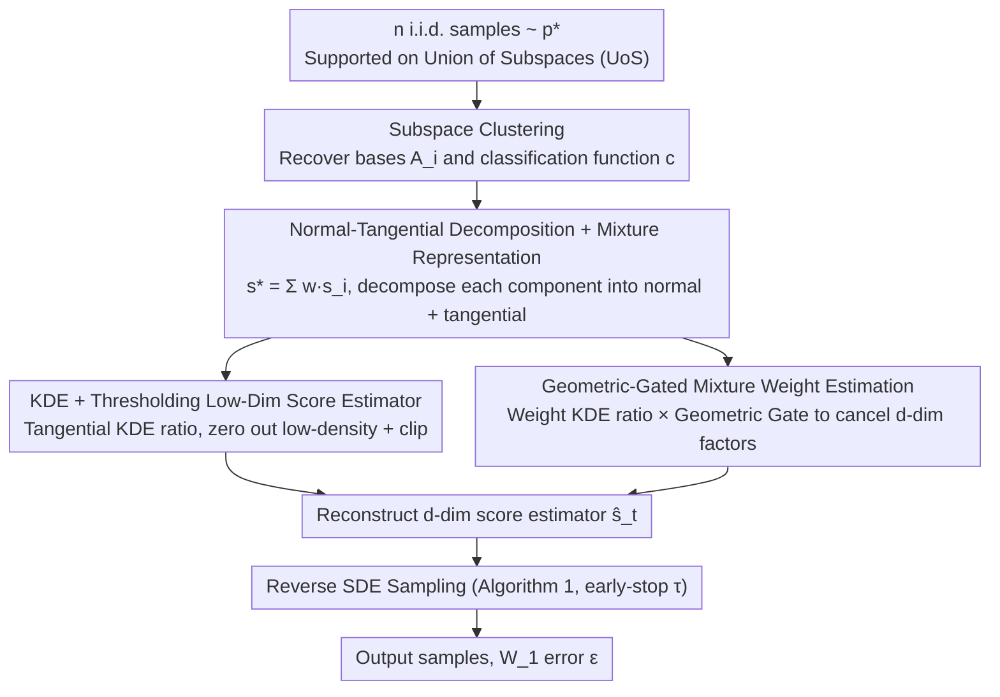

# Diffusion Models Are Statistically Optimal for Learning Low-Dimensional Multi-Modal Distributions

**Conference**: ICML 2026  
**arXiv**: [2605.30153](https://arxiv.org/abs/2605.30153)  
**Code**: None (Theoretical paper, contains only numerical validation on synthetic data)  
**Area**: Diffusion Models / Statistical Theory of Generative Models  
**Keywords**: Diffusion models, sample complexity, Union of Subspaces (UoS), multi-modal distributions, minimax optimality

## TL;DR
This paper proves that when the data distribution is supported on a union of $M$ low-dimensional linear subspaces (UoS) and the distribution within each subspace is sub-Gaussian, a kernel density-based score estimator allows the score-based diffusion sampler to achieve a 1-Wasserstein error of $\varepsilon$ with $\widetilde{O}(\varepsilon^{-(k\vee 2)})$ samples (where $k$ is the maximum intrinsic dimension). This results achieves the minimax optimal rate matching the intrinsic dimension under multi-modal settings without assumptions of smoothness, bounded density, or log-concavity, effectively circumventing the curse of dimensionality.

## Background & Motivation

**Background**: Score-based diffusion models have achieved SOTA in high-dimensional generative tasks such as image, video, and language generation. They operate by adding noise in a forward OU process and then denoising via a learned score function $s_t^\star = \nabla\log p_t$. Recent theoretical research has investigated the sample complexity: how many training samples are required for a diffusion sampler to approximate the target distribution with $\varepsilon$ accuracy? Existing strong results for $\beta$-Hölder smooth $d$-dimensional distributions provide a sample complexity of $\varepsilon^{-(d+2\beta)/\beta}$ (Zhang 2024, Cai & Li 2025), which is minimax optimal but suffers from the curse of dimensionality.

**Limitations of Prior Work**: These worst-case rates fail to explain the actual performance of diffusion models on real-world high-dimensional data. Prior works leveraging intrinsic low-dimensional structures (Chen 2023, Azangulov 2024, Tang & Yang 2024, etc.) improve the rate to depend only on the intrinsic dimension, but at the cost of requiring the distribution to satisfy: (i) support on a single low-dimensional subspace or manifold; (ii) density bounded away from zero on the support; (iii) globally smooth or log-concave scores. These conditions naturally exclude multi-modal distributions, as density necessarily approaches zero between modes, causing the score to explode.

**Key Challenge**: Real-world high-dimensional data (e.g., clusters of images or text) are almost certainly multi-modal, with different modes often distributed across different low-dimensional structures (the "union of manifolds hypothesis"). Existing theories either succumb to the curse of dimensionality or use assumptions that exclude multi-modality—neither explains empirical phenomena.

**Goal**: Remove assumptions of density smoothness, boundedness, or log-concavity, allowing the diffusion sample complexity rate to depend solely on the intrinsic dimension $k$ while accommodating multi-modal geometry.

**Key Insight**: The data distribution is modeled as a UoS—$\mathsf{supp}(p^\star)\subseteq \cup_{i=1}^M V_i$, where each $V_i$ is a $k_i$-dimensional linear subspace and the restricted distribution $p_i^{\mathsf{low}}$ on $V_i$ is $\sigma$-sub-Gaussian. This is the simplest model that allows for multi-modality while providing an explicit low-dimensional structure. The key technical observation is that on each subspace, the smoothed score can be decomposed into "normal (analytic Gaussian) + tangential ($k_i$-dimensional sub-problem)" components—the former is computable in closed form, while the latter is a low-dimensional score estimation problem.

**Core Idea**: First, subspace clustering is used to assign samples to each $V_i$. Then, a low-dimensional score estimator is constructed within each $V_i$ using kernel density and thresholding. Finally, the components are recombined using mixture weights to reconstruct the $d$-dimensional score. The estimator is purely analytic and does not rely on neural networks; the objective is to "prove achievability," pinning the statistical limit of diffusion sampling to $\varepsilon^{-(k\vee 2)}$.

## Method

### Overall Architecture

The core problem is constructing a score estimator under the UoS multi-modal assumption such that the sample complexity of the diffusion sampler depends only on the intrinsic dimension rather than the ambient dimension $d$. The approach decomposes high-dimensional score estimation into three tasks: clustering samples into subspaces, performing low-dimensional score estimation within each subspace, and combining components via mixture weights. The estimator is analytic and does not involve training neural networks.

Given $n$ i.i.d. samples from $p^\star$, standard subspace clustering (e.g., SSC, threshold, or greedy clustering) is performed using $n_0=C_{\mathsf{sc}}M^2k\log n$ samples to recover the orthogonal bases $\{A_i\}_{i=1}^M$ ($A_i\in\mathbb{R}^{d\times k_i}$, $A_i^\top A_i=I_{k_i}$) and a classification function $c:\mathbb{R}^d\to[M]$. Under UoS and standard separation conditions, this step succeeds with high probability using a negligible portion of the total sample budget. The remaining $N=n-n_0$ samples are used to construct the score estimator $\widehat s_t$ to approximate $s_t^\star=\nabla\log p_t$ (where $p_t=p^\star * \mathcal{N}(0,tI_d)$) for all $t>0$. The sampler follows the standard reverse SDE (Algorithm 1: initialized at $\mathcal{N}(0,I_d)$, integrated backwards to early-stopping time $\tau$). The theoretical analysis is established on the equivalence mapping between the OU process $X_t$ and the variance-exploding process $Z_t$.

### Key Designs

**1. Normal-tangential decomposition and mixture representation: Reducing $d$-dimensional score estimation to $M$ sub-problems of dimension $k_i$**

Directly estimating the $d$-dimensional score suffers from the curse of dimensionality. The UoS structure allows for a divide-and-conquer strategy. Starting from $p^\star=\sum_i p_i^\star$, the smoothed density is $p_t(x)=\sum_i\int_{V_i}\varphi_t(x-y;d)p_i^\star(\mathrm{d}y)$, leading to the score decomposition $s_t^\star(x)=\sum_i w_t(i,x)\cdot s_t(i,x)$, where $w_t(i,x)$ is the posterior weight that $x$ originates from the $i$-th subspace. A key lemma decomposes each component score into normal and tangential parts: $s_t(i,x)=-\tfrac{1}{t}(x-\mathsf{proj}_i(x))+A_i\,s_t^{\mathsf{low}}(i,A_i^\top x)$. The first term is a closed-form normal displacement. The second term is the score of a $k_i$-dimensional smoothed distribution $p_i^{\mathsf{low}}*\mathcal{N}(0,tI_{k_i})$. This shifts all "high-dimensional difficulty" to the analytic part and the "statistical difficulty" to a $k_i$-dimensional problem, avoiding the curse of dimensionality.

**2. Kernel density ratio + adaptive thresholding: Stability in gaps between modes**

In multi-modal distributions, the density approaches zero in the "gaps" between modes, causing plug-in score estimators to oscillate wildly. This paper applies two levels of regularization to the KDE ratio. First, a Gaussian KDE $\widehat g_t(i,x)$ is calculated on $\mathcal{C}_i=\{j:X^{(j)}\in V_i\}$ to get the plug-in ratio $\nabla\widehat g_t/\widehat g_t$. Then, a threshold $\psi(\widehat g_t;\eta_t)$ zeros out estimates in low-density regions (threshold $\eta_t=\frac{\log N}{N(2\pi t)^{k_i/2}}$ adapts with $t$), and a clipping radius $R=\sqrt{2\log N/t}$ is applied to obtain $\widehat s_t^{\mathsf{low}}(i,x)$. This "gives up" on estimation when data are too sparse, controlling the second moment and aligning the estimator complexity with the minimax bound: $\mathbb{E}[\|\widehat s_t-s_t^\star\|_2^2]=\widetilde{O}(\tfrac{1}{N}(\tfrac{1}{t}+\tfrac{\sigma^{k\vee 2}}{t^{(k\vee 2)/2+1}}))$.

**3. Geometric-gated mixture weight estimation: Preserving intrinsic dimensionality during reconstruction**

When recombining component scores, the mixture weights $w_t(i,x)=q_t(i,x)/p_t(x)$ are also estimated via KDE ratios. Naive estimation would introduce a $t^{-d/2}$ factor, negating the dimensionality reduction. This paper uses KDE for the numerator $\widehat q_t$ and denominator $\widehat p_t$ and multiplies the ratio by a "geometric gate" $\mathds{1}_{\{x\in\mathcal{G}_t(i)\}}$ where $\mathcal{G}_t(i)=\{x:\|x-\mathsf{proj}_i(x)\|_2\le R_t(i)\}$. Lemma 1 proves that points far from $V_i$ have exponentially decaying weights, and the refined point-wise MSE bound ensures the total rate only depends on intrinsic dimensions after integration over the sub-Gaussian band.

### Loss & Training

The proposed method does not require training neural networks or gradient descent—all estimators are explicit formulas. The only "hyperparameters" are the threshold $\eta_t$ (naturally determined by $N, t, k_i$), the clipping radius $R$, and the geometric gate $R_t(i)$. Sampling is performed via Algorithm 1 (Reverse SDE) with early-stopping $\tau=n^{-2/k}$ and total time $T=\log n$. The paper notes that NN-based score training should follow a paradigm of "subspace clustering followed by score fitting on the low-dimensional latent space," for which this construction provides a theoretical target.

## Key Experimental Results

### Main Results: Theoretical Rate Comparison

| Setting | Prev. SOTA | Ours | Key Difference |
|------|-------------|------|---------|
| $d$-dim $\beta$-Hölder smooth density | $\varepsilon^{-(d+2\beta)/\beta}$ (Zhang 2024 / Cai & Li 2025) | — | Baseline, dominated by $d$ |
| Single $k$-dim subspace + density lower bound | $\varepsilon^{-O(k)}$ (conditionally) | $\widetilde{O}(\varepsilon^{-(k\vee 2)})$ | Removes density bound / smoothness |
| UoS multi-modal + sub-Gaussian within subspace | N/A (multi-modality breaks prior assumptions) | $\widetilde{O}(\varepsilon^{-(k\vee 2)})$ | First minimax optimal rate for multi-modal |
| Minimax lower bound ($k$-dim density estimation) | $n^{-1/(k\vee 2)}$ | Matches | (Near-)minimax optimal |

**Main Bounds**:
- **Score Estimation (Theorem 1)**: $\mathbb{E}[\|\widehat s_t(X)-s_t^\star(X)\|_2^2]\le C\cdot \tfrac{dM^3}{N}\big(\tfrac{1}{t}+\tfrac{\sigma^{k\vee 2}}{t^{(k\vee 2)/2+1}}\big)\mathsf{polylog}\,N$. The $t$-dependence is governed by $k$.
- **Sampling (Theorem 2)**: With $T=\log n$ and $\tau=n^{-2/k}$, $\mathbb{E}[W_1(p^\star,p_{\widehat Y_{T-\tau}})]\le C\cdot dM^{3/2}n^{-1/(k\vee 2)}\mathsf{polylog}\,n$. This shows that $\widetilde{O}(\varepsilon^{-(k\vee 2)})$ samples are sufficient, decoupling the rate from $d$.

### Ablation Study

| Configuration | Key Metric | Explanation |
|------|--------|------|
| Full Method | $d=48, M=128, k=3, N=50{,}000$ | Empirical $L^2$ score error curves align with $\widetilde{O}(t^{-(k\vee 2)/2-1})$ |
| Without Normal-Tangential Decomposition | $d$-dim KDE | $t^{-d/2}$ factor dominates; intrinsic rate is lost |
| Without Thresholding $\psi$ | Plug-in ratio | Second moment explodes in gaps between modes |
| Without Geometric Gate $\mathcal{G}_t(i)$ | Naive KDE ratio | Weight MSE contains $t^{-d/2}$; pre-factor degrades to $\exp(d)$ |

### Key Findings

- On synthetic data with $d=48$ but $k=3$, the empirical $L^2$ score error dependence on $t$ matches the theoretical $t^{-(k\vee 2)/2-1}$, refuting the claim that high ambient dimensionality must lead to high score estimation error.
- The rate $n^{-1/(k\vee 2)}$ reflects the statistical limit where density estimation for $k=1$ cannot be faster than $n^{-1/2}$, confirming the optimality of the "$\vee 2$" term.
- Pre-factors involving $d$ and $M$ are likely artifacts of the analysis, which the paper suggests can be further refined.

## Highlights & Insights

- The "Normal-Tangential Decomposition + Mixture Weighting + Thresholded KDE" approach is the first to pin the statistical limit of diffusion to the intrinsic dimension in UoS multi-modal scenarios without requiring density smoothness or lower bounds.
- The kernel-based estimator serves as a "proof device" to establish achievability. It identifies the $k_i$-dimensional scores as the specific targets for future analysis of neural network capacity and approximation error.
- Adaptive thresholding $\psi(\widehat g_t;\eta_t)$ essentially implements a strategy of "recognizing when data are too sparse to estimate and zeroing out the estimate," which may inspire actual score network training by clipping losses in low-SNR regions.

## Limitations & Future Work

- Current results rely on exact subspace recovery. The rate for noisy/approximate subspaces is only sketched in Section 6.
- The pre-factors $dM^3$ and $dM^{3/2}$ show a linear dependence on $d$ that appears to be an analysis artifact but is not yet eliminated.
- The analysis covers the forward OU process and continuous-time SDE but does not yet include end-to-end discretization errors (e.g., DDPM/DDIM).
- Extending the UoS assumption to a "Union of Manifolds" is natural future work.

## Related Work & Insights

- **vs. Zhang 2024 / Cai & Li 2025**: Moves from $\varepsilon^{-(d+2\beta)/\beta}$ for general smooth densities to $\varepsilon^{-(k\vee 2)}$ by utilizing UoS structure to bypass ambient dimensionality.
- **vs. Chen et al. 2023**: Inherits the decomposition tool but removes density lower bounds and score smoothness requirements, extending the theory to multi-modal settings.
- **vs. Azangulov 2024 / Tang & Yang 2024**: Substitutes manifold complexity for linear subspace complexity to accommodate multi-modality without density bounds.
- **vs. Wang et al. 2024**: Generalizes from orthogonal Gaussian mixtures to arbitrary sub-Gaussian UoS.

## Rating
- Novelty: ⭐⭐⭐⭐⭐
- Experimental Thoroughness: ⭐⭐⭐
- Writing Quality: ⭐⭐⭐⭐⭐
- Value: ⭐⭐⭐⭐⭐

<!-- RELATED:START -->

<!-- RELATED:END -->

## Related Papers

- [\[ICML 2025\] Annealing Flow Generative Models Towards Sampling High-Dimensional and Multi-Modal Distributions](../../ICML2025/image_generation/annealing_flow_generative_models_towards_sampling_high-dimensional_and_multi-mod.md)
- [\[ICML 2026\] Pareto-Guided Optimal Transport for Multi-Reward Alignment](pareto-guided_optimal_transport_for_multi-reward_alignment.md)
- [\[CVPR 2026\] Evaluating Generative Models via One-Dimensional Code Distributions](../../CVPR2026/image_generation/evaluating_generative_models_via_one-dimensional_code_distributions.md)
- [\[NeurIPS 2025\] Understanding Representation Dynamics of Diffusion Models via Low-Dimensional Models](../../NeurIPS2025/image_generation/understanding_representation_dynamics_of_diffusion_models_via_low-dimensional_mo.md)
- [\[ICML 2026\] STARE: Step-wise Temporal Alignment and Red-teaming Engine for Multi-modal Toxicity Attack](stare_step-wise_temporal_alignment_and_red-teaming_engine_for_multi-modal_toxici.md)

<!-- RELATED:END -->
