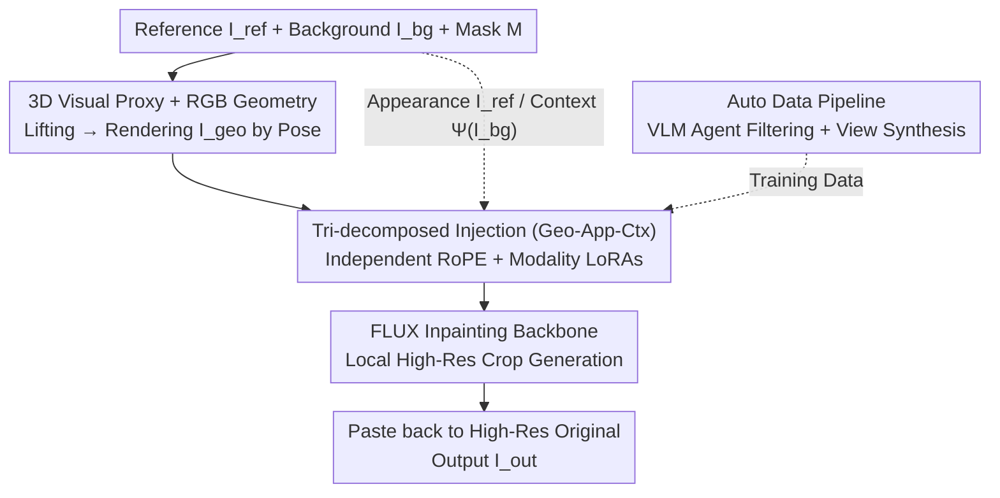

# Direct 3D-Aware Object Insertion via Decomposed Visual Proxies

**Conference**: ICML 2026  
**arXiv**: [2606.06601](https://arxiv.org/abs/2606.06601)  
**Code**: https://gong1130.github.io/DIRECT (Project Page)  
**Area**: Image Generation / Diffusion Models  
**Keywords**: Object Insertion, Pose Controllable, 3D Visual Proxy, Decoupled Injection, Diffusion Models, LoRA

## TL;DR
DIRECT upgrades "object insertion" from 2D inpainting to a **pose-controllable** task: it first lifts a reference image into an interactive 3D proxy using an off-the-shelf image-to-3D model, renders dense geometric condition maps based on user-specified 6-DoF poses, and then injects "geometry, appearance, and context" conditions into the diffusion model via **decomposed independent pathways**. This ensures strict adherence to specified 3D poses while preserving reference appearance and achieving harmonious background integration, outperforming previous methods in both geometric controllability and visual quality.

## Background & Motivation
**Background**: Object insertion (seamlessly synthesizing a reference object into a target region of a background image) has advanced significantly with reference-guided generation. Tools like AnyDoor, IMPRINT, and InsertAnything leverage strong generative backbones like Stable Diffusion or FLUX to achieve high performance in identity preservation and environmental coordination.

**Limitations of Prior Work**: These methods are confined to the **2D image plane** and lack explicit control over the 3D pose of the object. They struggle when a scene requires precise spatial alignment (e.g., "leaning a sign against a wall facing the camera"). Specifically, existing control mechanisms have two flaws: (1) **Textual guidance** (e.g., Nano Banana Pro) relies on natural language, which is spatially ambiguous; descriptions like "leaning against" cannot define exact contact geometry, leading to "hallucinated" but incorrect poses. (2) **Parametric 3D-aware models** (e.g., Object3DIT) attempt to inject control via abstract scalars like rotation angles, but the lack of explicit spatial correspondence makes it difficult for the model to translate low-dimensional parameters into dense pixel-level deformations.

**Key Challenge**: A representation gap exists between rigid 3D control and high-fidelity 2D synthesis. The model must strictly follow a user-specified 6-DoF pose $\boldsymbol{\xi}\in\mathfrak{se}(3)$ while preserving high-frequency texture details and maintaining consistency with background lighting and perspective. Existing signals are either too blurry (text) or too sparse (rotation angles).

**Key Insight & Core Idea**: The authors bridge this gap using **explicit 3D visual proxies**. A feed-forward image-to-3D model lifts a single reference image into a coarse 3D representation, which is then rendered into a **dense geometric condition map** $I_{geo}$ at the specified pose, turning "pose" into a pixel-aligned dense signal. To prevent artifacts from degraded proxy textures, the **Core Idea** is to orthogonally decompose input conditions into three streams—**geometry (from the 3D proxy), appearance (from the reference image), and context (from the background)**—and inject them via independent pathways.

## Method

### Overall Architecture
DIRECT stands for **Decomposed Injection for REference Composition and Target-integration**. Given a reference image $I_{ref}$, background $I_{bg}$, mask $M$, and 6-DoF pose $\boldsymbol{\xi}$, it outputs $I_{out}$. The process involves: lifting $I_{ref}$ to 3D proxy $\mathcal{P} \rightarrow$ rendering dense geometry $I_{geo} \rightarrow$ encoding conditions via **decomposed LoRA pathways + independent positional encodings** into a FLUX inpainting backbone $\rightarrow$ generating within a local high-resolution window and pasting back. The target distribution is:

$$I_{out}\sim p_\theta\big(I \mid \underbrace{I_{ref}}_{\text{appearance}},\ \underbrace{I_{geo}}_{\text{geometry}},\ \underbrace{\Psi(I_{bg})}_{\text{context}},\ M\big),$$

where $\Psi(\cdot)$ provides scene-level global context.

### Key Designs

**1. 3D Visual Proxy + RGB Geometry: Converting Ambiguous Poses to Dense Conditions**
DIRECT uses a feed-forward image-to-3D model (TRELLIS) to lift the 2D reference into a rotatable 3D proxy $\mathcal{P}$. By rendering this proxy at the desired pose into an RGB image $I_{geo}$, the pose becomes a dense signal aligned with the output pixels. Crucially, **RGB rendering** is used instead of depth/normal maps because standard geometric signals are semantically ambiguous; for example, an upside-down symmetric sign looks identical in depth/normal maps, but RGB proxies provide texture cues that allow the model to correctly determine orientation.

**2. Tri-decomposed Injection: Avoiding Feature Entanglement**
To prevent the model from inheriting degraded textures from the 3D proxy, DIRECT uses **Decomposed Injection**. Reference and geometry tokens ($z_{ref}, z_{geo}$) and global context tokens ($c_{global}$) are concatenated into a sequence $Z$. Two mechanisms differentiate these: (1) **Independent Positional Encoding**: Assigning different Rotary Positional Encodings (RoPE) to appearance and geometry tokens to isolate them spatially. (2) **Modality-specific Adapters**: Independent LoRA adapters in self-attention layers force the model to learn specific transformations—extracting structure from $z_{geo}$, identity from $z_{ref}$, and lighting/composition from $c_{global}$.

**3. Auto Data Pipeline: Constructing Pose-Paired Data from In-the-wild Images**
Training requires "same instance, different pose, complex background" pairs. DIRECT uses an automated pipeline: **Step 1: VLM Agent Filtering** (Qwen3-VL + SAM-3) to select high-quality, unoccluded objects from SA-1B. **Step 2: View Synthesis as Reference** using a "Real-Target, Synthetic-Source" strategy. The original real image serves as the ground-truth $I_{gt}$, while a synthetic rotated version of the cropped object serves as the reference $I_{ref}$. This produces ~160k pairs combining SA-1B and MVImgNet.

### Loss & Training
The backbone is **FLUX.1-Fill-dev**. LoRA adapters (rank=128) and linear projections are trained using the **rectified flow matching** objective.
- **Shape-Decomposed Mask Augmentation**: Replaces exact object masks with random shapes during training to prevent the model from "leaking" the target shape and force reliance on $I_{geo}$.
- **Progressive Training**: Starts at $512^2$ crops and moves to $1024^2$ high-resolution synthesis.
- **Geometry Alignment**: During training, a 3DGS-based refinement process is used to recover the precise ground-truth pose $\boldsymbol{\xi}_0$ for rendering $I_{geo}$.

## Key Experimental Results

### Main Results
Evaluation was conducted on 200 pairs (100 MVImgNet, 100 SA-1B). Metrics included PSNR/SSIM/LPIPS, CLIP-I/DINO (identity), and Matching Error (ME, pose accuracy).

| Method | PSNR↑ | SSIM↑ | LPIPS↓ | CLIP-I↑ | DINO↑ | ME↓ |
|------|------|------|------|------|------|------|
| TRELLIS† (SD) | 19.51 | 0.778 | 0.312 | 0.895 | 0.848 | 75.4 |
| **Ours (SD)** | **21.66** | **0.829** | **0.206** | **0.937** | **0.913** | **21.4** |
| TRELLIS‡ (FLUX) | 22.00 | 0.843 | 0.217 | 0.935 | 0.902 | 19.6 |
| **Ours (FLUX)** | **23.09** | **0.871** | **0.147** | **0.959** | **0.936** | **17.8** |

DIRECT leads across all metrics. The FLUX version achieves SOTA with a Matching Error of 17.8, validating the fine-grained pose guidance of RGB geometric conditions.

### Ablation Study

| Configuration | PSNR↑ | LPIPS↓ | CLIP-I↑ | DINO↑ | ME↓ |
|------|------|------|------|------|------|
| Base | 22.26 | 0.207 | 0.904 | 0.915 | 26.9 |
| + Hybrid Data | 22.56 | 0.192 | 0.943 | 0.930 | 22.7 |
| + Context | 22.74 | 0.190 | 0.952 | 0.932 | 20.7 |
| + Mask Aug. | 22.89 | 0.155 | 0.957 | 0.935 | 19.0 |
| + Progressive | **23.09** | **0.147** | **0.959** | **0.936** | **17.8** |

### Key Findings
- **Hybrid Data** provides the largest gain in identity and pose (CLIP-I 0.904 $\rightarrow$ 0.943).
- **Mask Augmentation** is crucial for perceptual quality, reducing LPIPS significantly.
- The model is **robust to 3D reconstruction degradation**, as it can recover sharp textures from the reference image even if the proxy is blurry.

## Highlights & Insights
- **Pose as Drawing**: Converting 6-DoF pose into a dense RGB "drawing" bridges the gap between abstract 3D transformations and 2D pixel generation.
- **Decomposition is Key**: Separating geometry and appearance pathways prevents the model from "inheriting" the low-quality textures typical of fast 3D reconstruction models.
- **Global-Local Duality**: Using global context tokens while performing local high-res inpainting ensures that inserted objects are consistent with the entire scene's lighting.

## Limitations & Future Work
- **Performance Ceiling**: The method is bounded by the quality of the image-to-3D proxy. Significant topological errors in the proxy (e.g., wrong aspect ratio) directly impact the output.
- **Pipeline Complexity**: The training process requires an offline alignment pipeline involving multiple models (VGGT, 3DGS).
- **Future Directions**: Exploring end-to-end geometry refinement during generation or allowing the model to "correct" obvious proxy distortions.

## Related Work & Insights
- Compared to **AnyDoor/InsertAnything**, DIRECT adds the missing dimension of explicit 3D pose control.
- Compared to **Object3DIT**, DIRECT replaces sparse scalar control with dense visual proxies, resolving the "spatial mapping" difficulty.
- Compared to **ZeroComp**, DIRECT does not require high-quality 3D assets, making it more applicable to casual in-the-wild photos.

## Rating
- Novelty: ⭐⭐⭐⭐ (First work to achieve pose-controllable insertion via visual proxies.)
- Experimental Thoroughness: ⭐⭐⭐⭐ (Comprehensive ablation and dual-backbone comparison.)
- Writing Quality: ⭐⭐⭐⭐ (Clear motivation and well-supported design choices.)
- Value: ⭐⭐⭐⭐ (Highly practical for AR/VR and controllable content creation.)

<!-- RELATED:START -->

## Related Papers

- [\[CVPR 2026\] SpatialDiff: 3D-Aware Object Movement via Implicit Spatial Modeling](../../CVPR2026/image_generation/spatialdiff_3d-aware_object_movement_via_implicit_spatial_modeling.md)
- [\[CVPR 2026\] EffectErase: Joint Video Object Removal and Insertion for High-Quality Effect Erasing](../../CVPR2026/image_generation/effecterase_joint_video_object_removal_and_insertion_for_high-quality_effect_era.md)
- [\[ICML 2026\] Compression as Adaptation: Implicit Visual Representation with Diffusion Foundation Models](compression_as_adaptation_implicit_visual_representation_with_diffusion_foundati.md)
- [\[ICCV 2025\] OmniPaint: Mastering Object-Oriented Editing via Disentangled Insertion-Removal Inpainting](../../ICCV2025/image_generation/omnipaint_mastering_object-oriented_editing_via_disentangled_insertion-removal_i.md)
- [\[CVPR 2026\] ViHOI: Human-Object Interaction Synthesis with Visual Priors](../../CVPR2026/image_generation/vihoi_human-object_interaction_synthesis_with_visual_priors.md)

<!-- RELATED:END -->
