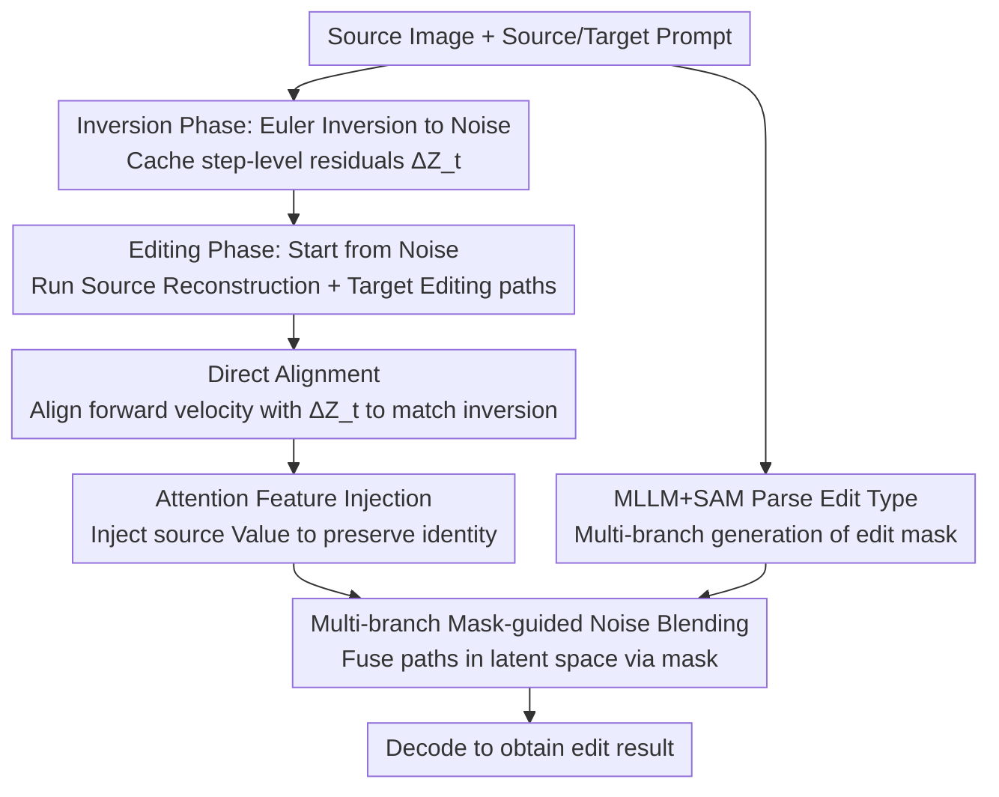

# DirectEdit: Step-Level Accurate Inversion for Flow-Based Image Editing

**Conference**: ICML 2026  
**arXiv**: [2605.02417](https://arxiv.org/abs/2605.02417)  
**Code**: https://desongyang.github.io/Directedit (Available)  
**Area**: Diffusion Models / Image Editing / Rectified Flow  
**Keywords**: Flow-model inversion, training-free image editing, step-level accurate reconstruction, feature injection, mask-guided blending

## TL;DR
DirectEdit achieves "step-level accurate reconstruction" without increasing NFE by recording the latent residual $\Delta\mathbf{Z}_t$ for each step during Rectified Flow inversion and injecting it ahead of time in the forward path. This strictly aligns the reconstruction path with the inversion trajectory. Combined with MLLM+SAM multi-branch mask noise blending and attention Value injection, it significantly outperforms all existing training-free methods such as RF-Inversion, FireFlow, FTEdit, and DNAEdit, with comprehensive rankings of 4.0 (FLUX) / 2.43 (SD3.5) on PIE-Bench.

## Background & Motivation

**Background**: Rectified Flow (RF) has become the mainstream framework for large-scale T2I models like SD3.5 and FLUX. Training-free image editing based on these pre-trained flow models typically follows the "inversion $\rightarrow$ reconstruction + editing dual-path" paradigm: Euler inversion maps a clean image to a noise latent, and during forward denoising, a source reconstruction path and a target editing path are run simultaneously. Features from the source path (attention KV, latents, etc.) are injected into the target path to preserve original image information.

**Limitations of Prior Work**: The core approximation of Euler inversion, $\mathbf{Z}^{inv}_t = \mathbf{Z}^{inv}_{t+1} - (\sigma_{t+1}-\sigma_t)\,v_\theta(\mathbf{Z}^{inv}_{t+1})$, uses velocity at $t+1$ to approximate velocity at $t$. Although the single-step error is small, it accumulates along the denoising steps, causing the reconstruction path to deviate entirely from the inversion trajectory. Subsequent works (high-order ODE solvers like RFEdit, fixed-point iteration in FTEdit, and interpolated noise optimization in DNAEdit) only mitigate global trajectory drift; **step-level errors within each single step still exist**. This means source features injected into the editing path are "drifted features," leading to background distortion and editing artifacts. Inversion-free methods like FlowEdit sacrifice fidelity due to their reliance on random noise interpolation. Table 2 shows that the step-level MSE for standard Stepwise Correction is 0.2857 (avg) / 11.73 (max), and FTEdit also reaches 0.0881.

**Key Challenge**: Existing methods attempt to "correct the inversion path to approximate the reconstruction path." However, RF's Euler inversion is **far more sensitive** to single-step approximation errors than DDIM inversion. No matter how the inversion side is optimized, the velocity $v_\theta(\mathbf{Z}_t)$ used in forward denoising is inherently different from the velocity $v_\theta(\mathbf{Z}^{inv}_{t+1})$ recorded during inversion, making step-level errors irremediable.

**Goal**: Achieve step-level accurate reconstruction—meaning the latent at each step of the forward path is strictly equal to the corresponding latent in the inversion path ($\mathbf{Z}_{t+1} = \mathbf{Z}^{inv}_{t+1}$)—without increasing the Number of Function Evaluations (NFE).

**Key Insight**: Reversing the perspective—since correcting the inversion path is ineffective, why not **directly align the forward path**? If the forward denoising velocity can be made exactly equal to the velocity used during inversion ($v_\theta(\mathbf{Z}_t) = v_\theta(\mathbf{Z}^{inv}_{t+1})$), step-by-step alignment follows automatically. Since $\mathbf{Z}^{inv}_{t+1}$ is fully accessible during the inversion phase, one can simply cache the latent residual of each step $\Delta\mathbf{Z}_t = \mathbf{Z}^{inv}_{t+1} - \mathbf{Z}^{inv}_t$.

**Core Idea**: Use the cached latent residuals $\Delta\mathbf{Z}_t$ to temporarily shift the current latent before velocity prediction in the forward path, resulting in $\hat{\mathbf{Z}}_t = \mathbf{Z}_t + \Delta\mathbf{Z}_t$. Then, use $v_\theta(\hat{\mathbf{Z}}_t)$ to update $\mathbf{Z}_t$, forcing the velocity to align with the inversion trajectory at no additional cost.

## Method

### Overall Architecture
DirectEdit addresses the reconstruction trajectory drift caused by misaligned velocities in RF inversion. The workflow is split into inversion and editing stages. In the inversion stage, standard Euler encoding maps the source image into a noise trajectory while caching step-level latent residuals, and MLLM+SAM pre-calculates the editing region mask. In the editing stage, starting from noise, source reconstruction and target editing paths run concurrently. At each step, cached residuals align the velocity field back to the inversion trajectory, source attention Values are injected into the target path to maintain detail, and the two paths are fused in the latent space using the mask to decode the final result. No additional NFE is added compared to vanilla Euler; the only overhead is caching residuals.

### Key Designs

**1. Direct Alignment: Aligning Forward Velocity with Inversion via Cached Residuals**

Previous approaches tried to fix the inversion path to match the reconstruction path, but RF Euler is too sensitive to step errors. Ours treats the inversion trajectory as the pivot and aligns the forward path to it. From the Euler update formula, achieving $\mathbf{Z}_{t+1}=\mathbf{Z}^{inv}_{t+1}$ in the $t$-th forward step is equivalent to aligning $v_\theta(\mathbf{Z}_t)=v_\theta(\mathbf{Z}^{inv}_{t+1})$. Since $\mathbf{Z}^{inv}_{t+1}$ is known from inversion, the residual $\Delta\mathbf{Z}_t=\mathbf{Z}^{inv}_{t+1}-\mathbf{Z}^{inv}_t$ is recorded. During forward denoising, an alignment latent $\hat{\mathbf{Z}}_t=\mathbf{Z}_t+\Delta\mathbf{Z}_t$ is constructed for velocity prediction, which then updates the original latent:

$$\mathbf{Z}_{t+1}=\mathbf{Z}_t+(\sigma_{t+1}-\sigma_t)\,v_\theta(\hat{\mathbf{Z}}_t).$$

The ingenuity lies in the "offset" where $\hat{\mathbf{Z}}_t$ is the input for prediction, but the update is applied to the original $\mathbf{Z}_t$. This makes the velocity field exactly match the inversion velocity. With no extra $v_\theta$ calls, fixed-point iterations, or high-order solvers, the NFE remains identical to vanilla Euler (60 vs. FTEdit's 120), while step-level MSE is reduced from the $10^{-2}$ scale (0.0881) to $10^{-4}$ (0.0006), reaching the VAE reconstruction lower bound.

**2. Attention Feature Injection: Preserving Object Identity via Source Values**

While accurate reconstruction prevents "feature drift," the internal edited region may still lose original texture and identity if generated freely. Value injection is performed in the target path's self-attention: for the first $t_{inj}$ steps, the attention output of each MM-DiT block is replaced with $\text{Attention}(\mathbf{Q}^{tar}_t,\mathbf{K}^{tar}_t,\mathbf{V}^{src}_t)$ before reverting to standard self-attention. Here, Value provides the original "content" while Query/Key handle new "relationships." DirectEdit ensures the injected V is a "clean," non-drifted feature. In SD3.5, injection occurs in all but the last MM-DiT block; in FLUX, it is limited to single blocks. $t_{inj}$ acts as a knob: smaller values favor the target prompt, while larger values favor source fidelity ($t_{inj}=3$ is generally optimal).

**3. Multi-branch Mask-guided Noise Blending: Routing Masks by Edit Type for Background Protection**

To ensure the background remains untouched, spatial constraints are necessary. A single rectangle or mask cannot handle all scenarios (e.g., background edits need object mask complements; style transfer needs global coverage). Ours uses an MLLM with $(\mathbf{I}_{src},\psi_{src},\psi_{tar})$ to parse the edit type $O\in\{\text{Local, Background, Global, Other}\}$ and a bounding box $(P,Q)$. Masks $\mathcal{M}$ are generated via different branches: Local uses SAM for object segmentation, Background uses its complement, Global sets all to 1, and Other uses $\mathcal{B}(P,Q)$. At each denoising step, paths are fused in the latent space:

$$\mathbf{Z}^{tar}_{t+1}\leftarrow\mathbf{Z}^{src}_{t+1}\odot(\mathbf{1}-\mathcal{M})+\mathbf{Z}^{tar}_{t+1}\odot\mathcal{M}.$$

Step-by-step fusion prevents boundary artifacts. Combined with accurate reconstruction, this achieves near-zero distortion in non-edited regions. Ablations show that reverting to a uniform rectangular mask drops PSNR by 4.77 dB (32.63 $\rightarrow$ 27.86).

### Loss & Training
**Completely training-free**, with no loss functions or backpropagation. Inference settings: FLUX.1-dev / SD3.5-medium backbone, 30 denoising steps, CFG=1 (inversion) / CFG=2 (editing), $t_{inj}=3$.

## Key Experimental Results

### Main Results
Comparison of training-free editing on PIE-Bench (700 images, 9 edit categories):

| Backbone | Method | Structure↓ | PSNR↑ | LPIPS↓ | MSE↓ | CLIP-Whole↑ | Avg. Rank↓ |
|----------|------|-----------|-------|--------|------|-------------|-------------|
| FLUX | RF-Inversion | 41.17 | 20.86 | 187.01 | 120.12 | 25.08 | 13.57 |
| FLUX | RFEdit | 25.15 | 24.33 | 121.59 | 56.98 | 25.57 | 9.14 |
| FLUX | FireFlow | 27.40 | 23.11 | 128.46 | 70.75 | 26.13 | 9.43 |
| FLUX | FlowEdit | 27.83 | 21.96 | 112.15 | 94.94 | 25.26 | 10.57 |
| FLUX | DNAEdit | 16.81 | 25.20 | 86.68 | 48.35 | 24.81 | 7.71 |
| FLUX | **Ours** | **17.94** | **32.63** | **35.45** | **25.05** | 25.39 | **4.00** |
| SD3.5 | FTEdit | 21.06 | 23.49 | 90.25 | 61.78 | 25.21 | 9.29 |
| SD3.5 | FlowEdit | 23.13 | 23.29 | 92.81 | 69.09 | 26.71 | 7.29 |
| SD3.5 | DNAEdit | 11.03 | 27.71 | 60.51 | 26.28 | 25.20 | 5.14 |
| SD3.5 | **Ours** | **14.65** | **31.82** | **31.36** | **21.64** | 25.64 | **2.43** |

**Reconstruction Error Comparison** (FLUX, 60 NFE vs. 120 NFE):

| Method | NFE↓ | PSNR↑ | Step-Level MSE Avg↓ | Step-Level MSE Max↓ |
|------|------|-------|---------------------|---------------------|
| VAE (Lower Bound) | - | 34.38 | - | - |
| Vanilla Euler | 60 | 14.59 | 1177.73 | 39511.72 |
| Stepwise Correction | 60 | 34.38 | 0.2857 | 11.73 |
| FTEdit | 120 | 34.38 | 0.0881 | 14.82 |
| RFEdit | 120 | 21.92 | 231.72 | 20156.25 |
| **Ours** | **60** | **34.38** | **0.0006** | **0.0757** |

Ours uses half the NFE while reducing average/max step-level MSE by **2–4 orders of magnitude**, reaching the VAE limit.

### Ablation Study (FLUX, PIE-Bench)

| Config | Struct.↓ | PSNR↑ | LPIPS↓ | MSE↓ | CLIP-Whole↑ |
|------|----------|-------|--------|------|-------------|
| Vanilla | 75.95 | 16.81 | 276.29 | 332.65 | 23.57 |
| w/o alignment (revert to Stepwise Correction) | 29.22 | 31.12 | 53.16 | 48.17 | 25.24 |
| w/o attention | 23.75 | 31.93 | 39.60 | 33.97 | 25.60 |
| w/o mask | 21.93 | 24.70 | 102.92 | 56.76 | 25.89 |
| w/o multi-branch (revert to rectangle) | 19.15 | 27.86 | 60.92 | 38.94 | 25.71 |
| **DirectEdit (Full)** | **17.94** | **32.63** | **35.45** | **25.05** | 25.39 |

### Key Findings
- **Direct Alignment is the core**: Removing it causes all metrics to collapse (PSNR drops 32.63 $\rightarrow$ 31.12), proving that step-level reconstruction error is the root cause of feature drift.
- **Mask blending dominates background fidelity**: Removing masks drops PSNR by 7.93 dB (32.63 $\rightarrow$ 24.70); the multi-branch logic contributes another 4.77 dB.
- **Attention injection trades detail for prompt adherence**: Removing it slightly increases CLIP (25.39 $\rightarrow$ 25.60) but loses fine-grained texture; $t_{inj}=3$ is the empirical sweet spot.
- **Efficiency advantage is significant**: Achieving better step-level MSE than FTEdit (0.0006 vs. 0.0881) at 60 NFE means it is both faster and more accurate.

## Highlights & Insights
- **Perspective Reversal**: While others fix inversion to match reconstruction, this work treats inversion as the pivot and aligns the forward path to it. This elegant solution requires only caching residuals, reflecting high engineering aesthetics.
- **Zero-NFE Precision Gain**: Using algebraic identity at the latent level ($v_\theta(\mathbf{Z}_t + \Delta\mathbf{Z}_t) = v_\theta(\mathbf{Z}^{inv}_{t+1})$) to achieve strict step-level alignment without extra forward passes or solvers is a "cost-free" and powerful improvement.
- **"Semantic Mask Router"**: Upgrading mask generation from a binary choice to multi-branch routing based on MLLM analysis is a pattern directly transferable to other spatial-constrained tasks like video or 3D editing.
- **Reusable Trick**: The paradigm of caching inversion quantities to "compensate" the forward side can be generalized to any target using Euler/RK discrete solvers, such as audio/video RF editing or 3DGS editing.

## Limitations & Future Work
- Editing quality is capped by the backbone T2I model's prior; complex reasoning or spatial manipulation remains challenging.
- Performance relies on MLLM accuracy for edit types and coordinates; errors here can flip the fusion logic.
- Memory overhead: Caching $\{\Delta\mathbf{Z}_t\}$ ($T$ sets of latents) may strain VRAM for long schedules or high-resolution FLUX.
- Future directions: (1) Combining Direct Alignment with higher-order solvers for even fewer steps; (2) Extending mask routing to a learned continuous generator; (3) Hybridizing with inversion-free methods (FlowEdit) for large-scale exploration.

## Related Work & Insights
- **vs. Stepwise Correction (Direct Inversion, 2023)**: Both recognize the need for alignment, but the former forces $\mathbf{Z}_t = \mathbf{Z}^{inv}_t$ *after* reconstruction, whereas DirectEdit ensures velocity consistency *before* update, resulting in errors two orders of magnitude lower (0.2857 $\rightarrow$ 0.0006).
- **vs. FTEdit / DNAEdit**: These methods reduce but cannot eliminate step-level errors and double the NFE (120). DirectEdit achieves $10^{-4}$ error at 60 NFE.
- **vs. FlowEdit (Inversion-free)**: FlowEdit bypasses inversion via noise interpolation but has poor fidelity (PSNR 21.96 on FLUX). DirectEdit proves that "perfect inversion" remains a superior route for RF.
- **vs. RF-Inversion**: RF-Inversion uses LQR control theory to construct auxiliary fields. DirectEdit’s simpler "residual caching + alignment" approach achieves significantly better PSNR (32.63 vs. 20.86), showing that engineering simplicity often beats complex theory.

## Rating
- Novelty: ⭐⭐⭐⭐⭐ Perspective switch to forward-alignment + zero-NFE residual trick.
- Experimental Thoroughness: ⭐⭐⭐⭐ Extensive PIE-Bench results + dual backbones + error validation, though missing high-res VRAM data.
- Writing Quality: ⭐⭐⭐⭐ Clear derivation and algorithms, though some proofs are relegated to the appendix.
- Value: ⭐⭐⭐⭐⭐ Simultaneously optimizes efficiency and precision for RF-based editing, serving as a new foundational component for inversion.

<!-- RELATED:START -->

## Related Papers

- [\[CVPR 2026\] FlashIn: Fast and Accurate Image Inversion for Real-time Image Editing](../../CVPR2026/image_generation/flashin_fast_and_accurate_image_inversion_for_real-time_image_editing.md)
- [\[ICML 2026\] Budget-Constrained Step-Level Diffusion Caching](budget-constrained_step-level_diffusion_caching.md)
- [\[ICLR 2026\] UniEdit-Flow: Unleashing Inversion and Editing in the Era of Flow Models](../../ICLR2026/image_generation/uniedit-flow_unleashing_inversion_and_editing_in_the_era_of_flow_models.md)
- [\[ICLR 2026\] FlowAlign: Trajectory-Regularized, Inversion-Free Flow-based Image Editing](../../ICLR2026/image_generation/flowalign_trajectory-regularized_inversion-free_flow-based_image_editing.md)
- [\[ICML 2025\] Taming Rectified Flow for Inversion and Editing](../../ICML2025/image_generation/taming_rectified_flow_for_inversion_and_editing.md)

<!-- RELATED:END -->
## Related Papers

- [\[CVPR 2026\] FlashIn: Fast and Accurate Image Inversion for Real-time Image Editing](../../CVPR2026/image_generation/flashin_fast_and_accurate_image_inversion_for_real-time_image_editing.md)
- [\[ICML 2025\] Taming Rectified Flow for Inversion and Editing](../../ICML2025/image_generation/taming_rectified_flow_for_inversion_and_editing.md)
- [\[CVPR 2026\] BiFM: Bidirectional Flow Matching for Few-Step Image Editing and Generation](../../CVPR2026/image_generation/bifm_bidirectional_flow_matching_for_few-step_image_editing_and_generation.md)
- [\[ICML 2026\] Budget-Constrained Step-Level Diffusion Caching](budget-constrained_step-level_diffusion_caching.md)
- [\[NeurIPS 2025\] SplitFlow: Flow Decomposition for Inversion-Free Text-to-Image Editing](../../NeurIPS2025/image_generation/splitflow_flow_decomposition_for_inversion-free_text-to-image_editing.md)

<!-- RELATED:END -->
