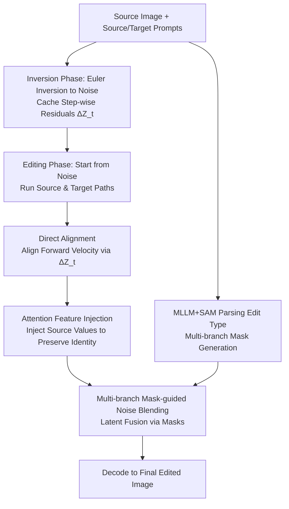

# DirectEdit: Step-Level Accurate Inversion for Flow-Based Image Editing

**Conference**: ICML 2026  
**arXiv**: [2605.02417](https://arxiv.org/abs/2605.02417)  
**Code**: https://desongyang.github.io/Directedit (Available)  
**Area**: Diffusion Models / Image Editing / Rectified Flow  
**Keywords**: Flow-based Inversion, Training-free Image Editing, Step-level Accurate Reconstruction, Feature Injection, Mask-guided Fusion

## TL;DR
DirectEdit achieves "step-level accurate reconstruction" without increasing NFE by recording latent residuals $\Delta\mathbf{Z}_t$ during Rectified Flow inversion and injecting them into the forward path to strictly align reconstruction with the inversion trajectory. Combined with MLLM+SAM multi-branch mask blending and Attention Value injection, it significantly outperforms existing training-free methods like RF-Inversion, FireFlow, FTEdit, and DNAEdit, achieving comprehensive rankings of 4.0 (FLUX) and 2.43 (SD3.5) on PIE-Bench.

## Background & Motivation

**Background**: Rectified Flow (RF) has become the mainstream framework for large-scale T2I models such as SD3.5 and FLUX. Training-free image editing based on these pre-trained flow models typically follows the "inversion → reconstruction + editing dual-path" paradigm: Euler inversion maps a clean image to noise latents, followed by a forward denoising process running a source reconstruction path and a target editing path simultaneously. Source features (attention KV, latents, etc.) are injected into the target path to preserve original information.

**Limitations of Prior Work**: The core approximation of Euler inversion, $\mathbf{Z}^{inv}_t = \mathbf{Z}^{inv}_{t+1} - (\sigma_{t+1}-\sigma_t)\,v_\theta(\mathbf{Z}^{inv}_{t+1})$, uses velocity at $t+1$ to approximate velocity at $t$. Although the single-step error is small, it accumulates over denoising steps, causing the reconstruction path to deviate entirely from the inversion trajectory. Subsequent works (high-order ODE solvers like RFEdit, fixed-point iteration in FTEdit, interpolated noise optimization in DNAEdit) only mitigate overall trajectory drift; **step-level errors within each step still persist**. This means source features injected into the editing path are "drifted features," leading to background distortion and editing artifacts. Inversion-free methods like FlowEdit sacrifice fidelity due to reliance on random noise interpolation. Table 2 shows that standard Stepwise Correction has an average step-level MSE of 0.2857 and a maximum of 11.73, while FTEdit remains at 0.0881.

**Key Challenge**: existing methods focus on "correcting the inversion path to approach the reconstruction path." However, RF's Euler inversion is **far more sensitive to single-step approximation errors** than DDIM inversion. No matter how the inversion side is optimized, the velocity $v_\theta(\mathbf{Z}_t)$ used in forward denoising fundamentally differs from the velocity $v_\theta(\mathbf{Z}^{inv}_{t+1})$ recorded during inversion, making step-level errors unavoidable.

**Goal**: Achieve step-level accurate reconstruction without any additional Neural Function Evaluations (NFE)—specifically, ensuring the forward path latent at each step strictly equals the corresponding inversion latent $\mathbf{Z}_{t+1} = \mathbf{Z}^{inv}_{t+1}$.

**Key Insight**: Instead of failing to fix the inversion path, why not **directly align the forward path**? If the velocity used in forward denoising can be made exactly equal to the velocity used during inversion $v_\theta(\mathbf{Z}_t) = v_\theta(\mathbf{Z}^{inv}_{t+1})$, step-by-step alignment follows automatically. Since $\mathbf{Z}^{inv}_{t+1}$ is fully accessible during the inversion phase, one simply needs to cache the latent residual $\Delta\mathbf{Z}_t = \mathbf{Z}^{inv}_{t+1} - \mathbf{Z}^{inv}_t$ at each step.

**Core Idea**: Use the latent residuals $\Delta\mathbf{Z}_t$ cached during inversion to temporarily shift the current latent before velocity prediction in the forward path, obtaining $\hat{\mathbf{Z}}_t = \mathbf{Z}_t + \Delta\mathbf{Z}_t$. Then, use $v_\theta(\hat{\mathbf{Z}}_t)$ to update $\mathbf{Z}_t$, forcibly aligning the velocity with the inversion trajectory at zero cost.

## Method

### Overall Architecture
DirectEdit addresses the reconstruction trajectory drift caused by misaligned step-wise velocities in RF inversion. The workflow is split into inversion and editing phases. In the inversion phase, standard Euler encoding maps the source image to a noise trajectory while caching latent residuals and utilizing MLLM+SAM to pre-calculate editing masks. In the editing phase, source reconstruction and target editing paths are run simultaneously from the noise. Each step utilizes cached residuals to align the velocity field with the inversion trajectory (Direct Alignment), injects source attention Values into the target path to preserve details (Attention Feature Injection), and merges the two paths in latent space via masks (Multi-branch Mask-guided Noise Blending) to decode the final result. The process adds no extra NFE compared to vanilla Euler, with the only overhead being residual caching.

### Key Designs

**1. Direct Alignment: Aligning Forward Velocity via Cached Residuals**

Previous works attempted to modify the inversion path to match reconstruction, but RF's sensitivity to Euler approximation makes step-level errors persistent. This method treats the inversion trajectory as the pivot and aligns the forward path to it. Based on the Euler update formula, achieving $\mathbf{Z}_{t+1}=\mathbf{Z}^{inv}_{t+1}$ at forward step $t$ is equivalent to aligning velocities $v_\theta(\mathbf{Z}_t)=v_\theta(\mathbf{Z}^{inv}_{t+1})$. Since $\mathbf{Z}^{inv}_{t+1}$ is known from inversion, the residual $\Delta\mathbf{Z}_t=\mathbf{Z}^{inv}_{t+1}-\mathbf{Z}^{inv}_t$ is recorded. During forward denoising, an aligned latent $\hat{\mathbf{Z}}_t=\mathbf{Z}_t+\Delta\mathbf{Z}_t$ is constructed as the network input for velocity prediction:

$$\mathbf{Z}_{t+1}=\mathbf{Z}_t+(\sigma_{t+1}-\sigma_t)\,v_\theta(\hat{\mathbf{Z}}_t).$$

The core mechanism lies in the misalignment between the input for velocity prediction ($\hat{\mathbf{Z}}_t$) and the latent being updated ($\mathbf{Z}_t$). This ensures the velocity field exactly matches that of the inversion step. With no additional $v_\theta$ calls, fixed-point iterations, or high-order solvers, the NFE remains identical to vanilla Euler (60 vs. FTEdit's 120), yet step-level MSE is reduced from the $10^{-1}$ scale to $10^{-4}$, reaching the VAE reconstruction lower bound.

**2. Attention Feature Injection: Preserving Identity via Source Values**

While accurate reconstruction prevents feature drift, the texture and identity of original objects may still be lost within edited regions. To counter this, Value injection is performed in the target path's self-attention. For the first $t_{inj}$ steps, the attention output of each MM-DiT block is replaced with $\text{Attention}(\mathbf{Q}^{tar}_t,\mathbf{K}^{tar}_t,\mathbf{V}^{src}_t)$. Subsequent steps return to standard self-attention. Here, Values provide the source "content" while Queries/Keys from the target path handle new "relationships." DirectEdit ensures the injected V-features are "clean" and non-drifted. For SD3.5, all MM-DiT blocks except the last receive injection; for FLUX, only single blocks processing joint features are used. $t_{inj}=3$ is found to be the optimal trade-off between detail preservation and prompt adherence.

**3. Multi-branch Mask-guided Noise Blending: Background Protection via Routing**

Value injection preserves object identity, but spatial constraints are needed to keep non-edited regions unchanged. Single bounding boxes or masks fail to accommodate all edit types (e.g., background edits require the inverse of object masks, while style transfer requires global coverage). DirectEdit uses an MLLM to parse $(\mathbf{I}_{src},\psi_{src},\psi_{tar})$ into an edit type $O\in\{\text{Local, Background, Global, Other}\}$ and a region of interest $(P,Q)$. Masks $\mathcal{M}$ are generated via different branches: Local uses SAM for object segmentation, Background uses its inverse, Global sets the mask to 1, and Other uses a rectangular box $\mathcal{B}(P,Q)$. After each denoising step, the paths are blended in latent space:

$$\mathbf{Z}^{tar}_{t+1}\leftarrow\mathbf{Z}^{src}_{t+1}\odot(\mathbf{1}-\mathcal{M})+\mathbf{Z}^{tar}_{t+1}\odot\mathcal{M}.$$

Step-wise blending avoids boundary artifacts, and combined with accurate reconstruction, achieves near-zero distortion in non-edited areas. Ablating multi-branch routing back to a uniform bounding box drops PSNR by 4.77 dB.

### Loss & Training
**Completely training-free**, involving no loss functions or backpropagation. Inference setup: FLUX.1-dev / SD3.5-medium backbone, 30 denoising steps, CFG=1 (Inversion) / CFG=2 (Editing), $t_{inj}=3$.

## Key Experimental Results

### Main Results
Training-free editing comparison on PIE-Bench (700 images, 9 edit categories):

| Backbone | Method | Structure↓ | PSNR↑ | LPIPS↓ | MSE↓ | CLIP-Whole↑ | Avg. Rank↓ |
|----------|------|-----------|-------|--------|------|-------------|-------------|
| FLUX | RF-Inversion | 41.17 | 20.86 | 187.01 | 120.12 | 25.08 | 13.57 |
| FLUX | RFEdit | 25.15 | 24.33 | 121.59 | 56.98 | 25.57 | 9.14 |
| FLUX | FireFlow | 27.40 | 23.11 | 128.46 | 70.75 | 26.13 | 9.43 |
| FLUX | FlowEdit | 27.83 | 21.96 | 112.15 | 94.94 | 25.26 | 10.57 |
| FLUX | DNAEdit | 16.81 | 25.20 | 86.68 | 48.35 | 24.81 | 7.71 |
| FLUX | **DirectEdit** | **17.94** | **32.63** | **35.45** | **25.05** | 25.39 | **4.00** |
| SD3.5 | FTEdit | 21.06 | 23.49 | 90.25 | 61.78 | 25.21 | 9.29 |
| SD3.5 | FlowEdit | 23.13 | 23.29 | 92.81 | 69.09 | 26.71 | 7.29 |
| SD3.5 | DNAEdit | 11.03 | 27.71 | 60.51 | 26.28 | 25.20 | 5.14 |
| SD3.5 | **DirectEdit** | **14.65** | **31.82** | **31.36** | **21.64** | 25.64 | **2.43** |

**Reconstruction Error Comparison** (FLUX, 60 NFE vs. 120 NFE):

| Method | NFE↓ | PSNR↑ | Step-Level MSE Avg↓ | Step-Level MSE Max↓ |
|------|------|-------|---------------------|---------------------|
| VAE (Lower Bound) | - | 34.38 | - | - |
| Vanilla Euler | 60 | 14.59 | 1177.73 | 39511.72 |
| Stepwise Correction | 60 | 34.38 | 0.2857 | 11.73 |
| FTEdit | 120 | 34.38 | 0.0881 | 14.82 |
| RFEdit | 120 | 21.92 | 231.72 | 20156.25 |
| **DirectEdit** | **60** | **34.38** | **0.0006** | **0.0757** |

DirectEdit reduces average/max step-level MSE by **2 to 4 orders of magnitude** using half the NFE compared to FTEdit.

### Ablation Study (FLUX, PIE-Bench)

| Configuration | Struct.↓ | PSNR↑ | LPIPS↓ | MSE↓ | CLIP-Whole↑ |
|------|----------|-------|--------|------|-------------|
| Vanilla | 75.95 | 16.81 | 276.29 | 332.65 | 23.57 |
| w/o alignment (reverts to Stepwise Correction) | 29.22 | 31.12 | 53.16 | 48.17 | 25.24 |
| w/o attention | 23.75 | 31.93 | 39.60 | 33.97 | 25.60 |
| w/o mask | 21.93 | 24.70 | 102.92 | 56.76 | 25.89 |
| w/o multi-branch (reverts to bounding box) | 19.15 | 27.86 | 60.92 | 38.94 | 25.71 |
| **DirectEdit (full)** | **17.94** | **32.63** | **35.45** | **25.05** | 25.39 |

### Key Findings
- **Direct Alignment is the absolute core**: Removing it causes performance collapse, validating that step-level reconstruction error is the root cause of injected feature drift.
- **Mask blending dominates background fidelity**: PSNR drops by 7.93 dB without masks. Multi-branch routing contributes an additional 4.77 dB.
- **Attention injection trades off details for prompt following**: Removing it slightly increases CLIP scores but loses fine-grained textures.
- **Significant efficiency advantage**: Achieves 100x better step-level MSE than FTEdit (0.0006 vs 0.0881) at half the NFE cost.

## Highlights & Insights
- **Inversion Philosophy Shift**: Instead of fixing inversion to match reconstruction, it treats inversion as the pivot and aligns the forward path. This "counter-intuitive" shift leads to an elegantly simple solution using cached residuals.
- **Two Orders of Magnitude Gain at Zero NFE Cost**: Accuracy is achieved via algebraic identity in the latent space ($v_\theta(\mathbf{Z}_t + \Delta\mathbf{Z}_t) = v_\theta(\mathbf{Z}^{inv}_{t+1})$) without extra network passes or solvers.
- **Semantic Mask Router**: Upgrading mask generation from binary choices to multi-branch routing based on MLLM analysis is a pattern applicable to all training-free editing tasks needing spatial constraints.
- **Reusable Trick**: The paradigm of caching inversion intermediates to "compensate" the forward side can be extended to any ODE-based inversion task, including audio/video RF editing and 3D Gaussian editing.

## Limitations & Future Work
- Editing ceilings are still constrained by the prior of the backbone T2I model; complex spatial manipulations and context reasoning remain challenging.
- Accuracy of MLLM parsing for edit types and coordinates is critical; misjudging "Local" as "Background" reverses fusion logic.
- Memory overhead from caching $\{\Delta\mathbf{Z}_t\}$ for high-resolution or long schedules is not quantified.
- Future directions include combining Direct Alignment with high-order solvers for fewer-step editing and extending the mask router to a continuous learnable generator.

## Related Work & Insights
- **vs. Stepwise Correction (Direct Inversion, 2023)**: Both seek path alignment, but the former corrects the trajectory *after* reconstruction, while DirectEdit ensures velocity consistency *before* update, leading to 100x lower step-level MSE.
- **vs. FTEdit / DNAEdit**: These methods merely "reduce" but do not eliminate step-level errors and double the NFE requirement; DirectEdit hits the $10^{-4}$ error scale at base NFE.
- **vs. FlowEdit (Inversion-free)**: FlowEdit bypasses inversion but offers poor fidelity (PSNR 21.96 on FLUX); DirectEdit proves that "perfect inversion" is a superior route for RF models.
- **vs. RF-Inversion**: RF-Inversion uses LQR control theory for auxiliary fields, but DirectEdit's simpler residual alignment achieves significantly higher PSNR (32.63 vs. 20.86), proving that engineering simplicity often beats theoretical complexity.

## Rating
- Novelty: ⭐⭐⭐⭐⭐ 
- Experimental Thoroughness: ⭐⭐⭐⭐ 
- Writing Quality: ⭐⭐⭐⭐ 
- Value: ⭐⭐⭐⭐⭐ 

<!-- RELATED:START -->

## Related Papers

- [\[ICML 2025\] Taming Rectified Flow for Inversion and Editing](../../ICML2025/image_generation/taming_rectified_flow_for_inversion_and_editing.md)
- [\[CVPR 2026\] BiFM: Bidirectional Flow Matching for Few-Step Image Editing and Generation](../../CVPR2026/image_generation/bifm_bidirectional_flow_matching_for_few-step_image_editing_and_generation.md)
- [\[NeurIPS 2025\] SplitFlow: Flow Decomposition for Inversion-Free Text-to-Image Editing](../../NeurIPS2025/image_generation/splitflow_flow_decomposition_for_inversion-free_text-to-image_editing.md)
- [\[CVPR 2025\] Unveil Inversion and Invariance in Flow Transformer for Versatile Image Editing](../../CVPR2025/image_generation/unveil_inversion_and_invariance_in_flow_transformer_for_versatile_image_editing.md)
- [\[ICML 2026\] Principled RL for Flow Matching Emerges from the Chunk-level Policy Optimization](principled_rl_for_flow_matching_emerges_from_the_chunk-level_policy_optimization.md)

<!-- RELATED:END -->
