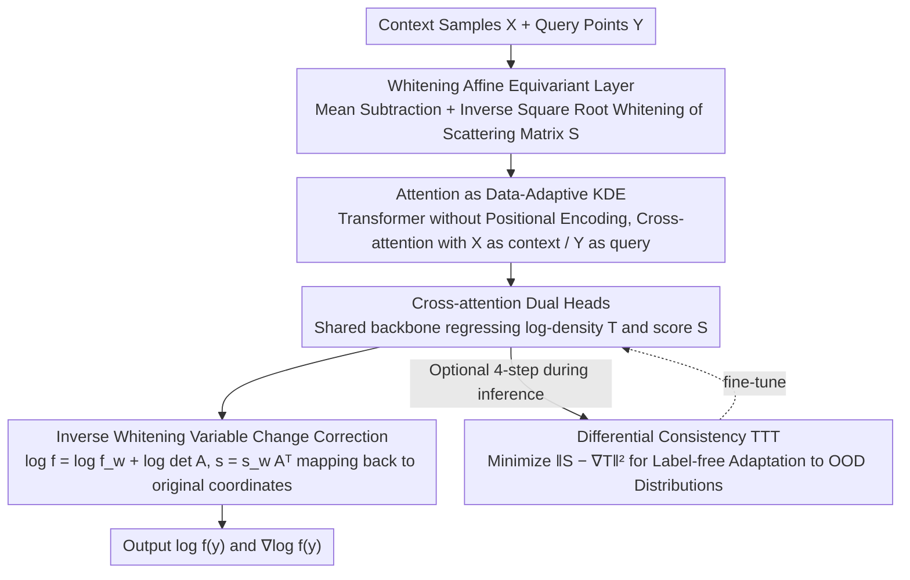

# DiScoFormer: Plug-In Density and Score Estimation with Transformers

**Conference**: ICML 2026 Oral  
**arXiv**: [2511.05924](https://arxiv.org/abs/2511.05924)  
**Code**: TBD  
**Area**: Scientific Computing / Non-parametric Statistics / Density and Score Estimation  
**Keywords**: Density estimation, score estimation, Transformer, Kernel Density Estimation, equivariant networks

## TL;DR
This paper proposes DiScoFormer, a Transformer that is equivariant to sample permutation and coordinate affine transformations. It maps any i.i.d. sample set to its corresponding density $f$ and score $\nabla\log f$ in a single forward pass. Theoretically, it proves that self-attention can exactly reproduce normalized Gaussian KDE under appropriate parameterization. Experimentally, it consistently outperforms classical KDE across various distributions (GMM, Laplace, Student-$t$), sample sizes, and dimensions, serving as a plug-and-play score oracle for Fisher information, entropy estimation, and Fokker–Planck-type PDE solving.

## Background & Motivation

**Background**: Estimating the density $f$ and score $\nabla\log f$ from samples are fundamental primitives in generative models, Bayesian inference, and the solution of kinetic equations. Current approaches mainly fall into two categories: Kernel Density Estimation (KDE), represented by Parzen windows / Silverman's rule, which provides closed-form, interpretable, and distribution-agnostic estimation; and neural score learning, represented by denoising score matching / diffusion models, which achieves extremely high accuracy in high dimensions.

**Limitations of Prior Work**: Both approaches have critical flaws. KDE suffers from the "curse of dimensionality"—the bias-variance tradeoff of the bandwidth is rigid, and errors explode as dimensions increase, with score estimation naturally carrying an $O(h^2)$ bias. Although neural score matching is accurate, it is **transductive**: it must be retrained for every target distribution, making it unusable as a "plug-and-play" statistical primitive.

**Key Challenge**: There is a structural contradiction between generalization capability (KDE's universality for arbitrary distributions) and high accuracy (neural networks' precision in high dimensions)—one relies entirely on fixed kernel functions for inductive bias, while the other is completely tied to a single target distribution.

**Goal**: Split the problem into two sub-problems: (i) find an **architectural** design that respects permutation/affine symmetries to "internalize" KDE's symmetric inductive bias into the network; (ii) enable the network to learn an **operator** $X \mapsto (\log f, \nabla\log f)$ rather than a function for a specific distribution, allowing it to generalize across distributions and sample sizes.

**Key Insight**: Reframe density/score estimation as sequence-to-operator learning—the input is an entire sample sequence $X=\{x_i\}_{i=1}^n$, and the output consists of two sequences, $\log f(x_i)$ and $\nabla\log f(x_i)$, in one-to-one correspondence with the samples. The self-attention of a Transformer is naturally equivariant to token permutation, matching the structure of an "unordered set" of i.i.d. samples. By adding affine equivariance, the Transformer can fully inherit the symmetries of KDE. The authors further note that the exponential kernel form of softmax attention is strikingly similar to Gaussian KDE, suggesting that the Transformer is not a "new departure" but a **data-adaptive generalization of KDE**.

**Core Idea**: Use a permutation-equivariant and affine-equivariant Transformer to learn a universal score/density operator across distributions. By theoretically proving that attention can strictly reproduce normalized KDE, the "universality" of KDE and the "accuracy + multi-scale adaptation" of neural networks are unified within a single architecture.

## Method

### Overall Architecture
DiScoFormer treats density/score estimation as a "set-to-operator" regression task: it takes context samples $X \in \mathbb{R}^{n_x \times d}$ (i.i.d. samples defining the empirical density) and query points $Y \in \mathbb{R}^{n_y \times d}$ (positions where values are to be estimated). A single forward pass produces a scalar $\log f(y_i)$ and a vector $\nabla\log f(y_i)$ for each query point. Samples first pass through a whitening layer to normalize coordinate scales, then enter a standard Transformer encoder without positional encodings for cross-attention between $X$ and $Y$. Finally, two output heads sharing a backbone regress the log-density $T$ and score $S$, with the results in whitened coordinates mapped back to the original coordinates. The model is trained solely on on-the-fly sampled GMM streams and can optionally use test-time training during inference to adapt to unseen distributions.

### Key Designs

**1. Whitening Affine Equivariant Layer: Hard-coding KDE's "Scale Invariance" into the Network**

A pure Transformer with positional independence only achieves permutation equivariance. However, the true strength of KDE lies in its insensitivity to coordinate translation, scaling, and rotation. Explicit affine normalization is required to embed this property. The authors use closed-form differentiable whitening: $X$ and $Y$ are centered by the mean of $X$, then a matrix inverse square root $A = S^{-1/2}$ (in the matrix sense) of a regularized scattering matrix $S = X_c^\top X_c + \varepsilon I$ is computed. Both sets of points are transformed to whitened coordinates $X_w = X_c A, Y_w = Y_c A$. The Transformer computes $\log f_w, s_w$ in whitened coordinates, followed by a correction via change of variables: $\log f = \log f_w + \log\det A$ and $s = s_w A^\top$. This ensures the model satisfies $T(PXA+\mathbf{1}\mu^\top) = PT(X) - \log|\det A|\,\mathbf{1}$ and $S(PXA+\mathbf{1}\mu^\top) = PS(X)A^{-\top}$ for any invertible linear transformation. Whitening reduces affine transformations to a residual $O(d)$ rotation/reflection, which is approximated through "random orthogonal rotation augmentation of GMMs during training," avoiding expensive group integrals of fully equivariant networks. Table 1 shows that the relative MSE for various affine transformations is on the order of $10^{-4}$, confirming the success of this "hard equivariance + soft augmentation" combination.

**2. Attention as Data-Adaptive KDE: A Constructive Equivalence Theorem**

This is the theoretical pillar of the paper: softmax cross-attention is not a black box but a strict generalization of normalized Gaussian KDE. For any positive semi-definite $B$, cross-attention weights can be rewritten via the polarization identity into a KDE form $A_{ij} = \frac{w_j \exp(-\tfrac{1}{2}\|y_i - x_j\|_B^2)}{\sum_k w_k \exp(-\tfrac{1}{2}\|y_i - x_k\|_B^2)}$, where the only redundant term preventing a standard KDE is $w_j = \exp(\tfrac{1}{2}\|x_j\|_B^2)$ (Prop. 3.3). By appending a scalar feature $\|z\|^2$ to each token, $w_j$ can be exactly canceled. Thus, a single residual cross-attention block (width $d_\text{model} \geq 2d+1$, no FFN, no LayerNorm) with an affine readout and a per-query log-normalizer $\ell_i = \log\sum_j \exp(q_i^\top k_j)$ can exactly replicate the score and log-density of a KDE at any query point:

$$\nabla\log\hat{f}_{h,X}(y_i) = h^{-2}\Bigl(\tfrac{\sum_j K_h(y_i,x_j)x_j}{\sum_j K_h(y_i,x_j)} - y_i\Bigr),\quad \log\hat{f}_{h,X}(y_i) = \ell_i - \tfrac{\|y_i\|^2}{2h^2} - \log n_x - \tfrac{d}{2}\log(2\pi h^2)$$

(Prop. 3.5, Cor. 3.6). This theorem elevates the Transformer's capability from an empirical phenomenon to a structural certainty—KDE is within the model's hypothesis space as a lower bound, while multi-head and multi-layer structures allow learning more flexible data-adaptive multi-scale kernels than fixed kernels. This also explains the observed head specialization in experiments (some heads focus on long-range, others on short-mid range or directional kernels).

**3. Cross-attention Dual Heads + Consistency TTT: Label-free OOD Adaptation**

To extend estimation from samples $X$ to arbitrary query points $Y$, the authors use $X$ as context and $Y$ as query for cross-attention, making the model a true non-parametric smoothing operator. Two output heads share a backbone to regress $\log f$ and the score, utilizing shared geometric features and joint training with $\mathcal{L} = \alpha \mathcal{L}_T + (1-\alpha)\mathcal{L}_S$ (Eq. 6-8). Crucially, since $S(C,Q)_i = \nabla_{q_i} T(C,Q)_i$ must hold mathematically, the consistency loss is minimized during inference by setting context to $\text{stopgrad}(X)$ and query to $X$:

$$\mathcal{L}_\text{con} = \tfrac{1}{n}\sum_i \bigl\|S(C,Q)_i - \nabla_{q_i} T(C,Q)_i\bigr\|_2^2$$

This allows fine-tuning on unseen distributions without any ground-truth density—this is test-time training (TTT). In practice, 4 steps of TTT further reduce score MSE on non-GMM distributions like Laplace and Student-$t$, utilizing the inherent differential relationship between density and score as zero-cost self-supervision.

### Loss & Training
Joint optimization of $\mathcal{L} = \alpha\,\mathcal{L}_T + (1-\alpha)\,\mathcal{L}_S$, where $\mathcal{L}_T, \mathcal{L}_S$ are the MSE of the log-density and score, respectively (Eq. 6-8). Training data is generated per Algorithm 1: for each batch, $k \in [k_\text{min}, k_\text{max}]$ GMM components are randomly drawn. Independent GMM samples serve as context $X_b$ and query $Y_b$, with analytically computed $\log f_{X_b}(y)$ and $\nabla\log f_{X_b}(y)$ as supervision. Default configuration: 4 encoder layers, hidden dimension 128, 8 heads, GELU, pre-norm, no positional encoding, ~800k parameters. Large $n$ experiments use $d_\text{model}=256$, 6 layers, 8 heads, 150k steps, with context sizes randomly sampled in $[2^8, 2^{14}]$.

## Key Experimental Results

### Main Results
Experiments were conducted on a 48GB L40S GPU. Comparisons include Scott's rule KDE and Score-Debiased KDE (SD-KDE).

| Dataset / Setting | Metric | Ours | KDE | Gain |
|--------|------|------|------|------|
| GMM 2D, $n=2^{14}$ | Rel. score MSE (%) | 6.80 | 17.2 | $\approx 2.5\times$ |
| GMM 10D, $n=2^{14}$ | Rel. score MSE (%) | 2.83 | 52.9 | $\approx 18\times$ |
| GMM 10D, $n=2^{17}$ (Extrapolation) | Rel. score MSE (%) | 2.74 | OOM | KDE Memory Exploded |
| 2D Laplace, $n=2048$ | Score MSE | 0.2990 (Superior) | 0.2990 (Near/Slightly worse) | Cross-distribution Generalization |

### Ablation Study
| Configuration | Key Metric | Observation |
|------|---------|------|
| Full Model (cross-attention + equivariance) | Rel. MSE for affine transforms $\sim 10^{-4}$ | Whitening + augmentation ensure approximate equivariance |
| GMM 1-10 modes training → 1-19 modes test | Slight monotonic MSE increase | Stable OOD mode number generalization |
| Large $n$ Transformer, $n \in [2^8, 2^{14}]$ training → test at $2^{17}$ | MSE still decreases monotonically | Successful sequence length extrapolation |
| TTT 0-step → 4-step (Laplace / Student-$t$) | Further reduction in score MSE | Consistency loss provides label-free OOD adaptation |

### Key Findings
- The performance gap between the Transformer and KDE increases with dimensionality: from $\sim 2$-$3\times$ at $d=2$ to $\sim 18\times$ at $d=10$. Additionally, KDE hits OOM at $n \geq 2^{15}$, whereas DiScoFormer evaluates smoothly, mitigating the "curse of dimensionality."
- Automatic head specialization (far-range / mid-range / directional kernels) strongly aligns with "multi-scale KDE" theoretical predictions (Prop. 3.3-3.6).
- Training only on GMMs allows transfer to Laplace and Student-$t$ distributions. 4-step TTT further reduces error, validating GMMs as a reasonable choice for training data.
- DiScoFormer can be used as a plug-and-play score oracle for SD-KDE, Fisher information calculation, and particle solvers for Fokker–Planck PDEs without additional training.

## Highlights & Insights
- **Strict constructive equivalence between attention and KDE**: Prop. 3.3-3.6 provide a formal derivation rather than a hand-wavy analogy. Appending $\|z\|^2$ to tokens allows single-head cross-attention to exactly equal normalized Gaussian KDE.
- **Whitening layer + Rotation augmentation**: This combination is ingenious. Whitening handles all invertible affine transformations strictly except for $O(d)$ residuals, which are efficiently learned via data augmentation, avoiding expensive equivariant layers.
- **Joint $(\log f, \nabla\log f)$ heads + Differential consistency → Label-free TTT**: This trick is reusable in any task involving density and score output. The inherent mathematical relationship becomes zero-cost self-supervision for OOD adaptation.

## Limitations & Future Work
- Training data is currently limited to GMMs. While GMMs are dense in probability space, further diversity (e.g., samples from normalizing flows) could improve robustness for heavy-tailed or discrete distributions.
- Experiments reached $d=10$. Real-world data like images or molecular conformations have much higher dimensions. The whitening layer relies on the sample covariance, which becomes singular if $n < d$, requiring low-rank or spectral truncation strategies.
- Attention complexity is $O(n_x n_y)$, which remains a bottleneck for large sample sizes. Linear attention or Nyström approximations could be explored.
- MSE training does not explicitly guarantee that $\exp(\log f)$ integrates to 1. Normalized density may require post-processing or architectural constraints.

## Related Work & Insights
- **vs Score-Debiased KDE (Epstein et al., 2025)**: SD-KDE requires an external score oracle to correct $O(h^2)$ bias; DiScoFormer serves as this "missing oracle."
- **vs Score Neural Operator (Liao et al., 2024)**: Unlike SNO which requires RKHS embeddings, DiScoFormer processes raw i.i.d. samples directly, making the architecture simpler and more direct for cross-density/dimension generalization.
- **vs Score-based Generative Models (DDPM, Score SDE)**: Generative models are transductive (one network per distribution), while DiScoFormer learns a distribution-agnostic operator ("train once, use anywhere").
- **vs Set Transformer / Neural Processes**: Shares the permutation-equivariant approach for sets but adds affine equivariance and outputs statistical quantities (density/score) with a strict connection to KDE.

## Rating
- Novelty: ⭐⭐⭐⭐⭐ First constructive equivalence proof between attention and data-adaptive KDE, coupled with a universal operator learner.
- Experimental Thoroughness: ⭐⭐⭐⭐ Coverage of dimensionality/sample scaling, OOD generalization, TTT, and downstream applications (Fisher/PDE), though lacking high-dimensional real-world data.
- Writing Quality: ⭐⭐⭐⭐⭐ Very clear progression from theoretical propositions to empirical validation and head specialization analysis.
- Value: ⭐⭐⭐⭐⭐ Providing a plug-in universal score oracle has a broad impact on downstream tasks like SVGD, information estimation, and PDE solvers.

<!-- RELATED:START -->

## Related Papers

- [\[ICLR 2026\] Sample-Efficient Evidence Estimation of Score-Based Priors for Model Selection](../../ICLR2026/image_generation/sample-efficient_evidence_estimation_of_score_based_priors_for_model_selection.md)
- [\[CVPR 2025\] Taming Score-Based Denoisers in ADMM: A Convergent Plug-and-Play Framework](../../CVPR2025/image_generation/taming_score-based_denoisers_in_admm_a_convergent_plug-and-play_framework.md)
- [\[ICML 2026\] Scalable GANs with Transformers](scalable_gans_with_transformers.md)
- [\[ICLR 2026\] Monocular Normal Estimation via Shading Sequence Estimation](../../ICLR2026/image_generation/monocular_normal_estimation_via_shading_sequence_estimation.md)
- [\[ICML 2026\] Krause Synchronization Transformers](krause_synchronization_transformers.md)

<!-- RELATED:END -->
