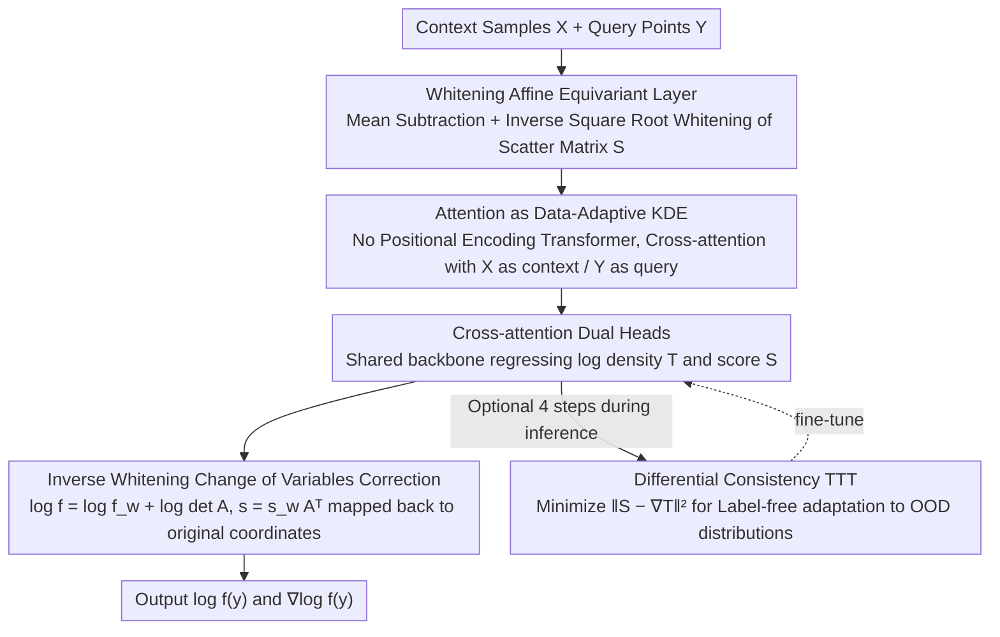

# DiScoFormer: Plug-In Density and Score Estimation with Transformers

**Conference**: ICML 2026 Oral  
**arXiv**: [2511.05924](https://arxiv.org/abs/2511.05924)  
**Code**: TBD  
**Area**: Scientific Computing / Non-parametric Statistics / Density and Score Estimation  
**Keywords**: Density estimation, score estimation, Transformer, Kernel Density Estimation, Equivariant networks

## TL;DR
This paper proposes DiScoFormer, a Transformer that is equivariant to sample permutation and coordinate affine transformations. It maps any i.i.d. sample set to corresponding densities $f$ and scores $\nabla\log f$ in a single forward pass. Theoretically, it proves that self-attention with appropriate parametrization can exactly replicate normalized Gaussian KDE. Experimentally, it outperforms classical KDE across various distributions (GMM, Laplace, Student-$t$), widespread sample sizes, and a range of dimensions. It serves as a plug-and-play score oracle for Fisher information, entropy estimation, and solving Fokker–Planck-type PDEs.

## Background & Motivation

**Background**: Estimating density $f$ and score $\nabla\log f$ from samples are fundamental primitives in generative modeling, Bayesian inference, and solving kinetic equations. Current methods are split into two schools: Non-parametric methods like Parzen windows / Silverman’s rule (KDE) provide closed-form, interpretable, and distribution-agnostic estimation; Neural score learning (e.g., denoising score matching / diffusion models) achieves extremely high accuracy in high dimensions.

**Limitations of Prior Work**: Both schools have critical weaknesses. KDE suffers from the "curse of dimensionality"—the bias-variance tradeoff of the bandwidth is rigid, causing errors to explode as dimensions increase, and score estimation naturally carries $O(h^2)$ bias. While neural score matching is accurate, it is **transductive**: the model must be retrained for every new target distribution, making it unusable as a "plug-and-play" statistical primitive.

**Key Challenge**: There is a structural contradiction between generalization capability (KDE being universal for any distribution) and high precision (Neural Networks being accurate in high dimensions)—one leaves the inductive bias entirely to a fixed kernel function, while the other is completely tied to a single target distribution.

**Goal**: Split the problem into two sub-problems: (i) Find an **architectural** design that respects permutation/affine symmetries to "internalize" the symmetric inductive bias of KDE into the network; (ii) Train the network to learn an **operator** $X \mapsto (\log f, \nabla\log f)$ rather than a function for a specific distribution, enabling generalization across distributions and sample sizes.

**Key Insight**: Reformulate density/score estimation as sequence-to-operator learning—the input is an entire sample sequence $X=\{x_i\}_{i=1}^n$, and the output is two sequences $\log f(x_i)$ and $\nabla\log f(x_i)$ in one-to-one correspondence with the samples. The self-attention of a Transformer is naturally equivariant to token permutation, matching the structure of i.i.d. sample "unordered sets." By adding affine equivariance, it inherits the symmetries of KDE. The authors further notice that the exponential kernel form of softmax attention is strikingly similar to Gaussian KDE, suggesting that the Transformer is not "starting from scratch" but is a **data-adaptive generalization of KDE**.

**Core Idea**: Use a permutation-equivariant and affine-equivariant Transformer to learn a cross-distribution universal score/density operator. Prove theoretically that attention can strictly replicate normalized KDE, thereby unifying KDE’s "universality" with neural networks' "precision and multi-scale adaptability" within a single architecture.

## Method

### Overall Architecture
DiScoFormer treats density/score estimation as a "set-to-operator" regression task: it takes context samples $X \in \mathbb{R}^{n_x \times d}$ (i.i.d. samples defining the empirical density) and query points $Y \in \mathbb{R}^{n_y \times d}$ (where values are to be evaluated) and produces the scalar $\log f(y_i)$ and vector $\nabla\log f(y_i)$ for each query point in one forward pass. Samples first pass through a whitening layer to normalize coordinate scales, then enter a standard Transformer encoder without positional encodings for cross-attention between $X$ and $Y$. Finally, two heads sharing a backbone regress log-density $T$ and score $S$, with results transformed back to the original coordinates from the whitened space. The model is trained solely on on-the-fly sampled GMM flows, and can optionally use test-time training (TTT) during inference to adapt to unseen distributions.

### Key Designs

**1. Whitening Affine Equivariant Layer: Hard-coding KDE's "Scale Invariance" into the network**

Standard Transformers with position-agnostic inputs only provide permutation equivariance. However, the strength of KDE lies in its insensitivity to coordinate translation, scaling, and rotation. To incorporate this, explicit affine normalization is required. The authors use a closed-form differentiable whitening: first, $X$ and $Y$ are centered by the mean of $X$; then, for the regularized scatter matrix $S = X_c^\top X_c + \varepsilon I$, the matrix inverse square root $A = S^{-1/2}$ is computed to transform both sets to whitened coordinates $X_w = X_c A$ and $Y_w = Y_c A$. The Transformer calculates $\log f_w$ and $s_w$ in the whitened space, which are then corrected via change of variables: $\log f = \log f_w + \log\det A$ and $s = s_w A^\top$. Consequently, the model satisfies $T(PXA+\mathbf{1}\mu^\top) = PT(X) - \log|\det A|\,\mathbf{1}$ and $S(PXA+\mathbf{1}\mu^\top) = PS(X)A^{-\top}$ for any invertible linear transformation. Since whitening only reduces affine transformations to a residual $O(d)$ rotation/reflection, the remaining rotation equivariance is approximately learned via "random orthogonal rotation augmentation of GMMs during training," avoiding expensive group integrals of fully equivariant networks. Table 1 shows that the relative MSE for various affine transformations is on the order of $10^{-4}$, confirming the success of this "hard equivariance + soft augmentation" combination.

**2. Attention as Data-Adaptive KDE: A Constructive Equivalence Theorem**

This is the theoretical anchor of the paper: softmax cross-attention is not a black box but a strict generalization of normalized Gaussian KDE. For any positive semi-definite $B$, cross-attention weights can be rewritten via polarization identities into the form of KDE: $A_{ij} = \frac{w_j \exp(-\tfrac{1}{2}\|y_i - x_j\|_B^2)}{\sum_k w_k \exp(-\tfrac{1}{2}\|y_i - x_k\|_B^2)}$, where the only extra term "blocking" standard KDE is $w_j = \exp(\tfrac{1}{2}\|x_j\|_B^2)$ (Prop. 3.3). By appending a scalar feature $\|z\|^2$ to each token, $w_j$ can be exactly neutralized. Thus, a single residual cross-attention block (width $d_\text{model} \geq 2d+1$, no FFN, no LayerNorm) paired with an affine readout and a per-query log-normalizer $\ell_i = \log\sum_j \exp(q_i^\top k_j)$ can exactly replicate the score and log-density of a KDE at any query point:

$$\nabla\log\hat{f}_{h,X}(y_i) = h^{-2}\Bigl(\tfrac{\sum_j K_h(y_i,x_j)x_j}{\sum_j K_h(y_i,x_j)} - y_i\Bigr),\quad \log\hat{f}_{h,X}(y_i) = \ell_i - \tfrac{\|y_i\|^2}{2h^2} - \log n_x - \tfrac{d}{2}\log(2\pi h^2)$$

(Prop. 3.5, Cor. 3.6). This theorem upgrades "Transformers can do density estimation" from an empirical phenomenon to a structural certainty—KDE lies within the model's hypothesis space as a lower bound, while multi-head and multi-layer structures allow the model to learn kernels that are more flexible and data-adaptive than fixed kernels. This also explains the head specialization observed in experiments (e.g., specific heads focusing on far-range, mid-range, or directional kernels).

**3. Cross-attention Dual Heads + Differential Consistency TTT: Label-free OOD Adaptation**

To extend estimation capability from "only at sample points $X$" to "any query point $Y$," the authors use $X$ as context and $Y$ as query for cross-attention, making the model a true non-parametric smoothing operator. The two output heads share a backbone to regress $\log f$ and score respectively, leveraging shared geometric features to improve sample efficiency through a joint MSE objective $\mathcal{L} = \alpha \mathcal{L}_T + (1-\alpha)\mathcal{L}_S$ (Eq. 6-8). Crucially, mathematically it must hold that $S(C,Q)_i = \nabla_{q_i} T(C,Q)_i$. At inference time, by setting context to $\text{stopgrad}(X)$ and query to $X$, the consistency loss can be minimized:

$$\mathcal{L}_\text{con} = \tfrac{1}{n}\sum_i \bigl\|S(C,Q)_i - \nabla_{q_i} T(C,Q)_i\bigr\|_2^2$$

This allows fine-tuning on unseen distributions without any ground-truth density—this is test-time training (TTT). Experiments show that just 4 steps of TTT further reduce score MSE on non-GMM distributions like Laplace and Student-$t$, essentially using the necessary differential relationship between density and score as zero-cost self-supervision.

### Loss & Training
Joint optimization of $\mathcal{L} = \alpha\,\mathcal{L}_T + (1-\alpha)\,\mathcal{L}_S$, where $\mathcal{L}_T, \mathcal{L}_S$ are the MSE of $\log f$ and score respectively (Eq. 6-8). Training data is generated on-the-fly via Algorithm 1: for each batch, $k \in [k_\text{min}, k_\text{max}]$ GMM components are randomly drawn. Two independent GMM sets are sampled as context $X_b$ and query $Y_b$, with analytically calculated $\log f_{X_b}(y)$ and $\nabla\log f_{X_b}(y)$ as supervision signals. Default config: 4 encoder layers, 128 hidden dim, 8 heads, GELU, pre-norm, no positional encodings (~800k params); batch size 32, $n=2048$, dropout 0.1, GMM means in $[-3,3]^d$, diagonal covariance in $[0.2,1]^d$. Large-$n$ experiments use $d_\text{model}=256$, 6 layers, 150k steps, with context sizes randomly sampled in $[2^8, 2^{14}]$ to ensure generalization across sample sizes.

## Key Experimental Results

### Main Results
All experiments run on a single 48GB L40S GPU. Baselines include Scott's Rule KDE and Score-Debiased KDE (SD-KDE); sliced score matching is compared in the Appendix.

| Dataset / Setting | Metric | Ours | KDE | Gain |
|--------|------|------|------|------|
| GMM 2D, $n=2^{14}$ | Rel. score MSE (%) | 6.80 | 17.2 | $\approx 2.5\times$ |
| GMM 10D, $n=2^{14}$ | Rel. score MSE (%) | 2.83 | 52.9 | $\approx 18\times$ |
| GMM 10D, $n=2^{17}$ (Extrap.) | Rel. score MSE (%) | 2.74 | OOM | KDE Memory Explosion |
| 2D Laplace, $n=2048$ | Score MSE | 0.2990 (Better) | 0.2990 (Tie/Worse) | Cross-dist. Gen. |

### Ablation Study

| Configuration | Key Metric | Description |
|------|---------|------|
| Full Model (cross-attn + equivariant) | Rel. MSE for affine transforms $\sim 10^{-4}$ | Whitening + Augment ensure approx. equivariance |
| GMM 1-10 modes Train → 1-19 modes Test | MSE rises slightly/monotonically | Stable generalization to OOD mode counts |
| Large-$n$ Transformer, $n \in [2^8, 2^{14}]$ Train → Eval at $2^{17}$ | MSE continues to decrease | Successful sequence length extrapolation |
| TTT 0 steps → 4 steps (Laplace / Student-$t$) | Score MSE decreases further | Consistency loss provides label-free adaptation |

### Key Findings
- The higher the dimension, the larger the lead of the Transformer over KDE: the gap is ~2-3$\times$ at $d=2$ and widens to ~18$\times$ at $d=10$. Moreover, KDE hits OOM at $n \geq 2^{15}$, while DiScoFormer evaluates smoothly, mitigating the "curse of dimensionality."
- Automatic head specialization (far-range / mid-range / directional kernels) is highly consistent with theoretical predictions of "multiscale KDE," providing empirical evidence for Prop. 3.3-3.6: multi-head Transformers naturally learn multi-bandwidth + anisotropic KDE.
- Training on GMMs alone generalizes to Laplace and Student-$t$. Coupled with 4-step TTT, errors are further reduced, validating GMMs as a dense set for training in smooth density spaces.
- Using DiScoFormer as a plug-and-play score oracle for SD-KDE / Fisher info / Fokker–Planck PDE solvers provides high-fidelity scores without additional training, proving it is the long-missing universal score component since KDE.

## Highlights & Insights
- **Strict proof of "attention as a generalization of data-adaptive KDE"**: Prop. 3.3-3.6 are not hand-wavy analogies but constructive equivalences—adding $\|z\|^2$ as a scalar to tokens allows single-head cross-attention to exactly match normalized Gaussian KDE at any query point. This result has independent value for the attention interpretability community.
- **Whitening layer + Rotation augmentation** is a clever combination: Whitening strictly reduces any invertible affine transformation to an orthogonal residue, and $O(d)$ residues are learned via data augmentation—ensuring "hard" equivariance (translation/scale/permutation) while achieving approximate rotation equivariance without expensive group integrals.
- **Joint $(\log f, \nabla\log f)$ heads + Autodiff consistency → Label-free TTT**: This trick can be reused in any work outputting both density and score—using the inherent mathematical differential relationship as self-supervision for zero-cost OOD adaptation.

## Limitations & Future Work
- Training data is currently limited to GMMs. While GMMs are dense under TV / Fisher divergence, extreme distributions (heavy-tailed, discrete, low-rank manifolds) still rely on TTT; future work could include more diverse distribution families (e.g., samples from normalizing flows).
- Experimental dimensions are capped at $d=10$, while real-world data like images/molecules reside in much higher-dimensional spaces. The whitening layer relies on the sample covariance, which becomes singular when $n < d$, requiring low-rank or spectral truncation strategies.
- The complexity of cross-attention was not detailed: as $n_x, n_y$ increase, attention is $O(n_x n_y)$, same as KDE. This might be a bottleneck for large datasets, and linear attention or Nyström approximations could be considered.
- Affine equivariance is restricted to "covariance normalization." For data with low-dimensional manifold structures (like images), Euclidean whitening is non-optimal; future work could replace it with Riemannian or manifold-aware normalization.
- The training objective is MSE rather than NLL, meaning the $\log f$ head does not explicitly guarantee that $\int \exp(\log f) = 1$. Normalization regularizers might be needed for downstream density-sensitive tasks.

## Related Work & Insights
- **vs Score-Debiased KDE (Epstein et al., 2025)**: SD-KDE requires an external score oracle to correct the $O(h^2)$ bias of KDE; DiScoFormer is precisely that "missing oracle" and can benefit SD-KDE as a downstream consumer, as shown in the experiments.
- **vs Score Neural Operator (Liao et al., 2024)**: Both aim to learn operators on probability distributions. SNO takes an RKHS embedding route; DiScoFormer directly processes raw i.i.d. samples without relying on kernel embeddings, resulting in a simpler architecture with more direct cross-dimension generalization.
- **vs Score-based Generative Models (DDPM, Score SDE)**: Those are transductive (one network per distribution). DiScoFormer learns a distribution-agnostic operator ("train once, use anywhere"), making them complementary: DDPM solves "how to sample from a distribution," while DiScoFormer solves "how to estimate the score of any distribution."
- **vs Set Transformer / DeepSets / Neural Processes**: They share the idea of permutation equivariance for exchangeable data, but this work adds affine equivariance and outputs statistical primitives (density/score) with a strict connection to KDE.

## Rating
- Novelty: ⭐⭐⭐⭐⭐ First to provide constructive equivalence proof for "attention = data-adaptive KDE" and design a universal density/score operator learner based on it.
- Experimental Thoroughness: ⭐⭐⭐⭐ Coverage of dimension/sample size scans, OOD (modes, Laplace, Student-$t$), TTT, and downstream applications (SD-KDE, Fisher, Fokker–Planck) is comprehensive; missing only real-world high-dimensional data.
- Writing Quality: ⭐⭐⭐⭐⭐ Theoretical propositions, whitening pseudocode, attention visualizations, and head specialization analysis progress logically, clearly explaining why Transformers are suitable for this task.
- Value: ⭐⭐⭐⭐⭐ Once weights are released, the community will have a plug-in universal score oracle for diverse downstream tasks like SVGD, information theory estimation, and more.

<!-- RELATED:START -->

## Related Papers

- [\[ICLR 2026\] Sample-Efficient Evidence Estimation of Score-Based Priors for Model Selection](../../ICLR2026/image_generation/sample-efficient_evidence_estimation_of_score_based_priors_for_model_selection.md)
- [\[CVPR 2025\] Taming Score-Based Denoisers in ADMM: A Convergent Plug-and-Play Framework](../../CVPR2025/image_generation/taming_score-based_denoisers_in_admm_a_convergent_plug-and-play_framework.md)
- [\[ICLR 2026\] Monocular Normal Estimation via Shading Sequence Estimation](../../ICLR2026/image_generation/monocular_normal_estimation_via_shading_sequence_estimation.md)
- [\[ICLR 2026\] Enhanced Generative Model Evaluation with Clipped Density and Coverage](../../ICLR2026/image_generation/enhanced_generative_model_evaluation_with_clipped_density_and_coverage.md)
- [\[ICML 2026\] Rao-Blackwellized Score Matching on Manifolds](rao-blackwellized_score_matching_on_manifolds.md)

<!-- RELATED:END -->
