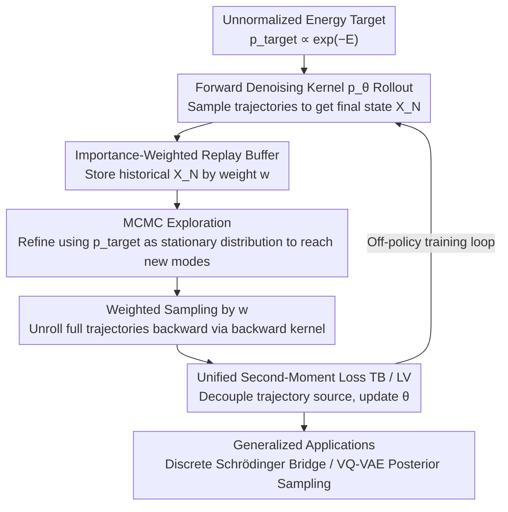

# Discrete Diffusion Samplers and Bridges: Off-Policy Algorithms and Applications in Latent Spaces

**Conference**: ICML2026  
**arXiv**: [2602.05961](https://arxiv.org/abs/2602.05961)  
**Code**: https://github.com/mmacosha/offpolicy-discrete-diffusion-samplers-and-bridges  
**Area**: Image Generation / Diffusion Sampling / Discrete Diffusion / Amortized Sampling / off-policy RL  
**Keywords**: Discrete diffusion samplers, off-policy RL, trajectory balance, Schrödinger bridge, VQ-VAE posterior sampling

## TL;DR
This work systematically migrates mature off-policy RL training techniques from continuous-space diffusion sampling (replay buffer, importance weighting, MCMC exploration) to discrete diffusion samplers for the first time. It further generalizes these to data-to-energy discrete Schrödinger bridges, significantly mitigating mode collapse on multi-modal distributions like Ising/Potts and discretized GMMs. Finally, it demonstrates data-free conditional image generation (posterior sampling) within the discrete latent space of VQ-VAEs.

## Background & Motivation

**Background**: Sampling from unnormalized energies $p(x) \propto e^{-E(x)}$ has long been dominated by MCMC, AIS, and SMC. Recently, diffusion samplers have emerged as an amortized sampling approach: using a learned diffusion process to push a simple prior $p_0$ toward a target $p_{\text{target}}$. Training objectives are typically path-space divergences (trajectory balance, log-variance, etc.). In continuous spaces, introducing off-policy RL (replay buffer, importance weighting, MCMC exploration) has been proven to significantly improve mode coverage (Sendera et al. 2024; Choi et al. 2026).

**Limitations of Prior Work**: Discrete versions (masked / uniform discrete diffusion samplers, such as MDNS, Zhu et al. 2025; Sanokowski et al. 2025a) lag behind—they almost exclusively use on-policy training (calculating loss directly from trajectories sampled by the current model). This leads to severe mode collapse on strongly multi-modal targets like low-temperature Ising, Potts, and high-dimensional GMMs, eventually covering only a single mode.

**Key Challenge**: On-policy training only observes trajectories generated by the model itself; once the model biases toward a certain mode, it reinforces that bias. Breaking this feedback loop requires training data that "exceeds the current policy coverage"—this is the role of off-policy techniques in continuous diffusion samplers, but they have not yet been cleanly introduced to the discrete setting. Furthermore, GFlowNet work (Zhang et al. 2022a) has long performed "off-policy training equivalent to discrete diffusion sampling," yet this line of research has remained disconnected from recent masked diffusion samplers.

**Goal**: (i) Cleanly migrate the TB/LV objectives along with replay buffers, importance weighting, and MCMC exploration to discrete diffusion samplers within a unified second-moment loss framework; (ii) Further generalize this method to data-to-energy discrete Schrödinger bridges (i.e., bridges where one end is energy and the other is samples); (iii) Explore a new application—data-free posterior sampling for discrete latent space generative models (VQ-VAE).

**Key Insight**: The authors note that the unified theory of continuous space by Berner et al. (2026) can be translated to discrete settings. Trajectory balance happens to absorb the unknown normalization constant into a learnable scalar $c$, meaning the off-policy ideas from GFlowNet can be seamlessly applied to the mask/uniform kernels of discrete diffusion samplers. The technical bridge is essentially replacing the path-space loss of continuous SDEs with the trajectory ratio loss of discrete Markov chains.

**Core Idea**: All that is required is a unified second-moment loss $\mathcal{L}_{\mathcal{P}} = \mathbb{E}_{\mathcal{P}}\big[(\log \tfrac{p_0 \otimes \overrightarrow{p}_\theta^{\otimes N}}{p_{\text{target}} \otimes \overleftarrow{p}^{\otimes N}} - c)^2\big]$. By using a carefully designed trajectory distribution $\mathcal{P}$ (buffer / importance weighting / MCMC refinement), off-policy training is implemented and transferred from continuous diffusion samplers to discrete diffusion samplers and Schrödinger bridges.

## Method

### Overall Architecture

The goal is to solve the amortized sampling problem from an unnormalized energy $p_{\text{target}}(x) \propto e^{-E(x)}$ ($E: \mathcal{S} \to \mathbb{R}$, where $\mathcal{S} = \{1, \dots, C\}^d$ is a discrete sequence space). The approach learns a forward denoising kernel $\overrightarrow{p}_\theta(X_{n+1} \mid X_n)$ in conjunction with a pre-selected backward noising kernel $\overleftarrow{p}$ (masking or uniform discrete diffusion). The objective is to make the marginal distribution of $X_N$, reached after an $N$-step Markov chain starting from prior $p_0$, approximate $p_{\text{target}}$. The key is not the network architecture, but rather using a "squared trajectory ratio" second-moment loss to decouple the training data source (trajectory distribution $\mathcal{P}$) from the optimal solution. This allows the inclusion of replay buffers and MCMC-explored trajectories, similar to off-policy RL. This framework is further generalized to data-to-energy discrete Schrödinger bridges and applied to data-free posterior sampling in VQ-VAE discrete latent spaces. Algorithm 1 describes the off-policy training loop: model rollout → weighted buffer entry → MCMC refinement exploration → weighted sampling + reverse unroll via the backward kernel → calculate second-moment loss to update the model.

### Key Designs

**1. Unified Second-Moment Loss: Decoupling Training Data from the Optimal Solution**

The reason discrete samplers are prone to mode collapse is that on-policy training only considers trajectories sampled by the model itself. This paper formulates the training objective as the square of the trajectory ratio $\mathcal{L}_{\mathcal{P}} = \mathbb{E}_{\mathcal{P}}\big[(\log \tfrac{p_0 \otimes \overrightarrow{p}_\theta^{\otimes N}}{p_{\text{target}} \otimes \overleftarrow{p}^{\otimes N}} - c)^2\big]$. A critical property is that as long as the trajectory distribution $\mathcal{P}$ has full support, its unique minimum is always $p_0 \otimes \overrightarrow{p}_\theta^{\otimes N} = p_{\text{target}} \otimes \overleftarrow{p}^{\otimes N}$, regardless of the specific form of $\mathcal{P}$. This means $\mathcal{P}$ can be replaced freely, like a behavior policy in RL, without changing the convergence target. When $\mathcal{P} = p_0 \otimes \overrightarrow{p}_\theta^{\otimes N}$, the gradient aligns with reverse KL, regressing to traditional on-policy training. Replacing it with buffer or MCMC-refined trajectories introduces exploration. The scalar $c$ is also pivotal: when treated as a learnable scalar, it leads to **trajectory balance (TB)**, which absorbs the unknown normalization constant $Z$ into $\log Z_\phi$, eliminating the need for importance correction. When using the empirical batch mean, it leads to **log-variance (LV)**, saving additional parameters and being more natural in the data-to-energy step of Schrödinger bridges.

**2. Importance-Weighted Replay Buffer: Focusing Computation on High-Value Modes**

Decoupling the loss is insufficient; one must also feed in trajectories that "exceed the current policy coverage." This work maintains a replay buffer of terminal states $X_N$ from historical rollouts and calculates importance weights at entry:

$$w = \frac{e^{-E(X_N)} \prod_n \overleftarrow{p}(X_n \mid X_{n+1})}{p_0(X_0) \prod_n \overrightarrow{p}_\theta(X_{n+1} \mid X_n)}.$$

During training, samples are drawn weighted by $w$, and full trajectories are unrolled backward using $\overleftarrow{p}^{\otimes N}$ to calculate the loss. While a uniform buffer stabilizes rapidly changing policies, importance weighting focuses training on samples that have high target probability but low model probability—regions on-policy training can never reach, which is crucial for mode coverage.

**3. MCMC Exploration: Reaching Unobserved Modes with Low-Cost Energy Evaluations**

The buffer can only store modes the model has already seen. To break mode collapse at extremely low temperatures, active discovery of new modes is required. Before feeding samples from the buffer to training, several MCMC iterations refined toward the stationary distribution $p_{\text{target}}$ are performed. For structured energies like Ising/Potts, Swendsen-Wang proposals are used for mode-jumping; for general discrete densities, 1-Hamming-ball Metropolis-Hastings is employed. This step is nearly "free": MCMC only calls the energy function $E$ without calling the model, adding no GPU overhead while reaching new modes under energy guidance. Algorithm 1 integrates "model rollout → buffer entry → MCMC refinement → weighted sampling training" into a complete loop, ensuring training data stays near the true target and providing sufficient exploration in low-temperature/multi-modal settings. Table 1 shows that only methods with MCMC avoid collapsing to a single mode at Ising $\beta=1.2$.

### Extension and Application

**Schrödinger Bridge (§3)**: Replaces the fixed prior $p_0$ with an arbitrary distribution and parameterizes the backward kernel $\overleftarrow{p}_\varphi$, using IPF iterations (Equations 6a/6b) to alternately fit the forward and backward processes $\overrightarrow{\mathcal{P}}, \overleftarrow{\mathcal{P}}$. In the data-to-energy case (samples at one end, energy at the other), (6b) is trained using the LV variant, with a uniform discrete diffusion reference process.

**VQ-VAE Posterior Sampling (§4)**: In a discrete latent space $z \in \{1, \dots, 8\}^{16}$ with a pre-trained autoregressive prior $p_{\text{latent}}(z)$, deterministic decoder $f$, and categorical likelihood $p(y \mid f(z))$, the posterior $p(z \mid y) \propto p_{\text{latent}}(z) \cdot p(y \mid f(z))$ is treated as a new discrete energy sampling problem. It is trained with the same sampler without fine-tuning the original model or back-propagating gradients.

### Loss & Training

The main objective uses trajectory balance $\mathcal{L}_{\text{TB}} = \mathbb{E}_{\mathcal{P}}[(\log \tfrac{p_0 \overrightarrow{p}_\theta^{\otimes N}}{p_{\text{target}} \overleftarrow{p}^{\otimes N}} - \log Z_\phi)^2]$, while the LV version replaces $\log Z_\phi$ with the batch empirical mean. Inference allows variable time discretization: multi-step masking during training and single-step unmasking during inference to balance memory and quality (§A.1). Target temperature annealing is enabled by default for all samplers.

## Key Experimental Results

### Main Results

Ising / Potts models ($16 \times 16$ toroidal lattice, average of 5 runs; MDNS = current SOTA on-policy discrete diffusion sampler):

| Setting | Method | ELBO ↑ | EUBO ↓ | Sinkhorn ↓ | Magnetisation err ↓ |
|------|------|--------|--------|------------|----------------------|
| Ising $\beta=0.6$ | MDNS (WDCE, on-policy) | 310.18 | 341.82 | 48.71 | 0.41 |
| Ising $\beta=0.6$ | LV (on-policy) | 309.77 | 422.53 | 116.96 | 0.97 (collapse) |
| Ising $\beta=0.6$ | TB + Buffer | 310.42 | 310.56 | 3.59 | 0.04 |
| Ising $\beta=0.6$ | **TB + Buffer + MCMC** | **310.43** | **310.55** | **3.47** | **0.02** |
| Ising $\beta=1.2$ | MDNS / on-policy | 614.42 | >1100 | ~127 | 1.00 (severe) |
| Ising $\beta=1.2$ | **TB + Buffer + MCMC** | **615.03** | **615.14** | **0.02** | **0.03** |
| Potts $q=3, \beta=1.2$ | MDNS | 620.23 | 680.52 | 99.95 | 0.58 |
| Potts $q=3, \beta=1.2$ | **TB + Buffer + MCMC** | **620.73** | **621.30** | **12.37** | **0.03** |

Discretized synthetic densities (8-bit Gray code per dimension, average of 5 runs):

| Target | Method | ELBO ↑ | MMD ↓ | Sinkhorn ↓ |
|------|------|--------|-------|------------|
| 40GMM ($d=32$) | MDNS | -16.66 | 0.17 | 349.31 |
| 40GMM ($d=32$) | TB (on-policy) | -2.47 | 0.40 | 2142.65 (collapse) |
| 40GMM ($d=32$) | TB + Buffer | -5.97 | 0.07 | 114.11 |
| 40GMM ($d=32$) | **TB + Buffer + MCMC** | **-7.13** | **0.04** | **4.25** |
| ManyWell ($d=80$) | MDNS | 41.52 | 0.04 | 1.82 |
| ManyWell ($d=80$) | **TB + Buffer + MCMC** | 48.74 | 0.04 | 1.36 |

VQ-VAE posterior sampling (MNIST, 16-d latent space, 8-word codebook, likelihood = odd / even / equal to k): Both on-policy LV and off-policy LV correctly generate target class images (Fig. 5), but off-policy yields better diversity; this is the first integration of discrete diffusion samplers into pre-trained latent spaces for data-free conditional generation.

### Ablation Study

| Configuration | Key Findings | Note |
|------|---------|------|
| on-policy (TB / LV) | Sinkhorn 1-3 orders higher than off-policy on $\beta=1.2$ Ising and 40GMM $d=32$; magnetisation ≈ 0.95 | Severe mode collapse |
| TB + Buffer | Significant improvement in most temps, but occasional collapse on Ising $\beta=1.2$ (Sink 50.94 ± 62.35) | Buffer alone is unstable at extreme lows |
| TB + Buffer + MCMC | Stable across all temperatures; Sinkhorn comparable to or better than true MH MCMC | MCMC exploration is critical for low-temp zones |
| LV vs TB | TB slightly outperforms LV in most temps, but LV is more efficient (no $\log Z$ learned) | Consistent with continuous space findings |
| MCMC Selection | Swendsen-Wang significantly faster on structured energy | §D.1.3 |
| Schrödinger Bridge | On and off-policy both work for simple bridges; on-policy collapses on difficult bridges (10GMM↔40GMM) | Fig. 4 |

### Key Findings

- Among the three off-policy components, **MCMC exploration is the only critical factor for stability in low-temperature/strong multi-modal settings**—buffers alone still suffer occasional collapses in Ising $\beta=1.2$. Once MCMC is integrated, results are as stable as long-run MH MCMC.
- On-policy training consistently collapses to a single mode on all difficult tasks (magnetisation near 1, Sinkhorn 1–3 orders higher than off-policy), validating the necessity of transferring continuous space off-policy experience to discrete settings.
- TB generally outperforms LV where unknown $\log Z$ can be modeled; however, LV is more natural for the data-to-energy step in Schrödinger bridges.
- VQ-VAE posterior sampling experiments prove for the first time that discrete diffusion samplers can serve as "universal posterior plugins" for pre-trained generative models without needing fine-tuning or back-propagation.

## Highlights & Insights

- The paper clarifies the equivalence between "GFlowNet (Zhang et al. 2022a) and discrete diffusion samplers (MDNS, Zhu et al. 2025)"—meaning the three years of off-policy training experience from GFlowNet is fully applicable. It bridges a gap previously ignored by both communities.
- Absorbing the "unknown normalization constant $Z$" into the learnable scalar $c$ of TB is a clever engineering move: it allows the second-moment loss to degrade to KL when $Z$ is known (bridge reference) and learned directly when $Z$ is unknown (sampling), bypassing bias correction in importance reweighting.
- The "MCMC for free" observation is valuable: since MCMC only calls the energy and not the model, it can be added to any amortized sampler for training exploration without significant cost. This is especially meaningful where model calls are expensive but energy evaluation is cheap (e.g., protein energy, combinatorial optimization).
- VQ-VAE posterior sampling frames conditional generation in pre-trained discrete latent spaces as a sampling problem. In the future, this could be used for controllable generation in LLM token spaces—essentially an alternative to RL fine-tuning that is completely data-free.

## Limitations & Future Work

- The primary evaluation is on synthetic targets (Ising / Potts / discretized GMM) and small-scale VQ-VAE/MNIST. Scalability to large-scale discrete latent spaces (VQ-GAN, large LM token spaces) and high-dimensional MCMC efficiency remains unchecked.
- MCMC is not run long enough in the training loop to converge (as noted by the authors), implying it acts as "benign perturbation" rather than "true posterior correction." Its effectiveness in more complex energy topologies is an open question.
- Evaluation focuses on trajectory balance / log-variance; direct comparisons with alternative amortized solutions based on SMC or adaptive importance sampling are missing.
- Schrödinger bridge experiments only reach 2D Gray-coded 16-bit; the stability of data-to-energy IPF in higher dimensions needs more systematic verification.
- Posterior sampling only used categorical likelihoods; whether it can handle complex conditions (OCR, ROI masks) in a data-free manner remains to be seen.

## Related Work & Insights

- **vs MDNS (Zhu et al. 2025)**: MDNS represents current on-policy discrete diffusion samplers (using weighted denoising cross-entropy). This paper incorporates it into a unified second-moment framework and shows the off-policy version is systematically stronger in multi-modal settings.
- **vs GFlowNet (Zhang et al. 2022a; Bengio et al. 2021/2023)**: GFlowNet has used TB + off-policy for amortized sampling on discrete EBMs for years, but the community had not linked it to masked discrete diffusion. This paper explicitly unifies them.
- **vs Continuous Diffusion Off-policy Work (Sendera et al. 2024; Choi et al. 2026)**: While continuous settings use SDEs, this paper proves the same buffer + importance weighting + MCMC triad is equally effective for discrete Markov chains.
- **vs Discrete Schrödinger Bridges (Kim et al. 2025a; Ksenofontov & Korotin 2025)**: Previous work required samples at both ends (data-to-data). This paper extends continuous data-to-energy IPF (Tamogashev & Malkin 2026) to discrete settings for the first time.
- **vs Outsourced Diffusion Samplers (Venkatraman et al. 2025)**: Venkatraman et al. performed data-free posterior sampling in continuous latent spaces (VAE/GAN/CNF); this paper extends the idea to VQ-VAE discrete latent spaces, expanding the family of applicable models.

## Rating
- Novelty: ⭐⭐⭐⭐ Individual components (TB/LV/buffer/MCMC) exist, but the "systematic migration + unified framework + new applications in bridges/VQ-VAE" represents high-quality synthesis rather than just a simple transfer.
- Experimental Thoroughness: ⭐⭐⭐⭐ Coverage of Ising, Potts, 40GMM, ManyWell, Schrödinger Bridges, and VQ-VAE posterior. Extensive ablations (buffer / MCMC / loss / scheduling / steps), though missing large-scale generation validation.
- Writing Quality: ⭐⭐⭐⭐⭐ Clear articulation of the relationship between GFlowNet and discrete diffusion; clean unified framework formulas; excellent synthesis of concepts.
- Value: ⭐⭐⭐⭐ Provides a "ready-to-use" toolbox for discrete amortized sampling; the VQ-VAE posterior sampling path is insightful for controllable generation, though immediate beneficiaries are the physics / combinatorial optimization / probabilistic ML communities.

<!-- RELATED:START -->

## Related Papers

- [\[ICML 2026\] $f$-Trajectory Balance: A Loss Family for Tuning GFlowNets, Generative Models, and LLMs with Off- and On-Policy Data](f-trajectory_balance_a_loss_family_for_tuning_gflownets_generative_models_and_ll.md)
- [\[NeurIPS 2025\] Fast Solvers for Discrete Diffusion Models: Theory and Applications of High-Order Algorithms](../../NeurIPS2025/image_generation/fast_solvers_for_discrete_diffusion_models_theory_and_applications_of_high-order.md)
- [\[ICML 2026\] Transferable Multi-Bit Watermarking Across Frozen Diffusion Models via Latent Consistency Bridges](transferable_multi-bit_watermarking_across_frozen_diffusion_models_via_latent_co.md)
- [\[ICML 2026\] Geometry-based Schrödinger Bridges for Trustworthy Multimodal Fusion](geometry-based_schrödinger_bridges_for_trustworthy_multimodal_fusion.md)
- [\[ICML 2026\] Hölder++: Improving the Quality-Coherence Trade-off in Multimodal VAEs](hölder_improving_the_quality-coherence_trade-off_in_multimodal_vaes.md)

<!-- RELATED:END -->
