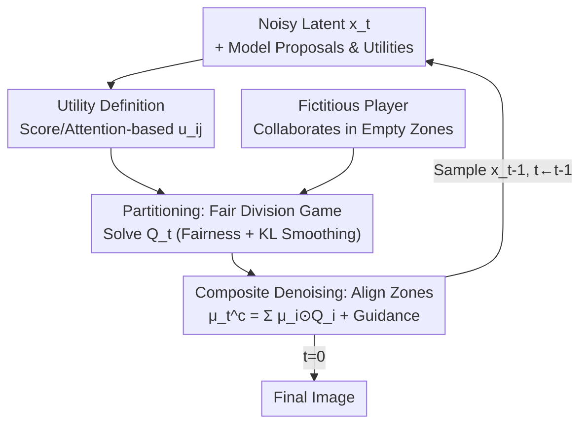

# Divide-and-Denoise: A Game-Theoretic Method for Fairly Composing Diffusion Models

**Conference**: ICML 2026  
**arXiv**: [2606.14756](https://arxiv.org/abs/2606.14756)  
**Code**: Not publicly available  
**Area**: Diffusion Models / Image Generation / Model Composition  
**Keywords**: Composition of Diffusion Models, Fair Division Game, Inference-time Guidance, Cross-attention Utility, Multi-concept Generation

## TL;DR
The paper models the "collaborative sampling of multiple pre-trained diffusion models" as a **fair division game**. At each step, game theory is utilized to assign specific image regions to each model (allocation), ensuring that the composite denoising respects these assigned zones. This allows combinations such as "single-dog model + single-cat model" to generate images containing both a dog and a cat without competing for the same space, all without requiring training or weight sharing. GenEval %images improved from 58% (MultiDiffusion) to 88.5%.

## Background & Motivation
**Background**: Pre-trained diffusion models have become abundant enough to be "assembled"—for instance, taking a model trained on dogs and another on cats to synthesize an image where both appear together. The mainstream approach involves analytical combinations of model distributions: Product/Mixture of Densities (Composable Diffusion), arithmetic averaging, logic AND, etc. These operations are simple to implement and offer analytical sampling.

**Limitations of Prior Work**: Analytical combinations are often too "crude," failing to preserve individual distribution features when conflicts arise. For example, if both models tend to place subjects in the center, their product density sampling often results in a **blurry overlap of dog and cat** in the center—leading to missing objects or attribute mismatch. Another path, **MultiDiffusion**, requires users to manually partition regions for prompts, which is labor-intensive for complex domains (like proteins) and **ignores the relative strengths/weaknesses of models**, while assuming models will faithfully obey the user-provided layout—a premise that frequently fails.

**Key Challenge**: The essence of composition lies in the unmanaged division of labor: "who is responsible for which part of the frame." Analytical combinations allow models to vote on every pixel simultaneously, leading to dominant models "eating" the whole image. Manual partitions are rigid and ignore model capabilities. Division must be both **efficient** (assigning models to regions they are good at) and **fair** (preventing one model from suppressing others and causing missing objects).

**Goal**: To **infer an online division scheme** during inference that maximizes efficiency while satisfying fairness constraints, without requiring shared weights, architectures, or training data, provided they operate in latent spaces of the same dimension.

**Core Idea**: Formulate the division as a **fair division** problem from game theory—each latent feature is a "good to be divided," and each diffusion model is a "player." Each step involves solving a utility maximization game with fairness constraints to obtain an allocation $Q$, then aligning the composite denoising with this allocation. The two processes (partitioning + composite denoising) evolve coupled over time.

## Method

### Overall Architecture
Divide-and-Denoise coordinates $n$ pre-trained diffusion models working in a shared latent space, treating latent variables as feature maps with $m$ features. The sampling process consists of **two coupled trajectories evolving synchronously**: one is the sampling path for the composite denoising process $\mathbf{x}_{t-1}\sim p^c_t(\cdot|\mathbf{x}_t)$, and the other is the allocation sequence $Q_t$ (where $Q_t$ represents the distribution of the $m$ features across the $n$ models).

Starting from $Q_T=\mathcal{U}(\mathbb{M}_{n,m})$ (uniform division, fair to all) and $p^c_T=\mathcal{N}(0,I)$, each time step performs a **bi-level optimization**: first update the allocation $Q_t=\arg\max_{Q\in\mathbb{Q}_t}\mathcal{G}_t(\mathbf{x}_t,Q)$ (maximizing efficiency within the fairness constraint set $\mathbb{Q}_t$), then select the denoising kernel $p^c_t=\arg\max_{p\in\mathbb{P}_t}\mathcal{F}_t(p,Q_t)$ (aligning denoising updates with this allocation), followed by sampling $\mathbf{x}_{t-1}$. Both sub-problems are linked by a common alignment score $U_t$. The method is **entirely training-free**.

### Key Designs

**1. Partitioning: Modeling Division as a Fair Allocation Game**

To address the "dominant model" problem, the paper models each step's division as a fair allocation game: $m$ latent features are the goods, and $n$ models are the players. The allocation $Q$ is represented in a **decomposable** form, equivalent to each model $i$ receiving a fractional weight $Q_{ij}\in[0,1]$ for each feature $j$ ($\sum_i Q_{ij}=1$). Efficiency is measured by the expected total utility $U_t(\mathbf{x},Q)=\mathbb{E}_{\mathbf{M}\sim Q}\sum_{i,j}\mathbf{M}_{i,j}u_{ij}(\mathbf{x},t)$, and the objective $\mathcal{G}_t$ includes a KL regularization to penalize abrupt changes between steps:

$$\mathcal{G}_t(\mathbf{x}_t,Q)=U_t(\mathbf{x}_t,Q)-\beta_t D_{\mathrm{KL}}(Q\,\|\,Q_{t+1}).$$

Fairness is formulated as **linear inequalities** within the constraint set $\mathbb{Q}_t$. Classical concepts like envy-free, proportional, and equitable can be expressed as $\mathbb{E}_{\mathbf{M}\sim Q}\sum \mathbf{M}_{i,j}\phi_{ij}\preceq \bm{b}$. The authors prove (Theorem 3.1) that the optimal $Q_t$ has a **closed-form softmax solution**:

$$Q^t_{ij}\propto \exp\!\big(-\langle\lambda^*,\phi_{ij}\rangle + u_{ij}/\beta_t\big)\,Q^{t+1}_{ij},$$

where $\lambda^*$ is derived from a low-dimensional dual problem. Figure 2 demonstrates that without fairness, a "car" model might receive far fewer pixels than a "bus" model, causing the car to disappear; with fairness, the allocation stabilizes both.

**2. Composite Denoising: Enforcing Responsibility Zones**

After obtaining the allocation $Q$, the second problem is how to "assemble" individual model proposals into a composite denoising kernel $p^c_t$. The objective $\mathcal{F}_t$ explicitly aligns each model's proposal with its assigned area:

$$\mathcal{F}_t(p,Q)=\mathbb{E}_{\mathbf{x}_{t-1}\sim p}U_{t-1}(\mathbf{x}_{t-1},Q)-\alpha_t\,\mathbb{E}_{\mathbf{M}\sim Q}\Big[\sum_{i,j}\mathbf{M}_{i,j}D_{\mathrm{KL}}(p_j\,\|\,p^i_j)\Big].$$

The authors provide a closed-form solution (Theorem 3.2), where the composite mean beautifully decomposes into a **combination term + guidance term**:

$$\mu^c_t=\sum_{i=1}^n\mu^i_t(\mathbf{x}_t)\odot Q_i+\frac{\sigma_t^2}{\alpha_t}\nabla_{\mathbf{x}_t}U_t(\mathbf{x}_t,Q),$$

where $\mu^i_t$ are individual model proposals and $Q_i$ are weight vectors. As $\alpha_t\to\infty$, this simplifies to MultiDiffusion, proving MultiDiffusion is a "hard division, zero guidance" special case of this framework.

**3. Utility Definitions: Measuring "Model Interest"**

Two training-free metrics for $u_{ij}$ are proposed. **Score-based utility** uses the energy ratio of Classified Free Guidance (CFG) score increments:

$$u_{ij}(\mathbf{x},t)=\frac{\|s^j_t(\mathbf{x},\bm{y}_i;\theta_i)-s^j_t(\mathbf{x};\theta_i)\|^2}{\|s_t(\mathbf{x},\bm{y}_i;\theta_i)-s_t(\mathbf{x};\theta_i)\|^2}.$$

**Attention-based utility** for text-to-image models uses normalized cross-attention maps $A^j_t$. Attention-based utility is observed to be less noisy and more temporally consistent.

**4. Fictitious Player: Encouraging Collaboration in Unwanted Zones**

Averaging-based combinations often produce "hybrid concepts" in low-utility regions, which can be leveraged to fill background gaps. A **fictitious player** is added, whose denoising kernel is the mean of all real models $\mu^{n+1}_t=\frac1n\sum_i\mu^i_t$, with a **uniform utility** $u_{(n+1)j}=1/m$. This player takes over regions no real model cares about, providing a collaborative background, while not being subject to fairness constraints.

## Key Experimental Results

### Main Results
Evaluated on GenEval (COCO vocabulary) and CLIP-Score / Reward / VQA using Stable Diffusion for 2-concept model composition:

| Strategy | GenEval %images ↑ | %prompts ↑ | CLIP(joint) ↑ | Reward(joint) ↑ | VQA(joint) ↑ |
|----------|-------------------|------------|---------------|-----------------|--------------|
| Averaging | 31.25% | 59% | 26.26 | −0.49 | 0.720 |
| Composable Diffusion | 36.50% | 67% | 26.85 | −0.26 | 0.749 |
| MultiDiffusion | 58.00% | 93% | 27.65 | 0.34 | 0.816 |
| **Ours** | **88.50%** | **99%** | **30.02** | **1.23** | **0.960** |

Ours significantly outperforms baselines: %images is 30% higher than MultiDiffusion, and the VQA score reaches 0.960.

### Ablation Study

| Config | GenEval %images | %prompts |
|------|-----------------|----------|
| **Ours (with fairness)** | **88.50%** | **99%** |
| Ours w/o fairness | 87.00% | 98% |
| MultiDiffusion | 58.00% | 93% |

### Key Findings
- **Value of Fairness**: Fairness prevents "object disappearance" caused by model dominance. While the average score jump is modest, qualitative results show it is crucial for preventing one model from monopolizing the frame.
- **Scalability**: As the number of models increases from 2 to 3, analytical methods (Averaging) collapse to nearly 0%, whereas Divide-and-Denoise maintains high performance.
- **Attention-based Advantage**: Cross-attention maps provide much cleaner localization signals than score-based gradients.

## Highlights & Insights
- **Game-Theoretic Perspective**: Translating "model composition" into a "fair division game" is an elegant shift. Division is no longer a manual box but an online optimization problem.
- **Unified Theory**: Proving MultiDiffusion as a special case ($\alpha\to\infty$) offers both a theoretical foundation and a technical explanation for its failures.
- **Training-Free Flexibility**: The method requires only matching latent dimensions, making it highly extensible for collaborative "expert" models without retraining.

## Limitations & Future Work
- **Latent Dimension Constraint**: Models must share the same latent space dimension, limiting the composition of heterogeneous model families.
- **Inference Overhead**: Solving the dual problem and computing gradients for guidance adds computational cost compared to simple analytical combinations.
- **Evaluated Scope**: Experiments focused primarily on 2-3 object images; performance in more complex relational scenes or non-image domains (like proteins) remains for future validation.

## Related Work & Insights
- **Ours vs. Analytical Combinations**: Composable Diffusion uses score products/sums, leading to "hybrid concepts." Ours partitions before denoising to ensure each region is managed by one specialized model.
- **Ours vs. Multi-Concept Models**: Rather than relying on a single "jack-of-all-trades" model, using a team of single-concept specialized "experts" coordinated by a game-theoretic division results in higher fidelity.

## Rating
- Novelty: ⭐⭐⭐⭐⭐ 
- Experimental Thoroughness: ⭐⭐⭐⭐ 
- Writing Quality: ⭐⭐⭐⭐ 
- Value: ⭐⭐⭐⭐ 

<!-- RELATED:START -->

- **MultiDiffusion**: Fusing Diffusion Paths for Controlled Image Generation (ICML 2023)
- **Composable Diffusion**: Compositional Visual Generation with Composable Diffusion Models (ECCV 2022)
- **GenEval**: An Object-Oriented Task for Evaluating Text-to-Image Synthesis (NeurIPS 2023)

<!-- RELATED:END -->

## Related Papers

- [\[CVPR 2026\] Back to Basics: Let Denoising Generative Models Denoise](../../CVPR2026/image_generation/back_to_basics_let_denoising_generative_models_denoise.md)
- [\[NeurIPS 2025\] Information-Theoretic Discrete Diffusion](../../NeurIPS2025/image_generation/information-theoretic_discrete_diffusion.md)
- [\[NeurIPS 2025\] Information Theoretic Learning for Diffusion Models with Warm Start](../../NeurIPS2025/image_generation/information_theoretic_learning_for_diffusion_models_with_warm_start.md)
- [\[ICML 2026\] Divide and Conquer: Reliable Multi-View Evidential Learning for Deepfake Detection](divide_and_conquer_reliable_multi-view_evidential_learning_for_deepfake_detectio.md)
- [\[CVPR 2025\] Composing Parts for Expressive Object Generation](../../CVPR2025/image_generation/composing_parts_for_expressive_object_generation.md)

<!-- RELATED:END -->
