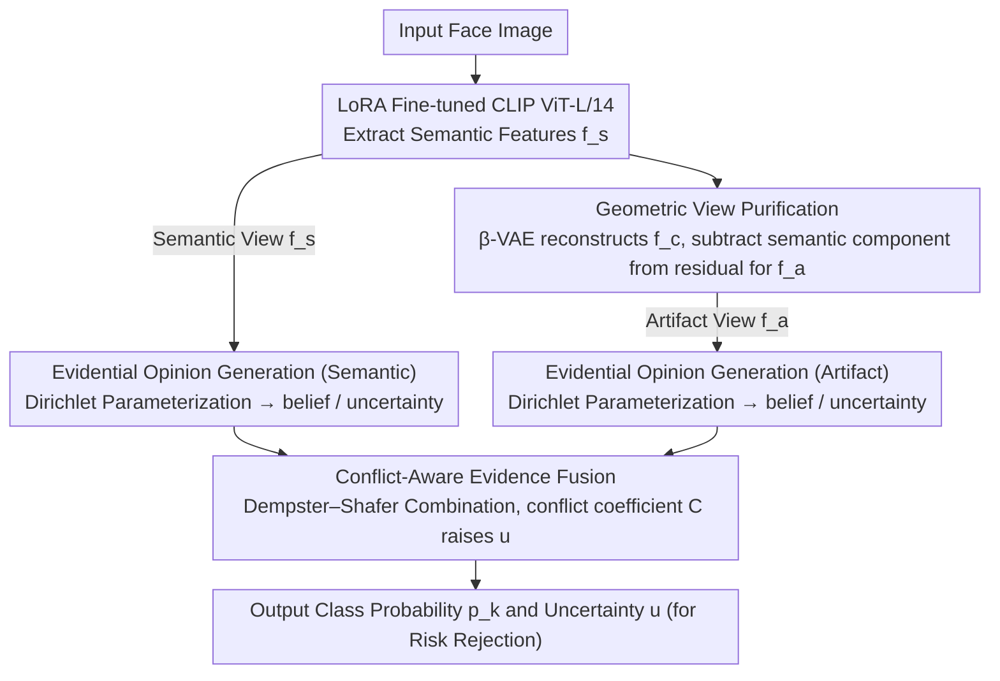

# Divide and Conquer: Reliable Multi-View Evidential Learning for Deepfake Detection

**Conference**: ICML 2026  
**arXiv**: [2606.01885](https://arxiv.org/abs/2606.01885)  
**Code**: https://github.com/kxl0825/DiCoME.git (Available)  
**Area**: AI Security / Deepfake Detection  
**Keywords**: Deepfake Detection, Multi-view Learning, Evidential Learning, Geometric Orthogonal Decomposition, Uncertainty Quantification

## TL;DR
This paper proposes the DiCoME framework, which uses geometric orthogonal projection to force the decoupling of CLIP semantic features and forgery artifact features into two complementary "expert views." It then employs Dempster–Shafer evidence fusion to explicitly model "epistemic conflict" between these views to output reliable uncertainty. The framework improves average AUC from 0.923 to 0.939 (cross-dataset) and 0.976 (cross-manipulation) on deepfake detection benchmarks.

## Background & Motivation

**Background**: With the advancement of GANs and diffusion models, deepfakes have become almost indistinguishable at the semantic level. The only forensic cues remaining are extremely faint structural abnormal traces. Current mainstream solutions follow a single-view holistic processing paradigm, using a backbone (increasingly visual foundation models like CLIP) to encode semantic content and forgery traces together into entangled representations, followed by Softmax binary classification.

**Limitations of Prior Work**: The authors characterize the failure mode of this paradigm as the **Semantic Masking Effect**—since visual backbones are inherently optimized for semantic invariance, high-amplitude semantic features like identity dominate the feature space ($\|f_s\| \gg \|f_a\|$), while faint artifact signals are ignored as shortcut noise during gradient descent. Consequently, models are overconfident on seen manipulations but collapse on unseen methods or cross-domain data, with Softmax disguising this collapse as high-confidence predictions.

**Key Challenge**: The essence of deepfake detection is "finding faint anomalies on strong semantic backgrounds." However, conventional backbones entangle the semantic and artifact dimensions. Feature-level fusion (e.g., RGB+Frequency, Global+Local) merely combines two highly correlated views—the so-called "Structure Expert" essentially repeats the "Content Expert," lacking true complementarity and failing to provide calibrated uncertainty during conflict. Previous efforts (ICML'25) attempted orthogonalization using SVD, but relied on global low-rank assumptions that are too coarse for sample-level subtle artifacts.

**Goal**: (1) Completely strip artifacts from semantics at the feature level to obtain two decorrelated and complementary pieces of evidence. (2) Explicitly model "conflict between two expert opinions" as high uncertainty at the decision level, rather than collapsing it into a false high-confidence prediction via Softmax.

**Key Insight**: Strictly define artifacts as the "orthogonal complement of the semantic subspace"—a hard geometric constraint more thorough than soft regularization (e.g., contrastive learning). Furthermore, leverage Subjective Logic to parametrize the output of each view as a Dirichlet distribution and use Dempster–Shafer theory to explicitly calculate the "conflict coefficient."

**Core Idea**: Use geometric orthogonal projection to subtract the semantic leakage from CLIP semantic residuals to obtain pure artifact views. Then, use evidence fusion to let the conflict between the two views directly increase epistemic uncertainty, allowing the model to "admit ignorance" in the face of unknown attacks.

## Method

### Overall Architecture
The core idea of DiCoME is "Divide and Conquer": rather than using a single backbone to encode semantics and artifacts together for classification, it first rigidly strips artifacts from semantics at the feature level into two decorrelated "expert views," then uses evidence theory to explicitly arbitrate the disagreement between experts at the decision level. This is implemented as a two-stage pipeline: in the **Divide** stage, a LoRA-fine-tuned CLIP ViT-L/14 extracts semantic features $f_s$, which are geometrically purified to obtain pure artifact features $f_a$; in the **Conquer** stage, $f_s$ and $f_a$ are each fed into an evidential head to be transformed into subjective opinions with uncertainty, which are then fused using Dempster–Shafer combination rules to output class probabilities $p_k = b_k + u/K$ and uncertainty $u$ for risk rejection.

### Key Designs

**1. Geometric View Purification: Defining Artifacts as Semantic Orthogonal Complements**

This addresses the Semantic Masking Effect—signals in CLIP residuals that appear to be anomalies often contain significant semantic leakage. Previous methods like attention guidance in FDML or global SVD in Effort are either soft constraints or coarse global low-rank assumptions, failing to guarantee decorrelation per sample. DiCoME first uses a lightweight $\beta$-VAE in the CLIP feature space (rather than pixel space) to reconstruct $f_s$ into a "semantic manifold version" $f_c$. Reconstruction uses cosine alignment $\mathcal{L}_{align} = 1 - \cos(f_s, f_c)$ instead of $\ell_2$, as CLIP embeddings are on a hypersphere where information is encoded in direction. After obtaining the raw residual $f_r = f_s - f_c$, the component along the direction of $f_s$ is subtracted according to the vector projection theorem: $f_r^{\parallel} = \frac{\langle f_r, f_s \rangle}{\|f_s\|_2^2} f_s$, yielding $f_a = f_r - f_r^{\parallel}$. This ensures $\langle f_a, f_s \rangle = 0$, meaning $f_a$ lies in the orthogonal complement $S^{\perp}$ of the semantic subspace. Implementing "Artifacts = Semantic Orthogonal Complement" as a hard geometric constraint grants the Structure Expert a feature space immune to semantic interference, fundamentally resolving the Semantic Masking Effect.

**2. Evidential Opinion Generation: Explicitly Encoding "Amount of Evidence" via Dirichlet Parameterization**

The issue with Softmax is that it collapses "insufficient evidence" and "conflicting evidence"—two fundamentally different types of uncertainty—into the same confidence score, leading to overconfidence on unseen attacks. DiCoME adopts Subjective Logic: for view $v \in \{1,2\}$, an evidential head outputs non-negative evidence $e^v = \text{Softplus}(W^v f_v + C^v)$, forming Dirichlet parameters $\alpha_k^v = e_k^v + 1$ and total strength $S^v = \sum_k \alpha_k^v$. This derives belief $b_k^v = e_k^v / S^v$ and uncertainty $u^v = K/S^v$, satisfying $\sum_k b_k^v + u^v = 1$. When a view lacks discriminative evidence, $e_k \to 0$ and $u^v \to 1$, allowing the model to say "I don't know." The "amount of evidence" is explicitly encoded in $S^v$.

**3. Conflict-Aware Evidence Fusion: Raising Uncertainty via Expert Disagreement**

Common mean or concatenation fusion tends to "average out" conflict, making models more confident on hard samples. DiCoME uses the Dempster–Shafer combination rule $T^1 \oplus T^2$: $b_k = \frac{1}{1-\mathcal{C}}(b_k^1 b_k^2 + b_k^1 u^2 + b_k^2 u^1)$ and $u = \frac{u^1 u^2}{1-\mathcal{C}}$, where the conflict coefficient $\mathcal{C} = \sum_{i \ne j} b_i^1 b_j^2$ quantifies the disagreement. This rule handles three scenarios: when both views are confident and consistent, $b_k^1 b_k^2$ dominates, amplifying the fused belief while $u$ decays (consistent amplification); when one is confident and the other is ignorant, the cross-term $b_k^1 u^2$ lets the confident view "vote" (knowledge complementarity); when views conflict, $\mathcal{C}$ increases significantly, suppressing belief and raising $u$ to provide a rejection signal (conflict awareness).

### Loss & Training
Total loss $\mathcal{L}_{total} = \mathcal{L}_{edl} + \lambda_{vae} \mathcal{L}_{vae}$, where $\mathcal{L}_{vae} = \mathcal{L}_{align} + \beta \mathcal{L}_{kld}$. $\mathcal{L}_{align} = 1 - \cos(f_s, f_c)$ forces the $\beta$-VAE to align CLIP features in terms of angle rather than magnitude. $\mathcal{L}_{kld}$ is the standard Gaussian prior KL. Backbone: CLIP ViT-L/14 with LoRA; AdamW lr=1e-4, batch 128, A100 GPU. Trained only on FaceForensics++ c23 and zero-shot transferred to all evaluation sets; video-level AUC used for inference.

## Key Experimental Results

### Main Results
Comparison with 12 baselines across 6 cross-datasets and 8 cross-manipulations (DF40 subset).

| Evaluation Setup | Metric | DiCoME | Effort (ICML'25) | GenD (WACV'26) | ProDet (NIPS'24) |
|----------|------|--------|------------------|----------------|------------------|
| Cross-dataset Avg AUC | video AUC | **0.939** | 0.907 | 0.923 | 0.821 |
| Cross-manipulation Avg AUC | video AUC | **0.976** | 0.940 | 0.958 | 0.867 |
| CDFv2 | video AUC | **0.977** | 0.956 | 0.960 | 0.926 |
| DFDC | video AUC | **0.882** | 0.843 | 0.871 | 0.707 |
| DFo | video AUC | **0.993** | 0.977 | 0.989 | 0.879 |

Cross-dataset Avg is 1.6 points higher than the runner-up GenD; cross-manipulation is 1.8 points higher. The improvement on the most difficult DFDC dataset reaches nearly 4 points.

### Ablation Study

| Sub-table | Configuration | CDFv2 | DFDC | MFS | Avg |
|------|------|-------|------|-----|-----|
| (a) | (A) $f_s$ only (Single-view CLIP) | 0.927 | 0.856 | 0.933 | 0.905 |
| (a) | (B) $f_s + f_s$ (Two copies, no new view) | 0.954 | 0.867 | 0.929 | 0.917 |
| (a) | (C) $f_s + f_r$ (Raw residual, no orthog.) | 0.956 | 0.860 | 0.951 | 0.922 |
| (a) | **Ours $f_s + f_a$ (Orthogonal purification)** | **0.977** | **0.882** | **0.956** | **0.938** |
| (b) | (D) $\mathcal{L}_{ce}$ + Mean Fusion | 0.956 | 0.874 | 0.942 | 0.924 |
| (b) | (E) $\mathcal{L}_{edl}$ + Mean Fusion | 0.961 | 0.878 | 0.941 | 0.927 |
| (b) | **Ours $\mathcal{L}_{edl}$ + DS-Conflict** | **0.977** | **0.882** | **0.956** | **0.938** |

### Key Findings
- **Orthogonal projection is the largest contributor**: (a) shows that geometric orthogonalization (C $\to$ Ours) raises Avg AUC from 0.922 to 0.938 (+1.6), proving raw residuals $f_r$ leak significant semantics.
- **DS fusion outperforms Mean**: (b) shows DS-Conflict adds 1.1 points over EDL+Mean; the gain comes from the explicit logic of handling evidence conflict.
- **Angular Alignment > Magnitude Alignment**: Removing $\mathcal{L}_{align}$ causes a larger drop than removing KL, confirming that $\ell_2$ reconstruction is biased by non-semantic magnitude perturbations in CLIP's spherical embeddings.
- **Uncertainty is actionable**: Risk-coverage curves show that rejecting the 10% most uncertain samples in DFD leads to significant precision gains.

## Highlights & Insights
- **Strict geometric definition of "artifacts"**: Using the orthogonal complement as a hard constraint is cleaner than attention guidance or contrastive decoupling. It holds per-sample and is implemented as a single vector projection line.
- **Conflict as Uncertainty**: DS fusion transforms expert disagreement into a well-defined uncertainty source (conflict coefficient $\mathcal{C}$), which is ideal for unseen attack detection.
- **Feature-space VAE reconstruction**: Reconstructing in CLIP feature space avoids the difficulty of pixel-space VAEs and leverages pre-compressed semantic priors.
- **Zero-shot robustness**: All improvements are obtained via zero-shot transfer from a single domain (FF++), which best reflects real-world generalization capability.

## Limitations & Future Work
- **Orthogonalization based on a single direction $f_s$**: Collapsing the entire semantic subspace into one vector is a coarse approximation for complex semantic factors (identity, expression, lighting).
- **VAE reconstruction quality is critical**: If $f_c$ reconstruction is insufficient, non-semantic noise will be sent to the Structure Expert.
- **Facial focus**: The method hasn't been evaluated on full-body deepfakes or temporal artifacts in video.
- **Binary classification constraints**: The advantages of DS fusion's conflict awareness are somewhat limited in $K=2$ cases; extension to multi-class forgery source identification would be more effective.

## Related Work & Insights
- **vs Effort (ICML'25)**: Both use orthogonal decomposition, but Effort imposes uniform global low-rank via SVD, losing sample-level details. DiCoME uses per-sample projection and evidential uncertainty.
- **vs RECCE**: RECCE reconstructs in pixel space, which is hard to train for high resolution and less robust to compression. DiCoME operates in the CLIP feature space.
- **vs Evidential Deep Learning (EDL)**: While standard EDL is a single-view uncertainty tool, DiCoME upgrades it into a multi-view evidence conflict arbitrator.

## Rating
- Novelty: ⭐⭐⭐⭐ 
- Experimental Thoroughness: ⭐⭐⭐⭐⭐ 
- Writing Quality: ⭐⭐⭐⭐ 
- Value: ⭐⭐⭐⭐⭐ 

<!-- RELATED:START -->

## Related Papers

- [\[ICML 2026\] From Talking to Singing: A New Challenge for Audio-Visual Deepfake Detection](from_talking_to_singing_a_new_challenge_for_audio-visual_deepfake_detection.md)
- [\[CVPR 2025\] Divide and Conquer: Heterogeneous Noise Integration for Diffusion-based Adversarial Purification](../../CVPR2025/image_generation/divide_and_conquer_heterogeneous_noise_integration_for_diffusion-based_adversari.md)
- [\[ICML 2026\] ViewMask-1-to-3: Multi-View Consistent Image Generation via Multimodal Discrete Diffusion Models](viewmask-1-to-3_multi-view_consistent_image_generation_via_multimodal_discrete_d.md)
- [\[ICML 2026\] Gradient Preconditioning for Efficient and Reliable Reward-Guided Generation](gradient_preconditioning_for_efficient_and_reliable_reward-guided_generation.md)
- [\[ICML 2026\] Offline Multi-agent Reinforcement Learning via Sequential Score Decomposition](offline_multi-agent_reinforcement_learning_via_sequential_score_decomposition.md)

<!-- RELATED:END -->
