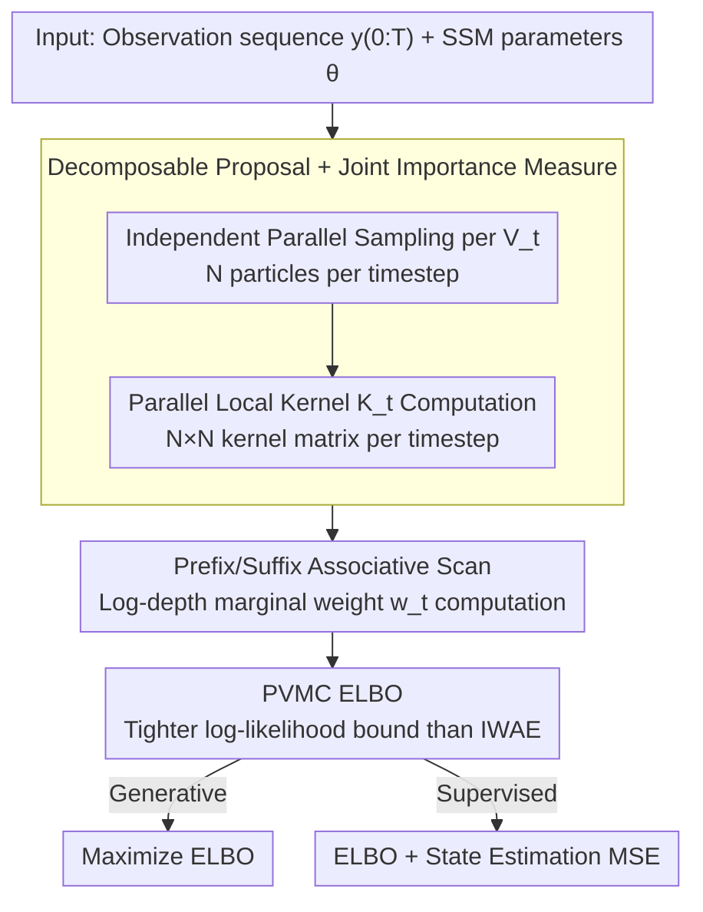

# Efficient Learning of Deep State Space Models via Importance Smoothing

**Conference**: ICML 2026  
**arXiv**: [2605.21108](https://arxiv.org/abs/2605.21108)  
**Code**: https://github.com/John-JoB/parallel-variational-sequential-monte-carlo (Available)  
**Area**: Time Series / Probabilistic Deep Learning / State Space Models  
**Keywords**: Deep State Space Models, Sequential Monte Carlo, Importance Smoothing, Parallel prefix scan, Variational Inference

## TL;DR
This paper proposes Parallel Variational Monte Carlo (PVMC), which utilizes prefix/suffix associative scans to compute the importance-weighted marginal smoothing distributions of Deep State Space Models (DSSM) within an $\mathcal{O}(\log N \times \log T)$ span. Supporting both supervised state estimation and generative modeling, it achieves approximately 10× speedup over the fastest differentiable SMC baselines while providing higher accuracy.

## Background & Motivation

**Background**: Deep State Space Models (DSSM) parameterize the transition kernel $M_t$ and observation kernel $H_t$ using neural networks, serving as primary tools for time-series modeling in finance, ecology, target tracking, and neuroscience. Training typically follows two divergent paths: (a) treating the entire trajectory as a latent variable $\tilde{x}=x_{0:T}$ and training via an IWAE-style ELBO (auto-encoding DSSM); (b) formulating Sequential Monte Carlo (SMC) as a differentiable operator and training via backpropagation through particle importance weights (differentiable SMC, DSMC).

**Limitations of Prior Work**: Both paths face significant drawbacks. The VAE-style approach is fully parallelizable but (i) lacks support for supervised losses—its encoder processes $y_{0:T}$ and cannot output a particle distribution at each timestep for ground-truth state comparison; (ii) its ELBO is a loose upper bound based on "importance weighting a single trajectory," failing to exploit the exponential trajectory space formed by particle combinations across timesteps. The DSMC approach provides valid marginal filtering posteriors for supervised losses (MSE / KNLL), but its core operator, resampling, introduces global dependencies across particles. This forces sequential forward passes, requiring biased reinforcement gradients, sacrificing unbiasedness for low variance, or introducing expensive differentiable relaxations (e.g., Diffusion DPF, which takes ~150× longer to train than PVMC in Table 2).

**Key Challenge**: To simultaneously achieve parallelism, supervision support, tight variational lower bounds, and unbiased gradients. The VAE approach sacrifices supervision and tight bounds, while DSMC sacrifices parallelism and (in some methods) unbiasedness. This work aims to satisfy all four criteria.

**Goal**: Construct an end-to-end differentiable estimator that enables parallel training like VAEs, outputs marginal smoothing posteriors $Q_t(x_t \mid y_{0:T})$ at each timestep like DSMC, and provides a tighter ELBO than IWAE.

**Key Insight**: The authors observe that by fully decoupling "sampling" and "weighting"—using a proposal that is completely factorizable across time $V_{0:T}(x_{0:T}\mid y_{0:T})=\prod_t V_t(x_t\mid y_{0:T})$—sampling becomes inherently parallel. The remaining marginal weights $w_t^n$ take the form of a summation over particle indices at all other timesteps. This summation structure constitutes a "forward-backward" chain tensor product, which can be solved via **associative prefix/suffix scans**. In other words, the sequential "resampling dependency" in SMC is replaced by a "re-summation dependency," where the latter satisfies associativity and allows log-depth parallelism.

**Core Idea**: Replace particle filtering resampling with a **decomposable proposal + importance smoothing over temporal associative scans**, resulting in a DSSM training algorithm with $\mathcal{O}(\log N \times \log T)$ span complexity, unbiased gradients, and an ELBO strictly tighter than IWAE.

## Method

### Overall Architecture
PVMC addresses the trade-off dilemma in DSSM training by replacing the sequential resampling found in particle filters with a time-decomposable proposal and associative scans. Given a parameterized SSM ($x_0\sim P$, $x_t\sim M_t(\cdot\mid x_{t-1})$, $y_t\sim H_t(\cdot\mid x_t)$) and a neural network proposal $V_t(\cdot\mid y_{0:T})$, the model consumes an observation sequence $y_{0:T}$ and parameters $\theta$, producing weighted particle sets $\{(X_t^n, w_t^n)\}$ and likelihood estimates $\hat L^N$ at every timestep. By decoupling sampling and weighting into "independent parallel sampling + chain tensor product summation," both forward and backward passes maintain an $\mathcal{O}(\log N\times\log T)$ span.

### Key Designs

**1. Decomposable Proposal + Joint Importance Measure: Replacing Serial Dependencies with Associative Summation**

The root of DSMC's serial nature is that resampling makes the proposal at time $t$ dependent on all particles at $t-1$. Conversely, VAE bounds are loose because they only weight $N$ trajectories instead of an exponential trajectory space. This work adopts a transverse factorization $V_{0:T}=\prod_t V_t(x_t\mid y_{0:T})$, enabling independent parallel sampling. By defining local importance kernels $K_t(X_t^{n_t}, X_{t-1}^{n_{t-1}}) = M_t H_t / V_t$ along a "trajectory index" $(n_0, \dots, n_T)$, the product of $K_t$ across all indices yields the likelihood estimate $\hat L^N = \frac{1}{N^{T+1}}\sum_{n_0,\dots,n_T}\prod_t K_t$ (Eq. 19). Summing over all indices except $n_t$ provides the marginal weight $w_t^{n_t}$ at time $t$ (Eq. 18). This is equivalent to a joint importance measure $Q_{0:T}^N$ weighting all $N^{T+1}$ possible trajectories, where the temporal marginal $Q_t^N$ is an unbiased estimator of the marginal smoothing posterior. The paper proves $\hat L^N$ is unbiased for $p(y_{0:T})$ (Prop 3.1) and converges at $\mathcal{O}_P(N^{-1/2})$ (Prop 3.2-3.3). This approach bypasses both the serial bottleneck of DSMC and the loose bounds of VAE-style methods.

**2. Prefix/Suffix Associative Scan: Translating Forward-Backward to Hardware Parallel Scans**

Marginalization involves a summation over $n_{-t}$ indices, which appears to require $N^T$ operations. However, the chain structure of $\prod_t K_t$ makes index summation equivalent to matrix-matrix multiplication. Since matrix multiplication is associative, it can be executed in log-depth using Blelloch-style scans. Specifically, kernel matrices of adjacent timesteps are grouped into semigroup elements $a_s=(\{K_{2s}\}, \{K_{2s+1}\})\in\mathbb{R}^{N\times N}\times\mathbb{R}^{N\times N}$ with an associative operator $(C_1, C_2)\oplus(D_1, D_2):=(C_1, C_2 D_1 D_2)$ (Eq. 20). After a prefix scan $b_s$ and suffix scan $\hat b_s$, the marginal weights $w_t^i$ are extracted in closed form via Theorem 3.1 (Eq. 22). The span for two $N\times N$ matrix multiplications is $\mathcal{O}(\log N)$, and the scan contributes $\mathcal{O}(\log T)$, resulting in a total span of $\mathcal{O}(\log N\times\log T)$. Backpropagation proceeds through the same scan tree with identical depth. This effectively maps the sequential forward-backward inference onto GPU prefix scans.

**3. PVMC ELBO: Tighter Bounds Without Increasing Sampling Overhead**

The training objective is defined as $\mathcal{L}^N_{\text{PVMC}} = \mathbb{E}[\log\hat L^N]$. By Jensen’s inequality, this remains a lower bound on $\log p(y_{0:T})$, but it is strictly tighter. Intuitively, IWAE's summation $\frac{1}{N}\sum_n\prod_t K_t(X_t^n, X_{t-1}^n)$ only weights $N$ "diagonal" trajectories, while PVMC's $\hat L^N$ weights all $N^{T+1}$ particle combinations, resulting in a smaller Jensen gap. Theorem 3.2 establishes the hierarchy: $\log p \geq \mathcal{L}^N_{\text{PVMC}} \geq \mathcal{L}^N_{\text{IWAE}} \geq \mathcal{L}^{\tilde N}_{\text{IWAE}} \geq \mathcal{L}^N_{\text{P-VAE}}=\mathcal{L}^N_{\text{VAE}}$ (Eq. 29). Furthermore, the PVMC bound monotonically tightens with $N$ (Eq. 30). Tighter bounds lead to better likelihoods in generative tasks and more stable gradients for supervised tasks. Ablation studies (Table 2) show that P-VAE (same architecture as PVMC but VAE-style objective) deteriorates filtering MSE from 0.40 to 1.21, highlighting the importance of the PVMC objective for learning self-consistent DSSMs.

### Loss & Training
Generative modeling maximizes $\mathcal{L}^N_{\text{PVMC}} = \mathbb{E}[\log\hat L^N]$. Supervised learning minimizes $-\mathcal{L}^N_{\text{PVMC}} + \beta\sum_t\|\sum_n w_t^n X_t^n - x_t^\star\|^2$, combining the ELBO with state estimation MSE. Because the proposal is factorizable and uses reparameterized sampling via $V_t$, the entire pipeline provides unbiased gradients, unlike DSMC methods requiring REINFORCE or relaxed resampling. Implementation is based on PyDPF (Brady et al., 2025) and executed on an NVIDIA RTX 4090.

## Key Experimental Results

### Main Results

**Linear Gaussian System** (5D state, compared against analytical RTS smoother):

| Method | $e_x$ (vs RTS mean) | Time (s) | KSD |
|------|-----------------------|----------|-----|
| Kalman Filter | 0.132 | 0.13 | — |
| TFS (Two-Filter Smoother) | 0.501 | 25.9 | 0.410 |
| d-SMC | 0.44 | 4.00 | 2.21 |
| **PVMC (Kalman proposal)** | **0.054** | **1.88** | **0.200** |
| **PVMC (learned proposal)** | **0.052** | **1.50** | **0.199** |

The learned neural proposal matches the analytical Kalman proposal, validating that the PVMC ELBO effectively learns high-quality proposals.

**Prey-Predator Supervised State Estimation** (256-step stochastic Lotka-Volterra with Poisson observations):

| Method | MSE | Filtering MSE | 2-SWD | Time (m:s) | Failures (/20) |
|------|-----|---------------|-------|------------|----------------|
| Stop-gradient DPF | 0.83±0.50 | 0.72±0.46 | 14.8±9.4 | 16:27 | 2 |
| Soft DPF | 0.62±0.42 | 0.58±0.42 | 6.70±4.30 | 15:32 | 7 |
| Diffusion DPF | 0.52±0.22 | 0.56±0.16 | 10.2±4.28 | **267:10** | 0 |
| MDPS | 1.20±0.55 | 1.32±0.64 | 13.5±10.0 | 26:23 | 14 |
| P-VAE Ablation | 0.43±0.06 | 1.21±0.11 | 20.9±2.6 | 1:49 | 0 |
| **PVMC** | **0.32±0.04** | **0.40±0.03** | **2.96±0.74** | **1:49** | **0** |

PVMC achieves convergence in all 20 runs with optimal metrics across the board; training is ~10× faster than Soft DPF and ~150× faster than Diffusion DPF.

**Financial Time Series Generation** (SPX daily returns, 120-day window, 2014-2024): PVMC best captures the short-term autocorrelation structure of $|return|$ and squared returns compared to SPX ground truth. DMM and Soft-DPF fail to learn volatility clustering, while P-VAE and TC-VAE underestimate skewness and kurtosis.

### Ablation Study

| Configuration | MSE | Filtering MSE | 2-SWD | Note |
|------|-----|---------------|-------|------|
| PVMC (Full) | 0.32 | 0.40 | 2.96 | ELBO + scan |
| P-VAE (VAE-style loss) | 0.43 | 1.21 | 20.9 | Same sampler/architecture, different loss |
| PVMC (Kalman proposal) | 0.054 ($e_x$) | — | 0.200 (KSD) | Analytical proposal |
| PVMC (learned proposal) | 0.052 ($e_x$) | — | 0.199 (KSD) | Default |

### Key Findings
- **Value of Tight Bounds**: P-VAE performs reasonably in supervised MSE (0.43) but fails in filtering MSE (1.21) and 2-SWD (20.9). This indicates that loose bounds yield DSSMs that collapse when reused with standard particle filters. The PVMC ELBO is essential for learning self-consistent models.
- **Parallel vs. Sequential**: Soft / Stop-grad / Diffusion / MDPS all require temporal resampling, resulting in training times of 15-267 minutes per epoch; PVMC requires only 1:49.
- **Training Stability**: PVMC had zero failures out of 20 runs, compared to 2/7/14 for DPF variants. This is attributed to unbiased gradients and the absence of REINFORCE through discrete resampling.
- **Learned vs. Analytical Proposals**: In linear-Gaussian settings, PVMC with a learned proposal matches the analytical Kalman proposal, demonstrating that the ELBO signal is sufficient to bypass structural prior knowledge.

## Highlights & Insights
- **Associative scan as a replacement for forward-backward**: The core of smoothing algorithms is the chain tensor product. As long as the proposal is decomposable, the chain product is a scan on a semigroup, making it hardware-friendly. This maps Bayesian inference onto GPU prefix scans for various chain models (HMM, CRF, etc.).
- **Underestimated potential of factorizable proposals**: DSMC often assumes proposals must depend on previous particles. By removing this requirement, PVMC gains parallelism and a tighter ELBO by spanning $N^{T+1}$ potential trajectories.
- **Clear theoretical hierarchy**: The progression from VAE → IWAE → PVMC represents successive tightening of bounds via particle combinations, allowing PVMC to achieve tighter bounds without additional sampling costs.
- **SSM reuse as a robustness metric**: Reporting both learning-time MSE and filtering MSE (using a bootstrap PF with the learned SSM) exposes models like P-VAE which fail to generalize across different inference engines.

## Limitations & Future Work
- The current factorizable proposal limitation might hinder quality in sequences with extremely strong long-range dependencies, requiring research into structured inference models.
- Memory complexity increases with $\mathcal{O}(N^2 T)$ due to storing $N\times N$ kernel matrices per timestep, imposing a trade-off on particle count $N$.
- Financial experiments lack downstream utilities (e.g., portfolio backtesting), focusing only on distributional moments.
- Future work could extend to non-factorizable proposals, auxiliary PF adaptations, or integrating scan frameworks with deterministic SSMs like S4/Mamba for probabilistic extensions.

## Related Work & Insights
- **vs Differentiable SMC**: DPFs soften resampling for differentiability but remain sequential; PVMC achieves 10-100× speedups with unbiased gradients.
- **vs MDPS**: MDPS uses dual filter fusion but retains biased gradients; PVMC provides consistent estimates via joint smoothing measures.
- **vs VAE-style DSSM**: VAE routes lack particle interaction and bound tightness; PVMC enables particle interaction through weights (not resampling) and supports per-step supervision.
- **vs Affine/Gaussian Parallel Smoothers**: Previous methods required linear-Gaussian structures; PVMC generalizes scans to non-linear and non-Gaussian SSMs via importance weighting.

## Rating
- Novelty: ⭐⭐⭐⭐⭐ The first end-to-end differentiable, unbiased, log-depth parallel particle smoother that bridges the VAE and DSMC paradigms.
- Experimental Thoroughness: ⭐⭐⭐⭐ Broad coverage across three difficulty levels; however, it lacks a systematic report on the N/T scaling trade-off and downstream financial metrics.
- Writing Quality: ⭐⭐⭐⭐⭐ Extremely clear presentation of theory and algorithms; excellent visualizations of sampling-weighting structures.
- Value: ⭐⭐⭐⭐⭐ Significant boost in speed/stability/accuracy for DSSM modeling in finance, ecology, and SLAM; the open-source code facilitates immediate adoption.

<!-- RELATED:START -->

## Related Papers

- [\[CVPR 2026\] Smoothing the Score Function to Enhance Generalization in Diffusion Models](../../CVPR2026/image_generation/smoothing_the_score_function_to_enhance_generalization_in_diffusion_models.md)
- [\[ICML 2025\] Importance Sampling for Nonlinear Models](../../ICML2025/image_generation/importance_sampling_for_nonlinear_models.md)
- [\[ICLR 2026\] Inference-Time Scaling of Discrete Diffusion Models via Importance Weighting and Optimal Proposal Design](../../ICLR2026/image_generation/inference-time_scaling_of_discrete_diffusion_models_via_importance_weighting_and.md)
- [\[CVPR 2025\] SaMam: Style-aware State Space Model for Arbitrary Image Style Transfer](../../CVPR2025/image_generation/samam_style-aware_state_space_model_for_arbitrary_image_style_transfer.md)
- [\[ICML 2026\] Spectral Guidance for Flexible and Efficient Control of Diffusion Models](spectral_guidance_for_flexible_and_efficient_control_of_diffusion_models.md)

<!-- RELATED:END -->
