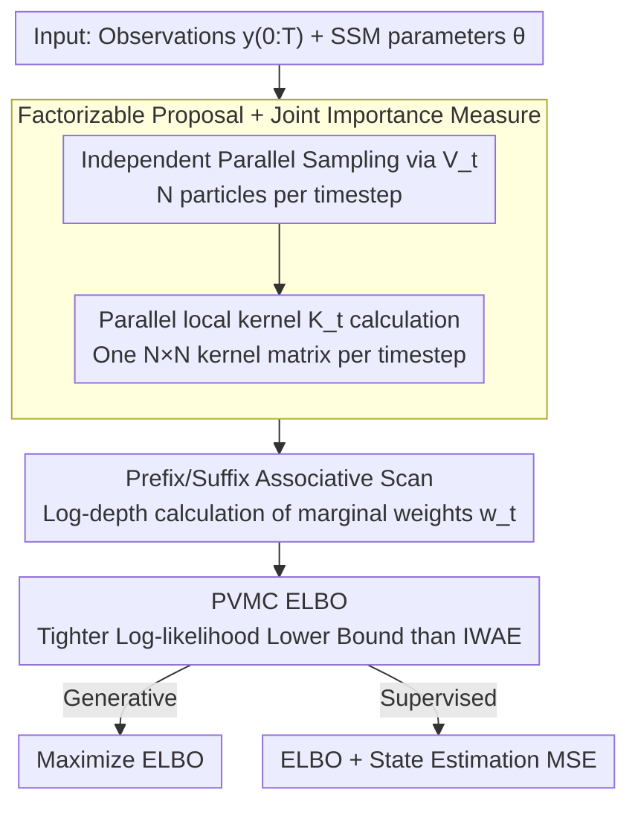

# Efficient Learning of Deep State Space Models via Importance Smoothing

**Conference**: ICML 2026  
**arXiv**: [2605.21108](https://arxiv.org/abs/2605.21108)  
**Code**: https://github.com/John-JoB/parallel-variational-sequential-monte-carlo (Available)  
**Area**: Time Series / Probabilistic Deep Learning / State Space Models  
**Keywords**: Deep State Space Models, Sequential Monte Carlo, Importance Smoothing, Parallel prefix scan, Variational Inference

## TL;DR
This paper proposes Parallel Variational Monte Carlo (PVMC), which leverages prefix/suffix associative scans to compute importance-weighted marginal smoothing distributions for Deep State Space Models (DSSM) within an $\mathcal{O}(\log N \times \log T)$ span. Supporting both supervised state estimation and generative modeling, it is approximately 10× faster than the quickest differentiable SMC baselines while achieving higher accuracy.

## Background & Motivation

**Background**: Deep State Space Models (DSSM) parameterize transition kernels $M_t$ and observation kernels $H_t$ using neural networks, serving as primary tools for time-series modeling in finance, ecology, object tracking, and neuroscience. Training typically follows two divergent paths: (a) treating the entire trajectory as a latent variable $\tilde{x}=x_{0:T}$ in a VAE and training with IWAE-style ELBO (auto-encoding DSSM); (b) implementing sequential Monte Carlo (SMC) as differentiable operators, training via backpropagation through particle weights (differentiable SMC, DSMC).

**Limitations of Prior Work**: Both routes face significant hurdles. The VAE route, while fully parallelizable, (i) lacks support for supervised losses—its encoder sees $y_{0:T}$ and cannot output a particle distribution per timestep for ground-truth comparison; (ii) its ELBO is a loose upper bound based on "importance weighting a single trajectory," failing to utilize the exponential trajectory space formed by particle combinations across timesteps. The DSMC route provides reasonable marginal filtering posteriors for supervised losses (MSE / KNLL), but its core "resampling" operator introduces global dependencies across particles, forcing sequential forward passes. This necessitates either biased gradient estimation via Reinforce, sacrificing unbiasedness for low variance, or introducing differentiable relaxations that incur extreme computational overhead (e.g., Diffusion DPF's training time in Table 2 is ~150x that of PVMC).

**Key Challenge**: Achieving the coexistence of "parallelism + supervision + tight variational bounds + unbiased gradients." The VAE route sacrifices supervision and tight bounds, while the DSMC route sacrifices parallelism and (in some methods) unbiasedness. This paper aims to reconcile all four requirements.

**Goal**: Construct an end-to-end differentiable estimator that enables parallel training like VAEs, outputs marginal smoothing posteriors $Q_t(x_t \mid y_{0:T})$ for each timestep like DSMC, and provides an ELBO strictly tighter than IWAE.

**Key Insight**: The authors observe that if "sampling" and "weighting" are completely decoupled—by making the proposal fully factorizable in the time dimension $V_{0:T}(x_{0:T}\mid y_{0:T})=\prod_t V_t(x_t\mid y_{0:T})$—sampling becomes inherently parallel. The remaining marginal weights $w_t^n$ take the form of a summation over particle indices from all other timesteps. This summation structure represents a "forward × backward" chain tensor product, which can be optimized using **associative prefix/suffix scans**. In other words, replacing the sequential "resampling dependency" in SMC with a "re-summation dependency" allows for log-depth parallelism due to the associative property.

**Core Idea**: Replace particle filtering resampling with a **factorizable proposal + importance smoothing over temporal associative scans**, resulting in a DSSM training algorithm with $\mathcal{O}(\log N \times \log T)$ span complexity, unbiased gradients, and an ELBO strictly tighter than IWAE.

## Method

### Overall Architecture
PVMC addresses the "parallelism vs. supervision vs. tightness vs. unbiasedness" quadrant by removing the sequential resampling step of particle filters. It uses a time-factorized proposal combined with an associative scan. Given a parameterized SSM ($x_0\sim P$, $x_t\sim M_t(\cdot\mid x_{t-1})$, $y_t\sim H_t(\cdot\mid x_t)$) and a neural proposal $V_t(\cdot\mid y_{0:T})$, it processes the observation sequence $y_{0:T}$ and parameters $\theta$ to output weighted particle sets $\{(X_t^n, w_t^n)\}$ and likelihood estimates $\hat L^N$. Since sampling and weighting are decoupled into "independent parallel sampling + chain tensor product summation," both forward and backward passes maintain a span of $\mathcal{O}(\log N\times\log T)$.

### Key Designs

**1. Factorizable Proposal + Joint Importance Measure: Replacing Sequential Dependency with Associative Summation**

The root cause of DSMC's serial nature is that resampling makes the proposal at $t$ dependent on all particles at $t-1$. Conversely, VAE bounds are loose because they weight only $N$ trajectories rather than an exponential trajectory space. PVMC adopts a horizontal factorization $V_{0:T}=\prod_t V_t(x_t\mid y_{0:T})$, enabling independent parallel sampling. It defines a local importance kernel $K_t(X_t^{n_t}, X_{t-1}^{n_{t-1}}) = M_t H_t / V_t$. By product-chaining $K_t$ along a "trajectory index" $(n_0,\dots,n_T)$ and summing over all index combinations, one obtains the likelihood estimate $\hat L^N = \frac{1}{N^{T+1}}\sum_{n_0,\dots,n_T}\prod_t K_t$ (Eq. 19). Summing over all indices except $n_t$ yields the marginal weight $w_t^{n_t}$ (Eq. 18). This is equivalent to weighting all $N^{T+1}$ possible trajectories simultaneously. The temporal marginal $Q_t^N$ provides an unbiased estimate of the marginal smoothing posterior. The paper proves $\hat L^N$ is unbiased for $p(y_{0:T})$ (Prop 3.1) and converges at $\mathcal{O}_P(N^{-1/2})$ (Prop 3.2-3.3).

**2. Prefix/Suffix Associative Scan: Mapping Forward-Backward to Hardware Parallel Scans**

Marginalization involves a summation over indices $n_{-t}$ that initially appears to be a brute-force $N^T$ operation. However, the chain structure of $\prod_t K_t$ means index summation is equivalent to matrix multiplication. Since matrix multiplication is associative, it can be parallelized with log-depth using Blelloch-style scans. The approach entails packing kernel matrices from adjacent timesteps into semigroup elements $a_s=(\{K_{2s}\}, \{K_{2s+1}\})\in\mathbb{R}^{N\times N}\times\mathbb{R}^{N\times N}$, equipped with the associative operator $(C_1, C_2)\oplus(D_1, D_2):=(C_1, C_2 D_1 D_2)$ (Eq. 20). Running one prefix scan $b_s$ and one suffix scan $\hat b_s$ allows Theorem 3.1 to extract closed-form marginal weights $w_t^i$ from $\{b_s, \hat b_s\}$ (Eq. 22). The span for two $N\times N$ matrix multiplications is $\mathcal{O}(\log N)$, and the scan contributes $\mathcal{O}(\log T)$, resulting in a total span of $\mathcal{O}(\log N\times\log T)$.

**3. PVMC ELBO: Tighter Bounds Without Increasing Sampling Cost**

The training objective is defined as $\mathcal{L}^N_{\text{PVMC}} = \mathbb{E}[\log\hat L^N]$. While it remains a lower bound of $\log p(y_{0:T})$ via Jensen's inequality, it is strictly tighter than IWAE. Intuitively, the IWAE sum $\frac{1}{N}\sum_n\prod_t K_t(X_t^n, X_{t-1}^n)$ only weights $N$ "diagonal" trajectories, whereas PVMC's $\hat L^N$ weights all $N^{T+1}$ combinations, reducing the Jensen gap. Theorem 3.2 establishes the bound hierarchy: $\log p \geq \mathcal{L}^N_{\text{PVMC}} \geq \mathcal{L}^N_{\text{IWAE}} \geq \mathcal{L}^{\tilde N}_{\text{IWAE}} \geq \mathcal{L}^N_{\text{P-VAE}}=\mathcal{L}^N_{\text{VAE}}$ (Eq. 29). Tighter bounds lead to better likelihoods in generative tasks and more stable gradient signals in supervised tasks.

### Loss & Training
For generative tasks, maximize $\mathcal{L}^N_{\text{PVMC}}$. For supervised tasks, minimize $-\mathcal{L}^N_{\text{PVMC}} + \beta\sum_t\|\sum_n w_t^{n} X_t^n - x_t^\star\|^2$. Since the proposal is fully factorizable and $V_t$ utilizes reparameterized sampling, gradients are unbiased, unlike DSMC methods requiring Reinforce or relaxed resampling.

## Key Experimental Results

### Main Results

**Linear Gaussian System** (5-dim state, compared with analytical RTS smoother):

| Method | $e_x$ (vs RTS Mean) | Time (s) | KSD |
| :--- | :--- | :--- | :--- |
| Kalman Filter | 0.132 | 0.13 | — |
| TFS (Classical Two-Filter) | 0.501 | 25.9 | 0.410 |
| d-SMC | 0.44 | 4.00 | 2.21 |
| **PVMC (Kalman proposal)** | **0.054** | **1.88** | **0.200** |
| **PVMC (learned proposal)** | **0.052** | **1.50** | **0.199** |

**Prey-Predator Supervised State Estimation** (256-step Lotka-Volterra with Poisson observations):

| Method | MSE | Filtering MSE | 2-SWD | Time (m:s) | Failures (/20) |
| :--- | :--- | :--- | :--- | :--- | :--- |
| Soft DPF | 0.62±0.42 | 0.58±0.42 | 6.70±4.30 | 15:32 | 7 |
| Diffusion DPF | 0.52±0.22 | 0.56±0.16 | 10.2±4.28 | **267:10** | 0 |
| **PVMC** | **0.32±0.04** | **0.40±0.03** | **2.96±0.74** | **1:49** | **0** |

Training time is ~10× faster than Soft DPF and ~150× faster than Diffusion DPF.

### Ablation Study

| Configuration | MSE | Filtering MSE | 2-SWD | Note |
| :--- | :--- | :--- | :--- | :--- |
| PVMC (Full) | 0.32 | 0.40 | 2.96 | ELBO + scan |
| P-VAE (VAE objective) | 0.43 | 1.21 | 20.9 | Same sampler, different loss |

### Key Findings
- **Impact of Tighter Bound**: P-VAE achieves decent supervised MSE (0.43), but its Filtering MSE spikes to 1.21. This suggests DSSMs trained with loose bounds fail when repurposed for classical particle filters. PVMC's ELBO learns self-consistent DSSMs.
- **Parallel vs. Sequential**: DPF variants require sequential resampling (15-267 mins/epoch); PVMC requires only 1:49.
- **Stability**: PVMC had 0 failures across 20 runs, attributed to unbiased gradients and avoidance of discrete resampling variables.

## Highlights & Insights
- **Associative scan as an abstraction**: Classical smoothing is essentially a chain tensor product. By using a factorizable proposal, this product becomes a scan on a semigroup, making it hardware-friendly and extensible to HMMs, CRFs, etc.
- **Horizontal proposal is undervalued**: By discarding the "propagate-and-weight" requirement (where $t$ depends on $t-1$), PVMC unlocks both parallelism and tighter bounds through the joint trajectory space.
- **Reuse as a Robustness Metric**: Reporting "Filtering MSE" (evaluating a learned model using a standard particle filter) exposes whether the model has truly learned the underlying dynamics or just "cheated" with its internal variational encoder.

## Limitations & Future Work
- **Factorization constraint**: Fully factorized proposals might struggle with sequences containing very strong long-range dependencies compared to structured inference models.
- **Space Complexity**: Memory scales with $N^2 T$ as $N\times N$ kernel matrices are stored across $T$ steps, limiting the maximum number of particles $N$ due to GPU VRAM limits.
- **Financial metrics**: The SPX task focused on distribution moments; future work could explore downstream portfolio backtesting.

## Related Work & Insights
- **vs. DPFs**: DPFs soften resampling but remain sequential. PVMC skips resampling for proposal-only sampling + scan, increasing speed by 10-100x with unbiased gradients.
- **vs. VAE-DSSMs (DMM, TC-VAE)**: VAE routes lack inter-particle interaction and tight bounds. PVMC enables particle interaction via weights in the scan, supporting per-step supervision.
- **vs. S4/Mamba**: These are deterministic SSMs without latent probability states. PVMC preserves the probabilistic latent state, offering a complementary approach for Bayesian inference.

## Rating
- Novelty: ⭐⭐⭐⭐⭐ The first end-to-end differentiable, unbiased, log-depth parallel particle smoother.
- Experimental Thoroughness: ⭐⭐⭐⭐ Broad coverage across tasks; however, scaling curves for N/T and memory overhead are missing.
- Writing Quality: ⭐⭐⭐⭐⭐ Clear exposition of theory and algorithms; excellent visualization of sampling structures.
- Value: ⭐⭐⭐⭐⭐ High utility for any time-series modeling or SLAM task requiring calibrated probabilistic state estimation.

<!-- RELATED:START -->

<!-- RELATED:END -->

## Related Papers

- [\[ICML 2025\] Importance Sampling for Nonlinear Models](../../ICML2025/image_generation/importance_sampling_for_nonlinear_models.md)
- [\[CVPR 2026\] Smoothing the Score Function to Enhance Generalization in Diffusion Models](../../CVPR2026/image_generation/smoothing_the_score_function_to_enhance_generalization_in_diffusion_models.md)
- [\[ICML 2026\] Spectral Guidance for Flexible and Efficient Control of Diffusion Models](spectral_guidance_for_flexible_and_efficient_control_of_diffusion_models.md)
- [\[CVPR 2025\] SaMam: Style-aware State Space Model for Arbitrary Image Style Transfer](../../CVPR2025/image_generation/samam_style-aware_state_space_model_for_arbitrary_image_style_transfer.md)
- [\[CVPR 2026\] Smoothing the Score Function for Generalization in Diffusion Models: An Optimization-based Explanation Framework](../../CVPR2026/image_generation/smoothing_the_score_function_for_generalization_in_diffusion_models.md)

<!-- RELATED:END -->
