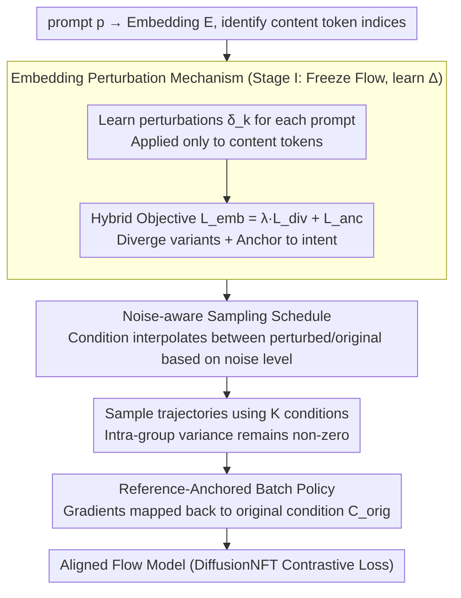

# E²PO: Embedding-perturbed Exploration Preference Optimization for Flow Models

**Conference**: ICML 2026  
**arXiv**: [2605.15803](https://arxiv.org/abs/2605.15803)  
**Code**: TBD  
**Area**: Image Generation / Flow Matching / RL Alignment  
**Keywords**: GRPO, Flow Matching, Text Embedding Perturbation, Reward Hacking, Intra-group Variance

## TL;DR
Addressing the collapse of intra-group variance and the disappearance of training signals in group-based RL alignment (e.g., GRPO, DiffusionNFT) for flow models, E²PO injects a set of learned structured perturbations into the text embedding space to maintain discriminative variance. Combined with a noise-aware schedule and a reference-anchored batch strategy, it improves GenEval from 0.917 to 0.932 on SD3.5-M while significantly enhancing diversity.

## Background & Motivation

**Background**: Adapting the RLHF-style GRPO paradigm to flow/diffusion models—by rewriting deterministic ODEs as SDEs to explore high-reward trajectories during sampling—is the current mainstream approach for aligning text-to-image models with human preferences. DiffusionNFT further integrates this into the forward process, optimizing the velocity field directly with a contrastive objective.

**Limitations of Prior Work**: These methods rely heavily on "intra-group relative advantage" signals, where rewards are normalized within a group before backpropagating gradients. However, during training, the policy naturally converges toward high-reward modes, causing intra-group samples to become increasingly similar. Consequently, the intra-group variance $\sigma_R$ rapidly decays toward zero. The paper monitors this using GenEval/PickScore and finds that the baseline std drops below critical levels early in training.

**Key Challenge**: The source of the signal (intra-group variance) and the optimization objective (aligning group samples toward high-reward modes) are inherently contradictory. Successful optimization leads to smaller variance, rendering gradients meaningless. Existing countermeasures—increasing the latent group size $G$ or using different initial noise—either fail to stop decay while scaling computation linearly (up to $G=48$) or trigger reward hacking (learning high-score artifacts that lack visual coherence).

**Goal**: Construct an exploration mechanism that does not rely on latent noise expansion but consistently maintains "semantically meaningful" intra-group differences, preventing signal disappearance while pushing the policy away from narrow local optima.

**Key Insight**: The authors observe that the text embedding space is a low-dimensional, structured semantic manifold. Fine-tuning along this manifold induces meaningful semantic changes more efficiently than brute-force sampling in high-dimensional noise. Prior work in prompt engineering and textual inversion has proven that minor shifts in embedding space significantly alter generation trajectories.

**Core Idea**: Shift the source of "intra-group diversity" from noise priors to text embedding perturbations. This involves learning a set of structured perturbations $\bm{\delta}_k$ for each prompt, injected into content tokens. This forces the policy to evaluate a set of semantically distinct yet intent-aligned conditions at each step, thereby pinning the discriminative variance at a non-zero level.

## Method

### Overall Architecture
Given a prompt $p$, it is tokenized into embeddings $\mathbf{E} \in \mathbb{R}^{S\times d}$. An index set $\mathcal{I}$ is defined for "substantive content tokens" (excluding [SOS]/[EOS]/padding, with effective length $L$). E²PO training consists of two stages: Stage 1 freezes the flow model to learn a set of perturbations $\Delta=\{\bm{\delta}_k\}_{k=1}^{K}$; Stage 2 freezes these perturbations and integrates them with the original prompt into the RL alignment loop (based on the DiffusionNFT contrastive objective). During sampling, a batch contains one original condition $\mathbf{C}^{\text{orig}}$ and $K-1$ perturbed conditions $\mathbf{C}_k(t)$, switched via a noise-aware temporal schedule. Policy updates compute gradients only on $\mathbf{C}^{\text{orig}}$, explicitly decoupling "exploration sources" from "update targets."

### Key Designs

**1. Embedding Perturbation: Shifting Variance Source from Noise to Semantics**

The mechanism addresses the issue of intra-group samples collapsing and $\sigma_R$ decaying to zero. Instead of sampling in high-dimensional noise, E²PO learns structured perturbations $\bm{\delta}_k \in \mathbb{R}^{L\times d}$ for each prompt, applied only to content token positions $t=\mathcal{I}_j$. This yields $\tilde{\mathbf{E}}_{k,t} = \mathbf{E}_t + \bm{\delta}_{k,j}$, which is processed by a frozen text encoder $f_\phi$ to obtain global embeddings $e_k$.

The perturbations are constrained by a hybrid objective $\mathcal{L}_{\text{emb}} = \lambda_{div}\mathcal{L}_{\text{div}} + \mathcal{L}_{\text{anc}}$: $\mathcal{L}_{\text{div}}$ minimizes the average cosine similarity between $K$ variants to push them apart; $\mathcal{L}_{\text{anc}} = \sum_k |\cos(e_k, e_{\text{anc}}) - \mu|_\epsilon$ uses an $\epsilon$-insensitive loss to anchor each variant's similarity to the original prompt near $\mu$. Diversity alone would lead to reward hacking in irrelevant semantic regions, while anchoring alone would collapse to a single point. Combined with content-only perturbation, this creates a "near-but-not-overlapping" ring around the prompt's semantics, restricting exploration to distinct semantic directions without deviating from intent.

**2. Noise-aware Sampling Schedule: Temporal Perturbation Control**

If perturbed conditions are applied throughout the generation process, low-noise detail stages may be corrupted by semantic drift. E²PO defines the real-time condition for the $k$-th variant via interpolation: $\mathbf{C}_k(t) = \gamma(\sigma_t)\mathbf{C}^{\text{opt}}_k + (1-\gamma(\sigma_t))\mathbf{C}^{\text{orig}}$. The weight $\gamma(\sigma_t) = \text{clip}((\sigma_t - (1-\rho))/\rho, 0, 1)$ mono-tonically decreases with the normalized noise level $\sigma_t$ (decaying from 1 to 0), where $\rho \in (0,1]$ controls the duration of perturbation.

This schedule aligns with the diffusion characteristic where coarse structures are fixed early while details are refined later. Perturbations dominate the early high-noise stages to diversify structural layouts, while the system switches back to the original anchor in late low-noise stages to ensure fidelity. Ablations (Fig. 6) show that static use of $\mathbf{C}^{\text{opt}}_k$ without decay leads to semantic drift and artifacts.

**3. Reference-Anchored Batch Policy: Decoupling Exploration and Updates**

To prevent the policy from being biased toward the perturbed conditions—thereby learning to perform well "under perturbations" rather than on "real prompts"—E²PO samples using a full set $\mathcal{C}_{\text{batch}} = \{\mathbf{C}^{\text{orig}}\} \cup \{\mathbf{C}_k(t)\}_{k=1}^{K-1}$. However, when calculating gradients for the DiffusionNFT contrastive loss, all conditions are mapped back to the unperturbed $\mathbf{C}^{\text{orig}}$.

Consequently, while the reward evaluation covers a semantic space expanded by perturbations, only the conditional distribution of the original prompt is updated. This ensures the model converges toward the high-reward mode of the original prompt, a property that would otherwise be destroyed if the model updated on whatever it sampled.

### Loss & Training
In Stage 1, $\mathcal{L}_{\text{emb}}$ is used to learn $\Delta$ with $\bm{\delta}_k \sim \mathcal{N}(0, \sigma_{\text{init}}^2 \mathbf{I})$ initialization. In Stage 2, a self-normalized $\bm{x}_0$-regression loss from DiffusionNFT is applied, where reward $r(\bm{x}_0, \bm{c}) \in [0,1]$ is decomposed into weighted regression terms for positive/negative policies $v_\theta^{\pm} = (1\mp\beta)v^{\text{old}} \pm \beta v_\theta$. The backbone is SD3.5-Medium on 8×H20, with configurations including High-Exploration $(G=4,K=12)$, Efficient $(G=2,K=4)$, and Human Preference $(G=8,K=3)$.

## Key Experimental Results

### Main Results

Comparison of GenEval rewards and diversity metrics after training (SD3.5-M is the zero-shot baseline; IDS—lower is better, others—higher is better):

| Method | $G$/$K$ | GenEval ↑ | IDS ↓ | ASC ↑ | SDI ↑ | PVS ↑ |
|------|---------|-----------|-------|-------|-------|-------|
| SD3.5-M | — | 0.263 | 0.044 | 0.143 | 0.458 | 0.392 |
| Flow-GRPO | 24/— | 0.776 | 0.064 | 0.123 | 0.422 | 0.318 |
| DiffusionNFT | 24/— | 0.922 | 0.054 | 0.118 | 0.418 | 0.259 |
| DiffusionNFT | 48/— | 0.917 | 0.051 | 0.109 | 0.463 | 0.196 |
| **Ours (E²PO)** | 4/12 | **0.932** | **0.048** | **0.127** | **0.467** | **0.322** |

Generalization to unseen rewards under PickScore (K=3):

| Method | $G$ | PickScore ↑ | Aesthetic ↑ | ImgRwd ↑ | HPSv2.1 ↑ | IDS ↓ |
|------|------|-------------|-------------|----------|-----------|-------|
| SD3.5-M | — | 19.93 | 5.600 | -0.50 | 0.203 | 0.044 |
| Flow-GRPO | 24 | 22.72 | 6.273 | 1.30 | 0.324 | 0.222 |
| DiffusionNFT | 24 | 23.34 | 6.514 | 1.27 | 0.324 | 0.239 |
| **Ours (E²PO)** | 8 | **23.38** | **6.538** | **1.29** | **0.325** | **0.167** |

### Ablation Study

| Configuration | Key Findings | Description |
|------|---------|------|
| Full E²PO ($G=4,K=12$) | GenEval 0.932 | Most stable exploration via dual noise/semantic sources |
| $G=1$ Extreme (only $K$) | Significant drop in performance | Noise prior alone is insufficient for exploration |
| $K=1$ Extreme (NFT baseline) | Comparable to high-$G$ NFT | Signal variance stabilizer is lost |
| Static $\mathbf{C}^{\text{opt}}_k$ (no schedule) | Semantic drift and artifacts | Low-noise stages corrupted by semantic perturbation |
| No $\mathbf{C}^{\text{orig}}$ Anchor | Slower convergence, worse peak perf | Policy biased by perturbations without anchor |

### Key Findings
- **Intra-group Variance**: Monitoring (Fig. 2) shows baseline reward std drops to the log-scale "floor" within 150 steps. E²PO maintains a stable variance level throughout, directly explaining sustained gains in GenEval/PickScore.
- **Budget Allocation**: Under a fixed compute budget $N=G\times K$, "pure $G$" or "pure $K$" are sub-optimal. Balanced allocation ($G=4,K=12$) performs best, suggesting noise and semantic diversity are complementary.
- **Diversity**: E²PO nearly matches the zero-shot baseline in IDS (0.048 vs 0.044) while achieving the highest GenEval. It increases rewards without sacrificing diversity. Qualitative results (Fig. 4) show superiority in tasks prone to reward hacking, such as counting, attribute binding, and text rendering.

## Highlights & Insights
- Shifting the source of "sustained exploration" from noise space to embedding space is a clever conceptual flip. A high-dimensional isotropic noise prior becomes powerless once the model converges, whereas small steps on the low-dimensional semantic manifold can switch to entirely different modes.
- Using $\mathcal{L}_{\text{div}} + \mathcal{L}_{\text{anc}}$ to constrain similarity is engineeringly simple but theoretically clean, creating a controlled exploration ring around the prompt without the instability of KL penalties.
- The decoupling of "noise/perturbed sampling" and "anchored updates" can be transferred to any RL scenario where reward estimation requires diversity but the policy itself should remain unimodal.

## Limitations & Future Work
- **Efficiency**: Perturbations are learned per-prompt, requiring Stage 1 optimization for unseen prompts during online RL, which is not user-friendly for inference-time applications. An amortized prompt-to-$\Delta$ generator would be more practical.
- **Scope**: Evaluations are limited to SD3.5-Medium. Transferability to larger models (SD3.5-Large/FLUX) or non-NFT policy gradient frameworks remains unverified.
- **Theory**: The optimal balance of $K$ and $G$ likely depends on the backbone and reward type. The paper provides empirical values but lacks a transition to predictive theory based on reward landscape properties.

## Related Work & Insights
- **vs. Flow-GRPO / DiffusionNFT**: These also use group-based RL but explore only via latent noise. E²PO argues this path is doomed by variance collapse and introduces structured diversity at the embedding layer instead.
- **vs. Textual Inversion / DreamBooth**: While those methods learn embeddings to reproduce static concepts, E²PO treats learned embeddings as a dynamic exploration mechanism within the RL loop.
- **vs. Initial Noise Diversification (Xue et al. 2025)**: Xue's approach relies on noise but acknowledges it can lead to visually incoherent "score-padding" images. E²PO's semantic anchoring naturally prevents exploration from drifting beyond prompt intent.

## Rating
- **Novelty**: ⭐⭐⭐⭐ Attributes the GRPO variance problem to the signal source and provides a clean alternative via embedding perturbation; innovative but incremental.
- **Experimental Thoroughness**: ⭐⭐⭐⭐ Main results cover both GenEval and PickScore with diversity metrics and three ablation sets; lacks cross-architecture validation.
- **Writing Quality**: ⭐⭐⭐⭐ Clear chain of Motivation → Phenomena → Formulas → Ablation; variance monitoring in Fig. 2 is highly persuasive.
- **Value**: ⭐⭐⭐⭐ Provides a drop-in stabilizer for flow/diffusion RL alignment with low implementation cost; likely to be adopted by subsequent RL alignment work.

<!-- RELATED:START -->

## Related Papers

- [\[ICML 2026\] Offline Preference Optimization for Rectified Flow with Noise-Tracked Pairs](offline_preference_optimization_for_rectified_flow_with_noise-tracked_pairs.md)
- [\[ICLR 2026\] Reinforcing Diffusion Models by Direct Group Preference Optimization](../../ICLR2026/image_generation/reinforcing_diffusion_models_by_direct_group_preference_optimization.md)
- [\[ICML 2026\] Principled RL for Flow Matching Emerges from the Chunk-level Policy Optimization](principled_rl_for_flow_matching_emerges_from_the_chunk-level_policy_optimization.md)
- [\[CVPR 2026\] Neighbor GRPO: Contrastive ODE Policy Optimization Aligns Flow Models](../../CVPR2026/image_generation/neighbor_grpo_contrastive_ode_policy_optimization_aligns_flow_models.md)
- [\[ICML 2026\] Adversarial Flow Models](adversarial_flow_models.md)

<!-- RELATED:END -->
