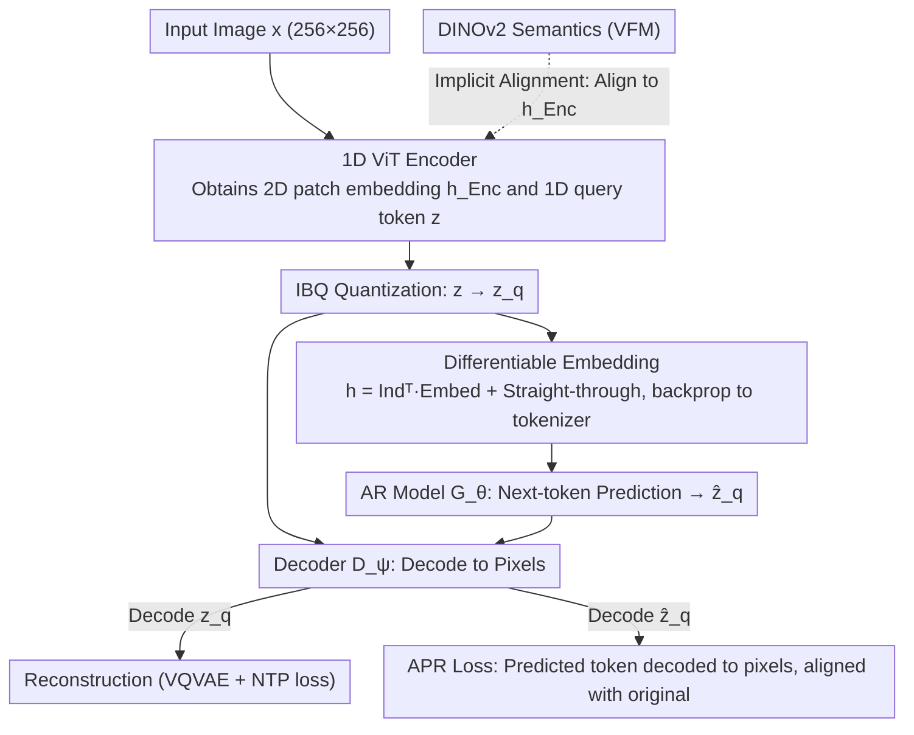

# End-to-End Autoregressive Image Generation with 1D Semantic Tokenizer

**Conference**: ICML 2026 Spotlight  
**arXiv**: [2605.00503](https://arxiv.org/abs/2605.00503)  
**Code**: None  
**Area**: Image Generation / Autoregressive Visual Tokenizer / Representation Alignment  
**Keywords**: 1D Tokenizer, Autoregressive Image Generation, APR loss, VFM Implicit Alignment, ImageNet FID

## TL;DR
EOSTok employs a single-stage end-to-end pipeline to jointly train a 1D ViT tokenizer and an autoregressive model. By utilizing a newly proposed APR (Autoregressive Prediction Reconstruction) loss, gradients from "next-token prediction" are effectively propagated back to the pixel space to prevent codebook collapse. Furthermore, "implicit alignment" is introduced to inject DINOv2 semantics into the 1D latent space without compromising the 1D autoregressive structure, achieving a SOTA FID of 1.48 (without guidance) on ImageNet 256.

## Background & Motivation

**Background**: Autoregressive image generation (e.g., VQGAN, LLaMaGen, MAR, VAR) aims to replicate the success of LLMs. However, most existing methods still rely on 2D grid tokenizers, compressing a 256×256 image into a 16×16 patch sequence decoded via raster-scan order. Recent works like TiTok, FlexTok, and Semanticist use learnable queries to compress images into 1D sequences, primarily focusing on high compression ratios (e.g., 32 tokens).

**Limitations of Prior Work**: (1) 2D grid tokens naturally possess bidirectional dependencies (a patch is contextualized by its neighbors in all directions), which conflicts with the unidirectional factorization of raster-scan AR modeling, leading to "directional misalignment." (2) Existing 1D tokenizers often sacrifice reconstruction quality for extreme compression and utilize two-stage training—where the tokenizer is pre-trained on reconstruction and then frozen—preventing gradients from the AR stage from reaching the tokenizer. (3) Direct alignment of VFM (Vision Foundation Model) representations with the 1D latent space often causes it to degenerate into a raster-ordered patch sequence, inadvertently reintroducing 2D priors.

**Key Challenge**: The trilemma of "reconstruction quality vs. AR-friendliness," "2D semantic priors vs. 1D sequential structure," and "next-token loss vs. pixel generation quality" is highly entangled. Single-stage joint training is prone to local minima where the NTP loss is "hacked"—the tokenizer learns to use only a few active tokens to minimize NTP loss, causing codebook utilization to collapse from 99.8% to 51.8%.

**Goal**: (1) Design a 1D tokenizer that does not focus solely on extreme compression; (2) Enable the tokenizer to receive generation gradients directly from the pixel space; (3) Inject VFM semantics into the 1D path without destroying the 1D structure.

**Key Insight**: The essence of 2D limitations is the conflict between "token arrangement and the direction of causal factorization." By stripping away 2D priors, 1D tokenizers can natively support vanilla AR modeling without the need for random masking or next-scale prediction.

**Core Idea**: The APR loss is used to decode AR-predicted tokens back into the pixel space for alignment with the ground truth, establishing end-to-end generative supervision. Simultaneously, "implicit alignment" aligns VFM representations with the 2D hidden patch embeddings of the encoder rather than the 1D latent space, allowing the 1D latents to absorb semantics indirectly.

## Method

### Overall Architecture
EOSTok addresses the issue where 1D tokenizers and AR models are trained in separate stages, preventing AR gradients from reaching the tokenizer. This is replaced by a single-stage end-to-end joint training. An input image $x$ (256×256) first passes through a ViT encoder to obtain 2D patch embeddings $h_\text{Enc}$ and a sequence of 1D latent tokens $z$ extracted via $L$ learnable queries. Only $z$ is passed to the IBQ quantizer to obtain $z_q$. The AR model $\mathcal{G}_\theta$ performs next-token prediction on $z_q$, while the decoder $\mathcal{D}_\psi$ decodes both $z_q$ and the AR-predicted $\hat z_q$ back to pixels. The total objective is $\mathcal{L}_\text{VQVAE} + \lambda_\text{NTP}\mathcal{L}_\text{NTP} + \lambda_\text{APR}\mathcal{L}_\text{APR} + \lambda_\text{align}\mathcal{L}_\text{align}$.

### Key Designs

**1. Differentiable Embedding: Enabling NTP Gradients to Backpropagate to the Tokenizer**

End-to-end joint training hinges on a specific implementation detail: standard LLM embeddings involve discrete index look-ups, which are non-differentiable for the tokenizer. Consequently, NTP loss typically only updates the AR model, and the tokenizer never learns which token sequences are easier for autoregressive prediction. EOSTok modifies the AR input from a table look-up to a weighted sum of the probability matrix $\text{Ind} \in \mathbb{R}^{L \times K}$ output by the IBQ: $h = \text{Ind}^\top \text{Embed}$. Combined with the straight-through estimator $\text{Ind} = \text{onehot}(\arg\max p) + [p - \text{stopgrad}(p)]$, gradients can flow continuously from the AR loss back to the encoder and the codebook.

**2. APR Loss: Routing AR Generation Gradients to Pixel Space**

Simply enabling gradient flow is insufficient—direct NTP supervision in an E2E setting can be "hacked." In a vanilla E2E setup, NTP artificially inflates AR accuracy from 11.8% to 30.2%, but because it only focuses on the discrete token space and ignores final pixels, the tokenizer learns to minimize NTP by using extremely few tokens. This causes codebook utilization to drop from 99.8% to 51.8% and gFID to spike to 8.01. The APR (Autoregressive Prediction Reconstruction) loss aligns the objective with "decoded pixel consistency" rather than just "token consistency." Under teacher forcing, the AR predicts $\hat z_q = \mathcal{G}_\theta(z_q)$, which is sent to the decoder to reconstruct the image. The loss is defined as $\mathcal{L}_\text{APR}(\phi, \psi, \theta) = \|x - \mathcal{D}_\psi(\mathcal{G}_\theta(z_q))\|_2^2$ (plus an LPIPS term). By aligning the supervision with the actual generation target, codebook utilization recovers to 99.7%, and gFID drops to 3.32.

**3. Implicit Alignment: Injecting VFM Semantics into 1D Encoder without Breaking 1D Structure**

To provide 1D tokenizers with VFM semantics (like DINOv2), a naive approach is "Direct Alignment" of the 1D latent $z$ to VFM features $f(x)$. However, this smuggles 2D spatial priors into the 1D space, causing $z$ to degenerate into a raster-ordered sequence and negating the benefits of 1D AR (gFID increases from 12.27 to 5.98). "Direct Substitution," replacing patch embeddings with VFM features, is only effective to a limited extent. The authors propose "Implicit Alignment": instead of constraining the 1D latent, the intermediate 2D hidden patch embeddings are aligned with the VFM: $\mathcal{L}_\text{implicit} = -\frac{1}{N}\sum_n \text{sim}(h_\omega(h_\text{Enc}^{[n]}), y^{[n]})$. This allows the 1D latent $z$ to absorb semantics via cross-attention without being forced into a 2D order. This preserves the 1D sequential freedom while leveraging VFM semantics, improving AR accuracy and dropping gFID to 3.32.

### Loss & Training
The total objective is $\mathcal{L}_\text{E2E} = \mathcal{L}_\text{VQVAE} + \lambda_\text{NTP}\mathcal{L}_\text{NTP} + \lambda_\text{APR}\mathcal{L}_\text{APR} + \lambda_\text{align}\mathcal{L}_\text{align}$. Here, $\mathcal{L}_\text{recon}$ includes L1/L2 + LPIPS + GAN, and $\mathcal{L}_\text{reg}$ includes commitment and entropy losses. An additional REPA-style alignment is applied at the decoder—aligning the hidden features of the $k$-th layer of mask tokens to the VFM—to accelerate 1D decoder convergence by treating it as conditional generation.

## Key Experimental Results

### Main Results

| Model | Tokenizer | #Tokens | rFID ↓ | gFID (w/o guidance) ↓ | gFID (w/ guidance) ↓ |
|------|-----------|---------|--------|---------|---------|
| LDM-4 | SD-VAE (2D) | 64×64 | 0.27 | 10.56 | 3.60 |
| DiT-XL/2 | SD-VAE | 32×32 | 0.62 | 9.62 | 2.27 |
| MAR-L | SD-VAE | 16×16 | 0.87 | 2.60 | 1.78 |
| Lightning-DiT | VA-VAE | 32×32 | 0.28 | 2.17 | 1.35 |
| **EOSTok-H** | **1D + Implicit VFM** | 256 query | — | **1.48** | — |

### Ablation Study

| Configuration | rFID ↓ | gFID ↓ | AR Acc. ↑ | Codebook Util. |
|------|--------|--------|-----------|----------|
| Two-stage Baseline | 1.09 | 3.82 | 11.8% | 99.8% |
| Vanilla E2E (NTP only) | 4.92 | 8.01 | 30.2% | 51.8% |
| **+ APR loss** | 1.02 | 3.32 | 11.9% | 99.7% |
| + Decoder VFM Align | 1.12 | 5.68 | 8.2% | — |
| + Encoder Direct Align | 0.98 | 5.98 | 8.5% | — |
| + Direct substitution | 1.05 | 4.89 | 12.1% | — |
| **+ Implicit alignment (Ours)** | 1.02 | 3.32 | 11.9% | — |

### Key Findings
- **Vanilla E2E is a False Positive**: Adding only NTP supervision inflates AR accuracy (30.2%) while generation quality collapses (gFID 8.01) due to codebook collapse. PCA visualization shows the codebook collapsing onto a 3D sphere.
- **APR loss is the Vital Fix**: Adding a pixel-level loss restores codebook utilization to 99.7% and improves rFID/gFID across the board, demonstrating the value of supervising the ultimate objective.
- **2D Priors Poison 1D AR**: Direct alignment with VFM forces 2D order onto the 1D latent space, leading to a gFID increase from 12.27 to 5.98, proving that 1D paths should not inherit 2D sequence assumptions.
- **Scaling Friendly**: gFID drops monotonically across EOSTok-S/L/H, and increasing codebook size from 4096 to 16384 yields consistent improvements.

## Highlights & Insights
- **Value of the Joint Training Paradigm**: This work demonstrates that by routing supervision signals to the actual generation target (pixel MSE) rather than a proxy (NTP), single-stage training can preserve reconstruction while significantly enhancing generation.
- **Subtlety of VFM Injection**: The choice between aligning latents versus intermediate hidden states is critical. Improper alignment can degrade performance, showing that adding VFM "features" is not a universal fix.
- **Differentiable Codebook Embedding Trick**: Replacing look-ups with `Ind^T Embed` is a technical necessity for end-to-end joint optimization, applicable to any VQ + downstream model scenario.

## Limitations & Future Work
- Validated only on ImageNet-256 class-conditional generation; its efficacy in text-to-image or video generation remains to be seen.
- Fixed token count of 256; adaptive token counts or nested dropout (like FlexTok) were not explored.
- APR loss requires decoding to pixels at each training step, leading to higher training costs compared to two-stage methods.
- The framework currently fixes the quantizer as IBQ; other designs like FSQ or LFQ were not tested.

## Related Work & Insights
- **vs. TiTok / FlexTok / Semanticist**: These focus on 1D tokenization but use two-stage training. EOSTok is the first to achieve end-to-end 1D + AR integration.
- **vs. VAR / MAR**: VAR uses multi-scale prediction and MAR uses masking to solve 2D issues. EOSTok argues that stripping 2D priors makes vanilla AR sufficient.
- **vs. VA-VAE / REPA**: While these use VFM for diffusion, EOSTok concludes that 1D AR routes specifically require "implicit alignment."
- **vs. LLaMaGen / RQ-VAE**: While traditional 2D AR usually results in gFID scores of 8-15 without guidance, EOSTok-H reaches 1.48, rivaling the best diffusion models (1.35).

## Rating
- Novelty: ⭐⭐⭐⭐ The combination of E2E 1D+AR, APR loss, and implicit alignment is highly effective.
- Experimental Thoroughness: ⭐⭐⭐⭐⭐ Comprehensive ablations on joint training, injection methods, scaling, and codebook size.
- Writing Quality: ⭐⭐⭐⭐ Clear explanations of failure cases (NTP hacking, Direct alignment degeneration).
- Value: ⭐⭐⭐⭐⭐ Challenges the perception that 1D tokenizers are only for high compression and provides a strong AR alternative to 2D grids.

<!-- RELATED:START -->

## Related Papers

- [\[ICML 2026\] CLEAR: Context-Aware Learning with End-to-End Mask-Free Inference for Adaptive Video Subtitle Removal](clear_context-aware_learning_with_end-to-end_mask-free_inference_for_adaptive_vi.md)
- [\[CVPR 2026\] DeCo: Frequency-Decoupled Pixel Diffusion for End-to-End Image Generation](../../CVPR2026/image_generation/deco_frequency-decoupled_pixel_diffusion_for_end-to-end_image_generation.md)
- [\[CVPR 2026\] SpeeDiff: Scalable Pixel-Anchored End-to-End Latent Diffusion Model](../../CVPR2026/image_generation/speediff_scalable_pixel-anchored_end-to-end_latent_diffusion_model.md)
- [\[ICCV 2025\] End-to-End Multi-Modal Diffusion Mamba](../../ICCV2025/image_generation/end-to-end_multi-modal_diffusion_mamba.md)
- [\[NeurIPS 2025\] LinEAS: End-to-end Learning of Activation Steering with a Distributional Loss](../../NeurIPS2025/image_generation/lineas_end-to-end_learning_of_activation_steering_with_a_distributional_loss.md)

<!-- RELATED:END -->
