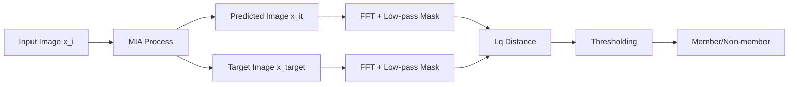

# Enhancing Membership Inference Attacks on Diffusion Models from a Frequency-Domain Perspective

**Conference**: ICML 2026  
**arXiv**: [2505.20955](https://arxiv.org/abs/2505.20955)  
**Code**: https://github.com/poetic2/FreMIA  
**Area**: AI Security / Privacy Attacks (Membership Inference / Diffusion Models)  
**Keywords**: Membership Inference Attack, Diffusion Model, Frequency Domain Analysis, High-Frequency Defects, Plug-and-Play Filter

## TL;DR
This paper analyzes the failure modes of Membership Inference Attacks (MIA) on diffusion models from a frequency-domain perspective. It identifies that high-frequency content amplifies the standard deviation of scores for both member and hold-out samples, thereby diluting the membership advantage. The authors propose a training-free, zero-inference-overhead "high-frequency filter" module. By applying the same FFT low-pass processing to both the predicted and target images before calculating the reconstruction error, mainstream MIAs (e.g., Naive, SecMI, PIA) achieve universal improvements of 4–11 percentage points in ASR/AUC/TPR@1%FPR on DDIM and Stable Diffusion (with TPR@1%FPR jumping from 6% to 41% in specific scenarios).

## Background & Motivation

**Background**: Diffusion models exhibit impressive image generation capabilities, but the risk of "memorizing" training sets has also increased. Consequently, Membership Inference Attacks (MIA) for evaluating training data privacy have become a prominent research direction. Mainstream MIAs for diffusion models (Naive loss, SecMI, PIA, PIAN, etc.) belong to the "reconstruction error" family: given a test image $x_i$, the model predicts $x_{i,t}$ and a target $x_{i,t}^{target}$ at a specific timestep $t$. The distance $\|x_{i,t}-x_{i,t}^{target}\|_q$ serves as the membership score for threshold-based classification.

**Limitations of Prior Work**: Empirical evidence shows these attacks systematically fail on certain "seemingly easy" samples—**member images with high-frequency content are often misclassified as non-members, while hold-out images with low-frequency content are misclassified as members**. Scatter plots (Fig. 1) and failure sample statistics (Table 1) across MS-COCO/Flickr/CIFAR-100/TINY-IN validate this pattern.

**Key Challenge**: Diffusion models possess a "frequency hierarchy"—recovering low-frequency global structures first, followed by high-frequency details. High-frequency recovery inherently involves greater variance and uncertainty (as proven by Yang et al., 2023 and Falck et al., 2025 via spectrum and SNR analysis). However, existing MIAs use pixel-level errors, mixing the "intrinsic model randomness" from high frequencies with the "membership signal." This causes the score distributions of both members and hold-outs to be "stretched" by high-frequency components.

**Goal**: (1) Characterize how high-frequency content systematically harms existing MIAs; (2) Provide a universal enhancement module that requires no training and adds no inference time; (3) Theoretically prove why this enhancement is effective.

**Key Insight**: Since high frequency acts as a "common noise source," it should be removed from the error calculation. Utilizing the membership advantage formula from Yeom et al. (2018), $Adv^M(\mathcal{A})\propto \sigma_H/\sigma_M$ (ratio of hold-out score std. dev. to member score std. dev.), the authors observe that high-frequency noise contributes nearly equally to the variance $\sigma^{high}$ of both groups, which lowers the $\sigma_H/\sigma_M$ ratio because the denominator increases disproportionately.

**Core Idea**: Before inputting into the distance function, both the predicted image $x_{i,t}$ and the target image $x_{i,t}^{target}$ undergo FFT. High-frequency regions with radius greater than $r_t$ are multiplied by a decay factor $s$ (default 0), then transformed back via IFFT. **Using the low-frequency reconstruction error instead of the original error** makes this a plug-and-play enhancement for any reconstruction-based MIA, termed FreMIA.

## Method

### Overall Architecture
The paper summarizes all existing "reconstruction-error" MIAs into a general paradigm (Eq. 6):
$$\mathcal{A}(x_i,\theta)=\mathbb{1}[\|x_{i,t}-x_{i,t}^{target}\|_q \le \tau]$$
Different methods vary only in how they construct $x_{i,t}$ and $x_{i,t}^{target}$—Naive uses one-step noise/denoise loss; SecMI uses DDIM multi-step inversion; PIA uses proximal initialization for deterministic noise prediction. Ours maintains the attack core but applies a **symmetric frequency-domain low-pass filter** $\mathcal{F}(\cdot)$ to both images, upgrading the paradigm to (Eq. 11):
$$\mathcal{A}'(x_i,\theta)=\mathbb{1}[\|\mathcal{F}(x_{i,t})-\mathcal{F}(x_{i,t}^{target})\|_q \le \tau]$$

### Key Designs

1.  **General Paradigm Formalization**:
    - **Function**: Consolidates seemingly different attacks like Naive, SecMI, and PIA under the $\|x_{i,t}-x_{i,t}^{target}\|_q$ expression as a unified interface for frequency modification.
    - **Mechanism**: Appendix B proves that the discriminants of these attacks can be rewritten as the $\ell_q$ distance between a predicted and a target image, differing only in the construction of $x_{i,t}^{target}$ (e.g., SecMI uses intermediate results of DDIM inversion).
    - **Design Motivation**: Avoids patching each attack individually, ensuring the **plug-and-play** nature of the module, while allowing theoretical analysis to cover all such attacks simultaneously.

2.  **High-Frequency Filter $\mathcal{F}$ and Symmetric Mechanism**:
    - **Function**: Removes high-frequency components with radius $r > r_t$ before computing distance to eliminate perturbations caused by model stochasticity in high frequencies.
    - **Mechanism**: For $x_{i,t}$, let $\mathbf{X}=FFT(x_{i,t})$. Multiply by a mask $\beta_{i,t}(r)=s$ if $r > r_t$, else $1$ (experimentally $s=0$). Then $\mathcal{F}(x_{i,t})=IFFT(FFT(x_{i,t})\odot\beta_{i,t}(r))$. The key is **using the same mask for both $x_{i,t}$ and $x_{i,t}^{target}$** so that the subtracted high-frequency signals are i.i.d.
    - **Design Motivation**: Based on (a) Spectrum observation: Diffusion models learn low frequencies before high frequencies; (b) Failure statistics: High-frequency content in member images is significantly higher than in hold-outs in failed cases.

3.  **Frequency Decomposition and Theoretical Guarantee (Proposition 4.2)**:
    - **Function**: Provides a provable basis for why removing high frequencies strengthens attacks.
    - **Mechanism**: Decomposes total variance into low and high parts $\sigma_M^2=\sigma_M^{low\,2}+\sigma_M^{high\,2}$ and $\sigma_H^2=\sigma_H^{low\,2}+\sigma_H^{high\,2}$. Let $\Delta = \sigma_H^{low}-\sigma_M^{low}$. The paper proves that if the high-frequency variance of members is not less than that of hold-outs ($\sigma_M^{high} \ge \sigma_H^{high}$), then $\sigma_H'/\sigma_M' > \sigma_H/\sigma_M$ necessarily holds, leading to a strict increase in membership advantage.
    - **Design Motivation**: Transcends an "engineering trick" into a provable conclusion under common conditions.

### Loss & Training
**No training required**. The module only adds an FFT→mask→IFFT step during inference for distance calculation. The complexity is $O(N \log N)$, which is negligible compared to multi-step sampling. The only hyperparameter is the radius $r_t$ (e.g., $r_t=2$ for CIFAR-100, $r_t=5$ for MS-COCO).

## Key Experimental Results

### Main Results

Comparison on DDIM across three datasets and three baselines (Naive / SecMI / PIA) with the +F (Frequency Filter) enhancement (Table 2 excerpt):

| Dataset / Method | ASR (Base → +F) | AUC (Base → +F) | TPR@1%FPR (Base → +F) |
| :--- | :--- | :--- | :--- |
| STL10-U / SecMI | 81.14 → 86.51 | 87.39 → 91.39 | 11.11 → 14.63 |
| CIFAR-100 / SecMI | 80.56 → 88.09 | 87.21 → 93.74 | 16.50 → 24.32 |
| Tiny-IN / PIA | 80.87 → 89.12 | 86.30 → 93.23 | 14.66 → 32.91 |
| **Average Gain** | **+5.4~+7.3** | **+4.5~+6.4** | **+4.5~+11.8** |

Results on Fine-tuned Stable Diffusion (Table 3) are even more significant:

| Dataset / Method | ASR (Base → +F) | AUC (Base → +F) | TPR@1%FPR (Base → +F) |
| :--- | :--- | :--- | :--- |
| MS-COCO / Naive | 80.29 → 93.60 | 87.85 → 98.32 | 4.80 → 41.99 |
| Flickr / Naive | 79.29 → 90.90 | 86.14 → 96.82 | 16.59 → 67.60 |

### Ablation Study

| Configuration / Phenomenon | Observations |
| :--- | :--- |
| Baseline (No Filtering) | Member images in failed cases have ~0.07–0.18 higher high-frequency content than hold-outs. |
| +F (Symmetric Low-pass) | Eliminates bias; ASR/AUC increases monotonically across all baselines and datasets. |
| Changing radius $r_t$ | Insensitive within reasonable ranges. Too small retains noise; too large loses memorization signal. |
| Normality Assumption | Proposition 4.2 holds strictly under normality, but Appendix D.2 shows robust gains even when distributions deviate. |

### Key Findings
- **High frequency is the source of "false signals"**: Evidence from failure statistics, scatter plots, and pixel-level distance visualization converge on the conclusion that high-frequency reconstruction error is mostly noise unrelated to memorization.
- **Maximized gains in low FPR intervals**: The improvement in TPR@1%FPR is much larger than ASR/AUC, meaning the filter is most effective at high-confidence thresholds.
- **Universal across architectures and datasets**: Improvements are consistent across unconditional DDIM and fine-tuned Stable Diffusion, as well as low-res (CIFAR) and high-res (Flickr) images.

## Highlights & Insights
- **Theoretical + Empirical Loop**: Provides a rigorous proof for a simple "low-pass" trick using the membership advantage formula.
- **Frequency Perspective Bridges Attack and Defense**: Suggests that any distance-based privacy/security analysis for diffusion models (unlearning verification, etc.) should be reconsidered in the frequency domain.
- **Zero-Cost Plug-and-Play**: No shadow models, no re-training, and negligible overhead make it a likely standard for future MIA benchmarks.
- **Symmetric Perturbation as a Design Principle**: Applying noise-canceling perturbations symmetrically to compared images is a transferable idea for other distance-based detectors (e.g., OOD or adversarial detection).

## Limitations & Future Work
- **Coverage**: Only targets "reconstruction-error" attacks (excludes gradient-based or likelihood-based attacks).
- **Hyperparameter $r_t$**: Requires manual setting per dataset; lacks an automated selection strategy.
- **Assumptions**: Relies on $k \ge 1$ (high-frequency variance of members $\ge$ hold-outs), which might not hold for extreme outlier datasets like high-contrast medical imagery.
- **Defense**: Primarily an attack enhancement; future work could explore frequency-aware differential privacy or training balancing as defenses.

## Related Work & Insights
- **vs. SecMI / PIA**: FreMIA shows that the failure of these methods stems from high-frequency instability rather than the inversion or initialization processes themselves.
- **vs. LiRA**: FreMIA provides a low-cost alternative to the computationally expensive shadow-model-based likelihood ratio estimation.
- **vs. Frequency-aware Generation**: Transfers generation quality research (Yang et al., 2023) to privacy identifiability.

## Rating
- **Novelty**: ⭐⭐⭐⭐ First to introduce a frequency-domain perspective to diffusion MIA with a unified framework.
- **Experimental Thoroughness**: ⭐⭐⭐⭐ Covers 3 baselines and 6 datasets across 2 architectures.
- **Writing Quality**: ⭐⭐⭐⭐ Clear formalization and well-integrated theoretical explanations.
- **Value**: ⭐⭐⭐⭐⭐ Practical, zero-cost, and significantly improves state-of-the-art performance.

<!-- RELATED:START -->

## Related Papers

- [\[AAAI 2026\] UNSEEN: Enhancing Dataset Pruning from a Generalization Perspective](../../AAAI2026/image_generation/unseen_enhancing_dataset_pruning_from_a_generalization_perspective.md)
- [\[ICML 2026\] Balancing Fidelity and Diversity in Diffusion Models via Symmetric Attention Decomposition: Hopfield Perspective](balancing_fidelity_and_diversity_in_diffusion_models_via_symmetric_attention_dec.md)
- [\[ICML 2026\] A Kinetic Energy Perspective of Flow Matching](a_kinetic_energy_perspective_of_flow_matching.md)
- [\[AAAI 2026\] Enhancing Multimodal Misinformation Detection by Replaying the Whole Story from Image Modality Perspective](../../AAAI2026/image_generation/enhancing_multimodal_misinformation_detection_by_replaying_the_whole_story_from_.md)
- [\[ICML 2026\] Stable Velocity: A Variance Perspective on Flow Matching](stable_velocity_a_variance_perspective_on_flow_matching.md)

<!-- RELATED:END -->
## Related Papers

- [\[ECCV 2024\] FouriScale: A Frequency Perspective on Training-Free High-Resolution Image Synthesis](../../ECCV2024/image_generation/fouriscale_a_frequency_perspective_on_training-free_high-resolution_image_synthe.md)
- [\[AAAI 2026\] UNSEEN: Enhancing Dataset Pruning from a Generalization Perspective](../../AAAI2026/image_generation/unseen_enhancing_dataset_pruning_from_a_generalization_perspective.md)
- [\[ICML 2026\] Balancing Fidelity and Diversity in Diffusion Models via Symmetric Attention Decomposition: Hopfield Perspective](balancing_fidelity_and_diversity_in_diffusion_models_via_symmetric_attention_dec.md)
- [\[ICLR 2026\] Continual Unlearning for Text-to-Image Diffusion Models: A Regularization Perspective](../../ICLR2026/image_generation/continual_unlearning_for_text-to-image_diffusion_models_a_regularization_perspec.md)
- [\[ICML 2026\] Stable Velocity: A Variance Perspective on Flow Matching](stable_velocity_a_variance_perspective_on_flow_matching.md)

<!-- RELATED:END -->
