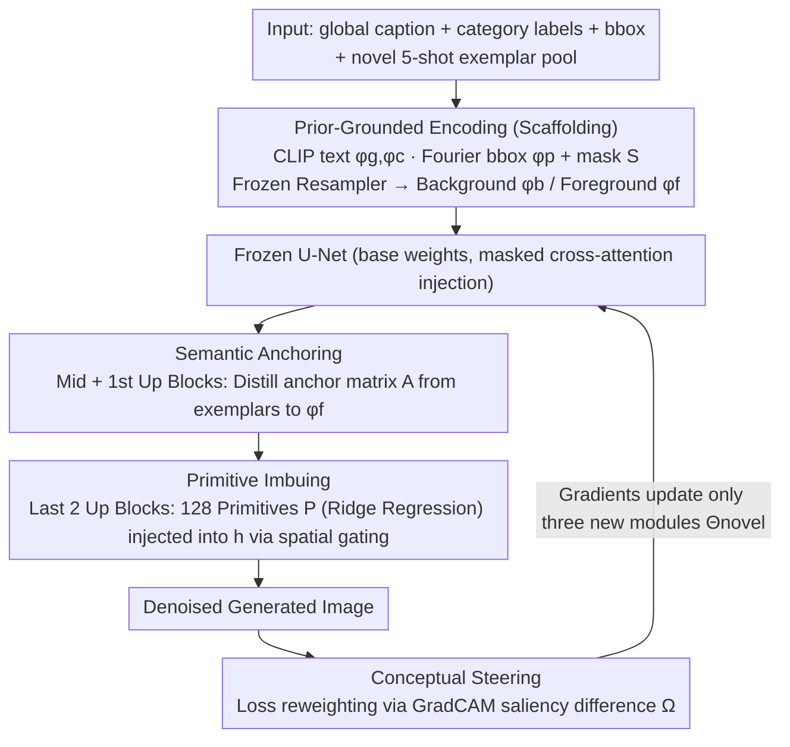

# Envisioning Beyond the Few: Disentangled Semantics and Primitives for Few-Shot Atypical Layout-to-Image Generation

**Conference**: ICML 2026  
**arXiv**: [2605.31266](https://arxiv.org/abs/2605.31266)  
**Code**: https://github.com/iCVTEAM/DSP  
**Area**: Diffusion Models / Image Generation / Few-Shot Learning  
**Keywords**: layout-to-image, few-shot adaptation, representation disentanglement, visual primitives, diffusion models

## TL;DR
To address "representation fragmentation" in layout-to-image generation within 5-shot atypical domains (aerial / underwater / extreme dark), the authors explicitly decompose the conditional representation of each category into global semantic anchors and local recomposable primitives. By using a saliency-aware loss to enforce foreground consistency, they reduce the Bootstrap FID on DIOR from 82.5 to 74.3 and improve mAP to 26.1.

## Background & Motivation

**Background**: Layout-to-image (L2I) utilizes categories and bounding boxes to control diffusion models for generating complex scenes. Mainstream approaches (MIGC, CC-Diff, etc.) are based on Stable Diffusion and rely on COCO-scale paired data to train instance-conditional injection.

**Limitations of Prior Work**: When targeting atypical domains such as aerial, underwater, or low-light scenes, annotations are scarce, typically with only 5-shot samples available. Fine-tuning L2I models directly in such few-shot scenarios leads to **representation fragmentation**—generated chimneys are severed, turtle shells crack into pieces, and both texture and geometry collapse. This is not simple "overfitting," but rather a failure of the model to form a coherent representation.

**Key Challenge**: The authors attribute the root cause to **grain mismatch**. High-level semantic identity (e.g., a turtle) should remain stable across all instances, while low-level visual details (e.g., shell patterns, lighting) are naturally local and highly variable. However, existing L2I conditioning paths cram both into the same set of cross-attention embeddings. Under few-shot conditions, high-variance local details dilute stable global semantics, causing both to fail. Furthermore, foreground classes in the base and novel sets are disjoint, while background statistics are largely shared, causing the loss to prioritize fitting the background as a shortcut.

**Goal**: Without modifying the parameters of the base diffusion model, the goal for novel categories is to (i) stabilize classification identity; (ii) recover fine-grained local details despite extremely few samples; and (iii) prevent optimization from taking shortcuts by fitting the background.

**Key Insight**: Rather than competing for capacity in the parameter space (LoRA, DreamBooth styles), it is more effective to perform granular disentanglement in the **representation space**. One conditioning path handles "what class it is," another handles "what it looks like," and a spatial loss enforces the model to utilize semantic signals on the foreground.

**Core Idea**: Explicitly decompose the L2I conditional representation into global *Semantic Anchors* (governing identity) and local *Visual Primitives* (governing details), then use a GradCAM-driven saliency loss, *Conceptual Steering*, to pull gradients toward foreground regions.

## Method

### Overall Architecture
The method addresses "representation fragmentation" in 5-shot atypical layout-to-image generation by splitting conditional representations by granularity. The framework is built on SD v1.5 and consists of two stages: a base stage for learning general L2I capabilities on large datasets to obtain $\Theta_{\text{base}}$, and a novel stage where base weights are frozen, and only three new modules $\Theta_{\text{novel}}$ are updated.

Input conditions in the novel stage undergo *Prior-Grounded Encoding*: global captions and category labels are encoded via frozen CLIP into $\phi_g, \phi_c$; bboxes are Fourier-encoded into $\phi_p$ and sigmoid spatial masks $\mathbf{S}$; visual features are provided by a Resampler pre-trained and frozen on the base set, yielding background $\phi_b$ and foreground $\phi_f$. Specifically, the source for $\phi_f$ shifts from the base set to an *exemplar pool* $\Delta$ cropped from the 5-shot novel samples. These five sets of embeddings are injected into the U-Net middle and upsampling blocks via masked cross-attention. Three new modules intervene at different positions: Semantic Anchoring modifies $\phi_f$ in the middle and first upsampling blocks, Primitive Imbuing modifies spatial features $\mathbf{h}$ in the last two upsampling blocks, and Conceptual Steering modifies the loss $\mathcal{L}$.

### Key Designs

**1. Semantic Anchoring: Stabilizing Visual Identity of Novel Classes**

The pain point is that the frozen Resampler, having only seen base classes, provides only coarse features for disjoint novel classes, lacks fine-grained semantics, and suffers from semantic drift when fitting instance-by-instance in 5-shot settings. The approach distills a cross-sample consensus anchor matrix $\mathbf{A}\in\mathbb{R}^{n\times d}$ back into the foreground embedding. For class $c$, dense features $\phi_{(\Delta,c)}\in\mathbb{R}^{n\times h\times w\times d}$ are extracted from its exemplar subset $\delta_c$ using frozen DINOv2. These are compressed into $\phi_r\in\mathbb{R}^{n\times r\times d}$ via cross-attention using $r$ learnable tokens through a frozen Resampler. After intra-exemplar self-attention and averaging across tokens, $\mathbf{A}$ is obtained. Injection uses gated cross-attention $\tilde{\phi}_f=\phi_f+\eta\cdot\text{softmax}((\phi_f\mathbf{W}_Q')(\mathbf{A}\mathbf{W}_K')^\top/\sqrt{d}+\mathcal{M})(\mathbf{A}\mathbf{W}_V')$, where the gate $\eta$ is initialized to 0 to preserve base priors, and mask $\mathcal{M}$ hides padding. Using "consensus" instead of "per-instance fitting" prevents noise from single samples from causing drift, thereby stabilizing identity.

**2. Primitive Imbuing: Recomposing Local Details in New Layouts**

Recovering fine-grained textures under few-shot conditions is ill-posed. Directly learning a complete appearance map is unstable and difficult to transfer to new bboxes. Instead, a set of $s=128$ learnable primitives $\mathbf{P}\in\mathbb{R}^{s\times d}$ is used to explicitly model recomposable local details, injected into the later upsampling stages of the U-Net. The primitives are solved via offline alternating minimization: DINOv2 features of $\delta_c$ are flattened into $\mathbf{T}\in\mathbb{R}^{nhw\times d}$, $\mathbf{P}$ is initialized via K-Means, and with the goal $\mathbf{T}\approx\mathbf{W}\mathbf{P}$, coefficients are solved using the Tikhonov closed-form solution $\hat{\mathbf{W}}=\mathbf{T}\mathbf{P}^\top(\mathbf{P}\mathbf{P}^\top+\lambda\mathbf{I})^{-1}$ ($\lambda=0.1$) while $\mathbf{P}$ is fixed. When $\mathbf{W}$ is fixed, $\mathbf{P}$ is updated by minimizing Frobenius reconstruction error over $N_{\text{iter}}=50$ iterations. The ridge regression closed-form solution is far more numerically stable than iterative SGD in few-shot settings. Injection uses spatial gated cross-attention $\tilde{\mathbf{h}}=\mathbf{h}+\gamma\cdot\mathcal{G}\odot\text{softmax}(\cdot)$, where the sparse spatial gate $\mathcal{G}=\mathbf{S}\odot\mathbf{1}_{\text{top}}(\mathbf{S})$ uses point-wise multiplication of the sigmoid mask and top-k hard selection to lock primitives strictly within foreground saliency regions, avoiding background contamination. A recomposable primitive library is better suited for "assembling" reasonable textures under new bboxes than a single appearance image.

**3. Conceptual Steering: Pulling Gradients to the Foreground**

Since background statistics are shared between base and novel categories, standard MSE tends to prioritize fitting the background to achieve low loss, bypassing the first two modules. The countermeasure is a spatial weight $\boldsymbol{\Omega}$ determined by saliency differences added to the standard LDM loss. Text-driven GradCAM is used for target class $c$ to obtain activation maps $\mathbf{M}(I,c)$ and $\mathbf{M}(\hat{I},c)$ for the GT image $I$ and one-step prediction $\hat{I}$, respectively. $\boldsymbol{\Omega}=\mathbf{1}+\min(|\mathbf{M}(I,c)-\mathbf{M}(\hat{I},c)|/\mu,\,1)$ ($\mu=0.95$) is defined as an element-wise weight: $\mathcal{L}_{\text{final}}=\mathbb{E}[\|\boldsymbol{\Omega}\odot(\epsilon_\Theta(x_t,t,\tau(y),\Delta)-\epsilon)\|_2^2]$. Positions with large activation differences—where the foreground "should be bright but isn't"—receive double the penalty, effectively encoding "semantic alignment" directly into loss weights.

### Loss & Training
The final training objective is $\mathcal{L}_{\text{final}}$. Optimization uses AdamW with a base lr of $1\times 10^{-4}$ and a $100\times$ multiplier for the two gating parameters $\eta, \gamma$ (preserving pre-trained capacity while rapidly learning new modules). The base stage runs for 100 epochs with a batch size of 320; the novel stage is fixed at 100 steps, using gradient accumulation across all novel samples for full-batch updates. The alternating minimization for primitives is performed as a pre-processing offline step and does not participate in SGD. Inference uses Euler Discrete Scheduler for 50 steps with CFG=7.5.

## Key Experimental Results

### Main Results
Performance in 5-shot settings across three atypical domains compared against MIGC, CC-Diff, and CC-Diff++. Detection on generated images via pre-trained Faster R-CNN serves as an alignment metric. FID is measured using Bootstrap FID from a 50-seed pool (to address FID bias in small samples).

| Dataset | Metric | Prev. SOTA (CC-Diff++) | Ours | Gain |
|--------|------|----------------------|------|------|
| DIOR (Aerial) | FID↓ | 82.62 | **74.34** | -8.28 |
| DIOR | mAP↑ | 24.63 | **26.06** | +1.43 |
| DIOR | AP50↑ | 54.60 | **57.22** | +2.62 |
| RUOD (Underwater) | FID↓ | 46.46 | **45.44** | -1.02 |
| RUOD | mAP↑ | 18.37 | **19.45** | +1.08 |
| ExDark (Extreme Dark) | FID↓ | 93.09 | **91.36** | -1.73 |
| ExDark | mAP↑ | 35.34 | **35.93** | +0.59 |

On DIOR, re-testing with a stronger YOLOv8 detector showed mAP 20.80 for Ours vs 19.50 for CC-Diff++, and AP50 43.34 vs 41.20, confirming the conclusion.

### Ablation Study (DIOR)
SA = Semantic Anchoring, PI = Primitive Imbuing, CS = Conceptual Steering.

| Configuration | FID↓ | mAP↑ | AP50↑ | Description |
|------|------|------|-------|------|
| Baseline (No new modules) | 94.96 | 19.15 | 47.97 | Prior-Grounded Encoding only |
| + SA | 88.57 | 22.84 | 52.05 | SA only: FID -6.4, mAP +3.7 |
| + PI | 87.34 | 21.09 | 51.12 | PI only: FID -7.6, but mAP gain lower than SA |
| SA + PI | 85.00 | 25.28 | 56.15 | Synergy; mAP jumps to 25.3 |
| SA + PI + CS (Full) | **74.34** | **26.06** | **57.22** | CS alone reduces FID by another 10.7 |

In variant ablations, *PI-SA Swapping* (placing semantic anchors in late upsampling and primitives in the middle) caused mAP to crash to 11.89 and AP50 to 30.77, verifying that the hierarchy of "global semantics in early layers, local primitives in late layers" is critical.

### Key Findings
- All three modules are essential, with distinct roles: SA primarily boosts mAP (semantic alignment), PI primarily lowers FID (texture fidelity), and CS improves both FID and mAP stability—consistent with the "pulling gradients to foreground" design.
- The injection layers for PI and SA cannot be swapped, indicating that the "high-level semantics—early / local details—late" structure is a hard binding of the U-Net architecture itself.
- Bootstrap FID is more suitable for few-shot evaluation (50 generated images per class) than vanilla FID; the authors propose this as an independent metric contribution.

## Highlights & Insights
- The term "representation fragmentation" accurately describes the failure mode—refining "model collapse" from vague "overfitting" to "high-frequency details diluting low-frequency semantics." The entire method is designed around this single insight.
- Using **ridge regression closed-form solutions + K-Means initialization** for learning primitives is a clean trick: it avoids the instability of SGD in few-shot settings and is completed in 50 offline iterations outside the training loop.
- *Conceptual Steering* treats GradCAM as a spatial weight for the loss rather than a post-hoc visualization tool—a generalizable idea for other tasks where foreground is small and background distribution is asymmetric (e.g., medical lesions, small remote sensing targets).
- Initializing gate parameters $\eta, \gamma$ to 0 with a $100\times$ lr multiplier effectively "preserves pre-trained priors while rapidly learning new modules," a successful adaptation of ControlNet/IP-Adapter techniques for few-shot scenarios.

## Limitations & Future Work
- Evaluation is limited to 5-shot; it remains unclear if SA's "cross-sample consensus" degrades or if the primitive count $s=128$ remains appropriate for 1-shot or 10-shot settings.
- All three domains are "object-level" atypicality (small aerial targets, murky underwater, low light); generalization to truly heterogeneous layouts like medical or industrial defects is unknown, as foreground saliency assumptions might not hold.
- FID improvement on ExDark is only 1.7 points, significantly lower than on DIOR—suggesting that when foreground signals are extremely weak in the original image, the GradCAM-derived $\boldsymbol{\Omega}$ might be inaccurate.
- The method is specific to the U-Net cross-attention structure of SD v1.5; migrating to pure transformer backbones like DiT, SD3, or Flux would require re-locating the "early SA, late PI" hierarchical bindings.

## Related Work & Insights
- **vs MIGC / CC-Diff / CC-Diff++**: These also perform instance-level L2I but assume large-scale training data; they degrade when fine-tuned in 5-shot atypical domains. The proposed method freezes base parameters and adds disentangled modules, reducing FID on DIOR by 8 points compared to CC-Diff++.
- **vs DreamBooth / DataDream**: These focus on few-shot personalization but are *subject-driven* (learning one token per instance) without bbox-level layout control. This work explicitly uses layout as input and disentangles "identity vs details," making it more suitable for multi-instance scenes than token-level embedding.
- **vs IP-Adapter**: Both use gated cross-attention for image conditioning, but IP-Adapter uses a single global image embedding. This work splits the image-conditioning path into anchor and primitive paths for "semantics" and "details."

## Rating
- Novelty: ⭐⭐⭐⭐ The naming of representation fragmentation and the disentangled framework are clear, though individual modules (DINOv2 features, Resampler distillation, primitive dictionary, GradCAM-loss) combine existing tricks. The specific combination is the primary contribution.
- Experimental Thoroughness: ⭐⭐⭐⭐ Three atypical domains with dual-detector cross-validation, comprehensive ablation, and variant swap experiments. Introduction of Bootstrap FID addresses bias; however, K-shot sweeps and migration to larger models are missing.
- Writing Quality: ⭐⭐⭐⭐ The Introduction effectively constructs the logical chain for "representation fragmentation." The Method section is well-organized (identity first, details second, shortcut prevention last) with complete formulas.
- Value: ⭐⭐⭐⭐ Provides a ready-to-use solution for few-shot atypical L2I with open-source code. The disentanglement logic and GradCAM-as-loss are valuable for other few-shot generation tasks.

<!-- RELATED:START -->

## Related Papers

- [\[CVPR 2026\] Beyond Patches: Global-aware Autoregressive Model for Multimodal Few-Shot Font Generation](../../CVPR2026/image_generation/beyond_patches_global-aware_autoregressive_model_for_multimodal_few-shot_font_ge.md)
- [\[CVPR 2026\] Uni-DAD: Unified Distillation and Adaptation of Diffusion Models for Few-step Few-shot Image Generation](../../CVPR2026/image_generation/uni-dad_unified_distillation_and_adaptation_of_diffusion_models_for_few-step_few.md)
- [\[CVPR 2025\] Zero-Shot Image Restoration Using Few-Step Guidance of Consistency Models (and Beyond)](../../CVPR2025/image_generation/zero-shot_image_restoration_using_few-step_guidance_of_consistency_models_and_be.md)
- [\[ICLR 2026\] I-DRUID: Layout to Image Generation via Instance-Disentangled Representation and Unpaired Data](../../ICLR2026/image_generation/i-druid_layout_to_image_generation_via_instance-disentangled_representation_and_.md)
- [\[CVPR 2026\] Few-shot Acoustic Synthesis with Multimodal Flow Matching](../../CVPR2026/image_generation/few-shot_acoustic_synthesis_with_multimodal_flow_matching.md)

<!-- RELATED:END -->
