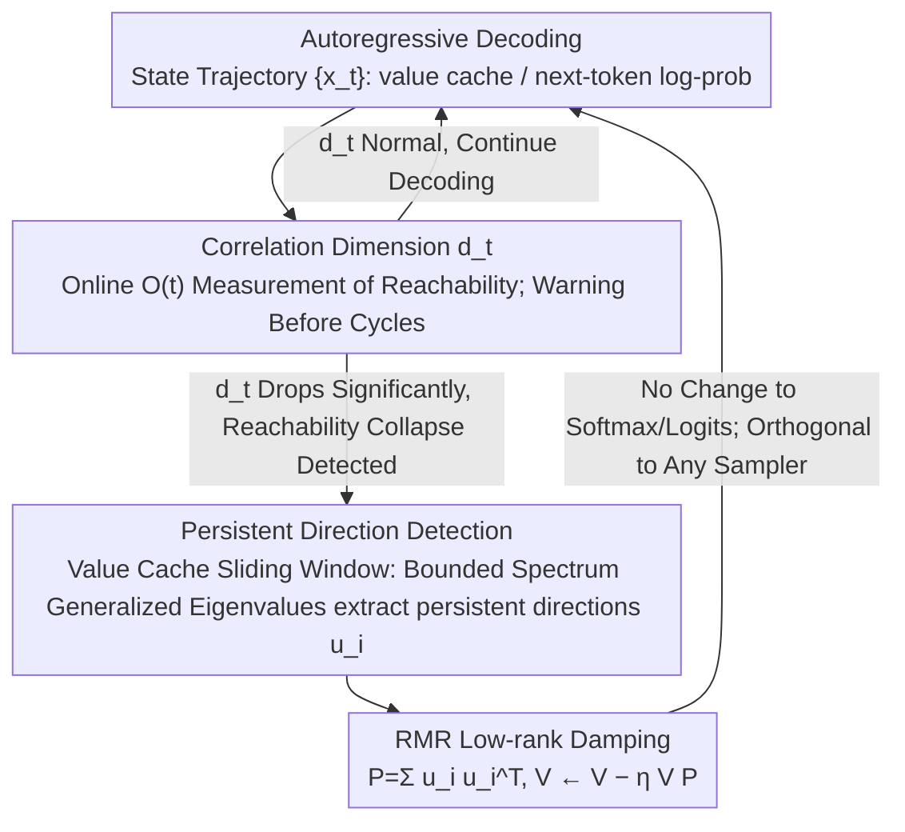

# Escaping Mode Collapse in LLM Generation via Geometric Regulation

**Conference**: ICML 2026  
**arXiv**: [2605.00435](https://arxiv.org/abs/2605.00435)  
**Code**: None  
**Area**: LLM Generation / Dynamical Systems / Decoding Control  
**Keywords**: Mode Collapse, Geometric Collapse, Correlation Dimension, KV Cache Intervention, Low-rank Damping

## TL;DR
This paper reinterprets "mode collapse" (repetition, cycles, monotony) in long-form LLM generation from a dynamical systems perspective as "geometric collapse" of hidden state trajectories in representation space. It proposes RMR—a lightweight low-rank damping on the Transformer value cache—to suppress the most persistent self-reinforcing directions, maintaining stable, high-quality generation even in extremely low-entropy decoding regimes ($0.8$ nats/step).

## Background & Motivation

**Background**: Long-text decoding failures (repetition, cycles, monotonic output) are major obstacles for LLM deployment. Mainstream mitigation methods are "token-level": top-k / top-p / temperature sampling, repetition penalties, and locally typical sampling, all of which modify the next-token probability distribution.

**Limitations of Prior Work**: These approaches are essentially "local, symbolic" patches. Under low-temperature or low-entropy targets (e.g., temperature $0.5$, entropy target $1.0$), models still frequently fall into loops. Token-level heuristics suppress symptoms without explaining why cycles emerge systematically, nor do they provide controllable knobs for long-range dynamics.

**Key Challenge**: Mode collapse is not just "incorrect probability for a certain token," but rather the "entire generation process sliding down a narrow path." Using "token-wise / local" tools to solve an inherently "trajectory / long-range" problem is naturally insufficient.

**Goal**: (1) Establish a geometric metric capable of directly characterizing long-range collapse; (2) Design a lightweight method to directly intervene in internal states without altering probability distributions.

**Key Insight**: Treat autoregressive decoding as a stochastic trajectory in a high-dimensional state space (where states are KV caches or next-token log-prob vectors). Mode collapse corresponds to the trajectory being trapped in a low-dimensional "quasi-attractor," representing "state-space reachability collapse."

**Core Idea**: Quantify "reachability" using correlation dimension. When a strongly self-reinforcing low-rank direction is detected (analogous to the order parameter in Ising model phase transitions), apply low-rank damping to the value cache to slightly attenuate these directions, thereby restoring the full-space exploration capability of the trajectory.

## Method

### Overall Architecture
The method shifts from "token-level firefighting" to "trajectory-level root-cause treatment," comprising diagnostic and intervention layers. The diagnostic layer uses a 2D state-dependent IFS (Iterative Function System) as a minimal dynamical model, proving that when the inverse temperature $\beta$ crosses a critical $\beta_0$, the system splits from a single ergodic invariant measure into two stable attraction domains—the geometric counterpart of mode collapse. The "finite-time correlation dimension" $d_t$ is then measured online in real LLMs to map this phase transition signal to the step-by-step next-token log-prob vector sequence. The intervention layer, RMR (Reinforced Mode Regulation), locates "temporally ultra-persistent" low-rank subspaces in recent value cache segments and applies damping. This generalizes the contraction of the historical mean in the minimal model to high dimensions, intervening purely in state space without altering softmax probabilities or logits.

### Key Designs

**1. Correlation Dimension: Turning "Trapped Trajectories" into Measurable Geometric Probes**

Token-level entropy / Distinct-n are stochastic variables on a single trajectory with high variance and hard-to-set thresholds, often alerting only after loops occur. The authors use a geometric invariant at the trajectory level to directly characterize "reachability collapse." Specifically, they compute the correlation sum $C_t(\varepsilon)=\frac{2}{t(t-1)}\sum_{i<j}\mathbf{1}(\|x_i-x_j\|<\varepsilon)$. The slope on a log-log plot against $\varepsilon$ yields the finite-time correlation dimension $d_t$ (based on the scaling law $C_t(\varepsilon)\propto\varepsilon^d$). To enable online computation, the $O(t^2)$ algorithm is rewritten as an $O(t)$ incremental update: $C_{t+1}(\varepsilon)=\frac{t-1}{t+1}C_t(\varepsilon)+\frac{2}{t(t+1)}\sum_i\mathbf{1}(\|x_i-x_{t+1}\|<\varepsilon)$. This allows $d_t$ to serve as an early warning (dropping significantly before explicit loops appear) while naturally aligning with the intervention target.

**2. Persistent Direction Detection: Identifying Directions for Suppression via Bounded Spectrum Generalized Eigenvalue Problems**

Applying full-dimensional damping to the value cache would damage normal semantics. Thus, the "most self-reinforcing, slowest-dissipating" directions must be precisely located—these are the high-dimensional counterparts of the historical mean $m_t$ in the minimal model. On a sliding window of the value cache matrix, covariance-like matrices are constructed for instantaneous and historical averages to solve a generalized eigenvalue problem. To avoid numerical explosion, a bounded spectrum form is used to map eigenvalues $\lambda\in[0,1]$ to "persistence intensity," followed by principled thresholding to select the few most significant directions far from the background spectrum. This restrained approach, informed by the minimal model in Section 3.2, shows that a weak damping of $\eta=10^{-4}$ suffices to restore reachability by suppressing only the most persistent directions with minimal destruction.

**3. RMR Low-rank Damping Update: Orthogonal, Training-free State Intervention on the Value Cache**

Given the selected directions, a low-rank projection $P=\sum_i u_i u_i^\top$ is constructed, and a low-rank update $V \leftarrow V - \eta\, V P$ is applied to the value cache. In high dimensions, this is equivalent to the $m_t\leftarrow(1-\eta)m_t$ contraction in the minimal model. This operation introduces only one small matrix multiplication, with overhead comparable to or lower than a single attention operation. Because the intervention occurs at the state level (value cache) and does not touch the analytical form of token probabilities, RMR can be orthogonally combined with any sampler (top-p, temperature, contrastive decoding, etc.). It is a pure inference-time method requiring no training, fine-tuning, or reward models. The only two hyperparameters are the damping coefficient $\eta$ and target rank $r$; the authors suggest $\eta\in[10^{-3},10^{-2}]$ and $r\in\{2,4,8\}$ for most models.

## Key Experimental Results

### Main Results
The authors tested multiple open-source LLMs (including Qwen3-4B-Base) under "temperature-locked" and "entropy-locked" protocols. The core metric is the "non-collapse rate" (ratio of samples without explicit loops during long generation).

| Decoding Setup | Baseline non-collapse | RMR non-collapse | Remarks |
|---|---|---|---|
| Temperature = 0.7 | 8% | **56%** | Significant improvement |
| Entropy target = 1.0 nats/step | 5% | **33%** | Baseline almost entirely collapses in low-entropy regions |
| Entropy target ≈ 2.0 nats/step | Near saturation | Near saturation | Gap narrows at high entropy |
| Entropy target = 0.8 nats/step | Near 0 | Still usable | RMR opens a new usable low-entropy regime |

### Ablation Study

| Configuration | Non-collapse Performance | Description |
|---|---|---|
| RMR full | Significant recovery | Detection + Low-rank Damping |
| Detection only, no damping | Comparable to baseline | Verifies intervention is necessary; diagnosis alone is insufficient |
| Full-dimension damping (non-LR) | Text quality drops | Highlights the value of the "minimal necessary intervention" principle |
| Token-level repetition penalty only | Limited improvement | Verifies symbol-level methods fail in low-temperature regions |

### Key Findings
- Correlation dimension $d_t$ drops significantly **before** explicit loops appear, serving as an early warning more sensitive than entropy or Distinct-n.
- "Persistent directions" are extremely sparse (typically < 8 dimensions), confirming the intuition that the "order parameter is low-dimensional" and explaining why low-rank damping is effective.
- RMR extends the usable decoding regime from $\sim 2.0$ nats/step to $\sim 0.8$ nats/step, unlocking a "high-determinism + high-diversity" operating zone previously unusable due to loops.

## Highlights & Insights
- **Interdisciplinary Analogy**: Bridges LLM decoding with non-equilibrium statistical physics (Ising phase transitions, slow variables, self-organization). The mapping between correlation dimension and order parameters is elegant—this "trajectory geometry" perspective is closer to the root problem than token probabilities.
- **Diagnosis-Intervention Loop**: Qualitatively identifies "reachability collapse" with correlation dimension and solves it directionally with low-rank damping. The full pipeline is self-consistent and derived from theory rather than trial-and-error.
- **Transferable Trick**: The path of "low-rank / low-overhead intervention on the value cache" may apply to other long-range issues (hallucination drift, CoT collapse, repetitive tool calls in agents)—all of which are "trajectory traps" in high-dimensional latent space.

## Limitations & Future Work
- Experiments focused on open-ended text generation and the Qwen3 series; coverage on reasoning / agent / code tasks is limited. The assumption that "persistent direction = unwanted direction" might not hold for structured tasks.
- Correlation dimension estimation is sensitive to window length; the online algorithm still relies on empirical thresholds $\varepsilon_0,\varepsilon_1$. Automatic threshold selection is a potential improvement.
- RMR is currently an "ex-post intervention." Feeding persistent direction detection signals back into training targets (e.g., adding a geometric term to RLHF rewards) is an obvious next step.

## Related Work & Insights
- **vs Locally Typical Sampling / top-p**: They modify probabilities; this modifies states. They are orthogonal and can be used together.
- **vs activation steering (Zou 2023 / Turner 2023)**: Also intervenes on the cache, but RMR's direction comes from "temporal persistence" rather than task vectors, aiming to stabilize dynamics rather than control semantics.
- **vs Existing repetition penalty**: Fundamentally avoids engineering patches like "N-gram history windows"; the mechanism is more universal.

## Rating
- Novelty: ⭐⭐⭐⭐⭐ Redefines mode collapse using dynamical systems/phase transitions; provides computable geometric metrics and corresponding interventions.
- Experimental Thoroughness: ⭐⭐⭐⭐ Complete comparisons across models and protocols, but lacks coverage of reasoning/agent long-range tasks.
- Writing Quality: ⭐⭐⭐⭐ Clear theoretical narrative; smooth transition from minimal models to real LLM intervention.
- Value: ⭐⭐⭐⭐ Provides a "free" new regime for low-entropy decoding; minimal deployment friction with significant engineering value.

<!-- RELATED:START -->

## Related Papers

- [\[CVPR 2026\] DiverseGRPO: Mitigating Mode Collapse in Image Generation via Diversity-Aware GRPO](../../CVPR2026/image_generation/diversegrpo_mitigating_mode_collapse_in_image_generation_via_diversity-aware_grp.md)
- [\[CVPR 2026\] Taming Preference Mode Collapse via Directional Decoupling Alignment in Diffusion Reinforcement Learning](../../CVPR2026/image_generation/taming_preference_mode_collapse_via_directional_decoupling_alignment_in_diffusio.md)
- [\[ICML 2026\] Quantifying Error Propagation and Model Collapse in Diffusion Models](quantifying_error_propagation_and_model_collapse_in_diffusion_models.md)
- [\[ICML 2026\] Information-Geometric Adaptive Sampling for Graph Diffusion](information-geometric_adaptive_sampling_for_graph_diffusion.md)
- [\[ICML 2026\] Restoring Initial Noise Sensitivity in Text-to-Image Distillation via Geometric Alignment](restoring_initial_noise_sensitivity_in_text-to-image_distillation_via_geometric_.md)

<!-- RELATED:END -->
