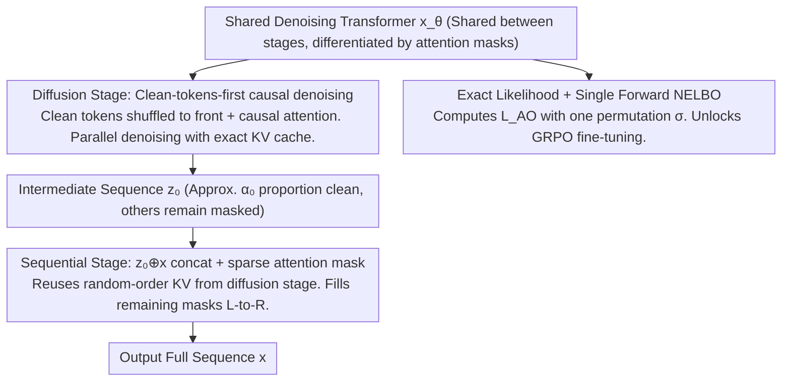

# Esoteric Language Models: A Family of Any-Order Diffusion LLMs

**Conference**: ICML 2026  
**arXiv**: [2506.01928](https://arxiv.org/abs/2506.01928)  
**Code**: https://s-sahoo.com/Eso-LMs (Available)  
**Area**: LLM Pre-training / Discrete Diffusion Language Models  
**Keywords**: Masked Diffusion LM, Any-Order AR, KV Cache, Causal Attention, Hybrid Training

## TL;DR
Eso-LMs deeply integrate AR and Masked Diffusion at the loss, attention, and sampling levels. By utilizing a "causal-on-shuffled-sequence" denoising Transformer, it simultaneously supports parallel diffusion and left-to-right AR. This marks the **first time an MDM can utilize exact KV cache during the diffusion phase**, achieving 14–65× speedups over MDLM and 3–4× over BD3-LM on OWT long contexts, while reaching SOTA on the speed–quality Pareto frontier.

## Background & Motivation
**Background**: Language models are evolving from pure AR toward a dual path of "AR + Discrete Diffusion." AR models offer the best quality but are restricted to token-by-token decoding. Masked Diffusion LMs (MDMs), represented by MDLM, support parallel and controllable generation, approaching LLaMA performance in math/code/science at the 8B scale.

**Limitations of Prior Work**: MDMs face two fatal bottlenecks for deployment. First, slow inference—despite being "parallel," denoising Transformers use **bidirectional attention**, requiring full sequence re-computation of Q/K/V at every step, which **prevents KV caching** and makes them slower than AR for long sequences. Second, exact likelihood cannot be calculated—NELBO is only an upper bound, making it difficult to obtain a usable policy log-prob for RL fine-tuning like GRPO. BD3-LM segments sequences into blocks (AR between blocks, MDM within), but it **can only cache between blocks**; internal block processing still requires a full forward pass, and small blocks ($\le 16$) lead to severe "parallel decoding conflicts" that collapse sample quality at low NFE.

**Key Challenge**: AR's "causal attention" is the prerequisite for KV cache, while MDM's "bidirectional attention" is the prerequisite for parallel denoising—the two are architecturally mutually exclusive. Any solution seeking the best of both must answer: "What attention mechanism supports both random-order denoising and KV reuse?"

**Goal**: (1) Design a shared denoising Transformer that handles both parallel diffusion and left-to-right AR generation modes; (2) Support **exact KV cache** (not an approximation) during the diffusion phase; (3) Provide the first calculable exact likelihood formula for MDM to enable RL-based objectives.

**Key Insight**: The authors leverage the equivalence revealed by Ou et al. (2025)—the MDM NELBO is equivalent to the "Any-Order AR" loss $L_\text{AO} = -\mathbb{E}_\sigma \sum_\ell \log p_\theta(x^{\sigma(\ell)} \mid x^{\sigma(<\ell)})$ averaged over all permutations $\sigma$. Since MDM is essentially AO-AR, it can be **trained directly as an AR model**: by shuffling clean tokens in $z_t$ to the front and masked tokens to the back, using standard causal attention makes the model both an MDM and an AR model simultaneously.

**Core Idea**: Use a "clean-tokens-first + causal attention on shuffled sequence" denoising Transformer to implement both parallel diffusion and AR. By adding an AR loss and a specialized sparse attention mask, the AR phase can reuse random-order KVs built during the diffusion phase, forming a two-stage sampler that "first lays a parallel layer with MDM, then fills gaps with AR."

## Method

### Overall Architecture
Eso-LMs decompose the generation process into two segments: "parallel layer first, then AR gap-filling," expressed as $p_\theta(x) = \sum_{z_0} p^\text{AR}_\theta(x \mid z_0)\, p^\text{MDM}_\theta(z_0)$. The MDM component first parallel-denoises a **partially masked intermediate sequence** $z_0$ (where an average proportion $\alpha_0$ of positions are clean), and the AR component then completes the remaining masks in $z_0$ from left to right. Here $\alpha_0$ is a continuous hyperparameter; $\alpha_0=1$ degrades to pure MDM, while $\alpha_0=0$ degrades to pure AR. A **shared denoising Transformer** $x_\theta$ handles the entire pipeline, using different attention masks to distinguish phases. Its variational upper bound decomposes into an AR cross-entropy term and an MDM NELBO term. During training, batches are split by ratio $\kappa$ (default 0.5) between AR loss and MDM loss.

### Key Designs

**1. Clean-tokens-first Causal Denoising in Diffusion: Transforming MDM into a KV-cacheable AR**

The root cause of MDM's slow inference is that bidirectional attention makes "already predicted tokens" dependent on "future tokens to be decoded," forcing Q/K/V re-computation over the full sequence at every step. Eso-LMs sever this link: given $z_t \sim q_t(\cdot \mid x)$, **clean tokens are shuffled to the front of the sequence with their original positional embeddings, while masked tokens are moved to the back**, followed by standard left-to-right causal attention training for denoising. This rearrangement is the implementation of the Any-Order AR perspective—random-order MDM is essentially "just one permutation of AR." By reordering into a causal sequence based on generation order, it becomes both MDM and AR without sacrificing parallelism (one forward pass still denoises a batch of masks). After reordering, clean tokens are causally visible to each other, corresponding to "already decoded clean tokens" during sampling, allowing KV cache reuse. Masked tokens only attend to clean tokens on their left and cannot see future masks, satisfying the causal constraint of sampling. Consequently, the forward pass for each sampling step only processes "already clean tokens + current masks" rather than the entire sequence, reducing the MDM inference bottleneck from $O(L^2)$ to $O(L)$.

**2. $z_0 \oplus x$ Concatenation + Sparse Attention Mask in Sequential Stage: Enabling AR to Reuse Random-Order KV**

Pure AR training requires every predicted token to have a full clean left context, but masks interspersed in $z_0$ lack this. Conventional methods would abandon the cache and re-run the forward pass. Eso-LMs utilize a "pseudo left context" trick: during training, the clean+masked $z_0$ and the full $x$ are concatenated into a $2L$ sequence $z_0 \oplus x$ and fed into the same Transformer. It uses a $2L \times 2L$ structured sparse attention bias $A$ dependent on permutation $\sigma$: clean tokens precede masks under $\sigma$, mask tokens maintain natural order, and each target mask position $i$ can only attend to true left tokens $x_{<i}$. The $x$ side output is discarded, and only the logits of mask positions on the $z_0$ side compute AR cross-entropy. Since clean tokens were generated and cached in $\sigma$ order during diffusion, AR sampling simply reuses this KV and causally decodes masks one by one. This is equivalent to training the AR to perform conditional prediction "based on a non-naturally ordered KV sequence," seamlessly bridging the cache across stages. The cost is a doubled sequence length, but since only half the batch uses AR training, overall training is only ~1.37× slower than MDLM.

**3. First Exact Likelihood Estimation for MDM + Single Forward NELBO: Unlocking GRPO-style RL**

To perform RL fine-tuning on MDMs, one must calculate the policy $\log p$, but the original NELBO is only an upper bound and requires $L$ forward passes per data point, while exact likelihood was missing. Based on $L_\text{AO}$ equivalence, the authors prove an importance-weighted bound (Theorem 3.1): $L^K_\text{AO} = -\mathbb{E}_{\sigma_{1:K}}\left[\log \tfrac{1}{K} + \log\sum_{k=1}^K \exp\sum_\ell \log p_\theta(x^{\sigma_k(\ell)} \mid x^{\sigma_k(<\ell)})\right]$. They show that $-\log p_\theta(x) \le L^K_\text{AO} \le L_\text{MDM}$, that $L^K_\text{AO}$ monotonically decreases with $K$, and converges to the true likelihood as $K\to\infty$. This is the first (asymptotic) exact likelihood formula for MDM. Furthermore, because one permutation $\sigma$ characterizes all $L$ latents along a diffusion trajectory, $L_\text{AO}$ in Eso-LMs can be computed in a single forward pass (impossible in MDLM due to bidirectional attention). Table 2 shows MDLM using 10 MC samples yields a $L_\text{MDM}$ std dev of 0.56, while Eso-LMs using 1 $\sigma$ yields an $L_\text{AO}$ std dev of only 0.03—more accurate and efficient. This estimator has already been used by subsequent work Wang et al. (2025b) for GRPO likelihood, outperforming Black et al. (2024) and Zhao et al. (2025) at 0.1B and 8B scales.

### Loss & Training
The total objective is the variational upper bound of Eq. (7): $-\log p_\theta(x) \le \mathbb{E}_{z_0}[\text{AR loss}] + \mathbb{E}_{q_t,t}[\text{MDM loss}]$. Batches are split by $\kappa$: $\kappa=0.5$ for diffusion loss and $1-\kappa$ for AR loss ($\kappa=1$ when $\alpha_0=1$). In AR loss, the replacement operator $\odot$ substitutes the first $\ell-1$ positions of $z_0$ with ground truth $x_{<i}$ to ensure predicted masks have clean left context. The noise schedule uses linear $\alpha_t = \alpha_0(1-t)$. When $\alpha_0=1$, replacing the MDM loss coefficient $\alpha'_t/(1-\alpha_t)$ with $-1$ empirically reduces training variance and accelerates convergence.

## Key Experimental Results

### Main Results
Test perplexity on LM1B ($L=128$, 1M steps) and OWT ($L=1024$, 250K steps) shows smooth interpolation between AR and MDM:

| Method | LM1B PPL (NELBO) | LM1B PPL (Exact) | OWT PPL (NELBO) | OWT PPL (Exact) |
|------|------------------|------------------|-----------------|-----------------|
| AR Transformer | – | 21.86 | – | 17.78 |
| MDLM | 31.78 | 26.82 | 25.19 | – |
| BD3-LM ($L'=4$) | 28.23 | – | 20.96 | – |
| **Ours ($\alpha_0=1$)** | 36.12 | 31.65 | 30.06 | 29.31 |
| **Ours ($\alpha_0=0.5$)** | 32.53 | 28.07 | 27.94 | 26.61 |
| **Ours ($\alpha_0=0.125$)** | 26.29 | 23.02 | 21.92 | 20.53 |
| **Ours ($\alpha_0=0)$** | – | 21.86 | – | 17.78 |

Long-context sampling latency (OWT, $T \gg L$, at same NFE level as AR):

| Context $L$ | vs MDLM Speedup | vs BD3-LM ($L'{=}16$) Speedup | vs BD3-LM ($L'{=}4$) Speedup |
|--------|--------------|--------------------------|--------------------------|
| 2048 | ~14× | Significant | Significant |
| 8192 | ~65× | ~3.2× | ~3.8× |
| 10240 (Post-FT) | ~5× vs BD3-LM at same quality | – | – |

### Ablation Study

| Configuration | Key Finding | Note |
|------|---------|------|
| Eso-LM ($\alpha_0=1$, full) | LM1B NELBO 36.12 | Approx 4 points worse than MDLM |
| Eso-LM (A): Causal mask on masks only, clean remains bidirectional | Match MDLM at $\alpha_0=1$ | Shows PPL gap mainly comes from "causal clean tokens"—the price for KV cache |
| $\kappa$ Scan (Table 4) | $\kappa=0.5$ is optimal | Best performance when AR and MDM losses share training samples equally |
| MC Estimated NELBO (Table 2) | $L_\text{AO}$ 1-sample σ=0.03 vs $L_\text{MDM}$ 10-sample σ=0.56 | Single forward pass is more accurate |
| Block sampler vs Original Ancestral | Significant MAUVE boost at low NFE | Parallelizing distant masks avoids local conflicts |

### Key Findings
- On the speed–quality Pareto frontier (Fig. 4, MAUVE vs. Sampling Time), Eso-LMs dominate both MDLM and BD3-LM; while BD3-LM quality collapses in the low NFE range, Eso-LM remains stable.
- $\alpha_0=1$ training is sufficient: The authors found that a model with $\alpha_0^\text{train}=1$ can cover the entire Pareto frontier by adjusting $\alpha_0^\text{eval}$ during sampling, precluding the need to train separate models for each operating point (Remark 2).
- Smaller $\alpha_0$ leads to closer AR behavior, reducing the gap between exact PPL and NELBO PPL—validating the tightness differences of the IW bound and NELBO across interpolation points.

## Highlights & Insights
- While the "Any-Order AR ≡ MDM" equivalence was previously known, the authors are the first to provide an **architectural implementation**: through "shuffling + causal" steps, MDM is transformed into a KV-cacheable AR variant without adding parameters. This is a highly engineered yet powerful insight.
- The $z_0 \oplus x$ concatenation + sparse mask design is clever: it delegates the conflict between "AR needing left context" and "MDM providing random-order KV" to the training phase via a separate context, allowing the inference phase to simply reuse the diffusion cache.
- Exact likelihood + single forward NELBO is not just theoretically elegant; it directly connects MDMs to the mainstream GRPO RL pipeline, a utility proven by subsequent 8B-scale work (Wang et al. 2025b). This impact exceeds surface PPL numbers.
- The remark that "perplexity at finite NFE does not reflect quality" serves as a critique of current diffusion LM evaluation—while the $\alpha_0=1$ Eso-LM PPL is worse than MDLM, its sample quality is better under any fixed time budget. It reminds the community not to over-optimize for PPL alone.

## Limitations & Future Work
- The authors acknowledge: At $\alpha_0 < 1$, training is ~1.37× slower than MDLM (doubled sequence length), though still faster than BD3-LM; at $\alpha_0=1$, NELBO is ~4 points higher than MDLM (due to "causal clean tokens"); KV reuse involves a one-step delay, making it slightly slower than AR at the same NFE.
- Additional limitations observed: (i) Experiments were conducted at academic scales like LM1B/OWT (~9K H200 GPU hours), lacking instruction tuning or downstream tasks; scaling is supported mostly by citations of 1.7B results in Sahoo et al. 2026. (ii) The "$\alpha_0^\text{train}=1$ is sufficient" finding was only validated on the OWT distribution. (iii) $2L$ concatenation in the sequential phase is memory-intensive; stability in fp16/bf16 during long-context fine-tuning warrants further investigation.
- Future directions: Evolving the Eso-LM (A) design ("bidirectional clean, causal masks") might recover PPL without losing cache; another path is integrating the IW bound directly into RLHF/RLAIF pipelines for MDM versions of DPO/GRPO.

## Related Work & Insights
- **vs MDLM (Sahoo et al., 2024a)**: Both are MDMs, but MDLM uses a bidirectional DiT which prevents caching; Eso-LMs use causal-on-shuffled-sequence, making long-context inference 1-2 orders of magnitude faster at the cost of slightly higher NELBO at $\alpha_0=1$.
- **vs BD3-LMs (Arriola et al., 2025)**: Both perform AR–MDM interpolation, but BD3-LM interpolates via block size with caching only between blocks, leading to quality collapse at small block sizes; Eso-LMs interpolate via $\alpha_0$ at the token level with full cache, proving superior on the Pareto frontier.
- **vs Pannatier et al. (2024) / Xue et al. (2025)**: These are special cases of Eso-LMs with $\alpha_0=1$; Xue adds AdaLN for position information, whereas Eso-LMs use only attention masks without extra parameters.
- **vs Concurrent KV cache work (Hu 2025, Wu 2025, Ma 2025)**: These use **approximate** caches (requiring internal block forwards or frequent refreshes), which degrade on long sequences; Eso-LMs use **exact** cache.

## Rating
- Novelty: ⭐⭐⭐⭐⭐ Architecturally implements the Any-Order AR perspective and provides the first exact likelihood and exact diffusion KV cache, solving long-standing MDM community issues.
- Experimental Thoroughness: ⭐⭐⭐⭐ Covers LM1B/OWT, long contexts, ablations, and Pareto frontiers; only lacks real-world downstream tasks and large-scale instruction fine-tuning.
- Writing Quality: ⭐⭐⭐⭐⭐ Formulas and diagrams (Fig. 1 feature comparison, Fig. 2 unified KV cache, Fig. 3 training/attention) are exceptionally clear, effectively explaining a non-intuitive design.
- Value: ⭐⭐⭐⭐⭐ A critical engineering unlock for diffusion LMs—14–65× speedup for long contexts + single forward NELBO makes GRPO feasible on MDMs, already being reused in 8B-scale work.

<!-- RELATED:START -->

## Related Papers

- [\[ICML 2026\] $f$-Trajectory Balance: A Loss Family for Tuning GFlowNets, Generative Models, and LLMs with Off- and On-Policy Data](f-trajectory_balance_a_loss_family_for_tuning_gflownets_generative_models_and_ll.md)
- [\[ICLR 2026\] Any-Order Flexible Length Masked Diffusion](../../ICLR2026/image_generation/any-order_flexible_length_masked_diffusion.md)
- [\[ICML 2026\] A Systematic Investigation of RL-Jailbreaking in LLMs](a_systematic_investigation_of_rl-jailbreaking_in_llms.md)
- [\[ICML 2026\] EvoGM: Learning to Merge LLMs via Evolutionary Generative Optimization](evogm_learning_to_merge_llms_via_evolutionary_generative_optimization.md)
- [\[ICLR 2026\] Any-step Generation via N-th Order Recursive Consistent Velocity Field Estimation](../../ICLR2026/image_generation/any-step_generation_via_n-th_order_recursive_consistent_velocity_field_estimatio.md)

<!-- RELATED:END -->
