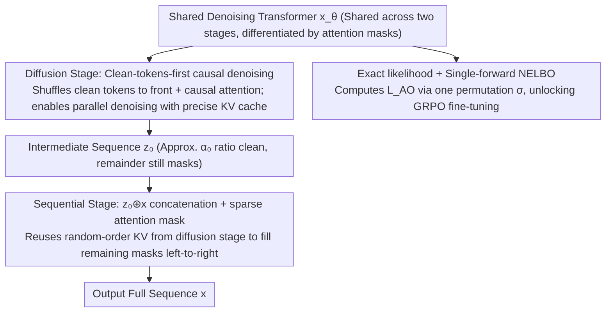

# Esoteric Language Models: A Family of Any-Order Diffusion LLMs

**Conference**: ICML 2026  
**arXiv**: [2506.01928](https://arxiv.org/abs/2506.01928)  
**Code**: https://s-sahoo.com/Eso-LMs (Available)  
**Area**: LLM Pre-training / Discrete Diffusion Language Models  
**Keywords**: Masked Diffusion LM, Any-Order AR, KV Cache, Causal Attention, Hybrid Training

## TL;DR
Eso-LMs deeply integrate Autoregressive (AR) and Masked Diffusion at three levels: loss, attention, and sampling. By using a causal-on-shuffled-sequence denoising Transformer to support both parallel diffusion and left-to-right AR, it enables the **first precise KV cache for MDMs during the diffusion phase**. This results in 14–65× speedups over MDLM and 3–4× over BD3-LM on OWT long contexts, achieving a SOTA speed–quality Pareto frontier.

## Background & Motivation
**Background**: Language modeling is evolving from pure AR to a dual approach of "AR + Discrete Diffusion." While AR models offer the best quality, they are restricted to token-by-token decoding. Masked Diffusion LMs (MDMs), such as MDLM, support parallel and controllable generation, and have approached LLaMA-level performance in math, code, and science at the 8B scale.

**Limitations of Prior Work**: MDM deployment faces two critical bottlenecks. First, inference is slow—despite "parallel decoding," the denoising Transformer utilizes **bidirectional attention**, requiring full re-computation of Q/K/V at every step over the entire sequence, making it **impossible to use KV cache** and slower than AR for long sequences. Second, exact likelihood cannot be computed—the NELBO is only an upper bound, making it difficult to obtain usable policy log-probs for RL fine-tuning like GRPO. BD3-LM partitions sequences into blocks (AR between blocks, MDM within), but can **only cache between blocks**, requiring full forwards within blocks; furthermore, small block sizes ($\le 16$) lead to severe "parallel decoding conflicts," causing sample quality to collapse at low NFE.

**Key Challenge**: The "causal attention" of AR is the prerequisite for KV cache, while the "bidirectional attention" of MDM is the prerequisite for parallel denoising—the two architectures are mutually exclusive. Any solution seeking the benefits of both must answer: "What attention mechanism supports both random-order denoising and KV reuse?"

**Goal**: (1) Design a shared denoising Transformer that supports both parallel diffusion and left-to-right AR generation modes; (2) Support **precise KV cache** (not an approximation) during the diffusion phase; (3) Provide the first computable exact likelihood formula for MDMs to enable RL-style objectives.

**Key Insight**: The authors leverage the equivalence revealed by Ou et al. (2025)—the MDM NELBO is equivalent to the "Any-Order AR" loss averaged over all permutations $\sigma$: $L_\text{AO} = -\mathbb{E}_\sigma \sum_\ell \log p_\theta(x^{\sigma(\ell)} \mid x^{\sigma(<\ell)})$. Since MDM is essentially AO-AR, it can be **trained directly as an AR model**: by shuffling clean tokens in $z_t$ to the front and masked tokens to the back, and applying standard causal attention, the model remains both an MDM and an AR.

**Core Idea**: A denoising Transformer using "clean-tokens-first + causal attention on shuffled sequence" enables both parallel diffusion and AR. By adding an AR loss and a specialized sparse attention mask, the AR phase can reuse the random-order KV cache established during the diffusion phase, forming a two-stage sampler that "first populates a layer via MDM parallelly, then fills the gaps via AR."

## Method

### Overall Architecture
Eso-LMs decompose the generation process into two stages: "parallel population followed by AR filling," expressed as $p_\theta(x) = \sum_{z_0} p^\text{AR}_\theta(x \mid z_0)\, p^\text{MDM}_\theta(z_0)$. The MDM component first performs parallel denoising to produce a **partially masked intermediate sequence** $z_0$ (where on average a ratio $\alpha_0$ of positions are clean), and the AR component subsequently completes the remaining masks in $z_0$ from left to right. Here, $\alpha_0$ is a continuous hyperparameter where $\alpha_0=1$ reduces to pure MDM, $\alpha_0=0$ reduces to pure AR, and intermediate values provide a smooth interpolation in perplexity. The entire pipeline is handled by **a single shared denoising Transformer** $x_\theta$, differentiated by attention masks. Its variational upper bound decomposes into an AR cross-entropy term and an MDM NELBO; during training, half the batch (ratio $\kappa=0.5$) is assigned to AR loss and the other half to MDM loss.

### Key Designs

**1. Clean-tokens-first causal denoising in Diffusion: Transforming MDM into KV-cacheable AR**

The root cause of slow MDM inference is that bidirectional attention makes "predicted tokens" dependent on "future tokens to be decoded," requiring full sequence Q/K/V re-computation and preventing caching. Eso-LMs sever this link: given $z_t \sim q_t(\cdot \mid x)$, **clean tokens are shuffled to the front of the sequence with their original positional embeddings, while mask tokens are placed at the back**, and denoising is trained using standard left-to-right causal attention. This reordering implements the Any-Order AR perspective—random-order MDM is essentially "just one permutation of AR." Reordering into a causal sequence according to generation order allows both MDM and AR properties without sacrificing parallelism (one forward still denoises a batch of masks). Within the reordered sequence, clean tokens are causally visible to each other, corresponding to tokens decoded in previous steps, allowing KV cache to be reused. Mask tokens only attend to clean tokens on their left and cannot see future masks, satisfying causal constraints. Consequently, the forward pass for each sampling step only processes "already clean tokens + current masks" rather than the full sequence, reducing the MDM inference bottleneck from $O(L^2)$ to $O(L)$.

**2. $z_0 \oplus x$ concatenation + sparse attention mask in Sequential stage: Reusing Diffusion KV in AR**

Pure AR training requires each predicted token to have full clean left context, but the mixture of clean and mask tokens in $z_0$ lacks this. Eso-LMs use a "pseudo left context" trick: during training, the clean+mask $z_0$ and full $x$ are concatenated into a length-$2L$ sequence $z_0 \oplus x$ and fed into the same Transformer with a $2L \times 2L$ structured sparse attention bias $A$ dependent on permutation $\sigma$. Clean tokens appear before masks under $\sigma$, mask tokens maintain their natural order, and each target mask position $i$ attends only to its true left-side tokens $x_{<i}$. The $x$ side output is discarded, and only logits at $z_0$ mask positions are used for AR cross-entropy. Since clean tokens were generated and cached in $\sigma$-order during diffusion, the AR stage directly reuses this KV cache and decodes masks causally. This allows the AR to learn "conditional prediction based on a non-natural order KV sequence," seamlessly transitioning the cache. The implementation requires less than a screen of code using FlexAttention (Fig. 9). While doubling sequence length, only half the training batch undergoes AR, making overall training only ~1.37× slower than MDLM.

**3. First Exact Likelihood Estimation for MDM + Single-Forward NELBO: Unlocking GRPO-style RL**

RL fine-tuning requires calculating the policy $\log p$, but the MDM NELBO is only an upper bound and requires $L$ forwards per datapoint, with exact likelihood being unavailable. Based on $L_\text{AO}$ equivalence, the authors prove an importance-weighted bound (Theorem 3.1): $L^K_\text{AO} = -\mathbb{E}_{\sigma_{1:K}}\left[\log \tfrac{1}{K} + \log\sum_{k=1}^K \exp\sum_\ell \log p_\theta(x^{\sigma_k(\ell)} \mid x^{\sigma_k(<\ell)})\right]$. They show $-\log p_\theta(x) \le L^K_\text{AO} \le L_\text{MDM}$, where $L^K_\text{AO}$ monotonically decreases with $K$ and converges to the true likelihood as $K\to\infty$, providing the first (asymptotic) exact likelihood for MDMs (using Eso-LMs $\alpha_0=1$ as a proxy). Remarkably, a single permutation $\sigma$ characterizes $L$ latents along the diffusion trajectory, allowing $L_\text{AO}$ to be computed in one forward pass—something MDLM cannot do due to bidirectional attention. Table 2 shows MDLM has a std dev of 0.56 using 10 MC samples for $L_\text{MDM}$, while Eso-LMs achieves a std dev of only 0.03 using 1 $\sigma$ for $L_\text{AO}$. This estimator has been adopted by subsequent work (Wang et al., 2025b) for GRPO likelihood, outperforming Black et al. (2024) and Zhao et al. (2025) at 0.1B and 8B scales.

### Loss & Training
The total objective is the variational upper bound in Eq. (7): $-\log p_\theta(x) \le \mathbb{E}_{z_0}[\text{AR loss}] + \mathbb{E}_{q_t,t}[\text{MDM loss}]$. Batches are split via $\kappa=0.5$ between diffusion and AR losses ($\kappa=1$ if $\alpha_0=1$). In the AR loss, a replacement operator $\odot$ substitutes the first $\ell-1$ positions of $z_0$ with ground truth $x_{<i}$ to ensure predicted masks have clean contexts. Noise scheduling follows a linear $\alpha_t = \alpha_0(1-t)$. For $\alpha_0=1$, replacing the MDM loss coefficient $\alpha'_t/(1-\alpha_t)$ with $-1$ empirically reduces variance and speeds up convergence.

## Key Experimental Results

### Main Results
Testing perplexity on LM1B ($L=128$, 1M steps) and OWT ($L=1024$, 250K steps) shows smooth interpolation between AR and MDM:

| Method | LM1B PPL (NELBO) | LM1B PPL (Exact) | OWT PPL (NELBO) | OWT PPL (Exact) |
|------|------------------|------------------|-----------------|-----------------|
| AR Transformer | – | 21.86 | – | 17.78 |
| MDLM | 31.78 | 26.82 | 25.19 | – |
| BD3-LM ($L'=4$) | 28.23 | – | 20.96 | – |
| **Eso-LM ($\alpha_0=1$)** | 36.12 | 31.65 | 30.06 | 29.31 |
| **Eso-LM ($\alpha_0=0.5$)** | 32.53 | 28.07 | 27.94 | 26.61 |
| **Eso-LM ($\alpha_0=0.125$)** | 26.29 | 23.02 | 21.92 | 20.53 |
| **Eso-LM ($\alpha_0=0)$** | – | 21.86 | – | 17.78 |

Long-context sampling latency (OWT, $T \gg L$, same NFE order as AR):

| Context $L$ | Speedup vs MDLM | Speedup vs BD3-LM ($L'{=}16$) | Speedup vs BD3-LM ($L'{=}4$) |
|--------|--------------|--------------------------|--------------------------|
| 2048 | ~14× | Significant | Significant |
| 8192 | ~65× | ~3.2× | ~3.8× |
| 10240 (Fine-tuned) | ~5× (Matched Quality vs BD3-LM) | – | – |

### Ablation Study

| Configuration | Key Observation | Explanation |
|------|---------|------|
| Eso-LM ($\alpha_0=1$, full) | LM1B NELBO 36.12 | Approx. 4 pts worse than MDLM |
| Eso-LM (A): Causal only on masks, clean still bidirectional | Matches MDLM at $\alpha_0=1$ | Confirms PPL gap is mainly from "causal attention between clean tokens"—the cost of KV cache |
| $\kappa$ sweep (Table 4) | $\kappa=0.5$ optimal | Balanced AR/MDM loss distribution is best |
| MC estimate for NELBO (Table 2) | $L_\text{AO}$ 1-sample $\sigma=0.03$ vs $L_\text{MDM}$ 10-sample $\sigma=0.56$ | Single forward is more accurate and efficient |
| Block sampler vs original ancestral | Significant MAUVE gain at low NFE | Parallelizing distant masks avoids near-neighbor conflicts |

### Key Findings
- **Speed–quality Pareto frontier**: Eso-LMs dominate MDLM and BD3-LM across the board (Fig. 4, MAUVE vs Latency). BD3-LM quality collapses at low NFE, whereas Eso-LM remains robust.
- **$\alpha_0=1$ training is sufficient**: The authors find that a model trained with $\alpha_0^\text{train}=1$ can cover the entire Pareto frontier by adjusting $\alpha_0^\text{eval}$ during sampling (Remark 2), eliminating the need for point-specific training.
- Smaller $\alpha_0$ values (closer to AR) reduce the gap between exact PPL and NELBO PPL, validating the tightness of the IW bound and NELBO across interpolation points.

## Highlights & Insights
- While the "Any-Order AR ≡ MDM" equivalence was known, this work is the first to **implement it at the architectural level**. Converting MDM into a KV-cacheable AR variant via "shuffle + causal" is a highly effective engineering insight that adds no extra parameters.
- The $z_0 \oplus x$ concatenation + sparse mask design is clever—it resolves the conflict between AR's requirement for left context and MDM's random KV order by absorbing the burden in the training phase, allowing for direct cache reuse during inference.
- Exact likelihood and single-forward NELBO are not just theoretical curiosities; they integrate MDM into mainstream RL toolchains (like GRPO), as validated by subsequent 8B scale works. This is arguably more impactful than the perplexity numbers.
- The remark that "perplexity does not reflect quality at finite NFE" is a critique of diffusion LM evaluation—while $\alpha_0=1$ Eso-LMs have worse PPL than MDLM, their sample quality is superior under any fixed time budget.

## Limitations & Future Work
- The authors acknowledge that training is ~1.37× slower than MDLM when $\alpha_0 < 1$ (due to doubled sequence length), though still faster than BD3-LM. There is a ~4 pt NELBO gap at $\alpha_0=1$ compared to MDLM, principally due to the causal constraint on clean tokens. Parallelism introduces a slight delay compared to AR for the same NFE.
- **Additional limitations**: (i) Experiments were limited to academic scales (LM1B/OWT, ~9K H200 hours), lacking instruction tuning and downstream benchmarks; (ii) The sufficiency of $\alpha_0^\text{train}=1$ was only verified on OWT; (iii) The $2L$ sequence length in the sequential phase may impact memory efficiency during long-context fine-tuning.
- **Future directions**: Refining the "causal on masks, bidirectional on clean" approach to reclaim PPL while maintaining cache; applying the IW bound directly to RLHF/RLAIF pipelines such as DPO/GRPO for MDMs.

## Related Work & Insights
- **vs MDLM (Sahoo et al., 2024a)**: Both are MDMs, but MDLM uses bidirectional DiT and lacks cache. Eso-LMs use causal-on-shuffled-sequence, enabling 14–65× faster long-context inference at the cost of slightly lower NELBO at $\alpha_0=1$.
- **vs BD3-LMs (Arriola et al., 2025)**: Both interpolate AR/MDM. BD3-LM uses block sizes for interpolation and only caches across blocks, suffering quality collapse at small block sizes. Eso-LMs interpolate at the token level via $\alpha_0$, provide full caching, and yield a better Pareto frontier.
- **vs Concurrent KV cache work (Hu 2025, Wu 2025, Ma 2025)**: Prior works provide **approximate** cache (requiring full forwards within blocks or frequent flushes); Eso-LMs provide **precise** cache.

## Rating
- **Novelty**: ⭐⭐⭐⭐⭐ Successfully implemented Any-Order AR in architecture, solving the MDM precision likelihood and KV cache problems.
- **Experimental Thoroughness**: ⭐⭐⭐⭐ Covered diverse scales and contexts, though lacks large-scale instruction tuning.
- **Writing Quality**: ⭐⭐⭐⭐⭐ Extremely clear diagrams (Fig. 1-3) and formulas that demystify complex designs.
- **Value**: ⭐⭐⭐⭐⭐ A critical engineering unlock for diffusion LMs; the single-forward NELBO makes RL training feasible at scale.

<!-- RELATED:START -->

## Related Papers

- [\[ICML 2026\] $f$-Trajectory Balance: A Loss Family for Tuning GFlowNets, Generative Models, and LLMs with Off- and On-Policy Data](f-trajectory_balance_a_loss_family_for_tuning_gflownets_generative_models_and_ll.md)
- [\[ICML 2026\] Order within Chaos: Capturing Intrinsic Energy Anomalies for AI-Manipulated Image Forgery Localization](order_within_chaos_capturing_intrinsic_energy_anomalies_for_ai-manipulated_image.md)
- [\[CVPR 2026\] 2ndMatch: Finetuning Pruned Diffusion Models via Second-Order Jacobian Matching](../../CVPR2026/image_generation/2ndmatch_finetuning_pruned_diffusion_models_via_second-order_jacobian_matching.md)
- [\[ICML 2026\] A Systematic Investigation of RL-Jailbreaking in LLMs](a_systematic_investigation_of_rl-jailbreaking_in_llms.md)
- [\[ICML 2026\] EvoGM: Learning to Merge LLMs via Evolutionary Generative Optimization](evogm_learning_to_merge_llms_via_evolutionary_generative_optimization.md)

<!-- RELATED:END -->
