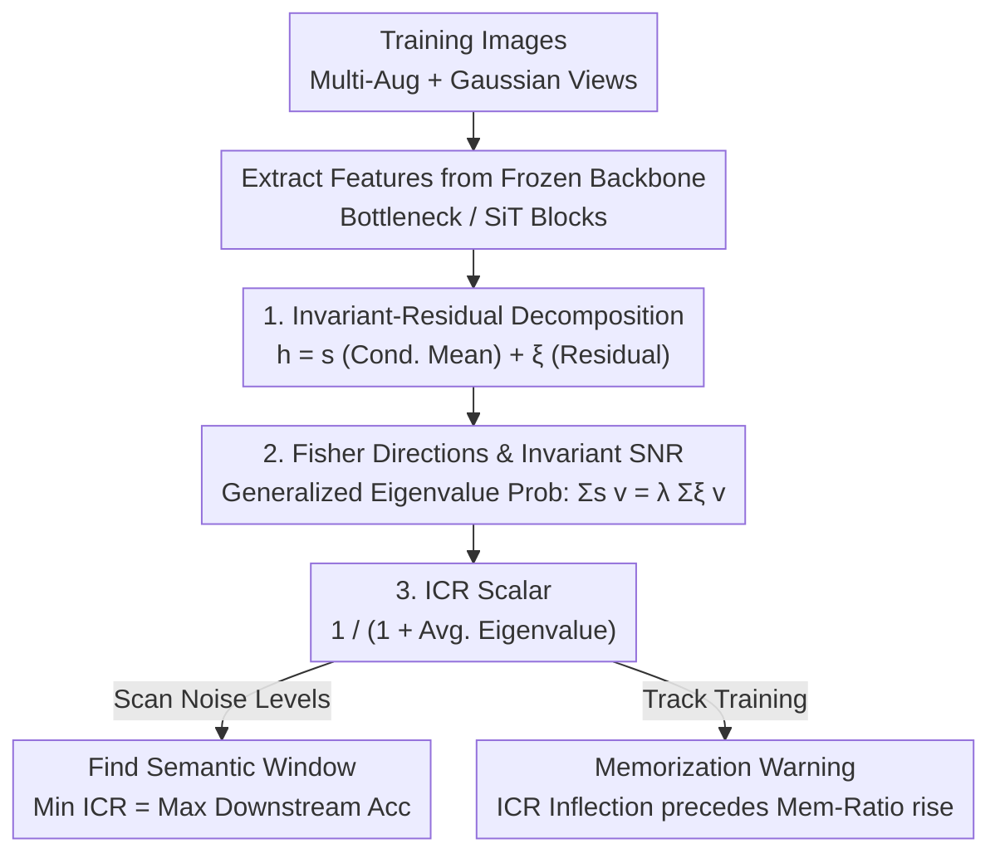

markdown
# Evaluating the Representation Space of Diffusion Models via Self-Supervised Principles

**Conference**: ICML2026  
**arXiv**: [2606.09718](https://arxiv.org/abs/2606.09718)  
**Code**: TBD  
**Area**: Diffusion Models / Representation Evaluation  
**Keywords**: Diffusion Models, Self-Supervised Principles, Invariant-Residual Decomposition, ICR Metric, Memorization Detection

## TL;DR
This paper examines the internal representations of diffusion models through the lens of the two principles of self-supervised learning (SSL): "invariance + expansion." It proposes a label-free scalar metric, **ICR (Invariant Contamination Ratio)**, which predicts the optimal noise levels for downstream classification and provides early warnings for overfitting/memorization during training without requiring sampling or training classifiers.

## Background & Motivation
**Background**: Diffusion models have evolved beyond mere generators. Using the bottleneck layer of a pre-trained denoiser at specific timesteps as a feature extractor has shown performance comparable to or exceeding SSL methods like DINOv2 and MAE in tasks such as classification, segmentation, and image correspondence. Representation learning and generative modeling are deeply intertwined in diffusion.

**Limitations of Prior Work**: The training paradigm of diffusion models differs significantly from SSL. Diffusion focuses on a **denoising objective** (recovering signal from Gaussian contamination), whereas most SSL methods explicitly **enforce invariance to data augmentations** while maintaining high-dimensional embeddings. Given these distinct objectives, a fundamental question remains: do diffusion representations implicitly possess the properties directly optimized by SSL? How do these properties evolve across **noise levels** and **training stages**?

**Key Challenge**: Current methods to evaluate whether a diffusion model is learning a low-dimensional image manifold or simply memorizing training samples are inadequate. Generative metrics like FID have been proven to be **unreliable as memorization detectors**. Exhaustive nearest-neighbor tests require generating massive samples, which is computationally expensive. There is a lack of an **intrinsic, label-free, and non-sampling-based signal** that can be monitored during training.

**Goal**: Translate two classic SSL principles into the **geometric quantities** of the diffusion representation space and construct a single scalar diagnostic metric that can be tracked across noise levels and training iterations.

**Key Insight**: The authors focus on two complementary principles of SSL: **representation invariance** (embeddings should remain stable under random perturbations of the same sample) and **representation expansion** (embeddings of different images should spread out to avoid dimensional collapse). Existing Alignment/Uniformity metrics are insufficient: Alignment measures absolute squared distance between views, which increases as the representation expands, even if semantic stability improves. Uniformity only measures "spread" and cannot distinguish between "invariant structures" and "augmentation-sensitive noise."

**Core Idea**: Each diffusion representation is **explicitly decomposed into an invariant component $\bm{s}$ and a residual component $\bm{\xi}$**. Their covariances are then used to form a generalized eigenvalue structure (Fisher-style SNR) summarized into a scalar ICR. This measures how much the stable representation space is contaminated by "augmentation/noise-sensitive changes"; a lower value indicates a "cleaner" representation.

## Method

### Overall Architecture
The method is essentially a **representation diagnostic pipeline**: extract features from a frozen diffusion backbone at its strongest performing layers (e.g., U-Net bottleneck or SiT intermediate transformer blocks). For each training image, multiple augmented and Gaussian-noised views are sampled. The resulting representations are decomposed into a "conditional mean + residual" (invariant component $\bm{s}$ and residual component $\bm{\xi}$). Their respective covariances $\bm{\Sigma}_s$ and $\bm{\Sigma}_\xi$ are estimated to solve a generalized eigenvalue problem, yielding "invariant SNRs." These are summarized into the scalar ICR. Since ICR is label-free and uses only training features, it can be used to scan across **noise levels** (to find the optimal semantic window) or track **training progress** (to distinguish generalization from memorization).

### Key Designs

**1. Invariant-Residual Decomposition: Splitting Representations into "Stable Structure + View Noise"**

Addressing the challenge that diffusion representations are high-dimensional and mix stable information with trivial variations, the authors define a random perturbation $a\sim\mathcal{A}$ for each training image $\bm{x}_0$. This covers both semantic-preserving augmentations (cropping, color) and the Gaussian noise injected by the diffusion objective itself $\bm{\epsilon}\sim\mathcal{N}(0,\sigma_t^2\bm{I})$. Let $\bm{h}(\cdot)$ be the representation; the stochastic representation is split into conditional mean and residual:

$$\bm{s}(\bm{x}_0)\coloneqq\mathbb{E}_a[\bm{h}(a(\bm{x}_0))\mid\bm{x}_0],\qquad\bm{\xi}(a,\bm{x}_0)\coloneqq\bm{h}(a(\bm{x}_0))-\bm{s}(\bm{x}_0),$$

resulting in the additive form $\bm{h}(a(\bm{x}_0))=\bm{s}+\bm{\xi}$. $\bm{s}$ is the **invariant component**, filtering out transient perturbations to keep attributes robust to corruption; $\bm{\xi}$ is the **residual component**, capturing trivial variations specific to a noisy view. Nearest-neighbor experiments (Fig 2) confirm this: retrieving with $\bm{s}$ yields semantically similar images, while $\bm{\xi}$ yields visually unrelated images with no shared category structure. Since $\mathbb{E}[\bm{\xi}\mid\bm{x}_0]=\bm{0}$, the law of total covariance gives a clean decomposition $\bm{\Sigma}_h=\bm{\Sigma}_s+\bm{\Sigma}_\xi$, where $\bm{s}$ represents **expansion** (trace of $\bm{\Sigma}_h$) and **invariance** (dominance of $\bm{\Sigma}_s$ over $\bm{\Sigma}_\xi$).

**2. Fisher Directions and Invariant SNR: Quantifying "Signal vs. Noise" along Optimal Directions**

To quantify the dominance of invariance, the authors solve the generalized eigenvalue problem $\bm{\Sigma}_s\bm{v}_i=\lambda_i\bm{\Sigma}_\xi\bm{v}_i$. The eigenvalues $\lambda_1\ge\dots\ge\lambda_d\ge0$ represent the **invariant SNR** along Fisher directions $\bm{v}_i$. This follows the generalized eigenvalue structure of classic Fisher Linear Discriminant Analysis, where $\bm{\Sigma}_s$ and $\bm{\Sigma}_\xi$ act as between-class and within-class covariances—except here, **each individual image is treated as its own class**. This precisely characterizes representation quality by how many directions allow the identity signal to overpower augmentation-sensitive contamination. (In practice, $\bm{\Sigma}_\xi + \tau\bm{I}$ is used for inversion).

**3. ICR: Summarizing the Spectrum into a Label-free Monitorable Scalar**

The Invariant Contamination Ratio is defined as:

$$\mathrm{ICR}\coloneqq\frac{1}{1+\frac{1}{d}\sum_{i=1}^d\lambda_i}.$$

Where $\frac{1}{d}\sum\lambda_i$ is the average invariant SNR. When $\bm{s}$ dominates $\bm{\xi}$ in most directions, this average is large and ICR is low. Conversely, if residual contamination occupies most of the space, ICR approaches 1. This "lower is cleaner" convention aligns with FID. Because ICR is entirely label-free and calculated from training features (requiring only 2+ augmentations per image), it can be monitored continuously across noise levels and training epochs.

### Usage Examples
**Usage 1 (Scanning Noise Levels for Semantic Windows)**: For a pre-trained backbone, ICR is estimated at each noise level $\sigma_t$. Results across CIFAR/ImageNet (Fig 3) show ICR is **U-shaped** regarding $\sigma_t$, reaching a minimum at intermediate noise levels. Classification accuracy peaks precisely in this same interval—the "semantic window." At low noise, representations are glued to augmentation details; at high noise, they collapse to noise. The label-free ICR thus identifies the best noise scale for feature extraction.

**Usage 2 (Monitoring Training for Memorization)**: Tracking ICR during training at a fixed $\sigma^\star$. With sufficient data, ICR **monotonically decreases**, correlating with FID (Fig 4). In data-limited regimes (e.g., CIFAR10 with 4096 samples), ICR exhibits a **U-shape**. The minimum of ICR occurs **before** the memorization ratio starts to rise (Fig 5/6). This provides a **early-stopping signal** that does not require generation, filling the gap where FID fails to detect memorization.

## Key Experimental Results

### Main Results
Correspondence between ICR and downstream accuracy across noise levels:

| Dataset | Backbone | ICR Minima | Class. Acc. Peak | Match? |
|--------|------|-----------|----------------|----------|
| CIFAR10 | EDM | Intermediate $\sigma_t$ | Intermediate $\sigma_t$ | Yes (U-shape ↔ Peak) |
| CIFAR100 | EDM | Intermediate $\sigma_t$ | Intermediate $\sigma_t$ | Yes |
| ImageNet | SiT-XL/2 | Intermediate $\sigma_t$ | Intermediate $\sigma_t$ | Yes |

ICR and Training Dynamics:

| Training Setup | Data Scale | ICR Trajectory | Relation to Gen/Mem |
|----------|----------|----------|--------------------|
| CIFAR10, EDM (Full) | 50K | Monotonic Decrease | Co-occurs with FID drop |
| ImageNet-256, SiT-B/2 (Full) | 1.28M | Monotonic Decrease | Co-occurs with FID drop |
| CIFAR10, EDM (Limited) | 4096 | U-shaped | Minima precedes Mem-ratio rise |
| ImageNet-256, SiT-B/2 (Limited) | 20K | U-shaped | Minima precedes Mem-ratio rise |

### Key Findings
- **ICR Minima ⇔ Highest Downstream Accuracy**: Across datasets, "ICR Valley = Accuracy Peak." ICR accurately predicts the best noise scale without using labels.
- **Early Warning for Memorization**: In data-constrained settings, the inflection point of ICR **leads** the onset of memorization, serving as an early-stopping signal where FID is unreliable.
- **Expansion Destination**: With sufficient data, new capacity is allocated to the invariant structure $\bm{\Sigma}_s$; under limited data, later expansion is dominated by the residual $\bm{\Sigma}_\xi$.
- **Alignment Failure**: In full-data training, ICR and FID drop together, but the Alignment loss actually increases (Fig 11), showing that absolute distance metrics are biased by expansion, whereas ICR's relative construction is robust.

## Highlights & Insights
- **Geometric Translation of SSL**: Conceptualizing Invariance as $\bm{\Sigma}_s$ dominance and Expansion as $\mathrm{Tr}(\bm{\Sigma}_h)$, then summarizing them via Fisher eigenvalues is a clean, transferable framework.
- **Multi-purpose Metric**: One metric for selecting noise levels, tracking generative quality (without sampling), and warning against memorization.
- **"Image-as-a-Class" Perspective**: Treating multiple augmented views of a single image as intra-class and different images as inter-class effectively repurposes discriminant analysis for self-supervised evaluation.

## Limitations & Future Work
- ICR depends on manually selected layers (e.g., U-Net bottleneck); an automated layer selection scheme is not provided.
- Estimating $\bm{\Sigma}_s$ and $\bm{\Sigma}_\xi$ requires multiple augmentations per image and regularization for inversion; computational stability and cost for very high-dimensional models need further study.
- While validated on classification and memorization, whether ICR can guide complex tasks like segmentation or be used as a training regularizer to **improve** generation remains an open question.

## Related Work & Insights
- **vs. FID / Nearest-Neighbor Tests**: FID fails to detect memorization; NN tests are sampling-intensive. ICR is label-free, sampling-free, and acts as an intrinsic early-stopping signal.
- **vs. Alignment & Uniformity**: Alignment is biased by representation expansion. ICR uses a relative decomposition that is robust to expansion and distinguishes contamination.
- **vs. RankMe**: While RankMe looks at covariance decay for SSL selection, ICR specifically utilizes the invariant-residual decomposition induced by augmentations and diffusion noise to study the "semantic window" and training dynamics unique to diffusion.

## Rating
- Novelty: ⭐⭐⭐⭐⭐ Translating SSL principles into geometric Fisher eigenvalues for label-free ICR calculation is a fresh perspective.
- Experimental Thoroughness: ⭐⭐⭐⭐ Validated across CIFAR/ImageNet and EDM/SiT; lacks diversity in downstream task types beyond classification.
- Writing Quality: ⭐⭐⭐⭐⭐ Clear logical chain from SSL theory to geometric quantities to scalar metrics.
- Value: ⭐⭐⭐⭐ Provides a practical, monitorable diagnostic and early-stopping signal for diffusion models.

<!-- RELATED:START -->

## Related Papers

- [\[ICLR 2026\] Adapting Self-Supervised Representations as a Latent Space for Efficient Generation](../../ICLR2026/image_generation/adapting_self-supervised_representations_as_a_latent_space_for_efficient_generat.md)
- [\[ICLR 2026\] Generalization of Diffusion Models Arises with a Balanced Representation Space](../../ICLR2026/image_generation/generalization_of_diffusion_models_arises_with_a_balanced_representation_space.md)
- [\[AAAI 2026\] Stabilizing Self-Consuming Diffusion Models with Latent Space Filtering](../../AAAI2026/image_generation/stabilizing_self-consuming_diffusion_models_with_latent_space_filtering.md)
- [\[ICML 2026\] SAEmnesia: Erasing Concepts in Diffusion Models with Supervised Sparse Autoencoders](saemnesia_erasing_concepts_in_diffusion_models_with_supervised_sparse_autoencode.md)
- [\[CVPR 2026\] Spatial-SSRL: Enhancing Spatial Understanding via Self-Supervised Reinforcement Learning](../../CVPR2026/image_generation/spatial-ssrl_enhancing_spatial_understanding_via_self-supervised_reinforcement_l.md)

<!-- RELATED:END -->
