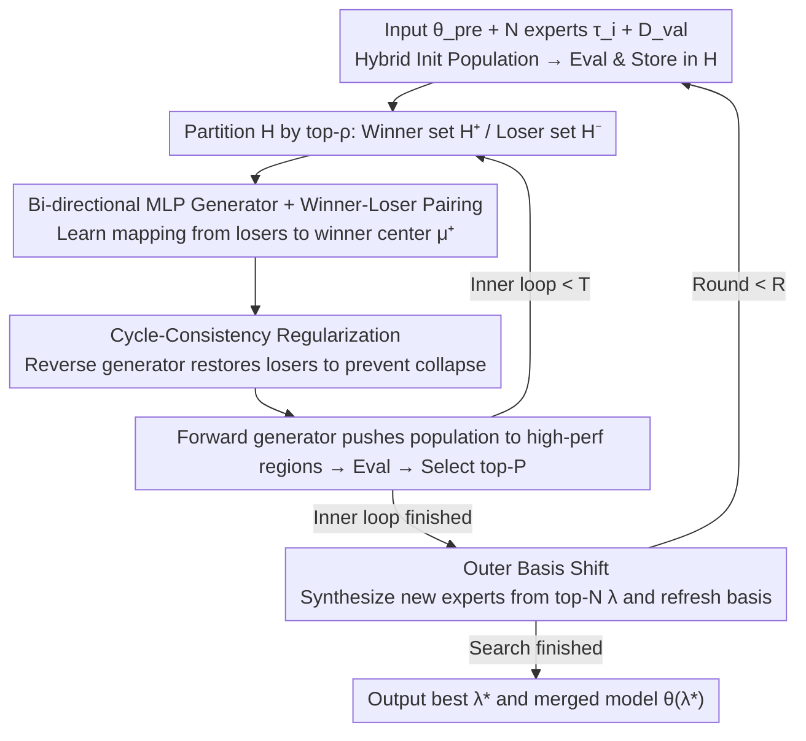

# EvoGM: Learning to Merge LLMs via Evolutionary Generative Optimization

**Conference**: ICML 2026  
**arXiv**: [2605.29295](https://arxiv.org/abs/2605.29295)  
**Code**: https://github.com/JiangTao97/evogm (Yes)  
**Area**: Model Compression / LLM Merging / Evolutionary Search  
**Keywords**: Model Merging, Task Vectors, Evolutionary Algorithms, Generative Optimization, Cycle Consistency

## TL;DR
EvoGM reformulates "searching for task-vector merging coefficients $\bm{\lambda}$" from an evolutionary search with hand-crafted mutation operators into a learnable generative task. It uses a pair of cycle-consistent MLP generators to learn the distribution of high-performance regions from historical winner-loser pairs. By wrapping this in an outer "basis shift" mechanism to refresh the expert pool periodically, EvoGM outperforms the SOTA PSO-Merging by approximately 1.4% on 8 GLUE tasks and significantly leads on unseen tasks using Qwen2.5-1.5B with 10 models.

## Background & Motivation

**Background**: As the cost of full-parameter fine-tuning for LLMs escalates, model merging has become a mainstream paradigm for "training-free capability reuse" by directly combining multiple expert models in the parameter space. The task arithmetic branch defines each expert as a task vector $\bm{\tau}_i = \bm{\theta}_i - \bm{\theta}_{pre}$ relative to the pre-trained model, then applies a linear combination with coefficient vectors $\bm{\lambda} \in \mathbb{R}^N$ to obtain $\bm{\theta}(\bm{\lambda}) = \bm{\theta}_{pre} + \sum_i \lambda_i \bm{\tau}_i$. Thus, the merging problem reduces to a low-dimensional (where $N$ is the number of experts) black-box optimization.

**Limitations of Prior Work**: Current approaches suffer from structural flaws. One category includes heuristic-based methods like TA, TIES, DARE, and DELLA, which rely on "pruning + scaling + averaging." These are completely unlearnable relative to validation objectives. The other category includes evolutionary searches like CMA, PSO-Merging, and Model Swarm, which can utilize validation signals in principle. However, their mutation operators are hand-crafted random perturbations that **completely ignore the performance landscape of the coefficient space**. In practical deployments with small validation sets and limited evaluation budgets (each fitness evaluation requires a full inference pass), the search efficiency of random perturbations is too low, often getting trapped in sub-optimal solutions.

**Key Challenge**: Under sparse and expensive fitness feedback, random mutations waste samples and fail to capture structural inductive biases. Meanwhile, historical search trajectories actually accumulate substantial signals about "which $\bm{\lambda}$ is better," but **these signals are wasted by random operators**.

**Goal**: Upgrade evolutionary merging from "random perturbation" to "learning a proposal distribution from historical data." This involves solving three sub-problems: (i) How to extract "good vs. bad" preference signals from history; (ii) How to train a generator to map "bad" to "good" without collapsing to a single point; (iii) How to avoid early saturation under a fixed expert basis.

**Key Insight**: The authors draw inspiration from "using generative models for structured proposals" in sparse-feedback optimization. They view the coefficient search as a data-driven generative task—validation accuracy serves as the reward, and the set of winners serves as samples of a high-performance distribution.

**Core Idea**: A **bi-directional MLP generator** is employed to learn a "loser $\to$ winner" mapping to replace random mutations. Cycle-consistency is used to prevent collapse, and an **outer "basis shift"** periodically incorporates the elite merge as a new expert, allowing the search space and model capabilities to evolve together.

## Method

### Overall Architecture
EvoGM aims to efficiently search for task-vector merging coefficients $\bm{\lambda}\in\mathbb{R}^N$ under small validation sets and limited budgets. The core mechanism involves replacing the **hand-crafted random mutation operator** in the traditional "sample $\to$ evaluate $\to$ select $\to$ mutate" cycle with a generator learned from historical trajectories. An outer layer of "expert basis refresh" ensures the search space itself can evolve. The search is conducted entirely in $\mathbb{R}^N$ ($N$ is the number of experts, 8 or 10 in the paper), without any gradient backpropagation through LLM parameters.

This is implemented as a nested dual loop. Inputs include the pre-trained base $\bm{\theta}_{pre}$, $N$ LoRA-tuned experts and their task vectors $\bm{\tau}_i$, validation set $\mathcal{D}_{val}$, population size $P=2N$, outer rounds $R$, and inner iterations $T$. The inner loop uses hybrid initialization (uniform average, one-hot, random uniform) to construct the population, which is evaluated on $\mathcal{D}_{val}$ and stored in history $\mathcal{H}$. In each iteration, $\mathcal{H}$ is partitioned into a winner set $\mathcal{H}^+$ and a loser set $\mathcal{H}^-$ based on top-$\rho$ (default $\rho{=}0.3$). A pair of generators is re-trained, and the forward generator "pushes" the population toward high-performance regions. The top-$P$ are selected for the next generation. After finishing the inner search, the outer round takes the top-$N$ $\bm{\lambda}^{(i)}$ to synthesize new experts, refreshes the basis, and starts a new round. The final output is the $\bm{\lambda}^*$ with the highest historical fitness and its corresponding merged model $\bm{\theta}(\bm{\lambda}^*)$.

### Key Designs

**1. Bi-directional MLP Generator + Winner-Loser Training: Learning Mutations as Differentiable Mappings**
The bottleneck of evolutionary search lies in random mutations ignoring the performance landscape. EvoGM explicitly learns the "bad solution $\to$ good solution" transition as a pair of 5-layer MLPs (with tanh output constraining $\bm{\lambda}$ to $[-1,1]^N$). The forward generator $G_{-\to+}: \mathcal{H}^- \to \mathcal{H}^+$ handles proposals, while the reverse generator $G_{+\to-}: \mathcal{H}^+ \to \mathcal{H}^-$ supports cycle constraints. Training data is constructed using the Cartesian product $\mathcal{H}^- \times \mathcal{H}^+$ of winner/loser sets (implemented via independent mini-batch sampling). The optimization objective explicitly pulls losers toward the winner center $\bm{\mu}^+ = \frac{1}{|\mathcal{H}^+|}\sum_{\bm{\lambda}^+ \in \mathcal{H}^+} \bm{\lambda}^+$: $\mathcal{L}_{opt} = \mathbb{E}_{\bm{\lambda}^- \in \mathcal{H}^-}[\|G_{-\to+}(\bm{\lambda}^-) - \bm{\mu}^+\|_2^2]$. Using winner-loser preferences rather than direct reward modeling is chosen because reward regression variance is too high under sparse-feedback optimization; the simpler "who is better" signal is more stable for tracking the distribution as it refreshes each generation.

**2. Cycle-Consistency Regularization: Preventing Generator Collapse**
Minimizing only $\mathcal{L}_{opt}$ forces the generator toward a constant function $\bm{\mu}^+$, mapping all losers to the same winner center and zeroing out population diversity. Borrowing the fixed-point logic from CycleGAN, EvoGM adds cycle constraints in both directions: $\mathcal{L}_{cyc} = \mathbb{E}_{\bm{\lambda}^-}[\|G_{+\to-}(G_{-\to+}(\bm{\lambda}^-)) - \bm{\lambda}^-\|_2^2] + \mathbb{E}_{\bm{\lambda}^+}[\|G_{-\to+}(G_{+\to-}(\bm{\lambda}^+)) - \bm{\lambda}^+\|_2^2]$, where $\mathcal{L}_{total} = \alpha_c \mathcal{L}_{cyc} + \alpha_o \mathcal{L}_{opt}$. The intuition is straightforward: if $G_{-\to+}$ compresses all inputs into a single point, $G_{+\to-}$ cannot reconstruct the diverse original losers, causing the cycle loss to explode. Bijectivity acts as an implicit geometric regularizer, which is easier to tune than explicit entropy or KL terms. Ablations show that removing cycle loss leads to the sharpest performance drops in reasoning tasks like NLGraph that require exploration.

**3. Outer Basis Shift: Evolving Expert Bases with the Search**
Merging spaces spanned by fixed experts limit the upper bound of $\bm{\lambda}^*$. EvoGM's basis shift instantiate the top-$N$ coefficients $\{\bm{\lambda}^{(i)}\}_{i=1}^N$ as new models $\bm{\theta}_i^{(r+1)} = \bm{\theta}(\bm{\lambda}^{(i)})$ at the end of each round $R$. Task vectors are recomputed as $\bm{\tau}_i^{(r+1)} = \bm{\theta}_i^{(r+1)} - \bm{\theta}_{pre}$. The next inner search proceeds on this new basis spanned by elite merges (default $R=2, T=3$). Since linear combinations of task vectors represent new directions, promoting them back to the basis is equivalent to "changing the coordinate system" of the search space. This step produces a characteristic performance jump at iteration 3 in convergence curves; w/o Rounds shows the largest drops on NLGraph and MMLU.

The total loss $\mathcal{L}_{total}$ is used to reset and re-train the generators in every inner iteration to follow the latest distribution in $\mathcal{H}$. The entire process involves zero gradient updates for the LLM; computational overhead is dominated by validation evaluation of candidates.

## Key Experimental Results

### Main Results

**Seen tasks**: FLAN-T5-base merging 8 GLUE single-task experts.

| Dataset (GLUE) | Metric | EvoGM | PSO-Merging (SOTA) | Gain |
|---|---|---|---|---|
| CoLA | acc | 71.1 | 68.2 | +2.9 |
| MNLI | acc | 82.8 | 83.8 | -1.0 |
| QQP | acc | 84.8 | 83.6 | +1.2 |
| RTE | acc | 82.2 | 81.2 | +1.0 |
| STS-B | acc | **80.9** | 71.9 | **+9.0** |
| **AVG (8 tasks)** | **acc** | **82.4** | 81.2 | **+1.2** |

**Unseen tasks**: Multi-task merging of 10 Tulu-v2 LoRA experts on Qwen2.5-1.5B, evaluated on 8 benchmarks across knowledge, reasoning, and safety.

| Benchmark (Test) | EvoGM | PSO-Merging | Model Swarm | Single Best |
|---|---|---|---|---|
| MMLU | **0.625** | 0.595 | 0.606 | 0.586 |
| MMLU-Pro | 0.224 | 0.232 | 0.236 | 0.232 |
| HellaSwag | **0.594** | 0.587 | 0.587 | 0.572 |
| GSM8K | **0.434** | 0.354 | 0.332 | 0.325 |
| NLGraph | **0.537** | 0.465 | 0.373 | 0.376 |
| TruthQA | **0.441** | 0.421 | 0.392 | 0.384 |
| AbstainQA | 0.121 | **0.147** | 0.095 | 0.119 |

EvoGM ranks first in 5 out of 8 test benchmarks, with particularly significant gains in reasoning tasks like GSM8K and NLGraph (+8 to +14 relative percentage points), indicating that the learned proposal distribution is especially effective for "hard" tasks.

### Ablation Study
Configuration: 4-expert merging, population 8, $R=2, T=2$.

| Configuration | Key Observation | Description |
|---|---|---|
| Full EvoGM | Best overall | Complete bi-directional generator + cycle + multi-round basis shift |
| Single-Generator | Consistent drop | Removing reverse generator prevents cycle constraints, degrading search |
| w/o Rounds | Drop on NLGraph/MMLU | Replacing "multi-round + shift" with 5 continuous inner iterations proves refreshing the basis is vital |
| w/o Cycle Loss | Largest drop on NLGraph | Only $\mathcal{L}_{opt}$ remains; generator collapses to winner center, hurting reasoning tasks |

### Key Findings
- **Cycle loss is central**: Its removal causes the most severe drop in NLGraph where exploration is needed, validating "collapse prevention > direct reward fitting."
- **Basis shift is not merely cosmetic**: Training curves show a "vibration then surge" pattern at iteration 3 (round switch), where basis shift kicks the search out of local optima.
- **Population size sensitivity**: Increasing population from 10 to 30 improves test accuracy by 0.0305; increasing iterations from 3 to 8 yields marginal gains, showing candidate coverage is the bottleneck.
- **Superiority in low-budget settings**: By default, each benchmark uses 200 samples for val and 1000 for test. Under this sparse feedback, generative proposals show much higher sample efficiency than random perturbations.

## Highlights & Insights
- **Turning evolutionary operators into a learning task is a clean paradigm shift**: In traditional EA/PSO, mutations are hand-crafted (Gaussian, polynomial). EvoGM replaces them with a learnable conditional generator without requiring surrogate models or differentiable proxies. Running on "preference-only" signals is highly valuable for expensive black-box optimization.
- **CycleGAN as a clever tool for low-dimensional search**: Applying cycle constraints in $\mathbb{R}^N$ adds negligible computation (5-layer MLPs) but transforms "collapse prevention" from a hard-to-tune entropy/KL hyperparameter into a concrete geometric constraint.
- **Basis shift reveals hidden dimensions of model merging**: Previous search-based merging treated task vectors $\bm{\tau}_i$ as an immutable structure. This paper suggests "elite merges themselves are better task vectors," making the outer loop optimizable. This is insightful for future federated or continual merging.
- **Transferable to other expensive black-box searches**: The winner-loser + cycle-generator template can theoretically be applied to NAS operator selection, prompt optimization, or hyperparameter tuning, provided the search space is continuous and low-dimensional.

## Limitations & Future Work
- **Dimensionality constraints**: The dimensionality $\bm{\lambda} \in \mathbb{R}^N$ is limited to the number of experts ($N \le 10$). Whether this scales to layer-wise or module-wise coefficients (where $N$ reaches hundreds) via the current MLP structure is unverified.
- **Evaluation overhead remains**: Every new $\bm{\lambda}$ requires running inference on a validation set. The wall-clock time is still tied to LLM inference; the paper does not report specific speedup ratios against PSO-Merging under equal budgets.
- **Expert pool quality assumption**: Basis shift assumes elite merges are "better bases." If original experts are highly redundant, the new basis might just rotate in the same subspace without expanding the capability upper bound.
- **Hyperparameter sensitivity**: Defaults for $\alpha_c / \alpha_o$, $\rho$, and the tanh range $[-1, 1]$ (which excludes task negation regions $|\lambda_i| > 1$) lack robust analysis across different model families or task difficulties.
- **Future Improvements**: Replacing the generator with conditional diffusion (with reward guidance) might better model multi-modal winner distributions; layer-wise coefficients could incorporate graph or inter-layer structural priors.

## Related Work & Insights
- **vs PSO-Merging / Model Swarm**: Both are population-based. The difference is their mutation/crossover is hand-crafted (velocity updates or position perturbations), while EvoGM uses a learned generator. EvoGM's lead in reasoning tasks on unseen tasks suggests structured proposals handle complex landscapes better.
- **vs CMA (Akiba et al., 2025)**: CMA-ES uses adaptive covariance for layer-wise spaces; EvoGM focuses on sample efficiency in the expert-wise space. They are orthogonal and could be combined.
- **vs TIES / DARE / DELLA**: These are heuristic training-free methods. EvoGM's 3-point lead over DELLA on GLUE highlights the ceiling of validation-guided search.
- **vs AdaMerging**: AdaMerging uses unsupervised entropy minimization with limited gradients. EvoGM is gradient-free and does not require unlabeled test data, making it more suitable for pure black-box deployment.

## Rating
- Novelty: ⭐⭐⭐⭐ Introducing the "learnable proposal + cycle collapse prevention + outer basis shift" trinity to model merging is a clear and effective methodological combination.
- Experimental Thoroughness: ⭐⭐⭐⭐ Covers FLAN-T5 and Qwen across seen/unseen settings with 10+ baselines and components ablations, though lacking wall-clock comparisons.
- Writing Quality: ⭐⭐⭐⭐ Algorithms and diagrams are clear; the motivation is naturally derived and highly readable.
- Value: ⭐⭐⭐⭐ High practical significance for real-world deployment with small validation budgets; the paradigm is transferable to other black-box optimization tasks.

<!-- RELATED:START -->

## Related Papers

- [\[ICML 2026\] Threshold-Guided Optimization for Visual Generative Models](threshold-guided_optimization_for_visual_generative_models.md)
- [\[CVPR 2025\] Decouple-Then-Merge: Finetune Diffusion Models as Multi-Task Learning](../../CVPR2025/image_generation/decouple-then-merge_finetune_diffusion_models_as_multi-task_learning.md)
- [\[ICML 2026\] A Systematic Investigation of RL-Jailbreaking in LLMs](a_systematic_investigation_of_rl-jailbreaking_in_llms.md)
- [\[ICML 2026\] $f$-Trajectory Balance: A Loss Family for Tuning GFlowNets, Generative Models, and LLMs with Off- and On-Policy Data](f-trajectory_balance_a_loss_family_for_tuning_gflownets_generative_models_and_ll.md)
- [\[ICML 2026\] Esoteric Language Models: A Family of Any-Order Diffusion LLMs](esoteric_language_models_a_family_of_any-order_diffusion_llms.md)

<!-- RELATED:END -->
