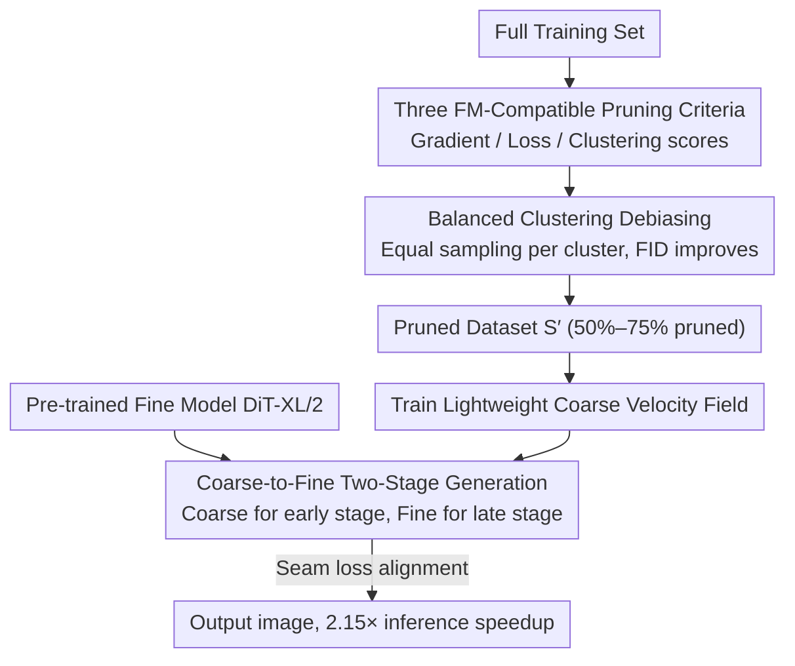

# Exploring and Exploiting Stability in Latent Flow Matching

**Conference**: ICML 2026  
**arXiv**: [2605.08398](https://arxiv.org/abs/2605.08398)  
**Code**: https://github.com/briqr/explo-r-it-ing_lfm_stability  
**Area**: Diffusion Models / Flow Matching / Data Pruning  
**Keywords**: Latent Flow Matching, Trajectory Stability, Data Pruning, Coarse-to-Fine, Inference Acceleration

## TL;DR
This paper systematically characterizes "trajectory stability" in Latent Flow Matching (LFM)—demonstrating that pruning 75% of data, varying architecture sizes, or changing training seeds under the same noise seed produces nearly identical images. This property is leveraged into two practical algorithms: (1) balanced-clustering pruning that enables removing 50% of data on CelebA-HQ with slight FID improvements and 75% on ImageNet; (2) a Coarse-to-Fine two-stage generation that joins DiT-XL/2 (675M) and DiT-S/2 (33M), achieving a 2.15× inference speedup.

## Background & Motivation

**Background**: Diffusion models have become the dominant paradigm for image/video/medical imaging generation. Flow Matching (FM) is increasingly popular as an ODE alternative to DDPM due to fewer sampling steps. Latent FM (LFM) further extends FM to the VAE latent space and serves as the foundation for large models like SD3 and Flux.

**Limitations of Prior Work**: Training LFM is prohibitively expensive, requiring massive datasets, long training times, and enormous compute; conditional models also require heavy manual annotation. However, the community has rarely systematically questioned: **How large must the dataset be? How large must the model be?** Scattered observations suggest the existence of stability (e.g., Kadkhodaie observed convergence in score-based diffusion models trained on different splits), but these have not yielded practical pruning/acceleration schemes and were limited to low-resolution pixel space.

**Key Challenge**: Theoretically, FM learns the "transport between distributions" and should be sensitive to small perturbations in sample distribution. Yet, empirical evidence suggests FM models map the same $x_0$ to nearly identical $x_1$ even under massive perturbations (deleting half the data or using architectures 20× larger). If this "stability" holds, it implies massive amounts of training data are redundant and can be pruned.

**Goal**: (1) **Rigorously measure** this stability in LFM (using ArcFace similarity for faces and DINO similarity for ImageNet under the same seed); (2) provide a **theoretical explanation** (based on the extreme peakiness of softmax weights in the FM closed-form solution from Bertrand 2025); (3) **translate stability into practical algorithms**—data pruning and model composition.

**Key Insight**: Bertrand 2025 proved that in the optimal velocity field for rectified FM $\hat{u}^*(x,t)=\sum_i \lambda_i(x,t)\frac{x^i-x}{1-t}$, the softmax weights $\lambda_i$ become extremely peaked early on—a single training sample dominates the entire trajectory. As long as this "dominant sample" remains in the data, pruning other samples has minimal impact on the trajectory.

**Core Idea**: Utilize the intrinsic stability of LFM to trade for "training efficiency (reduced data/labels)" and "inference efficiency (small-large model concatenation)," validated through three pruning criteria paired with balanced clustering.

## Method

### Overall Architecture
The study first rigorously quantifies "trajectory stability" in LFM using generation similarity under the same seed. Using the closed-form solution of FM (peaked softmax weights, single-sample dominance) as an explanation, this property is implemented into two complementary tools: on the training side, sample scoring + clustering allows pruning 50%–75% of the dataset without performance loss; on the inference side, one Large and one Small DiT are concatenated along the time axis for a 2.15× speedup. Both lines share the same core—since trajectories are determined by a few dominant samples and large/small models produce nearly identical trajectories, much of the training data and early-stage computation in large models is redundant.

### Key Designs

**1. Three FM-compatible pruning criteria: Assigning importance scores to retain samples proportionally**

Transferring pruning from classification to Flow Matching is challenging because the FM loss signal is noisy—variance primarily stems from randomly sampled noise at each step, making it difficult to distinguish sample quality in a single forward pass. This work proposes three scoring criteria to retain samples in the top $1-pr$ fraction. The gradient criterion $\mathcal{G}$ uses a small proxy model trained for 7% of total steps, fixing $M=2$ noises + $T=8$ timesteps along "shared noise paths" to calculate the squared gradient norm per sample, normalized by the per-$t$ mean to eliminate scale bias, yielding $s_i^{\mathcal{G}}$. The loss criterion $\mathcal{L}$ replaces gradients with loss values, acting as a cheaper alternative. The clustering criterion $\mathcal{C}$ performs k-means in the CLIP image embedding space, split into **proportional** (sampling by cluster size to maintain distribution) and **balanced** (equal sampling per cluster to force dataset balancing). Representative samples can be selected based on proximity to center, distance from center, or kernel-mean matching. The key adaptation is: fixed noise paths + EMA smoothing are required to extract stable importance signals from high-variance FM loss.

**2. Balanced Clustering for Fairness ($\mathcal{C}_b$): Correcting data bias via cluster-level balancing**

On CelebA-HQ, unpruned models generate biased gender distributions (more females than males). Stability provides a side benefit: since deleting samples within one cluster hardly affects trajectories of other clusters, one can perform k-means on CLIP embeddings and sample equally from each cluster to flatten the data distribution. Results show that after $\mathcal{C}_b$ pruning, the gender KL divergence (calculated via PaliGemma) drops from 0.044 to 0.016 (approaching $(\mathcal{C}_b)_{\text{gender}}=0.005$ which uses explicit labels); KL divergence for age, skin-tone, and hair-color also decreases, while FID improves. This provides a "label-free debiasing" solution—balancing data without sacrificing quality, a direct consequence of stability ensuring cluster independence.

**3. Coarse-to-Fine Two-Stage Generation (C2F): Using small models for the early trajectory**

Stability experiments show that DiT-S/2 (33M) and DiT-XL/2 (675M) follow highly similar trajectories under the same seed (similarity 0.81). Consequently, running 675M parameters from $t=0$ to $t=1$ is wasteful. C2F trains a lightweight Coarse velocity field $v_C$ on the pruned set $S'$ to cover the noise-dominant early segment $t\in[0,t_0)$, while reserving the pre-trained Fine model $v_F$ (DiT-XL/2) for the detail-critical late segment $t\in[t_0,1]$. To handle the seam at $t_0$, the Fine model is used for ODE backward integration $x_{k+1}=x_k+h\,v_F(x_k,t_k),\,h<0$ from clean samples $x_1$ back to $x_{t_0}$. This $x_{t_0}$ serves as the Coarse training target, supplemented by a seam loss $\mathcal{L}_{\text{seam}}^v=\|v_F(x_{t_0},t_0)-v_C(x_{t_0},t_0)\|^2$ to force velocity alignment. Due to the inherent similarity between models, only a few epochs of fine-tuning are needed to stitch the C2F system without retraining Fine weights.

### Loss & Training
The total loss for the Coarse model combines the early-stage FM objective with seam alignment:

$$\mathcal{L}_{\text{coarse}}=\mathbb{E}\,\mathcal{L}_{\text{FM}}^{t\in[0,t_0)}+\lambda_v\,\mathcal{L}_{\text{seam}}^v$$

The seam coefficient $\lambda_v$ is a hyperparameter; setting $t_0=0.7$ yields the best balance between FID and speed. Using DiT-S/2 as Coarse and DiT-XL/2 as Fine at $256^2$ resolution on H100s, C2F achieves 43.53 ms/img compared to 93.95 ms/img for Fine-only (2.15× speedup).

## Key Experimental Results

### Main Results

FID on CelebA-HQ ($pr=0.5$) under different pruning criteria (lower is better):

| Method | FID | Remarks |
|------|------|------|
| Unpruned | 24.24 | Baseline |
| Random | 25.25±0.38 | Random pruning |
| $\mathcal{G}$ (High Gradient) | 24.62 | Nearly tied |
| $\mathcal{G}^{-1}$ (Low Gradient) | 29.75 | Significant degradation |
| $\mathcal{L}$ (High Loss) | 33.92 | Worst (Counter-intuitive, opposite of classification) |
| $\mathcal{L}^{-1}$ (Low Loss) | **23.49** | Slight improvement |
| $\mathcal{C}_p$ | 25.19 | Proportional |
| $\mathcal{C}_b$ | **22.80** | **Balanced clustering is optimal** |
| $\mathcal{C}_b^\kappa$ | 23.42 | Kernel variant |

ImageNet (DiT-XL/2 conditional, 200k iterations):

| Pruning Rate $pr$ | FID Trend | Remarks |
|------------|----------|------|
| 0 (Unpruned) | Baseline | |
| 0.75 | Slight rise then converges after 600k | Most stable long-term gain |
| 0.9 | Fastest before 200k, drops after 590k | Strongest mid-term |
| 0.95 | Fastest before 170k, then crashes | Short-term sprint |

### Ablation Study

Impact of seam position $t_0$ for C2F on CelebA-HQ:

| Configuration | FID@$t_0=0.7$ | Inference Speed (ms/img) | Description |
|------|--------------|-------------------|------|
| Fine-only | 24.24 | 93.95 | Pure DiT-XL/2 |
| C2F (unpruned Coarse) | Slightly better | 43.53 | 2.15× Speedup |
| C2F + $\mathcal{C}_b$ pruned Coarse | **Optimal** | 43.53 | Speed + FID win-win |
| C2F_male (violates stability) | **44.92** | 43.53 | Seam loss cannot fix |

### Key Findings
- **$\mathcal{L}$ performance in FM is opposite to classification**: In classification, "high loss samples" are hard examples worth keeping; in FM, $\mathcal{L}$ performs worst (FID 33.92) while $\mathcal{L}^{-1}$ (low loss) is best. FM high loss often comes from low-density outliers, whereas FM relies on "dominant samples" to construct paths—outliers actually hinder training.
- **Impact of perturbations varies wildly**: Switching DiT-S/2→DiT-XL/2 ($s=0.81$, stable), U-Net ($s=0.55$, slight drop), or removing one gender mode ($s=0.58$) maintains some stability. However, **changing VAE seeds** ($s=0.32$) or **flipping all latent feature map signs** ($s=0.32$) completely destroys stability. This suggests stability is rooted in the coupling of **latent space geometry + FM objective**, not the architecture.
- **Score-based diffusion lacks this stability**: Switching from FM to score-based diffusion causes stability to vanish, indicating this is a property of the rectified FM objective specifically.
- **Balanced clustering reduces bias without harming FID**: $\mathcal{C}_b$ reduces gender KL from 0.044 to 0.016 while improving FID. This offers a simple label-free solution for dataset balancing.

## Highlights & Insights
- The major contribution is **elevating "stability" from a phenomenon to a theoretical explanation and practical algorithms**: Using Bertrand 2025’s closed-form solution as a foundation and translating it into data pruning and C2F creates a complete theory-empirical-engineering loop.
- **C2F has high engineering value**: Without touching Fine weights, training a small Coarse model with seam loss yields a 2.15× speedup in production; this "partial distillation" is highly friendly for deploying DiT-XL/Flux-scale models.
- **Boundary conditions for stability** (broken by VAE changes or latent sign flips) warn the LFM community: Any operation affecting VAE (replacement, scaling, normalization) invalidates existing LFMs, necessitating a full retrain.

## Limitations & Future Work
- Validated primarily on medium-scale datasets (CelebA-HQ 28k, FFHQ 63k, ImageNet 1.2M) and DiT architectures; effectiveness on web-scale data (LAION-5B) and larger Flux/SD3 models remains unaddressed.
- The $\mathcal{G}$ gradient criterion is computationally expensive; it is used for analysis but not scaled to large datasets. Practical use might require random projections or sketching.
- C2F seam loss only aligns at a single point and does not account for curvature matching between ODE segments; significant differences in 2nd-order derivatives could still produce artifacts.
- The relationship between stability and generalization is left as future work—higher stability might imply "memorizing the training set"; balancing stability with diversity remains an open question.

## Related Work & Insights
- **vs. Kadkhodaie 2024**: They observed convergence in score-based diffusion in pixel space; this paper moves the phenomenon to latent FM, provides theoretical grounding, and creates practical tools.
- **vs. Bertrand 2025**: Bertrand provided the FM closed-form to study generalization; this paper "repurposes" the softmax-peaked nature to justify pruning feasibility.
- **vs. Dataset Distillation / Coreset**: This work demonstrates that simple cluster-balanced pruning on LFM can outperform complex coreset methods, providing a clean baseline for data efficiency in generative models.

## Rating
- Novelty: ⭐⭐⭐⭐ Stability and C2F are not entirely new, but this is the first systematic application and theoretical explanation for LFM.
- Experimental Thoroughness: ⭐⭐⭐⭐⭐ Comprehensive coverage across three datasets, six pruning criteria, and five perturbation types.
- Writing Quality: ⭐⭐⭐⭐ Clear formalization; Figure 4's perturbation categorization is visually impactful.
- Value: ⭐⭐⭐⭐⭐ Significant engineering value (2.15× speedup + 50% data reduction) and actionable guidance on LFM stability boundaries.

<!-- RELATED:START -->

## Related Papers

- [\[ICLR 2026\] Exploring the Design Space of Transition Matching](../../ICLR2026/image_generation/exploring_the_design_space_of_transition_matching.md)
- [\[ICML 2026\] Stable Velocity: A Variance Perspective on Flow Matching](stable_velocity_a_variance_perspective_on_flow_matching.md)
- [\[ICML 2026\] The Coupling Within: Flow Matching via Distilled Normalizing Flows](the_coupling_within_flow_matching_via_distilled_normalizing_flows.md)
- [\[ICML 2026\] Saving Foundation Flow-Matching Priors for Inverse Problems](saving_foundation_flow-matching_priors_for_inverse_problems.md)
- [\[ICML 2026\] LithoGRPO: Fast Inverse Lithography via GRPO Reinforced Flow Matching](lithogrpo_fast_inverse_lithography_via_grpo_reinforced_flow_matching.md)

<!-- RELATED:END -->
