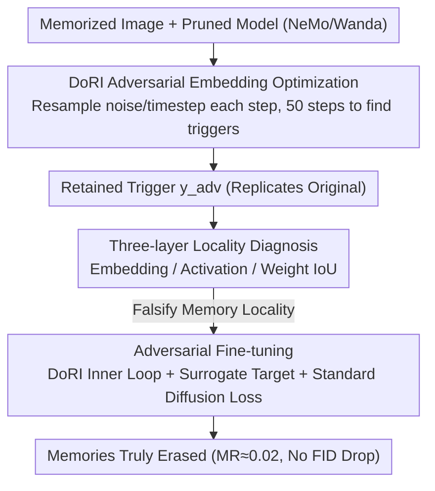

# Finding DoRI: Discovery of Retained Images in Diffusion Models

**Conference**: ICML2026  
**arXiv**: [2507.16880](https://arxiv.org/abs/2507.16880)  
**Code**: https://github.com/sprintml/finding_dori  
**Area**: AI Safety / Diffusion Model Memorization / Training Data Privacy  
**Keywords**: Diffusion model memorization, adversarial embedding, pruning failure, adversarial fine-tuning, copyright and privacy

## TL;DR
The authors demonstrate via a simple adversarial text embedding optimization method (DoRI) that diffusion model memory mitigation schemes like NeMo or Wanda—which aim to "prune and locate memory neurons"—merely "hide" memories rather than truly erasing them. This is because memorization is not localized at the embedding, activation, or weight levels. They further propose an adversarial fine-tuning scheme to genuinely extract training samples from the model.

## Background & Motivation

**Background**: Text-to-image diffusion models (DMs, such as Stable Diffusion v1.4) can replicate portions of their training images verbatim, presenting significant privacy and copyright risks. Current mainstream "permanent mitigation" strategies, represented by NeMo (Hintersdorf et al., 2024) and Wanda (Chavhan et al., 2024), observe abnormal activations when a memory-triggering prompt is used. They locate a small number of "memory neurons/weights" and prune them, claiming to erase specific training samples without sacrificing overall generation quality.

**Limitations of Prior Work**: All these pruning methods rely on the assumption that memory is **local**—that the "fingerprint" of a specific training image is hidden within a few weights and can be removed via targeted pruning. However, their effectiveness has only been verified using the **original memory prompt**. No previous studies have checked whether the same image can be retrieved using alternative inputs.

**Key Challenge**: Pruning severs the specific mapping from "prompt → memorized image," but the memorized image may not be tied to a single path. If other paths in the text embedding space can trigger the same image, "pruning as forgetting" is merely an illusion.

**Goal**: (1) Design a method to actively search for "retained triggers" in pruned models; (2) Systematically test whether the memory locality hypothesis holds at the embedding, activation, and weight levels; (3) Provide a solution that truly erases memories by rejecting the locality assumption.

**Key Insight**: Modeling the search for "retained triggers" as a continuous adversarial optimization over text embeddings. This bypasses the constraints of discrete natural language, using diffusion loss gradient descent directly in the embedding space. If an embedding that replicates the original image can still be optimized in a pruned model, the memory has not been erased.

**Core Idea**: Use DoRI (Discovery of Retained Images)—an adversarial embedding optimizer that repeatedly resamples noise and timesteps—as a "memory detection probe" and "adversarial training sample generator." This is used to expose the failure of pruning and to perform adversarial fine-tuning to truly erase memories.

## Method

### Overall Architecture
This paper addresses a question ignored by pruning-based mitigation schemes: once the mapping from "memory prompt → memorized image" is pruned, is the image truly deleted, or can it still be retrieved via an alternative path? The authors' design centers on an adversarial embedding optimizer, DoRI, and proceeds in three steps: first, using DoRI as a **probe** to search for retained triggers in models pruned by NeMo/Wanda; second, using the generated triggers as a **diagnostic tool** to falsify the "local memory" hypothesis across the embedding distribution, layer activations, and identified weights; finally, embedding DoRI into the inner loop of **fine-tuning** as a treatment, using adversarial triggers to drive full-model fine-tuning and truly wash out memory samples. Experiments use Stable Diffusion v1.4 with 500 known memorized prompts from LAION-5B (following standard benchmarks by Wen et al.), with generalization verified on SD v2.0.

### Key Designs

**1. DoRI Adversarial Embedding Optimization: Finding Retained Triggers in Pruned Models**

Pruning methods only verify results using the original memory prompt. DoRI acts as a probe for this blind spot: given a memorized image $\bm{x}_{\mathit{mem}}$ and a (potentially pruned) model $\bm{\theta}_{N/W}$, the text embedding $\bm{y}_{adv}$ is initialized (via the original prompt's embedding, random Gaussian, or non-memory prompts) and iterated for 50 steps using Adam ($\eta=0.1$, batch=8) based on gradient descent: $\bm{y}_{adv}^{(i+1)} = \bm{y}_{adv}^{(i)} - \eta \nabla_{\bm{y}_{adv}^{(i)}} \mathcal{L}(\bm{x}_{\mathit{mem}}, \bm{\epsilon}, \bm{y}_{adv}^{(i)}, t, \bm{\theta}_{N/W})$. Continuous embedding search is chosen over discrete prompt search because the larger search space exposes "hidden channels" in pruned models. A crucial design is resampling noise $\bm{\epsilon}\sim\mathcal{N}(0,I)$ and timesteps $t\sim\mathcal{U}(1,T)$ at each step, forcing the discovered embedding to trigger replication across any initial noise rather than overfitting a specific sampling trajectory. The authors verify in the appendix that this does not cause false positives: non-memorized images require $>500$ steps to replicate, far exceeding the 50-step threshold.

**2. Three-layer Locality Diagnosis: Falsifying "Local Memory" via DoRI**

The justification for pruning relies on "one image corresponding to one small cluster of weights." The authors use DoRI to generate batches of adversarial embeddings to dismantle this assumption at three levels. **Embedding Layer**: Running DoRI for 100 random initializations $\bm{y}_{adv}^{(0)}\sim\mathcal{N}(0,I)$ for the same image shows (via t-SNE) that the resulting embeddings are as scattered as random points; their pairwise $L2$ distances are often larger than those between different non-memorized prompts. **Activation Layer**: Defining discrepancy as the average pairwise $\ell_2$ distance of activations across different embeddings, the researchers found that 100 $\bm{y}_{adv}$ triggering the same image show activation differences comparable to those between 100 entirely different memory prompts. **Weight Layer**: Defining weight agreement as the IoU between sets of "to-be-pruned weights" identified by NeMo/Wanda for different embeddings, Wanda scores $<0.6$ for most layers. NeMo appears to have $>0.8$ agreement only because it identifies nearly all weights in certain layers; in its most effective layer (layer 1), agreement is only $0.6$. This proves that "memory neurons" are input-dependent pseudo-local solutions rather than objective internal storage locations.

**3. Adversarial Fine-tuning: Erasing Memories via Inner-loop DoRI**

Since memory is distributed, single-point pruning inevitably fails. Thus, the model must be tuned against multiple adversarial triggers simultaneously. In each fine-tuning step, DoRI first collects a batch of $\bm{y}_{adv}$ for each memory image. A surrogate image $\widetilde{\bm{x}}$ (generated by the pruned model using the original prompt to preserve semantic content but change pixels) is used as the target. The adversarial loss $\mathcal{L}_{Adv}(\widetilde{\bm{x}}_0, \bm{\epsilon}, \bm{y}_{adv}, t, \bm{\theta}) = \|\bm{\epsilon} - \bm{\epsilon}_{\bm{\theta}}(\widetilde{\bm{x}}_t, t, \bm{y}_{adv})\|_2^2$ pulls the output of adversarial embeddings toward the surrogate. This is combined with the standard diffusion loss $\mathcal{L}_{\mathrm{DM}}$ on regular LAION image-caption pairs to prevent catastrophic forgetting: $\mathcal{L} = \mathcal{L}_{\mathrm{DM}} + \mathcal{L}_{Adv}$. Full-model fine-tuning is performed for 5 epochs; LoRA-based attempts failed, further supporting the conclusion that global adjustment is necessary.

## Key Experimental Results

### Main Results (DoRI Exposing Pruning + Adversarial Fine-tuning Effectiveness)

| Setting | SSCD$_{\mathrm{Orig}}$ ↓ | MR ↓ | Description |
|------|---|---|---|
| Original DM + Memorized prompt | 0.90 ± 0.04 | 0.98 | Baseline memorization |
| Non-memorized prompt + DoRI | 0.48 ± 0.06 | 0.00 | DoRI does not report false positives |
| NeMo (Pruning) | 0.33 ± 0.18 | 0.20 | Appears to have erased |
| NeMo + DoRI | **0.91 ± 0.03** | **0.99** | Adversarial embeddings recover almost all memories |
| Wanda (Pruning) | 0.20 ± 0.08 | 0.00 | Appears more thorough |
| Wanda + DoRI | **0.76 ± 0.05** | **0.72** | 72% of images still retrieved |
| ESD + DoRI | 0.90 ± 0.04 | 0.98 | Concept unlearning also fails |
| Concept Ablation + DoRI | 0.91 ± 0.04 | 0.97 | Same as above |
| SISS (State-of-the-Art Unlearning) + DoRI | 0.60 ± 0.22 | 0.39 | Better than pruning, but 39% leak |
| **Ours (Adv. FT) + DoRI** | **0.36 ± 0.14** | **0.02** | Nearly zeroed out |

On SD v2.0, conclusions were consistent: NeMo+DoRI restored MR from 0.06 to 1.00, while the proposed method reduced MR to 0.06; FID improved slightly from 14.44 to 13.61.

### Ablation Study / Locality Diagnosis

| Dimension | Phenomenon | Locality Holds? |
|------|------|---|
| Embedding Dist. | Pairwise L2 distance of 100 $\bm{y}_{adv}$ > distance between non-memorized prompts | No |
| Activation Discrepancy | Activation diff between 100 $\bm{y}_{adv}$ ≈ diff between 100 different memory prompts | No |
| Weight Agreement | Wanda <0.6; NeMo IoU is high only in layers where it prunes almost everything | No |
| LoRA Adv. FT | Failed to erase | No |
| Wanda (10% Pruning) | Resists DoRI but generation quality collapses | Rejects locality-based patches |

### Key Findings
- **Pruning ≠ Erasure**: Local pruning like NeMo/Wanda only cuts the shortest path in prompt space, turning memory from "one-click access" to "password protected," while DoRI brute-forces the password.
- **Memory is Distributed**: Evidence across three levels converges—the same image can be triggered by disparate points in the embedding space, and their corresponding activations and "important weights" do not overlap. DMs store memories in the global geometric structure of the network.
- **Adversarial Fine-tuning is Necessary and Sufficient**: Global tuning (LoRA failure) and targeting multiple triggers are required; once applied, 5 epochs suffice without degrading FID.

## Highlights & Insights
- **Unifying "Memory Detection" and "Adversarial Training"**: DoRI acts both as an auditing tool to reveal pseudo-security and as a training data generator. This "alignment of attack and defense" ensures that if a memory can be found, it can be washed away.
- **Resampling Noise/Timesteps as a Key Trick**: Many adversarial methods fix $\bm{\epsilon}$ and $t$, resulting in triggers that only fool the model on a specific trajectory. Resampling ensures $\bm{y}_{adv}$ stably triggers the image, setting the success bar high enough to equate to actual residual memory.
- **Using the Opponent's Operator Against Them**: The weight agreement evaluation brilliantly uses the pruning methods' own localization logic to disprove their premise—if they truly located memory neurons, different triggers for the same image should point to the same weights. The low IoU forces the pruning methods to admit their "localization" is an input-dependent random solution.

## Limitations & Future Work
- **Older Model Scales**: Experiments focused on SD v1.4 / v2.0 because these have established "known memory prompt" sets. Generalizability to SDXL or FLUX remains to be tested once new benchmarks emerge.
- **Dependence on Known Memorized Images**: DoRI requires the memory targets to be known beforehand; for "unknown" memories, it must be paired with detection pipelines.
- **Computational Cost**: Adversarial fine-tuning with DoRI in the inner loop is expensive when scaled to tens of thousands of images.
- **Template Memorization (TM) Evaluation**: SSCD is insensitive to semantic/template-level replication; more robust metrics for semantic vs. pixel-level memory are needed.

## Related Work & Insights
- **vs. NeMo / Wanda**: This paper serves as a direct rebuttal to these methods. It proves that their "targeted localization" assumption is flawed, as memories can be retrieved via alternative embedding paths.
- **vs. SISS (ICLR 2025)**: SISS is a SOTA data unlearning method but still leaks 39% under DoRI. This work upgrades "passive forgetting" to "active forgetting" using adversarial embeddings.
- **vs. Concept Unlearning (ESD, Concept Ablation)**: These methods target categories (e.g., "cars"), not specific images. Experiments show they are nearly useless against verbatim memorization (MR 0.97-0.98), highlighting that concept unlearning and data unlearning must be treated separately.

## Rating
- Novelty: ⭐⭐⭐⭐⭐ Falsifying the locality of DM memory directly challenges mainstream mitigation routes.
- Experimental Thoroughness: ⭐⭐⭐⭐ Comprehensive comparison across multiple models and baselines; half star deducted for the lack of recent large-scale model benchmarks.
- Writing Quality: ⭐⭐⭐⭐⭐ Very clear logical flow (Deconstruct → Diagnose → Reconstruct).
- Value: ⭐⭐⭐⭐⭐ Redefines the evaluation standard for DM memory mitigation (requiring adversarial trigger testing) and provides a practical engineering solution for model sanitization.

<!-- RELATED:START -->

## Related Papers

- [\[NeurIPS 2025\] What We Don't C: Manifold Disentanglement for Structured Discovery](../../NeurIPS2025/image_generation/what_we_dont_c_manifold_disentanglement_for_structured_discovery.md)
- [\[CVPR 2026\] SimLBR: Learning to Detect Fake Images by Learning to Detect Real Images](../../CVPR2026/image_generation/simlbr_learning_to_detect_fake_images_by_learning_to_detect_real_images.md)
- [\[CVPR 2025\] Hiding Images in Diffusion Models by Editing Learned Score Functions](../../CVPR2025/image_generation/hiding_images_in_diffusion_models_by_editing_learned_score_functions.md)
- [\[AAAI 2026\] Beautiful Images, Toxic Words: Understanding and Addressing Offensive Text in Generated Images](../../AAAI2026/image_generation/beautiful_images_toxic_words_understanding_and_addressing_offensive_text_in_gene.md)
- [\[ICML 2026\] Initialization is Half the Battle: Generating Diverse Images from a Guidance Potential Posterior](initialization_is_half_the_battle_generating_diverse_images_from_a_guidance_pote.md)

<!-- RELATED:END -->
