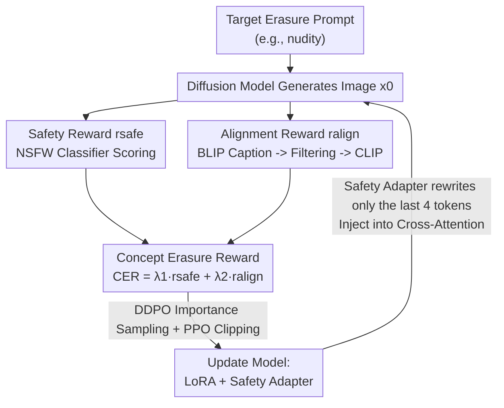

# ForceForget: Reinforcement Concept Removal for Enhancing Safety in Text-to-Image Models

**Conference**: ICML 2026  
**arXiv**: [2606.14351](https://arxiv.org/abs/2606.14351)  
**Code**: To be confirmed  
**Area**: Image Generation / Diffusion Models / AI Safety  
**Keywords**: Concept Erasure, Text-to-Image Safety, Reinforcement Learning, Cross-Attention Adapter, NSFW Defense

## TL;DR
This work reformulates "erasing unsafe concepts" as a reinforcement learning reward optimization problem. It fine-tunes a diffusion model using a Concept Erasure Reward (CER)—composed of a safety reward and an alignment reward—paired with a "Safety Adapter" that modifies only a few tail text tokens. This approach thoroughly removes pornographic content while maximizing the preservation of benign semantics (especially person-related content) embedded in harmful prompts.

## Background & Motivation
**Background**: Text-to-image (T2I) models (e.g., Stable Diffusion, DALL·E 2) can generate a wide variety of content, including unsafe material such as pornography and violence. Mainstream safety measures fall into four categories: training set filtering (filtering data via NSFW detectors), post-hoc safety filters (intercepting generation results), training-free guidance (SLD/SAFREE, pushing generation in "opposite directions" during inference), and weight fine-tuning erasure (ESD/MACE/CA/DuMo, directly modifying UNet weights to remove target concepts).

**Limitations of Prior Work**: The core problem with Supervised Fine-Tuning (SFT) based erasure methods is **over-erasure**. On one hand, "unsafe concepts" are difficult to define precisely in SFT, leading to incomplete erasure. On the other hand, because concepts like "nudity" are naturally strongly associated with "person," methods with high erasure strength often damage the model's ability to generate normal human images. Worse, when a harmful prompt contains safe semantics (e.g., "a person wearing clothes"), existing methods often wipe out the safe semantics as well, leading to degraded model utility. Furthermore, recent work indicates that erasure methods designed for T2I largely fail in image-to-image (I2I) scenarios.

**Key Challenge**: There is a trade-off between erasure intensity and model utility—the cleaner the erasure, the more likely it is to harm benign content; the more that is retained, the easier it is to bypass via adversarial prompts. SFT relies on "hard labels/anchor concepts" for alignment, lacking a direct feedback signal on the actual safeness of generated results.

**Goal**: To thoroughly eliminate unsafe content while preserving the ability to interpret safe semantics within harmful prompts, and to extend erasure capabilities to I2I scenarios and general concepts (artistic styles, objects).

**Key Insight**: The authors draw inspiration from the success of fine-tuning diffusion models with RL to optimize "fuzzy targets" (such as aesthetic quality or compressibility) like DDPO or AlignProp. Since "safety" is also a fuzzy target difficult to supervise with ground truth, it can be formulated as a reward function. This allows the model to learn to "avoid the unsafe and approach the safe" within a self-generation, evaluation, and update loop.

**Core Idea**: Replace Supervised Fine-Tuning with reinforcement learning reward optimization for concept erasure. The method designs a Concept Erasure Reward (CER) consisting of a "safety reward + alignment reward" and uses a lightweight "Safety Adapter" to rewrite only a small number of tail tokens in the text embeddings. This "squeezes out" unsafe concepts from cross-attention without affecting the remaining semantics.

## Method

### Overall Architecture
ForceForget frames concept erasure as an RL fine-tuning loop: given a target concept to be erased (e.g., "nudity"), the model continuously samples prompts from a prompt pool, generates images, and then scores these images using a **Concept Erasure Reward (CER)**. The model is updated via policy gradients (using DDPO's importance sampling + PPO clipping). The CER consists of two parts: the **Safety Reward** $r_{safe}$, which determines image safeness via an NSFW classifier, and the **Alignment Reward** $r_{align}$, which assesses whether the image remains faithful to "safe-version semantics" via an image captioner + CLIP. Structurally, text features are split: most follow standard LoRA linear projections, while a few tail tokens pass through a **Safety Adapter**. The two are concatenated and fed into the UNet's cross-attention layers to achieve erasure that only regulates unsafe semantics without touching the primary subject.

### Key Designs

**1. Safety Reward: Direct scoring of "safeness" using an image-level NSFW classifier**

A pain point of SFT is the inability to directly tell the model "whether this image is safe." This paper uses an image NSFW classifier $\mathcal{M}$ as a safety evaluator, outputting scores for "Neutral" and "Porn" classes ($\varpi_s, \varpi_u$). The safety reward is a weighted sum:

$$r_{safe}=\alpha\varpi_s+\beta\varpi_u=\mathcal{M}(x_0)$$

Where $\alpha$ is a positive coefficient and $\beta$ is a negative coefficient. A positive safety reward indicates the image is safe, while a negative reward indicates potential unsafe content. This signal comes directly from the generated result itself, acting as a "live referee" for RL and guiding the model to push the generation distribution toward the safe domain—much more direct than SFT's alignment with preset anchor concepts. The prompt pool is small, containing only generalized unsafe terms like "nudity," "sexual," "naked," and "erotic."

**2. Alignment Reward: Preventing over-erasure and degradation via "image self-description + target conditions"**

Relying solely on the safety reward carries a risk: the NSFW classifier only recognizes limited content, and the model might learn to generate nonsensical images to "cheat" the referee. The authors observed a tendency to generate arbitrary nude human figures with these simple prompts. Thus, an alignment reward is introduced to ensure erased images remain "meaningful and safe." The approach first uses an image captioner (BLIP) to generate a caption for the image, then applies a simple keyword filter $\tau$ to remove pornographic terms (e.g., cleaning "a nude woman with blond hair" into "a woman with blond hair"). Finally, CLIP measures the consistency between the image and this "safe caption." Additionally, an auxiliary target condition $c_\phi$ ("a photo of person wearing cloth") is added to pull the reward toward "clothed people":

$$r_{align}=CLIP(x_0,\tau(BLIP(x_0)))+CLIP(x_0,c_\phi)$$

The first term ensures the image is faithful to its own safe semantics and does not degrade into noise; the second term specifically compensates for the common utility loss where "erasing nudity hurts person generation." The two rewards are scaled to $[0, 1]$ and summed as $CER=\lambda_1 r_{safe}+\lambda_2 r_{align}$. $\lambda_1, \lambda_2$ control the trade-off between "clean erasure" and "preservation."

**3. Safety Cross-Attention Adapter: Isolating unsafe semantics by rewriting few tail tokens**

The authors found that pure DDPO fine-tuning with CER converges slowly and fails to erase thoroughly. Thus, a lightweight "Safety Adapter" is added to the UNet cross-attention layers. A key observation is that CLIP applies padding to short prompts; a short concept like "nudity" falls at the **front** of the sequence, while **tail** tokens carry weaker semantics. Applying an adapter to the front tokens destroys the prompt's original intent, whereas acting on tail tokens allows for global erasure without damaging the primary semantics. Specifically, text features are split into $c_t=c_t''\otimes c_t'$: a small tail segment $c_t'$ (last 4 tokens) is processed by independent adapter projections $K_{sa}=c_t'W_k'$ and $V_{sa}=c_t'V_k'$, while the rest $c_t''$ follows standard LoRA projections to get $K'', V''$. They are then concatenated:

$$\mathbf{Z_{sa}}=Attention(Q,\ K''\otimes K_{sa},\ V''\otimes V_{sa})$$

In this way, the Safety Adapter learns to "dominantly represent unsafe concepts," allowing the main body of text features to focus on safe content. This essentially "collects" unsafe semantics into a few regulated tokens and overwrites them, remaining lightweight (only 4 tokens) and harder to bypass via implicit adversarial prompts than methods modifying the entire cross-attention block.

### Loss & Training
The goal is to maximize the expected reward $\mathbf{J}(\theta)=E_{c\sim p(c),\,x_0\sim p_\theta(x_0|c)}[r(x_0,c)]$, where $r(x_0,c)=CER$. Following DDPO, the denoising process is treated as a multi-step decision-making process, using importance sampling for multi-step updates:

$$\nabla_\theta\mathbf{J}(\theta)=E\Big[\sum_{t=0}^{T}\frac{p_\theta(x_{t-1}|x_t,c)}{p_{\theta_{old}}(x_{t-1}|x_t,c)}\nabla_\theta\log p_\theta(x_{t-1}|x_t,c)\,r(x_0,c)\Big]$$

To prevent the new policy from deviating too far from the old one (causing estimation distortion), PPO's clipping (trust region) is used. Only the LoRA projections and Safety Adapter are trainable; all other weights are frozen.

## Key Experimental Results

### Main Results
Evaluated on the I2P benchmark (4,703 images) using NudeNet (threshold 0.6) to count detected nude body parts (lower is better). Robustness was tested using Ring-A-Bell / MMA / P4D red-teaming attacks (reporting Nude Removal Rate, NRR; higher is better). Fidelity (FID) and prompt following (CLIP score) were measured on COCO-30K. Comparison includes 10 Prev. SOTA erasure methods.

| Method | Total Nudity Detections ↓ | Ring-A-Bell NRR ↑ | MMA NRR ↑ | P4D NRR ↑ | CLIP ↑ | FID ↓ |
|------|------|------|------|------|------|------|
| SD v1.4 (Original Model) | 810 | 0.00 | 0.00 | 36.76 | 31.33 | 19.59 |
| ESD | 133 | 63.51 | 96.30 | 83.46 | 29.89 | 23.63 |
| RECE | 92 | 95.44 | 73.10 | 86.03 | 30.49 | 22.12 |
| SAFREE | 85 | 50.17 | 71.80 | 73.16 | 30.66 | 31.96 |
| Co-Erasing | 53 | 73.33 | 97.20 | 85.29 | 30.35 | 26.97 |
| DuMo | 45 | 99.65 | 96.40 | 97.79 | 30.59 | 28.96 |
| **ForceForget (Ours)** | **38** | **100.0** | **100.0** | **99.63** | 30.53 | 26.73 |

Erasure is the most thorough (38 detections, far lower than the original 810 and the second-best DuMo's 45). Simultaneously, NRR reaches near-perfect scores across all three attacks (100.0 for two, 99.63 for P4D), indicating it is both clean and hard to bypass. CLIP/FID remain within reasonable ranges, showing no significant sacrifice of benign quality for safety.

### Ablation Study

| Dimension | Observation | Description |
|------|------|------|
| Only $r_{safe}$ | Degenerates into generating arbitrary nudity | Safety referee has limited coverage; needs alignment reward for grounding |
| Add $r_{align}$ | Preserves "person wearing clothes" semantics | Target condition $c_\phi$ repairs utility for human generation |
| Only CER (No Adapter) | Slow convergence, incomplete erasure | Safety Adapter is needed to accelerate and strengthen erasure |
| Adapter Position | Tail tokens superior to front tokens | Front tokens carry main prompt semantics; modifying them breaks the prompt |

### Key Findings
- **Alignment reward is the key antidote for "over-erasure"**: Without it, the model generates random content to "pass" safety checks. Adding the "self-description caption + clothing condition" preserves safe semantics and human generation capability.
- **Erasure position matters**: Since CLIP pads short concepts to the front, the Safety Adapter must act on **tail** tokens to achieve "global erasure without breaking main semantics." This is a counter-intuitive but practical engineering insight.
- **RL loop brings robustness advantages**: Unlike SFT or closed-form methods, using the safety of the generated result as a direct reward makes the model almost immune to red-teaming adversarial prompts (especially Ring-A-Bell / MMA).

## Highlights & Insights
- **Fuzzy "Safety" as an RL Reward**: Using an NSFW classifier as a live referee instead of SFT's hard anchors bypasses the fundamental difficulty of defining unsafe concepts. This reformulation is very clean.
- **"Image Self-Description + Keyword Filtering" to create safe captions**: Having the model use a caption of its own image (cleaned of pornographic terms) to constrain itself is a self-supervised, annotation-free alignment signal that can be transferred to other tasks.
- **Tail Token Isolation**: "Divert" unsafe semantics to a few regulated tokens and overwrite them; this is lightweight and hard to bypass. The idea can extend to general concepts like styles or objects.

## Limitations & Future Work
- Safety rewards depend on external NSFW classifiers; the referee's blind spots (limited categories) become the erasure upper bound. If the classifier is fooled by adversarial examples, the reward signal distorts.
- The "clothed person" target condition $c_\phi$ is manually designed for sexual content; it may need redesigning when migrating to other sensitive concepts like violence or gore.
- The training cost and stability of RL fine-tuning (reward scaling, PPO hyperparameters) are higher than closed-form methods.
- Experiments on I2I and general concept erasure are qualitative; they lack systematic comparisons with I2I-specific defense methods.

## Related Work & Insights
- **vs. ESD / CA (SFT Fine-tuning)**: SFT relies on anchor concepts for alignment, which is hard to define and prone to over-erasure. Ours uses RL reward optimization for a more direct and cleaner signal.
- **vs. MACE / RECE (Closed-form Erasure)**: Closed-form methods are fast but lack feedback from generated results. Ours sacrifices training cost for superior robustness against red-teaming attacks.
- **vs. SLD / SAFREE (Training-free Guidance)**: Training-free methods rely on inference-time projection and are easily bypassed. Ours "bakes" the erasure into the weights and adapters, offering significantly better robustness.
- **vs. DDPO / AlignProp (RL Fine-tuning for Diffusion)**: These optimize for aesthetics or alignment. This is the first work to apply RL reward optimization to the safety goal of "concept erasure," designing a specific CER and Safety Adapter.

## Rating
- Novelty: ⭐⭐⭐⭐ First reformulation of concept erasure as RL reward optimization; CER + Safety Adapter combo is clear.
- Experimental Thoroughness: ⭐⭐⭐⭐ Compares with 10 SOTA methods, includes three red-teaming attacks, and extensions to I2I/general concepts.
- Writing Quality: ⭐⭐⭐⭐ Motivation, method, and experiment logic are smooth.
- Value: ⭐⭐⭐⭐ Provides a practical balance between "clean erasure" and "utility preservation" with outstanding robustness.

<!-- RELATED:START -->

## Related Papers

- [\[ECCV 2024\] Enhancing Diffusion Models with Text-Encoder Reinforcement Learning](../../ECCV2024/image_generation/enhancing_diffusion_models_with_text-encoder_reinforcement_learning.md)
- [\[ECCV 2024\] Implicit Concept Removal of Diffusion Models](../../ECCV2024/image_generation/implicit_concept_removal_of_diffusion_models.md)
- [\[CVPR 2026\] When Safety Collides: Resolving Multi-Category Harmful Conflicts in Text-to-Image Diffusion via Adaptive Safety Guidance](../../CVPR2026/image_generation/when_safety_collides_resolving_multi-category_harmful_conflicts_in_text-to-image.md)
- [\[ICML 2026\] Orthogonal Concept Erasure for Diffusion Models](orthogonal_concept_erasure_for_diffusion_models.md)
- [\[CVPR 2026\] Neighbor-Aware Localized Concept Erasure in Text-to-Image Diffusion Models](../../CVPR2026/image_generation/neighbor-aware_localized_concept_erasure_in_text-to-image_diffusion_models.md)

<!-- RELATED:END -->
