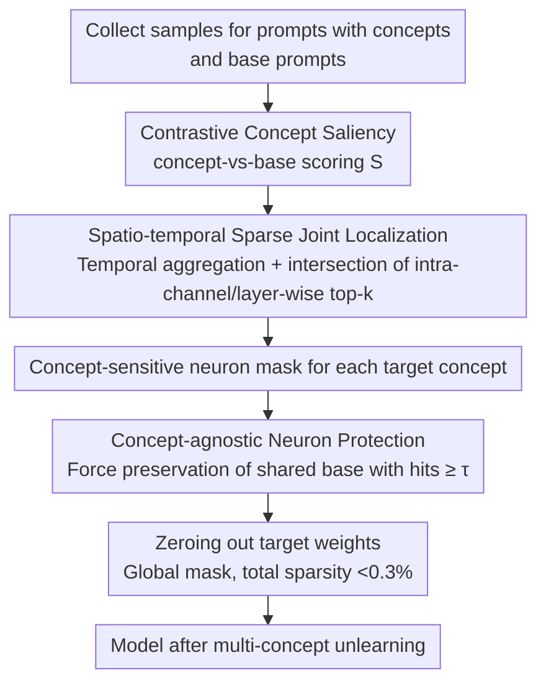

# Forget-It-All: Multi-Concept Machine Unlearning via Concept-Aware Neuron Masking

**Conference**: ICML 2026  
**arXiv**: [2601.06163](https://arxiv.org/abs/2601.06163)  
**Code**: https://github.com/kaiyuan02415/Forget-It-All (Available)  
**Area**: AI Safety / Diffusion Model Unlearning / Model Sparsity  
**Keywords**: Multi-concept machine unlearning, text-to-image diffusion, concept-sensitive neurons, neuron masking, training-free

## TL;DR
This paper proposes FIA, a training-free multi-concept unlearning framework. By employing "contrastive concept saliency + spatio-temporal sparse selection," it locates concept-sensitive neurons corresponding to each target concept. When merging multi-concept masks, it explicitly preserves "concept-agnostic neurons" that respond to multiple concepts simultaneously, pruning only truly concept-specific connections. On SD v1.5/v1.4, it successfully unlearns ten Imagenette classes (average unlearning accuracy 1.9%, overall score 86%), multiple artistic styles, and inappropriate content with a total sparsity rate of <0.3%.

## Background & Motivation

**Background**: T2I diffusion models (e.g., Stable Diffusion) generate high-quality images but pose risks related to copyright, privacy, and inappropriate content. Machine unlearning (MU) is considered a cost-effective solution. Current mainstream methods fall into two categories: fine-tuning-based methods (FMN, SalUn, AC, ESD, MACE, SPM), which erase concepts by updating cross-attention or adding LoRAs; and training-free methods (UCE, SLD, ConceptPrune), which directly edit weights or inject safety guidance during inference.

**Limitations of Prior Work**: Most methods are designed for single-concept unlearning. Applying them sequentially to multiple concepts leads to two significant issues: (i) previously forgotten concepts may be "reactivated," or overall generation quality may collapse; (ii) fine-tuning is extremely sensitive to hyperparameters, requiring re-tuning for every added concept, which leads to linear growth in computational overhead and susceptibility to overfitting. Even specialized multi-concept methods (SPM/MACE/COGFD/SepME) rely on additional LoRAs, concept maps, or closed-form editing, making it difficult to optimize unlearning effectiveness and generation quality simultaneously.

**Key Challenge**: There is a conflict between "thoroughly deleting $N$ concepts" and "preserving general generation capabilities." Many weights contribute to the expression of multiple concepts simultaneously. Simply taking the union of masks for all candidate neurons would result in excessive "collateral damage" to neurons sharing low-level features.

**Goal**: (1) Identify truly "concept-sensitive" neurons for each target concept without fine-tuning or introducing additional parameters; (2) Protect "concept-agnostic" neurons shared by multiple concepts during mask fusion to avoid degradation in generation quality.

**Key Insight**: The authors reinterpret multi-concept unlearning as a **model sparsity** problem. Since a single concept activates only a small number of neurons, performing "concept-aware pruning" for each concept and then merging masks with a smart fusion strategy can achieve multi-concept unlearning at an extremely low sparsity rate.

**Core Idea**: Use *contrastive, spatio-temporal joint* neuron saliency to separate concept-specific neurons from shared neurons. By pruning the former and preserving the latter, the model can "forget $N$ concepts without forgetting how to draw."

## Method

### Overall Architecture
FIA reformulates the task of "forgetting $C$ concepts simultaneously without harming general drawing capabilities" as a model sparsity problem. It individually locates a small number of neurons that truly serve only each target concept and utilizes a fusion strategy that "bypasses shared neurons" to merge pruning decisions into a global mask. The entire pipeline is completed during inference without updating any weights. It first scores each connection using contrastive saliency for each concept, aggregates these scores across space and time to filter concept-sensitive neurons, and then performs concept-agnostic-aware fusion to zero out weights targeted by the final mask. The total pruning rate is less than 0.3% of the model.

### Key Designs

**1. Contrastive Concept Saliency: Separating "Concept-Specific" from "General Features" via Concept-vs-Base**

The first challenge in multi-concept unlearning is the criterion: simply looking at weight magnitude or activation intensity cannot distinguish whether a connection is drawing a "concept" or "low-level features used in any image." FIA first defines a unified energy for each connection $(i,j)$ as $U_{\ell,t,i,j}=|W_{\ell,i,j}|\cdot\|X_{\ell,t,j}\|_2\cdot \frac{|\langle X_{\ell,t,j},Y_{\ell,t,i}\rangle|}{\|X_{\ell,t,j}\|_2\cdot\|Y_{\ell,t,i}\|_2+\varepsilon}$, characterizing weight magnitude, input activity, and "input-output directional consistency." The cosine term specifically penalizes neurons that are highly active but only propagate noise. The key is the contrast: for the same concept, samples are collected using a "concept prompt" (e.g., *a golf ball on the table*) and a "base prompt" stripped of the concept (*a table*). The mean $\mu_c$, $\mu_b$ and base variance $\sigma_b$ of $U$ are calculated, and $S_{\ell,t,i,j}=\max(0,\,\mu_c-\mu_b-\sigma_b)$ is computed. Subtracting the background mean and one standard deviation serves as a lightweight statistical significance filter. Only connections whose contributions are stable and significantly elevated after adding the concept receive a positive score, ensuring pruning targets concept-specific connections rather than the shared base.

**2. Spatio-temporal Sparse Joint Localization: Ensuring Stability and Precision of Selected Neurons**

Once step-wise and position-wise saliency $S$ is obtained, it must be converged into a set of stable neurons. Otherwise, transient spikes at a specific denoising step might be mistaken for concept neurons. FIA first aggregates across time using $A_{\ell,i,j}=\tfrac12\cdot\tfrac1T\sum_t S_{\ell,t,i,j}+\tfrac12\cdot\tfrac1T\sum_t \mathbf{1}[S_{\ell,t,i,j}>\tau_{\ell,t}]$, combining "average response intensity" and "activation frequency exceeding an adaptive threshold" with equal weights (where $\tau_{\ell,t}$ is the top-$r_1$ quantile per layer/step). Thus, only connections consistently active across time steps receive high scores. Spatially, two complementary filters are applied: taking the intra-channel top-$k$ of $A$ to obtain a local set $C_\ell$, preventing the budget from being consumed by a few dominant channels; and taking the layer-wide top-$K_g=r_2\cdot C_{out}\cdot C_{in}$ to obtain a global set $G_\ell$. The final concept-sensitive neurons for that layer are the intersection $\mathcal{Q}_\ell^{(c)}=C_\ell\cap G_\ell$, ensuring neurons are "not missing locally and not weak globally."

**3. Concept-agnostic Neuron Protection: Locking the Shared Base via Counting**

Directly taking the union of $C$ single-concept masks would prune neurons that "happen to be used by every concept," which often encode basic capabilities like color, shape, and composition. Deleting them would cause a collapse in CLIP/FID scores. FIA observes that the more target concepts a neuron hits, the more likely it is a general base rather than concept-specific. Therefore, it counts hits for each neuron $s_{\ell,i,j}=\sum_{c=1}^C \mathrm{Mask}_\ell^{(c)}[i,j]$ and sets a threshold $\tau_{ca}=\lceil \alpha C \rceil$ (where $\alpha\in(0,1]$ is the "concept-agnostic ratio"). Neurons with hits $s_{\ell,i,j}\ge\tau_{ca}$ are identified as concept-agnostic and forcibly preserved, while only connections with $0<s_{\ell,i,j}<\tau_{ca}$ (serving only one or two target concepts) are pruned. This avoids the need for LLM concept maps or explicit anchors, using a simple count to shield the shared base.

The entire process is training-free, with no gradient updates or new learnable parameters. It only requires setting three sparsity rates: temporal sparsity $r_1$, spatial sparsity $r_2$, and concept-agnostic ratio $\alpha$. Saliency is collected by sampling ~10 images per concept through 50 denoising steps. Inference can be completed and instantly rolled back on a single A6000 GPU.

## Key Experimental Results

### Main Results

**Multi-Object Unlearning (Simultaneous unlearning of 10 Imagenette classes, SD v1.5)**:

| Method | Avg Unlearn Acc ↓ | CLIP_coco ↑ | Remarks |
|------|----------------|------------|------|
| SD v1.5 (Original) | 90.34 | 31.42 | Not unlearned |
| CP (Training-free pruning) | 7.34 | 27.93 | Good unlearning but quality collapse |
| UCE (Closed-form edit) | 8.62 | 29.25 | Training-free baseline |
| SalUn (Fine-tuning) | 23.17 | 29.93 | Fine-tuning SOTA |
| SPM (LoRA) | 47.29 | 30.77 | Fine-tuning |
| MACE (LoRA+CFR) | 78.22 | 31.05 | Specialized multi-concept method |
| **FIA (Ours)** | **1.9** | 29.56 | Training-free, nearly total unlearning |

**Unlearn first 5 / Preserve last 5 Imagenette classes (overall = harmonic mean(P, 1−F))**:

| Method | Unlearn Acc ↓ | Preserve Acc ↑ | Overall ↑ |
|------|------------|--------------|-----------|
| CP | 2.7 | 52.4 | 68.1 |
| UCE | 5.5 | 71.9 | 81.7 |
| MACE | 58.5 | 78.2 | 54.2 |
| SalUn | 22.3 | 77.4 | 77.5 |
| **FIA** | **2.1** | 76.7 | **86.0** |

**Inappropriate Content Unlearning (I2P, NudeNet detection, SD v1.4)**: FIA reduced the total detected exposed body parts from 743 in the original model to **32** (second best MACE: 111), while maintaining FID 14.02 / CLIP 31.18 comparable to the baseline.

**Multi-Artist Style Unlearning (Van Gogh / Monet / Picasso / Da Vinci / Dali)**:

| Method | CLIP_a (Artist Sim) ↓ | FSR (Forget Success) ↑ | COCO CLIP ↑ |
|------|------------------------|-----------------------|-------------|
| CP | 27.90 | 79.6 | 29.76 |
| MACE | 30.98 | 57.4 | 30.14 |
| SPM | 31.10 | 40.0 | 31.33 |
| **FIA** | **27.45** | **83.4** | 30.56 |

### Ablation Study

| Configuration | Key Metrics | Description |
|------|---------|------|
| Full FIA | Forget Acc 1.9 / CLIP 29.56 | Complete model |
| Temporal Sparsity Only | Slight unlearn increase, sharp quality drop | Selected "layer-wide dominant neurons," harming general capability |
| Spatial Sparsity Only | Incomplete unlearning | Selected generally strong activations rather than concept-specific |
| No Concept-agnostic Protection | Significant CLIP drop | Shared neurons mistakenly pruned, quality collapse |
| Increasing Total Sparsity > 0.3% | Unlearn stable, quality drops monotonically | FIA is already at the most economical pruning point |

### Key Findings
- The three modules are irreplaceable: contrastive saliency determines "precision," spatio-temporal sparsity determines "stability," and concept-agnostic protection determines "post-pruning quality." Removing any significantly degrades performance.
- The total pruning rate is less than 0.3% of the entire model, confirming that information for multi-concept unlearning is highly concentrated in very few neurons—a significant discovery regarding model sparsity.
- As the number of target concepts increases from 2 to 10, FIA's unlearning accuracy remains linearly low, while baselines typically deteriorate rapidly.
- The same set of hyperparameters works across three distinct tasks (objects, styles, inappropriate content), validating the "plug-and-play" promise of the training-free approach.

## Highlights & Insights
- **Contrastive + Statistical Significance Pruning Criterion**: By using the mean difference between concept and base prompts minus the background variance, the traditional "importance score" is upgraded to a "concept specificity t-test." This elegant idea is transferable to other semantic pruning scenarios (e.g., style unlearning or specific capability reduction in LLMs).
- **Observation on Co-activation**: The heuristic that "neurons co-activated by multiple concepts are general-purpose" allows the identification of the shared base via a simple counting formula. This avoids the complex engineering of LLM concept maps or explicit anchors used in previous methods.
- **Training-free + 0.3% Sparsity**: This implies no GPU fine-tuning, no added parameters, and instant rollback (by keeping the original mask backup), which is highly favorable for regulatory compliance.
- **Transferability**: The framework's core logic—establishing contrastive response distributions followed by intersection and shared protection—can be applied to LLM unlearning or feature pruning in vision encoders.

## Limitations & Future Work
- The authors acknowledge that when the number of target concepts is extremely large and semantics overlap heavily, it may be difficult to find enough "concept-specific" neurons, as most fall into the "concept-agnostic" region, leading to incomplete unlearning.
- Validation was limited to SD v1.4/1.5 and SDXL; whether the sparsity assumption holds for DiT-based models (e.g., PixArt, SD3, Flux) or video diffusion models remains to be verified.
- Contrastive Concept Saliency relies on manually designed base prompts. For abstract/compositional concepts (e.g., "violence" or "racial stereotypes"), it is difficult to design a "neutral prompt" that remains after removing the concept, potentially causing bias in saliency estimation.
- Neuron pruning is a non-learnable binary decision; theoretically, a risk of "reactivation" exists (adversarial prompts or textual inversion might bypass the mask). Robustness against adversarial unlearning was not strictly compared with methods like Stereo.
- Future directions: Gated masks instead of hard 0/1, expanding contrastive saliency to self-attention/MLP layers, and making $\alpha$ an adaptive, data-driven threshold.

## Related Work & Insights
- **vs ConceptPrune (CP)**: Both follow a training-free pruning route, but CP targets single concepts and relies on fixed thresholds, leading to severe neuron interference in multi-concept scenarios. FIA introduces contrastive saliency, spatio-temporal joint localization, and concept-agnostic protection, improving unlearning (7.34 to 1.9) and CLIP (27.93 to 29.56).
- **vs MACE / SPM (LoRA Unlearning)**: MACE/SPM adapt multiple concepts via LoRAs but require training adapters for each concept and suffer from cumulative quantization errors in cross-attention editing. FIA requires no fine-tuning and no storage of extra parameters per concept.
- **vs UCE / SPEED / ScaPre (Closed-form editing)**: These methods modify cross-attention weights, relying on precise concept embeddings and often dragging down image quality. FIA leaves weight values untouched, only zeroing out a few neurons, which minimizes impact on quality and allows instant rollback.
- **vs SalUn (Gradient Saliency Fine-tuning)**: SalUn also uses saliency but requires backpropagation and fine-tuning. FIA approximates neuron contribution via forward activation contrast, saving computation and improving stability.

## Rating
- Novelty: ⭐⭐⭐⭐ "Concept-agnostic neurons" observation + contrastive saliency converts multi-concept unlearning into a sparsity problem.
- Experimental Thoroughness: ⭐⭐⭐⭐⭐ Three task types + multiple baselines + SDXL generalization + extensive ablation.
- Writing Quality: ⭐⭐⭐⭐ Clear structure and intuitive diagrams; some notation ($\tau_{\ell,t}$) is slightly dense.
- Value: ⭐⭐⭐⭐⭐ Training-free, 0.3% sparsity, and plug-and-play make it a practical baseline for T2I compliance.

<!-- RELATED:START -->

<!-- RELATED:END -->

## Related Papers

- [\[ECCV 2024\] Challenging Forgets: Unveiling the Worst-Case Forget Sets in Machine Unlearning](../../ECCV2024/image_generation/challenging_forgets_unveiling_the_worst-case_forget_sets_in_machine_unlearning.md)
- [\[ICML 2026\] Diagnosing and Correcting Concept Omission in Multimodal Diffusion Transformers](diagnosing_and_correcting_concept_omission_in_multimodal_diffusion_transformers.md)
- [\[CVPR 2026\] Neighbor-Aware Localized Concept Erasure in Text-to-Image Diffusion Models](../../CVPR2026/image_generation/neighbor-aware_localized_concept_erasure_in_text-to-image_diffusion_models.md)
- [\[ICML 2026\] Orthogonal Concept Erasure for Diffusion Models](orthogonal_concept_erasure_for_diffusion_models.md)
- [\[AAAI 2026\] Mass Concept Erasure in Diffusion Models with Concept Hierarchy](../../AAAI2026/image_generation/mass_concept_erasure_in_diffusion_models_with_concept_hierarchy.md)

<!-- RELATED:END -->
