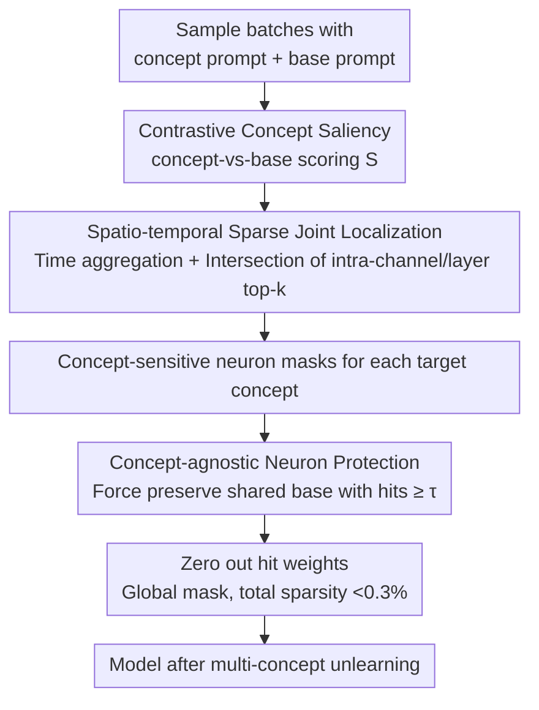

# Forget-It-All: Multi-Concept Machine Unlearning via Concept-Aware Neuron Masking

**Conference**: ICML 2026  
**arXiv**: [2601.06163](https://arxiv.org/abs/2601.06163)  
**Code**: https://github.com/kaiyuan02415/Forget-It-All (Available)  
**Area**: AI Safety / Diffusion Model Unlearning / Model Sparsity  
**Keywords**: Multi-concept machine unlearning, Text-to-image diffusion, Concept-sensitive neurons, Neuron masking, Training-free

## TL;DR
This paper proposes FIA, a training-free multi-concept unlearning framework. By utilizing "contrastive concept saliency + spatio-temporal sparse selection," it locates concept-sensitive neurons for each target concept. When fusing multi-concept masks, it explicitly preserves "concept-agnostic neurons" that respond to multiple concepts simultaneously, pruning only concept-exclusive connections. On SD v1.5/v1.4, with a total sparsity rate of <0.3%, it achieves simultaneous unlearning of ten Imagenette classes (average forget accuracy 1.9%, overall score 86%), as well as multiple artistic styles and inappropriate content.

## Background & Motivation

**Background**: T2I diffusion models (e.g., Stable Diffusion) generate high-quality images but pose risks regarding copyright, privacy, and inappropriate content. Machine unlearning (MU) is considered a cost-effective solution. Current mainstream methods fall into two categories: fine-tuning-based methods (FMN, SalUn, AC, ESD, MACE, SPM), which update cross-attention or add LoRAs to erase concepts; and training-free methods (UCE, SLD, ConceptPrune), which directly edit weights or inject safety guidance during inference.

**Limitations of Prior Work**: Most methods are designed for single concepts. Applying them sequentially to multiple concepts leads to two issues: (i) previously forgotten concepts may be "reactivated," or overall generation quality collapses; (ii) fine-tuning is extremely sensitive to hyperparameters, requiring re-tuning for every added concept, which increases computational overhead linearly and risks overfitting. Even specialized multi-concept methods (SPM, MACE, COGFD, SepME) rely on additional LoRAs, concept graphs, or closed-form editing, making it difficult to optimize both unlearning efficacy and generation quality.

**Key Challenge**: There is a conflict between "thoroughly erasing $N$ concepts" and "preserving general generation capabilities." Many weights simultaneously support the expression of multiple concepts. Simply taking the union of masks for all candidate neurons heavily damages neurons that share underlying features.

**Goal**: (1) Identify truly "concept-sensitive" neurons for each target concept without fine-tuning or adding parameters; (2) Protect "concept-agnostic" neurons shared by multiple concepts during mask fusion to avoid generation quality degradation.

**Key Insight**: The authors reframe multi-concept unlearning as a **model sparsity** problem. Since a single concept activates only a small number of neurons, performing "concept-aware pruning" for each concept and merging masks with a smart fusion strategy can achieve multi-concept unlearning at an extremely low sparsity rate.

**Core Idea**: Use *contrastive, spatio-temporal joint* neuron saliency to isolate concept-exclusive neurons from shared neurons; prune the former and preserve the latter to "forget $N$ concepts without forgetting how to draw."

## Method

### Overall Architecture
FIA reformulates the task of "forgetting $C$ concepts without harming general drawing capabilities" as a model sparsity problem. It individually locates the small number of neurons serving each target concept and uses a fusion strategy that "bypasses shared neurons" to merge pruning decisions into a global mask. The entire pipeline is completed during inference without updating any weights. It first scores each connection using contrastive saliency for each concept, aggregates these scores spatio-temporally to filter concept-sensitive neurons, and then performs concept-agnostic aware fusion, zeroing out weights hit by the final mask. The total pruning rate is less than 0.3% of the model.

### Key Designs

**1. Contrastive Concept Saliency: Isolating "Concept-Exclusive" from "General Features" via concept-vs-base**

The first hurdle in multi-concept unlearning is the criterion: weight magnitude or activation intensity alone cannot distinguish whether a connection is drawing a "concept" or "low-level features used in any image." FIA defines a unified energy for each connection $(i,j)$ as $U_{\ell,t,i,j}=|W_{\ell,i,j}|\cdot\|X_{\ell,t,j}\|_2\cdot \frac{|\langle X_{\ell,t,j},Y_{\ell,t,i}\rangle|}{\|X_{\ell,t,j}\|_2\cdot\|Y_{\ell,t,i}\|_2+\varepsilon}$, characterizing weight magnitude, input activity, and "input-output directional consistency"—the cosine term specifically penalizes neurons that are highly active but only transmit noise. The key is contrast: sample batches using a "concept prompt" (e.g., *a golf ball on the table*) and a "base prompt" without the concept (e.g., *a table*). Calculate the means $\mu_c$, $\mu_b$ and base variance $\sigma_b$ of $U$, then take $S_{\ell,t,i,j}=\max(0,\,\mu_c-\mu_b-\sigma_b)$. Subtracting the background mean and one standard deviation serves as a lightweight statistical significance filter, ensuring only connections with stable and significant contribution increases after adding the concept are scored positively.

**2. Spatio-temporal Sparse Joint Localization: Stabilizing and Refining Selected Neurons**

After obtaining step-wise and position-wise saliency $S$, it must be condensed into a stable set of neurons. FIA first aggregates over time: $A_{\ell,i,j}=\tfrac12\cdot\tfrac1T\sum_t S_{\ell,t,i,j}+\tfrac12\cdot\tfrac1T\sum_t \mathbf{1}[S_{\ell,t,i,j}>\tau_{\ell,t}]$, combining "average response intensity" and "activation frequency above an adaptive threshold" (where $\tau_{\ell,t}$ is the top-$r_1$ percentile per layer per step). This ensures only connections persistently active across timesteps receive high scores. Spatially, two complementary filters are applied: an intra-channel top-$k$ selection for $A$ to get a local set $C_\ell$, ensuring the budget isn't consumed by a few dominant channels; and a global top-$K_g=r_2\cdot C_{out}\cdot C_{in}$ selection for the entire layer to get a global set $G_\ell$. The intersection $\mathcal{Q}_\ell^{(c)}=C_\ell\cap G_\ell$ forms the stable set of concept-sensitive neurons for that layer.

**3. Concept-Agnostic Neuron Protection: Locking the Shared Base via Counting**

Directly taking the union of $C$ single-concept masks would prune neurons that "happen to be used by every concept," which often encode basic capabilities like color, shape, and composition. Deleting these leads to a collapse in CLIP/FID. FIA observes that neurons hit by more target concepts are more likely to be general base neurons. Thus, it counts hits for each neuron $s_{\ell,i,j}=\sum_{c=1}^C \mathrm{Mask}_\ell^{(c)}[i,j]$ and sets a threshold $\tau_{ca}=\lceil \alpha C \rceil$ ($\alpha\in(0,1]$ is the "concept-agnostic ratio"). Neurons with $s_{\ell,i,j}\ge\tau_{ca}$ are classified as concept-agnostic and forcibly preserved, pruning only connections with $0<s_{\ell,i,j}<\tau_{ca}$. This protects the shared base without needing LLM concept graphs or explicit anchors.

The entire process is training-free, requiring only three sparsity rates—temporal $r_1$, spatial $r_2$, and concept-agnostic ratio $\alpha$. Saliency is collected by sampling ~10 images per concept through 50 denoising steps.

## Key Experimental Results

### Main Results

**Multi-object Unlearning (10 Imagenette classes simultaneously, SD v1.5)**:

| Method | Avg. Forget Accuracy ↓ | CLIP_coco ↑ | Notes |
| :--- | :--- | :--- | :--- |
| SD v1.5 (Original) | 90.34 | 31.42 | Not unlearned |
| CP (Training-free pruning) | 7.34 | 27.93 | Good unlearning, poor quality |
| UCE (Closed-form edit) | 8.62 | 29.25 | Training-free baseline |
| SalUn (Fine-tuning) | 23.17 | 29.93 | Fine-tuning SOTA |
| SPM (LoRA) | 47.29 | 30.77 | Fine-tuning |
| MACE (LoRA+CFR) | 78.22 | 31.05 | Specialized multi-concept method |
| **FIA (Ours)** | **1.9** | 29.56 | Training-free, near-complete unlearning |

**Imagenette First 5 Forgotten / Last 5 Preserved (overall = harmonic mean(P, 1−F))**:

| Method | Forget Acc ↓ | Preserve Acc ↑ | Overall ↑ |
| :--- | :--- | :--- | :--- |
| CP | 2.7 | 52.4 | 68.1 |
| UCE | 5.5 | 71.9 | 81.7 |
| MACE | 58.5 | 78.2 | 54.2 |
| SalUn | 22.3 | 77.4 | 77.5 |
| **FIA** | **2.1** | 76.7 | **86.0** |

**Inappropriate Content Unlearning (I2P, NudeNet detection, SD v1.4)**: FIA reduced total detected exposed body parts from 743 to **32** (next best MACE 111), while maintaining FID 14.02 / CLIP 31.18.

**Multi-style Unlearning (Van Gogh / Monet / Picasso / Da Vinci / Dali)**:

| Method | CLIP_a (Artist Sim.) ↓ | FSR (Forget Success) ↑ | COCO CLIP ↑ |
| :--- | :--- | :--- | :--- |
| CP | 27.90 | 79.6 | 29.76 |
| MACE | 30.98 | 57.4 | 30.14 |
| SPM | 31.10 | 40.0 | 31.33 |
| **FIA** | **27.45** | **83.4** | 30.56 |

### Ablation Study

| Configuration | Key Metrics | Description |
| :--- | :--- | :--- |
| Full FIA | Forget Acc 1.9 / CLIP 29.56 | Complete model |
| Time-only Sparsity | Slight forget increase, large quality drop | Picks "dominant neurons," harms general ability |
| Spatial-only Sparsity | Incomplete unlearning | Picks neurons with strong general activation |
| No Agnostic Protection | Severe CLIP drop | Shared neurons pruned by mistake; quality collapse |
| Sparsity > 0.3% | Forget unchanged, quality drops | Confirms FIA is at the most efficient point |

### Key Findings
- The three modules are indispensable: Contrastive saliency determines "accuracy," spatio-temporal sparsity determines "stability," and concept-agnostic protection determines "generation capability."
- Total pruning rate is under 0.3%, suggesting multi-concept unlearning "information" is highly concentrated in very few neurons.
- As the number of concepts increases from 2 to 10, FIA's forget accuracy remains linearly low, whereas baselines degrade rapidly.
- The same hyperparameters work across three tasks (objects, styles, inappropriate content), verifying its "plug-and-play" promise.

## Highlights & Insights
- **Contrastive + Statistical Significance Pruning**: Upgrading "importance scores" to a "concept-specific t-test" is a simple yet effective idea transferable to other semantic pruning tasks.
- **Shared Neuron Observation**: Using a simple hit count to identify the "shared base" avoids complex engineering like LLM concept graphs.
- **Training-free + 0.3% Sparsity**: No GPU fine-tuning, no new parameters, and instant rollback (via mask backup) make it highly suitable for regulatory compliance.
- **Transferability**: The strategy of "establishing contrastive response distributions, then performing intersection + shared protection" could be applied to LLM unlearning or vision encoder feature pruning.

## Limitations & Future Work
- When target concepts are numerous and semantically overlapping, it may be difficult to find enough "concept-exclusive" neurons, potentially leading to incomplete unlearning.
- Validated only on SD v1.4/1.5 and SDXL; sparsity assumptions for DiT-based models (e.g., SD3, Flux) or video diffusion remain unverified.
- Contrastive Concept Saliency relies on manual base prompts, which is difficult for abstract concepts like "violence" or "racial stereotypes."
- Neuron pruning is a non-learnable binary decision; reactivation risks via adversarial prompts or textual inversion still exist and were not strictly compared against adversarial robust methods like Stereo.
- Future work: Use gated masks instead of hard 0/1, extend contrastive saliency beyond cross-attention to self-attention/MLP, and automate the concept-agnostic ratio $\alpha$.

## Related Work & Insights
- **vs ConceptPrune (CP)**: Both use training-free pruning, but CP lacks robust multi-concept logic. FIA improves forget acc from 7.34 to 1.9 and CLIP from 27.93 to 29.56 by refining fusion and saliency.
- **vs MACE / SPM (LoRA Unlearning)**: FIA outperforms these in deployment cost and efficacy by avoiding per-concept adapters and cumulative errors from closed-form editing.
- **vs UCE / SPEED / ScaPre (Closed-form Weight Editing)**: These modify weights and can degrade quality; FIA only zeros out few neurons, preserving generation quality better.
- **vs SalUn (Gradient Saliency Fine-tuning)**: FIA approximates neuron contribution via forward activation contrast, avoiding time-consuming and unstable backpropagation.
- **Insight**: Explicitly cargo-fencing "concept-agnostic" neurons could serve as "general capability guardrails" in LLM safety fine-tuning, preventing capability regression during alignment or unlearning.

## Rating
- Novelty: ⭐⭐⭐⭐ reframing unlearning as a "concept-agnostic" sparsity problem is refreshing and applicable to LLMs.
- Experimental Thoroughness: ⭐⭐⭐⭐⭐ three tasks, multiple baselines, SDXL generalization, and extensive ablations.
- Writing Quality: ⭐⭐⭐⭐ clear pipeline, self-consistent formulas, and intuitive diagrams.
- Value: ⭐⭐⭐⭐⭐ training-free, low-sparsity, and plug-and-play; a practical baseline for T2I model compliance.

<!-- RELATED:START -->

## Related Papers

- [\[ECCV 2024\] Challenging Forgets: Unveiling the Worst-Case Forget Sets in Machine Unlearning](../../ECCV2024/image_generation/challenging_forgets_unveiling_the_worst-case_forget_sets_in_machine_unlearning.md)
- [\[CVPR 2026\] GenErase: Generalizable and Semantically-Aware Concept Erasure in Diffusion Models](../../CVPR2026/image_generation/generase_generalizable_and_semantically-aware_concept_erasure_in_diffusion_model.md)
- [\[ICML 2026\] Diagnosing and Correcting Concept Omission in Multimodal Diffusion Transformers](diagnosing_and_correcting_concept_omission_in_multimodal_diffusion_transformers.md)
- [\[CVPR 2026\] Neighbor-Aware Localized Concept Erasure in Text-to-Image Diffusion Models](../../CVPR2026/image_generation/neighbor-aware_localized_concept_erasure_in_text-to-image_diffusion_models.md)
- [\[ICML 2026\] Orthogonal Concept Erasure for Diffusion Models](orthogonal_concept_erasure_for_diffusion_models.md)

<!-- RELATED:END -->
