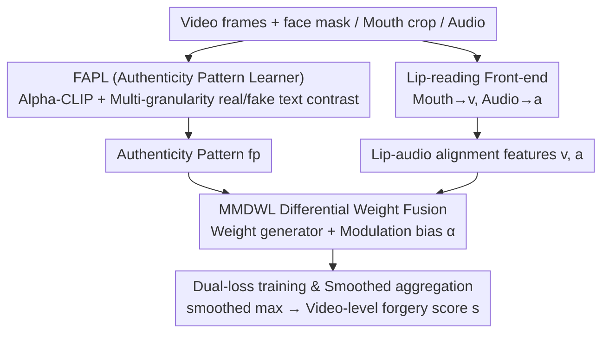

# From Talking to Singing: A New Challenge for Audio-Visual Deepfake Detection

**Conference**: ICML 2026  
**arXiv**: [2605.27944](https://arxiv.org/abs/2605.27944)  
**Code**: https://LiuKe3068LikWix.github.io/SingingHead-DeepFake/  
**Area**: AI Security / Audio-Visual Deepfake Detection  
**Keywords**: Deepfake, Cross-scenario generalization, Text-guided, Singing-driven avatar, Multimodal fusion

## TL;DR
Targeting the "Singing Head" challenge—a difficult domain neglected by existing deepfake detectors—the authors construct the SHDF dataset to quantify the "Talking → Singing" domain shift. They propose the T-AVFD framework, which uses Alpha-CLIP with multi-granularity real/fake text contrastive learning to extract "semantic patterns of real faces." A differential weight module adaptively fuses lip-audio consistency and facial semantics. Trained solely on real talking videos, it generalizes to singing forgeries, improving SHDF AUC from the ~50% range to 80.2%.

## Background & Motivation

**Background**: The mainstream paradigm for audio-visual forgery detection utilizes "cross-modal inconsistency," particularly the alignment error between lip movement and speech. Representative methods like AVAD and AVH-Align are built on the premise that "lips and audio should be strictly synchronized in real videos." Accompanying datasets (FakeAVCeleb, AVLips, TalkingHeadBench, etc.) consist almost entirely of talking heads.

**Limitations of Prior Work**: When the input shifts from talking to singing, rhythmic vocalization, accompaniment music, and exaggerated mouth/head movements make the lip-audio alignment signal inherently unstable. Detectors relying on alignment as core evidence fail rapidly. Using forgery-agnostic AVH-Align for diagnosis, the authors found the $MMD^2$ domain distance for singing relative to talking is $3.44 \times$ to $4.66 \times$ larger than between two talking domains. The overlap rate of real/fake score distributions soared from 26.4% to 77.6%, indicating a true "non-trivial domain shift."

**Key Challenge**: Cross-modal consistency is naturally weakened in singing scenarios. Simultaneously, there is a lack of singing training data (and singing forgeries cannot be added to the training set to avoid overfitting to specific generator fingerprints). In other words, the challenge is to find cross-scenario forgery clues under the strong constraint that "only real talking videos can be used for training."

**Goal**: (1) Construct the first singing head deepfake benchmark to quantify and expose this shift; (2) Design a detection framework that does not rely on singing training data or forgery samples, enabling generalization across both talking and singing.

**Key Insight**: The authors observe (Figure 2) that regardless of talking or singing, the semantic representation of real faces is richer and more coherent than that of synthetic faces. This acts as an **authenticity signature decoupled from specific scenarios**, which is more stable than lip-audio alignment.

**Core Idea**: Use "multi-granularity real/fake contrastive text" to supervise an Alpha-CLIP face encoder, distilling scenario-independent "real face semantic patterns." Then, a differential weight module adaptively decides whether to trust "facial semantics" or "lip-audio alignment" based on the content.

## Method

### Overall Architecture
The core challenge T-AVFD addresses is shifting forgery discrimination from "lip-audio alignment"—which fails in singing—to a more stable cross-scenario "real face semantic pattern" under the constraint of only training on real talking videos. It receives three inputs: video frames with face masks $\{F_t\}_{t=0}^{T}$, mouth crops $\{M_t\}_{t=0}^{T}$, and audio $\{A_t\}_{t=0}^{T}$. The FAPL (Authenticity Pattern Learner) aligns facial semantics into an authenticity pattern $fp$ within a face-text contrastive space. The MMDWL (Multimodal Differential Weighting Layer) performs content-adaptive fusion between $fp$ and lip-audio alignment features. The final output is a video-level forgery score $s$. The entire training uses only real talking videos with the loss $\mathcal{L}=\mathcal{L}_{ft}+\mathcal{L}_{av}$, without touching any synthetic samples.

### Key Designs

**1. Authenticity Pattern Learner FAPL: Using Real/Fake Text to Anchor Authenticity Semantics**

In singing scenarios, lip-audio alignment is naturally unstable, but real facial semantic representations remain more coherent than synthetic ones. FAPL explicitly distills this "authenticity signature." It replaces standard CLIP with Alpha-CLIP, which takes an additional face mask to strengthen facial region semantics via transformer attention $AT_{fm}$ while preserving global context. Frames are averaged to obtain a stable face feature $f$. On the text side, positive/negative pairs are designed at three granularities: face/eyes/mouth (e.g., "a real human face" vs. "a fake human face"). Each text is prepended with $l$ learnable tokens, passed through a CLIP text encoder, averaged, normalized, and processed by a shared linear layer to obtain positive anchors $p$ and negative anchors $n$: $p=W(\frac{1}{g_p}\sum_i f_i^p/\|f_i^p\|)$, and similarly for $n$.

Discrimination relies on a face-text contrastive alignment loss $\mathcal{L}_{ft}=-\frac{1}{N}\sum\log\frac{\exp(s_i^+)}{\exp(s_i^+)+\exp(s_i^-)}$, where $s^+=f^\top p/\tau$ and $s^-=f^\top n/\tau$. This pulls real faces toward $p$ and pushes them away from $n$. During inference, $p$ and $f$ are concatenated to form the authenticity pattern $fp$. Since the model only sees real faces during training, this loss learns the "shape of the real distribution." Forgery samples are exposed as long as they deviate from this distribution, fundamentally avoiding overfitting to specific generator fingerprints. The shared linear layer ensures $p$ and $n$ fall within the same subspace, while learnable tokens allow the text side to adapt to the detection task while retaining "face-eye-mouth" structural priors. Table 7 shows that performance drops if prompts are entirely fixed or entirely learnable.

**2. Multimodal Differential Weight Fusion MMDWL: Letting the Model Decide Modal Reliability**

Existing methods (AVH-Align, AVAD) use static uniform fusion for facial and lip-audio clues, which cannot handle modal reliability variance across forgery types—alignment is unreliable during singing but useful during talking. MMDWL makes fusion weights content-adaptive. First, pre-trained lip-reading visual/audio front-ends $E_v, E_a$ process mouth sequences and Mel-spectrograms, projecting them into $v, a$ with the same dimension as $fp$. A weight generator $\acute{w}=\delta(\mathrm{MLP}(\mathrm{CAT}[a,v,fp]))$ (where $\delta$ is softmax) provides relative weights for the three modalities. A fixed modulation bias $\alpha=\{-0.1,+0.1,+0.1\}$ is added to $\{fp,v,a\}$, resulting in $w=\delta(\acute{w}+\alpha)$. Finally, $w$ weights each modal feature to produce the video-level score.

This $\alpha$ slightly suppresses $fp$ and boosts the lip-audio alignment terms, essentially injecting the domain knowledge that "alignment signals remain important, but should not be dictatorial" into the softmax without adding parameters. In practice, the model automatically increases the $fp$ weight in singing scenarios and reverts to alignment-based detection for talking, enabling cross-scenario use without retraining. Table 8 confirms its criticality: without DWL, THB AUC drops from 93.0 to 80.4, and SHDF AUC drops from 80.2 to 68.7.

**3. Loss & Training: Learning Semantics and Alignment Without Forgery Samples**

To utilize audio-visual temporal evidence without synthetic samples, training simultaneously optimizes two losses. The audio-visual alignment loss follows the contrastive form of AVAD: $\mathcal{L}_{av}=-\frac{1}{F}\sum_{i=1}^{F}\log\frac{e^{\Phi_{ii}}}{\sum_{k\in T_{(i)}} e^{\Phi_{ik}}}$, requiring the $i$-th audio frame to have higher similarity with its corresponding video frame than with negative temporal neighbors. The total loss is $\mathcal{L}=\mathcal{L}_{av}+\mathcal{L}_{ft}$ (both coefficients set to 1 to avoid extra hyperparameters). Inference uses smoothed max aggregation $s=\log\sum_{t=1}^{F}\exp(s_t)$ for frame-level scores. Compared to hard max, it is not dominated by single-frame noise; compared to average, it does not dilute true anomaly frames. Combined with training on only real data, this allows "unseen forgery types" to be detected as anomalies.

## Key Experimental Results

### Main Results

Six baselines were compared across 3 talking datasets (AVLips, FakeAVCeleb=FKAV, TalkingHeadBench=THB) and the self-built singing dataset SHDF. All unsupervised methods were trained only on real talking data; supervised methods used official weights.

| Dataset | Metric | Ours (T-AVFD) | Prev. SOTA | Gain |
|--------|------|------|----------|------|
| AVLips (talking) | AP / AUC | 83.6 / 87.7 | 85.3 / 84.7 (LipFD) | +3.0 AUC |
| FKAV (talking) | AP / AUC | 95.6 / 95.6 | 95.1 / 93.0 (EffViT / AVH-Align) | +2.6 AUC |
| THB (talking, Diffusion) | AP / AUC | 87.6 / 93.0 | 68.7 / 82.3 (RealForensics / AVH-Align) | +10.7 AUC |
| SHDF (singing) | AP / AUC | 85.7 / 80.2 | 67.7 / 50.9 (RealForensics) | +29.3 AUC |

In singing scenarios, all baseline AUCs were around 50% (near random), while T-AVFD reached 80.2%. In talking scenarios, it outperformed others on the difficult diffusion-based THB by ~11 AUC, suggesting "semantic patterns" are more general than "alignment patterns."

### Ablation Study

| Configuration | SHDF AP/AUC | THB AP/AUC | Description |
|------|------|------|------|
| Full T-AVFD | 85.7 / 80.2 | 87.6 / 93.0 | Full model |
| w/o texts | 74.6 / 62.0 | 75.2 / 89.5 | No text; 18.2 AUC drop (SHDF) |
| w/ single text | 80.5 / 73.0 | 80.2 / 91.1 | Face-only granularity; 7.2 AUC drop |
| w/o face feature | 66.5 / 45.1 | 78.8 / 90.9 | Singing collapses; talking remains stable |
| w/o $\mathcal{L}_{ft}$ | 73.2 / 61.3 | 75.0 / 89.5 | No contrastive alignment; text prompts useless |
| w/o FAPL | 68.8 / 50.6 | 75.8 / 88.9 | Degrades to pure alignment; singing drops to ~50% |
| w/o DWL | 76.3 / 68.7 | 66.0 / 80.4 | Uniform fusion; THB suffers more than SHDF |

### Key Findings
- **DWL is more critical in talking than singing**: Removing DWL dropped THB AUC by 12.6, versus 11.5 for SHDF. This indicates DWL is not just a "safety net" for singing but also amplifies alignment clues in diffusion-generated talking forgeries.
- **Necessity of Alpha-CLIP**: Table 4 provides evidence—standard CLIP shows near +0.01 difference between real/fake text, offering weak discrimination. Alpha-CLIP shows +0.0412 for real faces and −0.0225 for fake faces, a "polarity reversal" proving mask-guided regional semantics are the true source of discriminative features.
- **Cross-training Domain Stability** (Table 3): Replacing the training set with real SHDF singing data caused AVH-Align AUC on AVLips to drop to 52.6 (near random), while T-AVFD maintained 77.3, proving the "authenticity pattern" is not tied to the training domain.
- **Generator Isolation Experiment** (Table 5): Using a fixed generator (MEMO) to synthesize 500 talking and 500 singing segments, T-AVFD went from 89.34 (talking) to 79.95 (singing) AUC, whereas AVH-Align collapsed from 88.0 to 42.4—hard evidence that the issue is the domain shift, not generator signatures.
- **Robustness**: Under 6 perturbations (Gaussian blur, JPEG, color inversion, noise, pixelation, scaling), the average THB AUC was 84.6% (compared to AVAD 37.8% and AVH-Align 43.2%). Performance was near-perfect under blur, compression, and scaling, validating the inherent resistance of semantic patterns to low-level degradation.

## Highlights & Insights
- **Reframing "Binary Classification" as "Contrastive Alignment with Real Distribution"**: By using text as anchors to define "real" semantic regions, the model learns decision boundaries without any fake samples, avoiding dependency on generator distributions—a strategy transferable to any domain where fake samples are scarce or evolve rapidly (e.g., new AIGC content).
- **Quantification of Domain Shift**: The use of $MMD^2$ and score overlap rates to prove "singing is indeed a new domain," followed by fixed-generator control experiments, makes the argument much more persuasive than just reporting scores.
- **Efficacy of Manual Modulation Bias $\alpha$**: Overlapping a fixed prior bias on adaptive weights injects domain knowledge (alignment still matters) into the softmax without increasing parameters, a trick worth migrating to other dynamic fusion scenarios.
- **Trade-off between Learnable Tokens and Multi-granularity Fixed Text**: Avoiding both fully learnable prompts (which lose structural priors) and fully fixed ones (as CLIP doesn't naturally distinguish real/fake) yielded results significantly better than either extreme (Table 7). This approach is valuable for any downstream task using CLIP text as a discriminative anchor.

## Limitations & Future Work
- The authors do not explicitly list limitations; however, practical ones include: (1) SHDF has only 80+100 identities, and real samples from YouTube may have copyright or diversity bottlenecks, covering only MEMO/Hallo2/EchoMimic generators; (2) Modulation bias $\alpha$ is manually set, and its suitability for more complex "multi-scenario" (lectures, performances, dramatic monologues) is unknown; (3) Training only on real talking data means any generator that "correctly guesses" the real facial semantic distribution could escape detection, requiring future stress tests with adversarial "semantically real" samples; (4) No solution for frame-level forgery localization is provided; (5) Evaluation is mainly on English and limited languages, raising questions about the stability of cross-linguistic/cross-cultural facial authenticity patterns.
- Future Work: Extend FAPL authenticity patterns to per-frame scores with temporal consistency for localization; replace Alpha-CLIP with stronger open-domain multimodal face foundational models; change $\alpha$ to a small prior network that detects audio content (speech/singing/laughter).

## Related Work & Insights
- **vs. AVH-Align (CVPR 2025)**: AVH-Align uses self-supervised alignment for unsupervised detection but relies on lip-sync. This paper shows its AUC in singing is only 37.4; T-AVFD uses its front-end as a backbone but adds FAPL to escape "alignment dictatorship."
- **vs. AVAD (CVPR 2023)**: AVAD models audio-visual synchronization anomalies via auto-regression; it fails in cross-scenario tests. T-AVFD borrows the alignment loss $\mathcal{L}_{av}$ as an auxiliary signal but demotes it from the lead role.
- **vs. LipFD / RealForensics**: Supervised methods perform well on seen generators (AVLips/FKAV) but crash on THB Diffusion and SHDF Singing, proving that "memory of forgery fingerprints" does not generalize. T-AVFD's "real-as-template" route is significantly superior in all cross-domain settings.
- **Insight**: The combination of CLIP text as a "semantic anchor" + multi-granularity learnable prompts has appeared sporadically in medical/industrial anomaly detection. This paper systematizes it as an "Authenticity Pattern Learner" and couples it with "alignment loss" via dynamic weighting—a framework that may become a universal skeleton for unsupervised forgery/anomaly detection.

## Rating
- Novelty: ⭐⭐⭐⭐⭐ Systematically identifies the "Talking → Singing" domain shift and reshapes deepfake detection from an alignment paradigm to a "real face semantic pattern" paradigm. Provides dataset, method, and diagnosis.
- Experimental Thoroughness: ⭐⭐⭐⭐⭐ 4 datasets $\times$ 6 baselines + cross-training + fixed-generator + 6 perturbations + 7 ablations; definitively addresses "is it a shift," "is it a module," and "is it the text design."
- Writing Quality: ⭐⭐⭐⭐ Clear arguments and self-consistent tables; details are somewhat dense, and the choice of prompt learnability and $\alpha$ could benefit from more intuitive visualization.
- Value: ⭐⭐⭐⭐⭐ In an era of exploding AIGC singing avatars, this new benchmark is high-value; the T-AVFD "real-as-template + dynamic fusion" framework offers methodological insights for all unsupervised forgery detection.

<!-- RELATED:START -->

## Related Papers

- [\[ICML 2026\] Divide and Conquer: Reliable Multi-View Evidential Learning for Deepfake Detection](divide_and_conquer_reliable_multi-view_evidential_learning_for_deepfake_detectio.md)
- [\[ECCV 2024\] Textual-Visual Logic Challenge: Understanding and Reasoning in Text-to-Image Generation](../../ECCV2024/image_generation/textual-visual_logic_challenge_understanding_and_reasoning_in_text-to-image_gene.md)
- [\[CVPR 2026\] Cinematic Audio Source Separation Using Visual Cues](../../CVPR2026/image_generation/cinematic_audio_source_separation_using_visual_cues.md)
- [\[ICCV 2025\] FLOAT: Generative Motion Latent Flow Matching for Audio-driven Talking Portrait](../../ICCV2025/image_generation/float_generative_motion_latent_flow_matching_for_audio-driven_talking_portrait.md)
- [\[CVPR 2026\] Markovian Scale Prediction: A New Era of Visual Autoregressive Generation](../../CVPR2026/image_generation/markovian_scale_prediction_a_new_era_of_visual_autoregressive_generation.md)

<!-- RELATED:END -->
