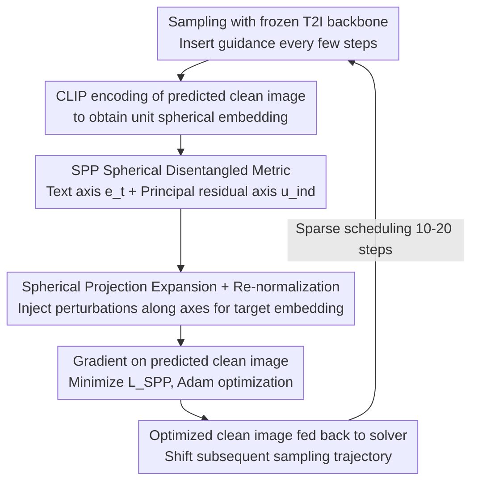

# GASS: Geometry-Aware Spherical Sampling for Disentangled Diversity Enhancement in Text-to-Image Generation

**Conference**: ICML 2026  
**arXiv**: [2602.17200](https://arxiv.org/abs/2602.17200)  
**Code**: https://github.com/L-YeZhu/GASS_T2I (Available)  
**Area**: Diffusion Models / Image Generation  
**Keywords**: T2I Diversity, CLIP Spherical Geometry, Orthogonal Decomposition, Inference-time Guidance, Prompt-independent Variation

## TL;DR
The authors project sample diversity under the same prompt in T2I onto the CLIP unit hypersphere. By expanding the projection spread along the "text direction $\mathbf{e}_t$" and the "orthogonal principal residual direction $\mathbf{u}_{\text{ind}}$" respectively, and transferring this geometric expansion back to the diffusion/flow sampling trajectory via gradient optimization of the predicted clean image $\hat{x}_{0|t}$, they simultaneously enhance prompt-dependent (pose, composition) and prompt-independent (background, style) diversity in SD2.1 and SD3-M with minimal loss in quality and alignment.

## Background & Motivation

**Background**: Modern T2I models (diffusion and rectified flow models such as SD2.1 and SD3-M) have become powerful in fidelity and text alignment. However, repeated sampling given the same prompt often yields highly redundant images, lacking diversity. Existing inference-time enhancement methods (PG, CADS, IG, SPELL) mostly follow the paradigm of "maximizing intra-batch sample dissimilarity or embedding space entropy" to align with metrics like the Vendi Score.

**Limitations of Prior Work**: Pure entropy maximization treats all variation directions equally, failing to distinguish between "semantic-level changes (viewpoint, pose)" and "prompt-unconstrained changes (background, style, lighting)." In practice, these methods often cause jitter in the foreground while the background is smoothed into blurry, uniform color blocks—the so-called "diversity gain" primarily stems from semantic jitter, while background diversity is largely ignored. Recent works like Scendi / SPARKE attempt to use Schur complement entropy for disentanglement but require an equal number of prompts and images, degrading to standard VS in fixed-prompt settings and losing disentanglement capability.

**Key Challenge**: T2I diversity is inherently multi-source—given "A black colored car," there are prompt-dependent variations (car model, perspective) and prompt-independent variations (background, lighting). However, existing metrics and sampling methods provide only a single scalar, failing to separate and intervene on these two axes independently.

**Goal**: (i) Provide a metric that geometrically separates prompt-dependent and independent diversity; (ii) design an inference-time sampling intervention that controllably amplifies the spread along one or both axes; (iii) ensure it is plug-and-play on frozen T2I backbones without additional training.

**Key Insight**: CLIP embeddings are naturally normalized on the unit hypersphere $\mathbb{S}^{d-1}$, and text and images share the same manifold—this provides geometric convenience for "orthogonal decomposition using $\mathbf{e}_t$ as an anchor." Any image embedding $\mathbf{e}_i$ can be decomposed into a "component along $\mathbf{e}_t$" (semantic alignment direction, essentially the CLIPScore) + "residuals in the orthogonal complement." While the residual subspace is high-dimensional, deep network representations are typically concentrated on low-dimensional manifolds, allowing a principal direction $\mathbf{u}_{\text{ind}}$ to approximate prompt-independent variations.

**Core Idea**: Use the "sum of projection ranges along the $\mathbf{e}_t$ and $\mathbf{u}_{\text{ind}}$ axes," $SPP = \mathcal{D}_{\text{dep}} + \mathcal{D}_{\text{ind}}$, to measure diversity. During sampling, explicitly spread the target CLIP embeddings of each image along these two axes randomly, then backpropagate this "imagined more dispersed embedding" through the CLIP encoder gradient to modify the predicted clean image $\hat{x}_{0|t}$.

## Method

### Overall Architecture
GASS aims to solve the issue of "repeatedly sampling redundant images from the same prompt" by redefining and operating on "diversity" within the CLIP unit hypersphere. The frozen T2I backbone (UNet or DiT, diffusion or rectified flow) performs normal sampling, with GASS guidance inserted every few steps: first, the frozen CLIP image encoder $\mathcal{E}_I$ encodes the current predicted clean image into a spherical embedding; then, a text direction and a principal residual direction are identified as two disentangled coordinate axes; the embeddings within the batch are artificially pushed apart along these axes; finally, the "imagined more dispersed embeddings" are backpropagated to the pixel space via gradients on the predicted clean image $\hat{x}_{0|t}$. The guidance is sparse, active only for 10–20 sampling steps, adding only 2.93–3.68 seconds per batch on an A100.

### Key Designs

**1. Spherical Disentangled Metric SPP: Splitting Diversity into Prompt-Dependent and Independent Axes**

Existing metrics (Vendi Score, embedding entropy) provide only a scalar, failing to distinguish between semantic changes and prompt-unconstrained changes. GASS solves this by leveraging CLIP's unit sphere normalization and shared manifold properties. Using the normalized text embedding $\mathbf{e}_t$ as the first basis, each image embedding is expanded as $\mathbf{e}_i = (\mathbf{e}_i^\top \mathbf{e}_t)\mathbf{e}_t + \sum_{k\ge 2} (\mathbf{e}_i^\top \mathbf{u}_k)\mathbf{u}_k$—the first term is exactly CLIPScore (prompt-dependent), while the orthogonal complement represents prompt-independent changes. Since representations concentrate on low-dimensional manifolds, the authors use a randomized Gram-Schmidt search (Algo. 1) to find a dominant residual direction $\mathbf{u}_{\text{ind}} = \arg\max_{\mathbf{r}} \tfrac{1}{B}\sum_i |\mathbf{e}_i^\top \mathbf{r}|$ in the orthogonal complement. Diversity is the sum of projection ranges on both axes $SPP = \mathcal{D}_{\text{dep}} + \mathcal{D}_{\text{ind}}$, where $\mathcal{D}_{\text{dep}} = \max_i(\mathbf{e}_i^\top \mathbf{e}_t) - \min_i(\mathbf{e}_i^\top \mathbf{e}_t)$ and $\mathcal{D}_{\text{ind}}$ is isomorphic. This allows a single prompt batch to yield two independent scalars, bypassing the multi-prompt covariance requirement of Scendi. On ImageNet, real images show $SPP \approx 0.220$ while SD2.1/SD3-M show $0.126$–$0.146$, proving it can distinguish "real diversity vs. generated diversity."

**2. Spherical Projection Expansion + Re-normalization: Directionally Spreading the Batch Without Disrupting Main Semantics**

With two disentangled axes, GASS injects bounded uniform perturbations $\delta_i^{\text{dep}}, \delta_i^{\text{ind}} \sim \mathcal{U}[-r, r]$ along them for each image to construct a geometrically more dispersed target embedding $\tilde{\mathbf{e}}_i = (\mathbf{e}_i^\top \mathbf{e}_t + \delta_i^{\text{dep}})\mathbf{e}_t + (\mathbf{e}_i^\top \mathbf{u}_{\text{ind}} + \delta_i^{\text{ind}})\mathbf{u}_{\text{ind}} + \mathbf{r}_i$, where $\mathbf{r}_i$ is the initial residual excluding the two main components. $\mathbf{r}_i$ is kept as-is to preserve other image details. Finally, $\tilde{\mathbf{e}}_i \leftarrow \tilde{\mathbf{e}}_i / \|\tilde{\mathbf{e}}_i\|_2$ projects it back to the unit sphere. Unlike PG / SPELL, which apply isotropic perturbations in high dimensions (leaving almost zero "budget" for the background after semantic dilution), GASS targets semantically interpretable directions to amplify specific variations without disrupting core semantics. Re-normalization acts as a quality guardrail—pulling the target back to high-density regions of the CLIP distribution. Ablations show removing it drops ImageReward from 0.778 to 0.732. Prop. 4.1 further proves that the Gram determinant (hypervolume) of the batch strictly increases in expectation.

**3. Gradient on Predicted Clean Image: Translating Spherical Targets to Pixels Without Backpropping Through the Backbone**

Target embeddings on the sphere must return to pixel space to affect sampling. Instead of using a CLIP decoder or backpropping through the massive T2I backbone, GASS computes the derivative directly on the predicted clean image $\hat{x}_{i,0|t}$ at each step. Using $\mathcal{L}_{\text{SPP}} = \sum_i (1 - \mathcal{E}_I(\hat{x}_{i,0|t})^\top \tilde{\mathbf{e}}_i)$ as the objective, Adam (lr $1\times 10^{-4}$, up to 60 steps, early stopping patience 4, tolerance $5\times 10^{-4}$) updates $\hat{x}^*_{i,0|t} \leftarrow \hat{x}_{i,0|t} - \eta \nabla \mathcal{L}_{\text{SPP}}$, then feeds the optimized $\hat{x}^*_{0|t}$ back into the solver (DDIM or flow ODE) to shift the trajectory. Since the gradient does not pass through the generative network, the method is a black-box for the backbone (UNet/DiT, diffusion/flow). Combined with sparse scheduling (10–20 steps), the overhead is reduced to ~3 seconds per batch.

### Loss & Training
No training required, inference-time only. The guidance loss is $\mathcal{L}_{\text{SPP}}$. Hyperparameters: $r_{\text{dep}} = r_{\text{ind}} = 0.02$, sampling steps 50 for SD2.1 and 28 for SD3-M, GASS active for 20 uniform steps, candidate directions $N = 10$.

## Key Experimental Results

### Main Results

ImageNet (SD3-M, 50 samples/class, 1000 classes, "A photo of [class]" template):

| Method | Density↑ | Coverage↑ | VS↑ | ClipScore↑ | SPP↑ |
|------|---------|----------|-----|-----------|------|
| CFG | 1.105 | 0.588 | 28.119 | 0.308 | 0.137 |
| PG (ICLR'24) | 1.103 | 0.586 | 28.119 | 0.308 | 0.129 |
| CADS (ICLR'24) | 1.374 | 0.636 | 28.456 | 0.309 | 0.133 |
| IG (NeurIPS'24) | 1.389 | 0.627 | 27.415 | 0.310 | 0.129 |
| SPELL (ICML'25) | 1.105 | 0.585 | 28.433 | 0.302 | 0.128 |
| **GASS** | 1.164 | 0.611 | **28.877** | **0.313** | **0.141** |

DrawBench (SD3-M, 200 prompts × 10 images): VS 8.115 → **8.212**, ImageReward 0.779 → 0.778, ClipScore 0.318 → **0.320**, SPP 0.113 → **0.114**. On SD2.1, GASS is the only method to achieve highest scores across VS (8.847), ClipScore (0.307), and SPP (0.135).

### Ablation Study

| Configuration | VS↑ | ImageReward↑ | ClipScore↑ | SPP↑ |
|------|-----|-------------|-----------|------|
| **GASS (full, $r=0.02$)** | 8.212 | 0.778 | **0.320** | **0.114** |
| IP (Isotropic perturbation on both axes) | 8.203 | 0.774 | 0.308 | 0.113 |
| RD (Keep $\mathbf{e}_t$, random orthogonal $\mathbf{u}_{\text{ind}}$) | 8.206 | 0.778 | 0.313 | 0.113 |
| w/o Re-normalization | **8.876** | 0.732 | 0.313 | 0.123 |
| $r_{\text{dep}}=0, r_{\text{ind}}=0.02$ (Expand background only) | 8.207 | 0.787 | 0.319 | 0.111 |
| $r_{\text{dep}}=0.02, r_{\text{ind}}=0$ (Expand semantic only) | 8.206 | 0.780 | 0.320 | 0.112 |
| $r=0.05$ (Overshot expansion) | 8.205 | 0.778 | 0.320 | 0.112 |
| GASS 10 steps (early consecutive) | 8.215 | **0.808** | 0.318 | 0.114 |

### Key Findings
- **Disentangled basis selection is key**: Replacing $\mathbf{e}_t$ with a random direction (IP) drops ClipScore from 0.320 to 0.308, proving grounding the decomposition in text vs. residual directions is not a trivial choice.
- **Re-normalization is a quality guardrail**: Removing it causes VS to spike to 8.876, but ImageReward plummets to 0.732—this confirms that staying near the unit sphere is crucial for image quality.
- **Dual-axis expansion > Single-axis**: Expanding both axes yields higher SPP (0.114) than single axes (0.111/0.112), confirming diversity stems from independent sources.
- **Superior Gain on long prompts**: GASS shows the most significant VS gains (7.549 → 7.935) for long prompts (≥15 words), counter-intuitively compensating for the typical diversity drop in complex prompts.
- **Early consecutive vs. uniform scheduling**: Early 10-step guidance yields the highest ImageReward (0.808) but lower saturation; uniform scheduling produces more natural colors.

## Highlights & Insights
- **Geometric Perspective vs. Entropy Perspective**: Reconceptualizing "diversity" from "information entropy" to "spherical projection spread" provides an inherently disentangled, controllable, and visualizable metric.
- **First sampling method to explicitly increase background diversity**: GASS is arguably the first sampling-based method to introduct meaningful background changes without modifying prompts. Background neglect in prior work stems from isotropic perturbations being diluted by strong semantic priors.
- **Gradient on predicted clean image vs. noise prediction**: This trick allows GASS to bypass the generative backbone's backprop, making it backbone-agnostic. This paradigm of "guidance in $\hat{x}_0$ space" can be extended to any CLIP-based goal (fairness, style control).
- **Theoretical Guarantee of Prop. 4.1**: Elevates "hoping for diversity" to a provable expectation of increased hypervolume (Gram determinant), providing a rigorous template for future geometric guidance.

## Limitations & Future Work
- **Single principal residual direction**: The current approach assumes prompt-independent variation concentrates on a very low-rank manifold. For underspecified prompts like "an object," one direction may not cover background, style, and lighting simultaneously.
- **Brute random search for $N=10$**: Batch SVD or PCA could extract the top-k residual directions more robustly.
- **Dependence on CLIP image encoder as a proxy**: GASS cannot amplify details that CLIP is blind to (fine textures, high-frequency details). Using DINOv2 or SigLIP could be an extension.
- **Constant overhead of Adam optimization**: While ~3s/batch is acceptable, costs scale linearly with batch size or resolution (≥1024).
- **Validation on multi-condition inputs**: Not yet tested on layouts or reference-image conditioning.

## Related Work & Insights
- **vs. PG / SPELL / CADS / IG**: These methods perform isotropic random perturbations to maximize batch dissimilarity (blind VS increase). GASS restricts perturbations to geometrically interpretable axes, ensuring more controllable diversity and better background variation.
- **vs. Scendi / SPARKE**: These rely on prompt-image covariance matrices which become singular with single prompts. GASS uses a single prompt batch's projection to bypass this and can be used as both a metric and an intervention.
- **vs. CLIP latent editing**: While those emphasize geometric control for editing, GASS applies these tools to the orthogonal problem of diversity, suggesting spherical direction control is a universal toolbox.

## Rating
- Novelty: ⭐⭐⭐⭐ Reframing diversity via spherical geometry with provable hypervolume guarantees; cleanly executed disentanglement.
- Experimental Thoroughness: ⭐⭐⭐⭐ Covers SD2.1/SD3-M (UNet+DiT, diffusion+flow), ImageNet+DrawBench, and multiple SOTA baselines. (Lacks 1024 resolution and FLUX/SDXL tests).
- Writing Quality: ⭐⭐⭐⭐ Clear geometric derivations, well-defined algorithms, and helpful intuitive figures.
- Value: ⭐⭐⭐⭐ Plug-and-play, black-box compatible, and practically zero quality loss; strong potential for transfer to other controllable generation tasks.

<!-- RELATED:START -->

## Related Papers

- [\[ICML 2026\] Geometry-Aware Tabular Diffusion](geometry-aware_tabular_diffusion.md)
- [\[CVPR 2026\] DiverseGRPO: Mitigating Mode Collapse in Image Generation via Diversity-Aware GRPO](../../CVPR2026/image_generation/diversegrpo_mitigating_mode_collapse_in_image_generation_via_diversity-aware_grp.md)
- [\[ICML 2026\] Envisioning Beyond the Few: Disentangled Semantics and Primitives for Few-Shot Atypical Layout-to-Image Generation](envisioning_beyond_the_few_disentangled_semantics_and_primitives_for_few-shot_at.md)
- [\[CVPR 2026\] Spherical Leech Quantization for Visual Tokenization and Generation](../../CVPR2026/image_generation/spherical_leech_quantization_for_visual_tokenization_and_generation.md)
- [\[CVPR 2026\] Denoising, Fast and Slow: Difficulty-Aware Adaptive Sampling for Image Generation](../../CVPR2026/image_generation/denoising_fast_and_slow_difficulty-aware_adaptive_sampling_for_image_generation.md)

<!-- RELATED:END -->
