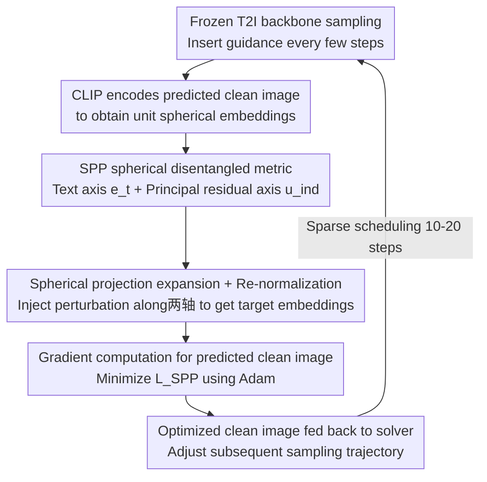

# GASS: Geometry-Aware Spherical Sampling for Disentangled Diversity Enhancement in Text-to-Image Generation

**Conference**: ICML 2026  
**arXiv**: [2602.17200](https://arxiv.org/abs/2602.17200)  
**Code**: https://github.com/L-YeZhu/GASS_T2I (Available)  
**Area**: Diffusion Models / Image Generation  
**Keywords**: T2I Diversity, CLIP Spherical Geometry, Orthogonal Decomposition, Test-time Guidance, Prompt-independent Variation  

## TL;DR
The authors project sample diversity under the same prompt onto the CLIP unit hypersphere, expanding the projection spread along the "text direction $\mathbf{e}_t$" and the "orthogonal principal residual direction $\mathbf{u}_{\text{ind}}$". This geometric expansion is transferred back to the diffusion/flow sampling trajectory via gradient optimization on the predicted clean image $\hat{x}_{0|t}$, enhancing both prompt-dependent (pose, composition) and prompt-independent (background, style) diversity in SD2.1 and SD3-M with minimal loss in quality or alignment.

## Background & Motivation

**Background**: Modern T2I models (such as SD2.1 and SD3-M diffusion and rectified flow models) are already proficient in fidelity and text alignment. However, repeated sampling with the same prompt often yields highly similar images, lacking diversity. Existing test-time enhancement methods (PG, CADS, IG, SPELL) mostly follow the approach of "maximizing intra-batch sample dissimilarity / embedding space entropy" to align with metrics like Vendi Score.

**Limitations of Prior Work**: Pure entropy maximization treats all variation directions equally, failing to distinguish between "semantic-level changes (perspective, pose)" and "changes not constrained by the prompt (background, style, lighting)". In practice, these methods often only perturb the foreground while the background is blurred into uniform color blocks—the "diversity gain" primarily comes from semantic jitter, while background diversity is largely ignored. Recent works like Scendi / SPARKE attempt disentanglement using Schur complement entropy, but they require an equal number of prompts and images, degrading to standard VS in fixed-prompt settings and losing disentanglement capability.

**Key Challenge**: T2I diversity is naturally multi-source—given "A black colored car", there are both prompt-dependent variations (car model, perspective) and prompt-independent variations (background, lighting). Current metrics and sampling methods provide only a single scalar, failing to separate and intervene on these two axes independently.

**Goal**: (i) Provide a metric that geometrically separates prompt-dependent and prompt-independent diversity; (ii) Design a test-time sampling intervention to controllably expand the spread along either or both axes; (iii) Ensure a plug-and-play approach for frozen T2I backbones without additional training.

**Key Insight**: CLIP embeddings are naturally normalized on the unit hypersphere $\mathbb{S}^{d-1}$, and text and images share the same manifold—this provides geometric convenience for "orthogonal decomposition using $\mathbf{e}_t$ as an anchor". Any image embedding $\mathbf{e}_i$ can be decomposed into a "component along $\mathbf{e}_t$" (semantic alignment direction, essentially CLIPScore) + a "residual in the orthogonal complement". While the residual subspace is high-dimensional, deep network representations typically concentrate on a low-dimensional manifold, allowing a principal direction $\mathbf{u}_{\text{ind}}$ to approximate prompt-independent variations.

**Core Idea**: Diversity is measured by the "sum of projection ranges along the two axes": $SPP = \mathcal{D}_{\text{dep}} + \mathcal{D}_{\text{ind}}$. During sampling, the target CLIP embeddings of each image are explicitly pushed apart along these axes. This "imagined more dispersed embedding" is then backpropagated through CLIP encoder gradients to modify the predicted clean image $\hat{x}_{0|t}$.

## Method

### Overall Architecture
GASS aims to solve the problem where "repeated sampling of the same prompt yields similar images" by redefining and operating on "diversity" within the CLIP unit hypersphere. The frozen T2I backbone (UNet or DiT, diffusion or rectified flow) performs normal sampling, with GASS guidance inserted every few steps: first, the frozen CLIP image encoder $\mathcal{E}_I$ encodes the current predicted clean image into spherical embeddings; then, a text direction and a principal residual direction are identified as disentangled axes to push the batch embeddings apart; finally, gradients are computed for the predicted clean image $\hat{x}_{0|t}$ to backpropagate the "dispersed embeddings" into pixel space. This guidance is sparse, active for only 10–20 sampling steps, adding only 2.93–3.68 seconds per batch on an A100.

### Key Designs

**1. Spherical Disentangled Metric SPP: Splitting diversity into prompt-dependent and prompt-independent axes**

Existing metrics (Vendi Score, embedding entropy) provide only a scalar and cannot distinguish between "semantic changes" and "unconstrained changes". GASS leverages the fact that CLIP embeddings are normalized on a unit sphere to decompose each image embedding as $\mathbf{e}_i = (\mathbf{e}_i^\top \mathbf{e}_t)\mathbf{e}_t + \sum_{k\ge 2} (\mathbf{e}_i^\top \mathbf{u}_k)\mathbf{u}_k$ using the normalized text embedding $\mathbf{e}_t$. The first term is CLIPScore (prompt-dependent), and the orthogonal complement contains prompt-independent variations. Using Algo. 1's random Gram-Schmidt search, the authors find the strongest principal residual direction $\mathbf{u}_{\text{ind}} = \arg\max_{\mathbf{r}} \tfrac{1}{B}\sum_i |\mathbf{e}_i^\top \mathbf{r}|$. Diversity is defined as the sum of projection ranges: $SPP = \mathcal{D}_{\text{dep}} + \mathcal{D}_{\text{ind}}$. This allows a single prompt batch to yield two independent scalars, bypassing the multi-prompt requirement of Scendi. The SPP of real images on ImageNet ($\approx 0.220$) is ~50% higher than SD2.1/SD3-M ($0.126$–$0.146$), demonstrating its ability to distinguish "real vs. generated diversity."

**2. Spherical Projection Expansion + Re-normalization: Directionally dispersing the batch without disrupting main semantics**

With two disentangled axes, GASS injects bounded uniform perturbations $\delta_i^{\text{dep}}, \delta_i^{\text{ind}} \sim \mathcal{U}[-r, r]$ for each image to construct geometrically dispersed target embeddings: $\tilde{\mathbf{e}_i} = (\mathbf{e}_i^\top \mathbf{e}_t + \delta_i^{\text{dep}})\mathbf{e}_t + (\mathbf{e}_i^\top \mathbf{u}_{\text{ind}} + \delta_i^{\text{ind}})\mathbf{u}_{\text{ind}} + \mathbf{r}_i$. The initial residual $\mathbf{r}_i$ is preserved to maintain image details. Finally, $\tilde{\mathbf{e}_i} \leftarrow \tilde{\mathbf{e}_i} / \|\tilde{\mathbf{e}_i}\|_2$ projects the targets back to the unit sphere. Unlike PG/SPELL, which use high-dimensional isotropic perturbations that often ignore the background, GASS concentrates noise on semantically meaningful directions. Re-normalization acts as a quality guardrail, keeping targets in the high-density regions of the CLIP distribution. Prop. 4.1 proves that the Gram determinant (hypervolume) of the batch strictly increases in expectation.

**3. Gradient-based Optimization on Predicted Clean Image: Translating spherical targets to pixels without backbone backprop**

To avoid backpropagating through large T2I backbones, GASS computes gradients directly on the predicted clean image $\hat{x}_{i,0|t}$ at each step. Using $\mathcal{L}_{\text{SPP}} = \sum_i (1 - \mathcal{E}_I(\hat{x}_{i,0|t})^\top \tilde{\mathbf{e}}_i)$ as the objective, Adam is used to perform $\hat{x}^*_{i,0|t} \leftarrow \hat{x}_{i,0|t} - \eta \nabla \mathcal{L}_{\text{SPP}}$. The optimized $\hat{x}^*_{0|t}$ is then used in the solver's transition equation (DDIM or flow ODE) to nudge the trajectory. Since gradients do not pass through the generative network, the method is a black box to the backbone, supporting UNet/DiT and diffusion/flow. Combined with early stopping and sparse scheduling, the overhead is minimized to ~3s per batch.

### Loss & Training
No training required; purely test-time. The guidance loss is $\mathcal{L}_{\text{SPP}}$. Hyperparameters: $r_{\text{dep}} = r_{\text{ind}} = 0.02$, 50 steps for SD2.1, 28 steps for SD3-M, GASS active for 20 uniform steps, number of candidate directions $N = 10$.

## Key Experimental Results

### Main Results

ImageNet (SD3-M, 50 images/class, 1000 classes, "A photo of [class]" template):

| Method | Density↑ | Coverage↑ | VS↑ | ClipScore↑ | SPP↑ |
|------|---------|----------|-----|-----------|------|
| CFG | 1.105 | 0.588 | 28.119 | 0.308 | 0.137 |
| PG (ICLR'24) | 1.103 | 0.586 | 28.119 | 0.308 | 0.129 |
| CADS (ICLR'24) | 1.374 | 0.636 | 28.456 | 0.309 | 0.133 |
| IG (NeurIPS'24) | 1.389 | 0.627 | 27.415 | 0.310 | 0.129 |
| SPELL (ICML'25) | 1.105 | 0.585 | 28.433 | 0.302 | 0.128 |
| **GASS** | 1.164 | 0.611 | **28.877** | **0.313** | **0.141** |

DrawBench (SD3-M, 200 prompts × 10 images): VS 8.115 $\rightarrow$ **8.212**, ImageReward 0.779 $\rightarrow$ 0.778, ClipScore 0.318 $\rightarrow$ **0.320**, SPP 0.113 $\rightarrow$ **0.114**.

### Ablation Study

| Config | VS↑ | ImageReward↑ | ClipScore↑ | SPP↑ |
|------|-----|-------------|-----------|------|
| **GASS (full, $r=0.02$)** | 8.212 | 0.778 | **0.320** | **0.114** |
| IP (Isotropic perturbation on both axes) | 8.203 | 0.774 | 0.308 | 0.113 |
| RD (Keep $\mathbf{e}_t$, random orthogonal $\mathbf{u}_{\text{ind}}$) | 8.206 | 0.778 | 0.313 | 0.113 |
| w/o Re-normalization | **8.876** | 0.732 | 0.313 | 0.123 |
| $r_{\text{dep}}=0, r_{\text{ind}}=0.02$ (Background only) | 8.207 | 0.787 | 0.319 | 0.111 |
| $r_{\text{dep}}=0.02, r_{\text{ind}}=0$ (Semantic only) | 8.206 | 0.780 | 0.320 | 0.112 |

### Key Findings
- **Choice of disentangled basis is critical**: Replacing $\mathbf{e}_t$ with a random direction (IP) drops ClipScore from 0.320 to 0.308, proving anchoring to text and principal residual directions is non-trivial.
- **Re-normalization as a quality guardrail**: Without it, VS spikes to 8.876 but ImageReward drops significantly (0.778 $\rightarrow$ 0.732), indicating distorted images as embeddings exit the unit sphere.
- **Dual-axis expansion > Single-axis**: Expanding both axes yields higher SPP (0.114 vs 0.111/0.112), confirming diversity arises from two independent additive sources.
- **GASS shows larger Gain on long prompts**: In DrawBench, the VS increase for long prompts ($\ge 15$ words) is most significant (7.549 $\rightarrow$ 7.935).
- **Early consecutive vs. Uniform scheduling**: Early consecutive steps result in higher ImageReward (0.808) but lower color saturation; uniform scheduling yields more natural colors.

## Highlights & Insights
- **Geometry over Entropy**: Replacing "Information Entropy" with "Spherical Projection Spread" provides a naturally disentangled and controllable metric.
- **First to explicitly enhance background diversity**: GASS is the first sampling-based method to introduce meaningful background variation without modifying the prompt. Other methods concentrate diversity on the foreground because isotropic noise is diluted by strong semantic priors.
- **Optimizing $\hat{x}_0$ instead of Noise**: This engineering choice allows GASS to bypass T2I backbone backpropagation, making it backbone-agnostic.
- **Hypervolume Guarantee**: Prop. 4.1 provides an elegant theoretical foundation, proving that the geometric spread (Gram determinant) strictly increases in expectation.

## Limitations & Future Work
- **Single principal residual direction**: The assumption that prompt-independent variation concentrates on a very low-dimensional manifold may be oversimplified for highly underspecified prompts like "an object".
- **Random search for $N=10$ is heuristic**: Future work could use batch SVD/PCA for top-k residual directions.
- **CLIP Proxy dependency**: GASS cannot amplify details that CLIP ignores (e.g., fine-grained textures).
- **Adam overhead**: While 3s/batch is efficient, cost scales with batch size or resolution ($\ge 1024$).
- **Multi-condition validation**: Extending to conditions like layout or reference images remains to be explored.

## Related Work & Insights
- **vs PG / SPELL / CADS / IG**: These methods perform isotropic random perturbations to maximize batch dissimilarity (blind VS increase). GASS constrains perturbations to two orthogonal axes with clear geometric interpretations, resulting in better control and background effects.
- **vs Scendi / SPARKE**: These require text-image covariance matrices and fail under fixed prompts. GASS uses a single prompt batch's geometric projection to bypass this.
- **vs CLIP latent editing**: While editing works focus on geometric control for personalization, GASS applies these tools to the orthogonal problem of diversity.

## Rating
- Novelty: ⭐⭐⭐⭐ Reframing diversity through spherical geometry with provable hypervolume guarantees.
- Experimental Thoroughness: ⭐⭐⭐⭐ Covers various architectures (UNet/DiT), sampling methods, and complex prompt datasets.
- Writing Quality: ⭐⭐⭐⭐ Clear geometric derivations and well-defined algorithms.
- Value: ⭐⭐⭐⭐ Plug-and-play and backbone-agnostic with minimal quality trade-off; high potential for transfer to fairness and controlled generation.

<!-- RELATED:START -->

## Related Papers

- [\[ICML 2026\] Geometry-Aware Tabular Diffusion](geometry-aware_tabular_diffusion.md)
- [\[CVPR 2026\] DiverseGRPO: Mitigating Mode Collapse in Image Generation via Diversity-Aware GRPO](../../CVPR2026/image_generation/diversegrpo_mitigating_mode_collapse_in_image_generation_via_diversity-aware_grp.md)
- [\[ICML 2026\] Envisioning Beyond the Few: Disentangled Semantics and Primitives for Few-Shot Atypical Layout-to-Image Generation](envisioning_beyond_the_few_disentangled_semantics_and_primitives_for_few-shot_at.md)
- [\[CVPR 2026\] Denoising, Fast and Slow: Difficulty-Aware Adaptive Sampling for Image Generation](../../CVPR2026/image_generation/denoising_fast_and_slow_difficulty-aware_adaptive_sampling_for_image_generation.md)
- [\[CVPR 2026\] Spherical Leech Quantization for Visual Tokenization and Generation](../../CVPR2026/image_generation/spherical_leech_quantization_for_visual_tokenization_and_generation.md)

<!-- RELATED:END -->
