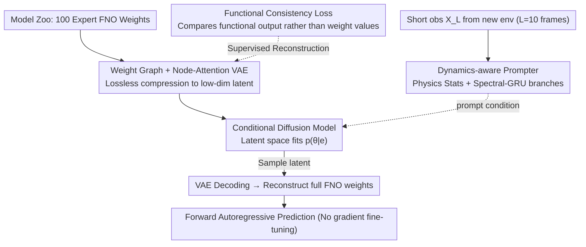

# DynaDiff: Generative Adaptation of Dynamics to Environmental Shifts via Weight-space Diffusion

**Conference**: ICML 2026  
**arXiv**: [2505.13919](https://arxiv.org/abs/2505.13919)  
**Code**: https://github.com/tsinghua-fib-lab/DynaDiff (Available)  
**Area**: Diffusion Models / Scientific Machine Learning / Meta-learning  
**Keywords**: Weight-space Diffusion, Dynamics Prediction, Cross-environment Generalization, Schrödinger-bridge Alternative, Meta-learning

## TL;DR
DynaDiff reformulates the meta-learning problem of "training a predictor for a new environment" into a conditional sampling problem of "directly generating full network weights using a diffusion model." By utilizing a weight graph, functional consistency loss, and a dynamics-aware prompter, it achieves a 10.78% average RMSE reduction over strong baselines across four PDE systems.

## Background & Motivation

**Background**: Data-driven dynamics prediction (e.g., FNO, Transformer Neural Operators) has replaced traditional numerical solvers in molecular dynamics, fluid mechanics, and meteorology. There are two primary routes for handling cross-environment shifts (e.g., varying Reynolds numbers or external forces): (i) Meta-learning, which splits weights into environment-shared and environment-specific contexts, updating only the context for new environments; (ii) Training a massive foundation model followed by fine-tuning a small subset of parameters.

**Limitations of Prior Work**: Both approaches restrict adaptation to a "small local subspace of the weight space," failing to represent the complete manifold spanned by expert weights across different environments. Furthermore, both rely on gradient optimization or enormous backbones, making deployment difficult in data-scarce or hardware-constrained scenarios.

**Key Challenge**: A natural coupling exists between the dynamics function space and the environment space $\frac{dx}{dt}=f(x,t,e)$. The optimal solution is an environment-dependent "set of weights," but current paradigms are forced to optimize only a subset of weights, resulting in an expressivity ceiling.

**Goal**: To model the joint distribution $p(\theta\mid e)$ such that given a few frames of observation from a new environment, a complete set of expert weights $\theta_{new}$ can be generated in one shot, entirely avoiding gradient backpropagation during inference.

**Key Insight**: This work treats "model weights" as a data modality equivalent to images or text, using latent diffusion for conditional generation in the weight space. However, weights present three unique challenges: topological structures cannot be simply flattened, the parameter space dimension is extremely high with distorted MSE metrics, and new environments only provide short trajectories as conditions.

**Core Idea**: A triplet design consisting of a "weight graph + functional consistency VAE + dynamics-aware prompter" turns weight generation into a pure forward sampling process.

## Method

### Overall Architecture
DynaDiff addresses the issue of "needing to retrain a dynamics predictor when the environment changes" by redefining "training weights" as "sampling weights." In the offline stage, it first pre-trains a base FNO across all seen environments and then rapidly fine-tunes an expert for each environment to build a model zoo of size 100. Next, it organizes each expert's weights into a "weight graph," which is compressed into a low-dimensional latent space via a node-attention VAE. Finally, a conditional diffusion model $\epsilon_\theta(z_n,n,\text{prompt})$ is trained in this latent space, where the prompt is extracted from short observation sequences $X_L$ by a dynamics-informed prompter.

During the online stage, the entire pipeline is a pure forward sampling process: given $L=10$ frames of observation from a new environment, the prompter generates a condition vector, the diffusion model samples a latent, and the VAE decodes it back into a weight graph to reconstruct the full FNO weights. Autoregressive prediction for 100 steps is then performed directly using these weights—completely eliminating gradient updates and compressing minute-level fine-tuning into millisecond-level sampling.

### Key Designs

**1. Weight Graph + Node-Attention VAE: Lossless mapping of network weights into diffusion-friendly latents**

To feed weights into a diffusion model, the most direct approach is flattening them into a token sequence, but this loses the network's connection topology, while using dense edge features is too expensive. DynaDiff's compromise is to treat the output neurons or output channels of each layer as graph nodes: a linear layer has $D_{out}$ nodes, where each node feature is a $D_{in}+1$ dimensional vector (weights flowing into it plus bias); a convolutional layer has $C_{out}$ nodes, each $C_{in}\cdot h\cdot w+1$ dimensional. Skip connection weights are attached to merge nodes. Multi-head attention is used instead of GNNs to model cross-layer dependencies, allowing the model to adapt to various topologies without fixed edge structures. This node-level aggregation balances computation and expressivity, mapping weights of any architecture into a low-dimensional latent space suitable for diffusion.

**2. Functional Consistency Loss instead of MSE Reconstruction: Aligning "behavior" rather than "numerical values"**

The loss landscape of neural networks is highly multi-modal, with many solutions having vastly different parameters but equivalent functions. If a VAE reconstructs weights based on a naive $\|\hat{\mathbf{w}}-\mathbf{w}\|^2$, it treats "functionally identical" weights as entirely different samples. The latent space would then be dominated by parameter permutation noise, preventing the diffusion model from learning a meaningful conditional distribution. DynaDiff replaces the reconstruction term with a functional space consistency loss $L_{func}=\mathbb{E}_{x_i}\|f_{\hat{\mathbf{w}}}(x_i)-f_{\mathbf{w}}(x_i)\|_2^2$, comparing the outputs of two sets of weights given the same inputs. Functional equivalence defines successful reconstruction. This makes the latent space smooth in terms of functional semantics, enabling the diffusion model to stably fit $p(\theta\mid e)$ (Appendix G further provides corresponding generalization error bounds).

**3. Dynamics-aware Prompter: Inferring the environment from 10 frames of observation**

In practical deployment, environmental labels (like Reynolds numbers) are unavailable and must be inferred from short trajectories. However, purely data-driven features are prone to overfitting noise, while pure physical statistics lack expressivity. The prompter uses a dual-branch complementary approach: the explicit branch extracts the temporal mean and trend of physical statistics (first/second moments, energy, enstrophy) to preserve physical interpretability; the implicit branch passes the real/imaginary spectral sequences obtained via FFT through a GRU, using the final hidden state to provide data-driven flexibility. Both are concatenated and injected into the diffusion transformer via adaLN. During training, the observation length is randomly sampled within $[1,L]$ to ensure the prompter remains robust to different frame counts during testing.

### Loss & Training
The VAE objective is $L_{VAE}=-\mathbb{E}[\log p(\mathbf{w}|\mathbf{z})]+\beta\,\mathrm{KL}+\lambda L_{func}$, and the diffusion model uses the standard $\epsilon$-prediction objective $L_n=\mathbb{E}\|\epsilon_n-\epsilon_\theta(\sqrt{\bar\alpha_n}z_0+\sqrt{1-\bar\alpha_n}\epsilon_n,n,\text{prompt})\|^2$. The model zoo is constructed using "domain-adaptive initialization": a shared base is trained first, followed by fine-tuning each expert with minor single-layer perturbations to avoid non-stationary weight distributions caused by random initialization.

## Key Experimental Results

### Main Results
Four PDE systems (Cylinder Flow / Lambda-Omega / Kolmogorov Flow / Navier-Stokes) plus ERA5 real-world wind speeds. The generator has ~380M parameters, and the target FNO has ~1M parameters.

| System | Metric | DynaDiff | Best meta-learning (GEPS) | Best weight gen (D2NWG) | Gain vs SOTA |
|------|------|---------:|--------------------------:|---------------------:|--------------|
| Cylinder Flow (out-domain) | RMSE | **0.065** | 0.082 | 0.086 | −20.7% |
| Lambda-Omega (out-domain)  | RMSE | **0.091** | 0.092 | 0.105 | −1.1% |
| Kolmogorov Flow (out-domain) | RMSE | **0.079** | 0.086 | 0.090 | −8.1% |
| Navier-Stokes (out-domain) | RMSE | **0.064** | 0.099 | 0.089 | −35.4% |

DynaDiff even outperforms "One-per-Env" (training a separate FNO for each environment, the theoretical "upper bound") in some cases, which the authors attribute to diffusion sampling being more stable on the weight manifold compared to optimizer training falling into local optima.

### Ablation Study

| Configuration | RMSE (Kolmogorov) | Description |
|------|------------------:|------|
| Full DynaDiff | 0.079 | Complete model |
| w/o Functional Loss | Significant ↑ | VAE degrades to pure MSE; heavy drop in OOD |
| w/o Domain Init | Substantial ↑ | Random init in model zoo causes scattered distributions |
| Model zoo size 50 → 25 | Performance degrades | Stable only when zoo size ≥50 |
| Observation length $L$=1 vs 10 | Mild degradation | Variable-length training makes prompter robust |
| Random Neuron Permutation 10% | Almost unchanged | Global attention automatically adapts to permutations |

### Key Findings
- **Functional loss is the biggest contributor**: Its removal leads to the steepest decline in OOD performance, validating the core hypothesis that weight similarity should be measured by functional similarity.
- **Generator parameters scale linearly with the predictor**: While MLP modules scale at $O(Ld^2)$, the weight graph nodes scale at $O(Ld)$ with feature dimension $O(d)$. Attention is independent of node counts, allowing the generator to scale linearly with $L$ and $d$ rather than exploding exponentially with the predictor's total parameters.
- **Interpretability**: The encoder attention matrix exhibits a block-diagonal structure, with block boundaries aligning with the lifting / fno_blocks / projection stages of the FNO. This structure remains stable across different environments—DynaDiff identifies invariant functional partitions at the topological level rather than just numerical weights.
- **Sampling Stability**: Repeated sampling (100 times) across 10 OOD environments shows extremely low variance; the "worst-case sample" still outperforms the strongest baseline.

## Highlights & Insights
- **Paradigm Shift**: Replacing "gradient fine-tuning" with "forward generation." For deployment, adaptation to new environments shifts from minutes to milliseconds, and memory overhead from gradient backpropagation is eliminated.
- **Model-agnostic Weight Graph + Attention**: Experiments replacing FNO with WNO or UNO yielded stable performance, indicating a universal interface for other operator families.
- **Transferable Functional Loss Trick**: Any generation task where "weights act as a modality" (hypernetworks, LoRA generation, neural field generation) can benefit from the trick of using output consistency instead of weight MSE.
- **Domain-adaptive Model Zoo is the Hidden Core**: The authors repeatedly emphasize that "sample quality > diversity." This contrasts with methods like D2NWG that use random initialization, suggesting that the smoothness of training data distribution should not be overlooked.

## Limitations & Future Work
- Constructing the model zoo still requires "training an expert for every seen environment," meaning offline costs scale linearly with the number of environments.
- Currently only tested on small operators (~1M parameters); whether diffusion generation can scale to 100M+ foundation model weights remains unverified.
- The prompter assumes $L=10$ frames are sufficient for environmental identification; in highly chaotic systems or those with high observation noise, physical statistics and spectral features might fail.
- Safety of generated weights is not discussed—diffusion sampling could potentially land on "plausible but broken" weights outside the model zoo; the paper only uses "minimum reconstruction residual" as a post-filter.

## Related Work & Insights
- **vs CoDA / GEPS / CAMEL**: Meta-learning routes update only environmental context and shared weights, still requiring gradients for new environments. DynaDiff generates the entire weight set, offering a larger search space and higher expressivity.
- **vs Poseidon / DPOT / MPP**: 600M-scale foundation models follow the ERM route. DynaDiff uses a 380M generator to produce 1M experts; the total parameters are comparable, but the division of labor differs—the large model's job is to "create small models," and only the small model runs during inference.
- **vs D2NWG / CVAE / HyperDiffusion**: These also use weight-space diffusion, but D2NWG flattens weights into sequences, and CVAE lacks geometric constraints. DynaDiff's weight graph and functional loss result in significantly lower JSD and tighter distribution fitting.
- **Transferable Insights**: Treating model weights as a data modality and defining similarity via functional equivalence rather than numerical equivalence provides direct value for LoRA generation, neural field hypernetworks, and continual learning.

## Rating
- Novelty: ⭐⭐⭐⭐⭐ Reframing "training a network for each environment" as "sampling a network" using a weight graph and functional loss is a first in SciML.
- Experimental Thoroughness: ⭐⭐⭐⭐⭐ 4 PDEs + 1 real dataset, 14 baselines, 6 dimensions of ablation (zoo size, environments, length, permutation, functional loss, domain init), plus generalization error proofs.
- Writing Quality: ⭐⭐⭐⭐ Clear main line and ample figures; some details (like the prompter's dual branches) require consulting the appendix.
- Value: ⭐⭐⭐⭐⭐ Provides a complete paradigm and reproducible code for "weight-as-modality" research, with practical implications for scientific computing at the edge.

<!-- RELATED:START -->

## Related Papers

- [\[ICML 2026\] Compression as Adaptation: Implicit Visual Representation with Diffusion Foundation Models](compression_as_adaptation_implicit_visual_representation_with_diffusion_foundati.md)
- [\[CVPR 2026\] Scale Space Diffusion: Integrating Scale Space into the Diffusion Process](../../CVPR2026/image_generation/scale_space_diffusion.md)
- [\[CVPR 2026\] Guiding a Diffusion Transformer with the Internal Dynamics of Itself](../../CVPR2026/image_generation/guiding_a_diffusion_transformer_with_the_internal_dynamics_of_itself.md)
- [\[CVPR 2026\] LoFA: Learning to Predict Personalized Prior for Fast Adaptation of Visual Generative Models](../../CVPR2026/image_generation/lofa_learning_to_predict_personalized_prior_for_fast_adaptation_of_visual_genera.md)
- [\[NeurIPS 2025\] PID-controlled Langevin Dynamics for Faster Sampling of Generative Models](../../NeurIPS2025/image_generation/pid-controlled_langevin_dynamics_for_faster_sampling_of_generative_models.md)

<!-- RELATED:END -->
