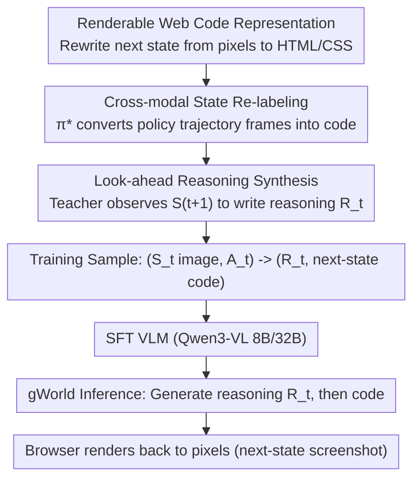

# Generative Visual Code Mobile World Models

**Conference**: ICML 2026  
**arXiv**: [2602.01576](https://arxiv.org/abs/2602.01576)  
**Code**: Yes (Project Page, Code, gWorld 8B/32B weights, and MWMBench provided)  
**Area**: LLM Agent / Multimodal VLM / Mobile GUI World Model  
**Keywords**: Mobile GUI World Model, Renderable Code Generation, VLM Post-training, Cross-modal Re-labeling, Look-ahead Reasoning

## TL;DR
The authors reformulate mobile GUI world modeling into a new paradigm where "VLMs generate renderable web code." They propose an automated data synthesis pipeline that rewrites policy trajectories into (image state, action) $\rightarrow$ (reasoning chain, next-state code) training samples. The resulting gWorld-8B/32B models achieve SOTA across six in/out-of-distribution benchmarks, improving baseline instruction accuracy by 27–46 percentage points and reducing rendering failure rates to $<1\%$.

## Background & Motivation

**Background**: Mobile GUI agents have become a major research focus. A key enhancement involves introducing a "World Model (WM)": given the current GUI state $S_t$ and action $A_t$, the model predicts the next state $S_{t+1}$ to augment strategy training or enable value estimation via rollouts. Existing WMs are categorized into: (1) **Textual WMs**, which compress states into text and lose visual information like icons and layouts; (2) **Visual WMs**, which directly generate screenshots (e.g., VIMO’s complex 5-stage pipeline involving OCR, diffusion, and multiple GPT-4o calls).

**Limitations of Prior Work**: Textual WMs lack visual fidelity for grounding. Pure pixel-based Visual WMs struggle with "text-dense + discrete layout" GUI scenarios; diffusion or autoregressive pixel models often produce unreadable text or distorted layouts. Furthermore, models like VIMO released data but no weights, hindering reproducibility.

**Key Challenge**: GUI states require both **pixel-level fidelity** (direct grounding for screenshots) and **symbolic precision** (accurate text and buttons). Pixel-prediction paradigms struggle to satisfy both—image models fail at precise text, while text models lose visual structure. Moreover, GUI transitions often contain high visual redundancy; pixel models tend to learn "approximate copying of $S_t$" as a shortcut, showing high similarity metrics without truly modeling action semantics.

**Goal**: Develop a **single self-contained model** for visual mobile GUI world modeling that achieves: (a) pixel-accurate text and layouts; (b) an end-to-end pipeline without multi-model cascades; (c) large-scale synthetic training data; (d) preservation of native coordinates for direct execution.

**Key Insight**: Modern VLMs are pre-trained on structured web code and excel at generating readable text. If the "next state" is represented as **renderable web code** (HTML/CSS), the VLM's language priors ensure text and semantic quality, its web code priors ensure layout structure, and the browser renderer translates the symbolic output back to pixels. This allows a single VLM to handle both visual understanding and structured generation.

**Core Idea**: Reformulate the world model from $p_\theta(S_{t+1}^{\text{image}} \mid S_t, A_t)$ to $p_\theta(R_t, S_{t+1}^{\text{code}} \mid S_t^{\text{image}}, A_t)$—the VLM generates a "first reasoning, then code" description of the next state, which the browser renders back into pixels.

## Method

### Overall Architecture
gWorld transforms the difficult task of "predicting the next GUI screenshot" into a representation space task: a standard VLM (Qwen3-VL 8B/32B) generates renderable web code for the next state. To facilitate this, the authors developed a synthesis pipeline that automatically converts existing mobile agent policy trajectories into training samples formatted as (screenshot + action $\rightarrow$ reasoning chain + next-state code). The model is supervised fine-tuned (SFT) on 260k samples.

### Key Designs

**1. Replacing Pixels with Renderable Web Code: Utilizing Language Priors to Avoid Pixel Artifacts**
GUI states demand both pixel fidelity and symbolic precision. Direct pixel generation fails at both, often resulting in unreadable text and distorted layouts. More importantly, pixel models often regress to an "identity mapping" shortcut; for Emu3.5 34B, the Pearson correlation between output similarity and $\text{Sim}(S_t, S_{t+1})$ is as high as $\rho=0.92$. By predicting $S_{t+1}^{\text{code}}$ instead of $S_{t+1}^{\text{image}}$, gWorld forces the VLM to use language priors for text accuracy and pre-trained web code knowledge for structural consistency. The VLM must understand the action to modify the DOM nodes correctly, making the "copying" shortcut difficult ($\rho \approx 0.4$ for gWorld).

**2. Cross-modal State Re-labeling: Unsupervised Conversion of Policy Trajectories**
There are no dedicated code-based WM datasets. However, mobile agent trajectories are abundant (approx. 3.7 million transitions from AitW, GUIO, AC, and AMEX). The authors convert these by taking ground-truth screenshots $S_t^{\text{image}}$ and using a teacher model $\pi^*$ (Gemini 3 Flash) to perform image-to-code re-labeling: $S_t^{\text{code}} \leftarrow \pi^*(S_t^{\text{image}}, P^{\text{img-to-code}})$. Using ground-truth frames for re-labeling ensures 100% renderability and semantic accuracy, outperforming zero-shot prediction from $(S_t^{\text{image}}, A_t)$ by +5.4% in IAcc.

**3. Look-ahead Reasoning Synthesis: Decomposition via Future Observation**
Generating complex code in one shot is difficult. The authors insert a natural language reasoning chain $R_t$ before $S_{t+1}^{\text{code}}$ in the SFT labels: $(S_t^{\text{image}}, A_t) \rightarrow (R_t, S_{t+1}^{\text{code}})$. During training, the teacher model $\pi^*$ is allowed to "look ahead" at the ground-truth $S_{t+1}^{\text{image}}$ to explain exactly what changed between $S_t$ and $S_{t+1}$ given action $A_t$. This "look-ahead" reasoning provides high-quality supervision that is superior to blind reasoning chains (as shown in Fig 6).

### Loss & Training
Standard SFT cross-entropy loss is used for the target sequence containing $R_t$ and $S_{t+1}^{\text{code}}$. The base models are Qwen3-VL 8B/32B. A total of 260k samples were synthesized. Evaluation utilizes a weighted average of scores from three frontier VLMs (GPT-5 Mini, Claude 4.5 Haiku, Gemini 3 Flash) to mitigate judge bias.

## Key Experimental Results

### Main Results
The evaluation covers 4 in-distribution (AitW, GUIO, AC, AMEX) and 2 out-of-distribution (AndroidWorld, KApps) benchmarks against 8 baselines.

| Model | Params | Avg. IAcc.↑ | Avg. Rendering Failure↓ | Avg. Similarity↑ |
| :--- | :--- | :--- | :--- | :--- |
| Qwen-Image-Edit | 20B | 13.4 | — | 65.2 |
| Emu3.5 | 34B | 25.8 | — | 70.5 |
| Llama 4 | 402B-A17B | 55.7 | 9.2 | 62.4 |
| Qwen3-VL | 32B | 52.5 | 11.0 | 63.3 |
| GLM-4.6V | 106B | 67.4 | 2.5 | 69.6 |
| **Ours (gWorld)** | **8B** | **74.9** | **1.4** | **70.3** |
| **Ours (gWorld)** | **32B** | **79.6** | **0.6** | **71.4** |

gWorld-8B outperforms models over 50x its size (Llama 4 402B) in IAcc. and reduces rendering failure rates to $<1\%$.

### Ablation Study

| Configuration | Key Metric | Mechanism |
| :--- | :--- | :--- |
| Naive $S_{t+1}^{\text{code}}$ synthesis ($\pi^*$ direct) | IAcc. 94.6% | No ground-truth image grounding |
| **Ours: Cross-modal re-labeling** | **IAcc. 100%** | **Uses GT pixels as target** |
| No look-ahead $R_t^*$ | Lower performance | Reasoning without seeing future |
| **Ours: Look-ahead $R_t$** | **Highest across 5 metrics** | **Teacher "looks ahead" at GT** |

### Key Findings
- **Image generation models are "fake powerhouses"**: Emu3.5 34B achieves high similarity by simply copying the input. gWorld demonstrates true structural modification with lower similarity correlation to input.
- **Scaling Law**: Performance scales log-linearly with data size ($R^2 \geq 0.94$), suggesting gWorld has not yet saturated at 240k samples.
- **Downstream gains**: Integrating gWorld-8B into an M3A agent for $K=3$ rollout value estimation improved success rates by +22.4 points compared to using the base Qwen3-VL as the WM.

## Highlights & Insights
- **Paradigm Reframe**: Reformulating visual world modeling as "structured code generation + deterministic rendering" leverages language model strengths to bypass image model weaknesses.
- **Teacher "Look-ahead"**: Providing the answer to the label synthesizer creates high-quality "process supervision" that remains robust during inference when the student model acts blindly.
- **Code is the New Pixel**: This approach proves that for structured UIs, code representations are more efficient and accurate than raw pixels for modeling dynamics.

## Limitations & Future Work
- **Code Space Ceiling**: Information loss occurs for complex photos or SVGs. Future work could explore hybrid representations (code for structure, latent embeddings for pixels).
- **Inference Latency**: Generating long reasoning chains and HTML strings increases token count and latency compared to direct pixel diffusion.
- **Domain Specificity**: While effective for Mobile GUI, its performance on desktop GUI or game UI requiring different DSLs remains untested.

## Related Work & Insights
- **vs. VIMO**: gWorld replaces a 5-stage pipeline with a single VLM, preserves native coordinates, and significantly outperforms it in IAcc.
- **vs. Pixel WMs**: Proves that pure pixel generation is a "dead end" for symbolic-heavy GUI scenarios due to identity-mapping regression.
- **Inspiration**: The same look-ahead reasoning and code-relabeling logic could be applied to video world models for robotics or automated document/slide generation.

## Rating
- **Novelty**: ⭐⭐⭐⭐⭐ A paradigm innovation in GUI world modeling.
- **Experimental Thoroughness**: ⭐⭐⭐⭐⭐ Comprehensive benchmarks, scaling analysis, and downstream validation.
- **Writing Quality**: ⭐⭐⭐⭐ Clear structure and insightful analysis.
- **Value**: ⭐⭐⭐⭐⭐ Open-source weights and benchmarks provide significant community value.

<!-- RELATED:START -->

## Related Papers

- [\[ICML 2026\] Threshold-Guided Optimization for Visual Generative Models](threshold-guided_optimization_for_visual_generative_models.md)
- [\[CVPR 2026\] Evaluating Generative Models via One-Dimensional Code Distributions](../../CVPR2026/image_generation/evaluating_generative_models_via_one-dimensional_code_distributions.md)
- [\[ICML 2026\] Compression as Adaptation: Implicit Visual Representation with Diffusion Foundation Models](compression_as_adaptation_implicit_visual_representation_with_diffusion_foundati.md)
- [\[CVPR 2026\] A Style is Worth One Code: Unlocking Code-to-Style Image Generation with Discrete Style Space](../../CVPR2026/image_generation/a_style_is_worth_one_code_unlocking_code-to-style_image_generation_with_discrete.md)
- [\[ICML 2026\] Conf-Gen: Conformal Uncertainty Quantification for Generative Models](conf-gen_conformal_uncertainty_quantification_for_generative_models.md)

<!-- RELATED:END -->
