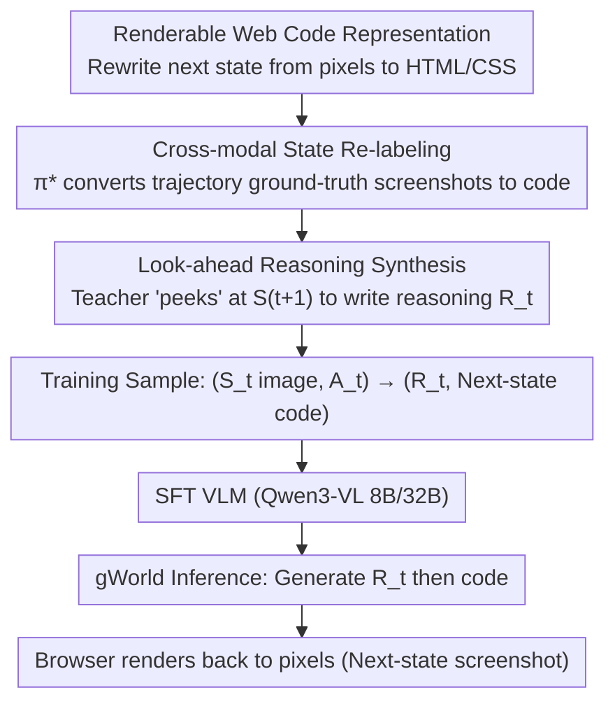

# Generative Visual Code Mobile World Models

**Conference**: ICML 2026  
**arXiv**: [2602.01576](https://arxiv.org/abs/2602.01576)  
**Code**: Yes (Paper provides Project Page, Code, gWorld 8B/32B weights, and MWMBench benchmark)  
**Area**: LLM Agent / Multimodal VLM / Mobile GUI World Model  
**Keywords**: Mobile GUI world model, renderable code generation, VLM post-training, cross-modal re-labeling, look-ahead reasoning

## TL;DR
The authors reformulate the "mobile GUI world model" as a new paradigm of "VLM generating renderable web code," and propose an automated data synthesis pipeline to rewrite policy trajectories into (image state, action) $\rightarrow$ (reasoning chain, next-state code) training samples. The resulting gWorld-8B/32B models achieve SOTA across 6 in/out-of-distribution benchmarks, improving average instruction accuracy by 27–46 percentage points and reducing rendering failure rates to $<1\%$.

## Background & Motivation

**Background**: Mobile GUI agents are a key research direction. A primary method for improvement is the introduction of a "World Model (WM)": given the current GUI state $S_t$ and action $A_t$, the model predicts the next state $S_{t+1}$ to enhance policies during training or perform rollout value estimation during inference. Existing WMs are generally categorized into: (1) **Text-based WMs**—compressing states into text descriptions, which loses critical visual information like icons, layout, fonts, and colors; (2) **Visual WMs**—directly generating the next GUI screenshot (e.g., VIMO uses a complex 5-stage pipeline involving OCR, box masks, and diffusion models).

**Limitations of Prior Work**: Text-based WMs sacrifice visual fidelity, making them incompatible with mainstream VLM policies. Pure pixel-based Visual WMs struggle in "text-dense + discrete layout" GUI scenarios; diffusion or autoregressive pixel models often produce unreadable text and distorted layouts, necessitating slow, complex, closed-source external pipelines. Furthermore, previous works like VIMO released data without weights, hindering replication.

**Key Challenge**: GUI states require both **pixel-level fidelity** (for grounding) and **symbolic precision** (accurate text, buttons, and lists). This duality forces "direct pixel prediction" into a dilemma—vision models excel at visuals but fail at text, while text models excel at text but lose visuals. Additionally, the authors observe that GUI transitions contain significant visual redundancy, leading pixel models to learn "approximate copying of $S_t$" as a degenerate solution, which fails to model action semantics despite high similarity metrics.

**Goal**: To create a **single self-contained model** for visual mobile GUI world modeling that satisfies: (a) pixel-level accuracy in text and layout; (b) end-to-end processing without multi-model pipelines; (c) large-scale synthetic training data; (d) retention of native coordinates for direct execution on real mobile devices.

**Key Insight**: Modern VLMs have encountered vast amounts of structured web code during pre-training and naturally excel at generating readable text. By representing the "next state" as **renderable web code** (HTML/CSS) and using a browser to render it back to pixels: VLM language priors ensure text and semantic quality, web code priors ensure structural layout, and the renderer "translates" symbolic output back to pixels. Thus, a single VLM handles both visual understanding and structured output.

**Core Idea**: Reformulate the world model from $p_\theta(S_{t+1}^{\text{image}} \mid S_t, A_t)$ to $p_\theta(R_t, S_{t+1}^{\text{code}} \mid S_t^{\text{image}}, A_t)$, where the VLM generates "reasoning followed by code" for the next state, and a browser renders the final pixels.

## Method

### Overall Architecture
gWorld shifts the representation of "predicting next GUI screenshot" into a code space: a standard VLM (Qwen3-VL 8B/32B) generates renderable web code for the next state. To enable this, the authors developed a data synthesis pipeline that automatically transforms existing mobile agent policy trajectories into training samples consisting of "(screenshot + action) $\rightarrow$ (reasoning chain + next-state code)." The model is refined via supervised fine-tuning (SFT) on 260,000 such samples.

### Key Designs

**1. Replacing Pixels with Renderable Web Code: Leveraging VLM language priors to bypass pixel errors**
Direct pixel generation often results in unreadable text or degenerate "copy-input" shortcuts. In ablation studies, Emu3.5 34B showed a Pearson correlation of $\rho=0.92$ between its output and the current state $S_t$, indicating it primarily performs identity mapping. By using $S_{t+1}^{\text{code}}$, the pixel consistency is offloaded to the browser renderer. VLM language priors ensure character-level text accuracy, while structural nodes require the model to actually understand the action to modify the DOM correctly (gWorld 32B correlation $\rho \approx 0.4$).

**2. Cross-modal State Re-labeling: Transferring policy trajectories to World Model data**
To avoid high manual labeling costs, the authors repurposed 3.7 million transitions from public mobile agent datasets (AitW, GUIO, AC, AMEX). They used a frontier model $\pi^*$ (Gemini 3 Flash) to perform image-to-code re-labeling: $S_t^{\text{code}} \leftarrow \pi^*(S_t^{\text{image}}, P^{\text{img-to-code}})$. Since the ground-truth pixels are provided to $\pi^*$, the resulting code reaches 100% renderability and IAcc., which is superior to zero-shot prediction from $(S_t^{\text{image}}, A_t)$.

**3. Look-ahead Reasoning Synthesis: Peeking at the future to decompose the task**
Generating complex code in one step is difficult for VLMs. The authors inserted a natural language reasoning chain $R_t$ before $S_{t+1}^{\text{code}}$. During training, the teacher model $\pi^*$ is allowed to "peek" at the ground-truth next state: $R_t \leftarrow \pi^*(S_t^{\text{image}}, A_t, S_{t+1}^{\text{image}}, P^{\text{look-ahead}})$. This forces the model to explain the state change before translating it into code. Although the student model cannot peek during inference, learning from "correct reasoning with the answer in mind" significantly outperforms blind reasoning.

### Loss & Training
The model uses standard SFT cross-entropy loss. The base models are Qwen3-VL 8B and 32B. Evaluation is performed using a joint score from three frontier VLMs (GPT-5 Mini, Claude 4.5 Haiku, Gemini 3 Flash) to eliminate model bias, combined with rule-based filters for renderability.

## Key Experimental Results

### Main Results
Evaluated on 4 in-distribution and 2 out-of-distribution (AndroidWorld, KApps) benchmarks against 8 baselines.

| Model | Params | Avg. IAcc. ↑ | Avg. Render Fail ↓ | Avg. Similarity ↑ |
|------|--------|------------|--------------|-----------------|
| Qwen-Image-Edit | 20B | 13.4 | — | 65.2 |
| Emu3.5 | 34B | 25.8 | — | 70.5 |
| Llama 4 | 402B-A17B | 55.7 | 9.2 | 62.4 |
| Qwen3-VL | 32B | 52.5 | 11.0 | 63.3 |
| Qwen3-VL | 235B-A22B | 51.5 | 29.5 | 67.6 |
| GLM-4.6V | 106B | 67.4 | 2.5 | 69.6 |
| **gWorld** | **8B** | **74.9** | **1.4** | **70.3** |
| **gWorld** | **32B** | **79.6** | **0.6** | **71.4** |

gWorld-8B outperforms Llama 4 402B and GLM-4.6V 106B in instruction accuracy. Compared to the base Qwen3-VL 32B, it improves IAcc. by 27.1 percentage points and reduces rendering failure from 11.0% to under 1%.

### Ablation Study

| Configuration | Key Metrics | Note |
|------|---------|------|
| Naive $S_{t+1}^{\text{code}}$ Synthesis | IAcc. 94.6% | No ground-truth pixel ref |
| **Ours: Cross-modal Re-labeling** | **IAcc. 100%** | +5.4% gain |
| No Look-ahead $R_t^*$ | Lower across 5 benchmarks | Blind reasoning |
| **Ours: Look-ahead $R_t$** | **Higher across 5 benchmarks** | Teacher peeks at future |
| gWorld 8B (Scaling) | $R^2 \geq 0.94$ | Performance far from saturated |

### Key Findings
- **Image models are "pseudo-strong"**: Emu3.5 34B has high similarity but low IAcc. (25.8%), as it simply copies the input. gWorld correctly models structural changes.
- **Data synthesis steps are essential**: Both re-labeling and look-ahead reasoning are necessary for semantic correctness.
- **Code handles photos well**: On photo-realistic GUI parts, performance only drops by 0.66%, indicating code representation is not a significant bottleneck.
- **Downstream gains**: Integrating gWorld 8B into an M3A agent for rollout value estimation improved success rates by +22.4 points compared to using the base VLM as a WM.

## Highlights & Insights
- **Paradigm shift**: Redefining visual world modeling as "structured code generation + deterministic rendering" leverages VLM language strengths to bypass generative visual weaknesses.
- **Future-peeking as supervision**: Look-ahead reasoning provides high-quality labels by explaining the "why" given the "result."
- **Data Leverage**: Converting existing policy trajectories into world model data provides a low-cost scaling path $(3.7M+ samples)$.

## Limitations & Future Work
- **Ceiling of code representation**: Pure HTML/CSS may lose information for videos or complex SVG icons.
- **Teacher dependency**: The pipeline relies on Gemini 3 Flash for labeling; open-source alternatives may vary in quality.
- **Domain specificity**: Currently validated on mobile; scalability to desktop (macOS/Windows) or game UIs requires different code schemas.
- **Inference latency**: Generating long reasoning chains and HTML strings is slower than single-step pixel diffusion.

## Related Work & Insights
- **Vs. VIMO**: gWorld replaces a 5-step pipeline with a single VLM + renderer, providing better accuracy and full weights.
- **Vs. Pixel-gen WM**: Proves that pure pixel paradigms are ineffective in symbol-dense GUI scenarios.
- **Insight**: The strategy of "using structure to replace pixels" can be generalized to document editing, presentation generation, and UI design tasks.

## Rating
- Novelty: ⭐⭐⭐⭐⭐ 
- Experimental Thoroughness: ⭐⭐⭐⭐⭐ 
- Writing Quality: ⭐⭐⭐⭐ 
- Value: ⭐⭐⭐⭐⭐ 

<!-- RELATED:START -->

## Related Papers

- [\[ICML 2026\] Threshold-Guided Optimization for Visual Generative Models](threshold-guided_optimization_for_visual_generative_models.md)
- [\[CVPR 2026\] Evaluating Generative Models via One-Dimensional Code Distributions](../../CVPR2026/image_generation/evaluating_generative_models_via_one-dimensional_code_distributions.md)
- [\[CVPR 2026\] A Style is Worth One Code: Unlocking Code-to-Style Image Generation with Discrete Style Space](../../CVPR2026/image_generation/a_style_is_worth_one_code_unlocking_code-to-style_image_generation_with_discrete.md)
- [\[ICML 2026\] Compression as Adaptation: Implicit Visual Representation with Diffusion Foundation Models](compression_as_adaptation_implicit_visual_representation_with_diffusion_foundati.md)
- [\[ICML 2026\] Conf-Gen: Conformal Uncertainty Quantification for Generative Models](conf-gen_conformal_uncertainty_quantification_for_generative_models.md)

<!-- RELATED:END -->
