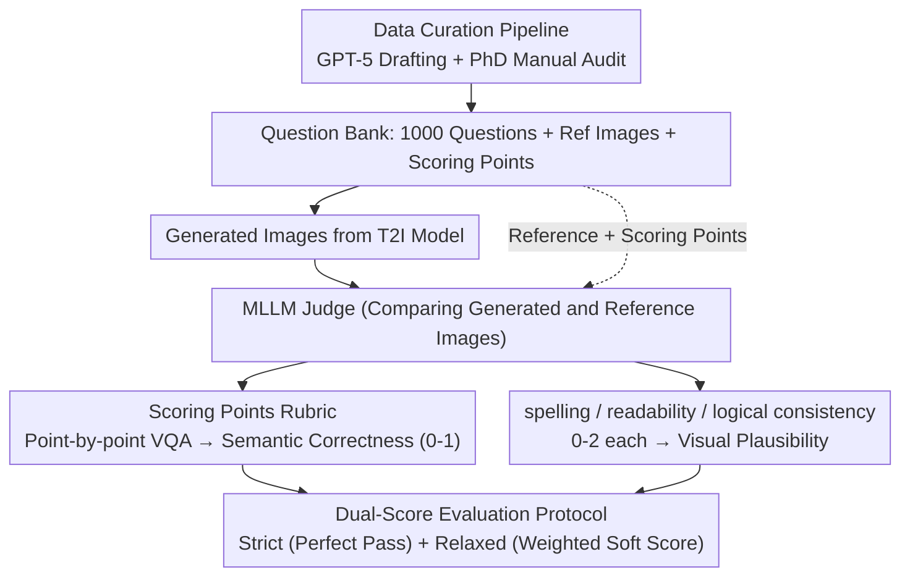

# GenExam: A Multidisciplinary Text-to-Image Exam

**Conference**: ICML 2026  
**arXiv**: [2509.14232](https://arxiv.org/abs/2509.14232)  
**Code**: https://github.com/OpenGVLab/GenExam (Available)  
**Area**: Multimodal VLM / Evaluation Benchmark / Text-to-Image Generation  
**Keywords**: Multidisciplinary Exam, Text-to-Image Evaluation, Scoring Points, MLLM-as-judge, GPT-Image-1.5

## TL;DR
GenExam adopts the "drawing exam" as the gold standard for measuring the integrated reasoning-understanding-generation capabilities of T2I models. By providing ground-truth images and fine-grained scoring points for 1000 questions across 10 disciplines, results reveal that even the strongest closed-source model, Nano Banana Pro, achieves only a 70.2% strict score, while most open-source T2I and unified MLLMs score below 3%.

## Background & Motivation

**Background**: Multidisciplinary reasoning has been evaluated by benchmarks such as MMLU, MMMU, and Humanity's Last Exam, but these are primarily "understanding" tasks. Existing multidisciplinary T2I benchmarks (MMMG, OneIG-Bench, SridBench) focus on "conceptual illustrations" with loose evaluation criteria, functioning more as "illustrating a concept" rather than "completing a rigorous drawing exam."

**Limitations of Prior Work**: Existing T2I evaluations suffer from: (i) short and broad prompts, (ii) lack of reference images and scoring rubrics, (iii) shallow knowledge coverage without hierarchical classification, and (iv) evaluation methods relying either on CLIP/VQA scores (which fail to capture disciplinary correctness) or vague MLLM-as-judge instructions (missing fine details). Consequently, hard errors like incorrect chemical bonds or improper geometric tangency cannot be identified.

**Key Challenge**: The priority for multidisciplinary images is semantic correctness rather than photorealism or aesthetics. A single misdrawn atom or a reversed arrow invalidates the entire image; however, general image evaluation metrics cannot capture such fine-grained errors.

**Goal**: (1) Construct a T2I benchmark similar to AP / A-level / IB drawing exams with standardized answers, scoring rubrics, and knowledge classification; (2) Design an automated evaluation protocol capable of reliably judging semantic correctness and visual plausibility; (3) Systematically expose the performance gaps of current T2I and unified MLLMs in disciplinary generation.

**Key Insight**: The scoring logic of professional exams is transferred to T2I evaluation. Each question includes a prompt, a reference image, and a list of "scoring points" (e.g., "Does the molecule contain exactly 8 C atoms?") co-developed by humans and GPT-5. An MLLM evaluates each scoring point as a VQA task (Yes/No), and scores are aggregated via weighted summation.

**Core Idea**: Evaluate T2I models like grading a drawing exam—calculate "semantic correctness" via customized scoring points first, then assess "visual plausibility" across three 0-2 point categories (spelling, readability, logical consistency), ultimately reporting both strict and relaxed scores.

## Method

### Overall Architecture
GenExam addresses the failure of general image metrics in capturing disciplinary correctness by decomposing a drawing exam question into a machine-evaluable trio: question bank, scoring rubrics, and a dual-dimension protocol. The question bank contains 1000 questions covering 10 primary disciplines (Math, Physics, Chemistry, Biology, CS, Geography, Economics, Music, History, Engineering), organized into a four-layer taxonomy (10/40/132/236) based on ISCED-F standards. Each question is paired with a ground-truth reference image, an exam-style prompt (average 74.8 words), and a set of scoring points. Instead of asking a judge for a vague verdict, the protocol calculates semantic correctness (0-1) via scoring points and visual plausibility by scoring spelling/logic/readability (0-2 each), yielding both strict and relaxed scores.

### Key Designs

**1. Data Curation Pipeline: Balancing Scale and Rigor via GPT-5 + Human Audit**

Given the inconsistent quality of web images and the high cost of manual curation, a two-layer pipeline was implemented. Keywords are generated based on the four-layer taxonomy, and candidates are filtered from web crawls and existing MLLM datasets. GPT-5 then filters these based on textual richness, disciplinary density, and complexity. For the remaining candidates, GPT-5 drafts prompts and scoring points, which are finally reviewed and revised by PhD annotators. The final 1000 questions consist of 38% Hard, 38% Medium, and 24% Easy questions, with prompt lengths ranging from 24 to 173 words.

**2. Scoring Points Rubric: Reducing "Image Correctness" to VQA Pairs**

Using single-instruction MLLM prompts to judge disciplinary images often overlooks critical details—such as the number of chemical bonds, geometric relations, or musical notes. GenExam explicitly extracts these constraints: for each question, GPT-5 drafts 3-14 (average 6.9) Yes/No scoring points (e.g., "Does the molecule contain exactly 8 carbon atoms?"), followed by manual refinement. During evaluation, the MLLM judge observes both the generated and reference images to answer Yes/No for each point. Semantic correctness is calculated as $\text{semantic} = \sum_i s_i \cdot \mathbb{1}[\text{answer}_i=\text{Yes}]$, where the sum of weights $s_i$ equals 1. This ensures that hard errors like a single missing bond are captured reliably.

**3. Dual-Score Evaluation Protocol (Strict + Relaxed): Characterizing Ceiling and Floor Performance**

A single metric fails to capture both the difficulty ceiling and model differences. GenExam reports two scores. The **Strict Score** represents the "perfect pass rate"—an image must satisfy all scoring points and receive full marks (2 points) for spelling, logic, and readability to be counted as 1; otherwise, it is 0. This highlights the high barrier to perfection. The **Relaxed Score** is a weighted soft score: $0.7\cdot\text{semantic}+0.1\cdot\text{spell}+0.1\cdot\text{logic}+0.1\cdot\text{read}$, with weights aligned to human preferences. This separates models clustered at the low end of the spectrum.

### Loss & Training
This work presents an evaluation benchmark and does not involve training. The only adjustable component is the MLLM judge—GPT-5 with low reasoning effort is used by default. The appendix demonstrates that alternatives like Gemini-3-Flash maintain high consistency with human judgment.

## Key Experimental Results

### Main Results
Strict and relaxed dual-scores measured across 17 models (selected):

| Model | Type | Strict ↑ | Relaxed ↑ |
|------|------|---------:|----------:|
| Nano Banana Pro | Closed | **70.2** | **93.0** |
| GPT-Image-1.5 | Closed | 42.5 | 81.5 |
| GPT-Image-1 | Closed | 13.1 | 62.2 |
| Seedream 4.5 | Closed | 12.3 | 59.5 |
| FLUX.2 max | Closed | 8.6 | 61.6 |
| FLUX.2 dev | Open T2I | 2.4 | 42.3 |
| Qwen-Image-2512 | Open T2I | 1.5 | 35.3 |
| BAGEL (thinking) | Open Unified MLLM | 0.0 | 12.9 |
| Janus-Pro | Open Unified MLLM | 0.0 | 9.5 |

Even the strongest closed-source models fail to reach a "passing" grade in strict terms, while most open-source T2I models are near zero. Open-source unified MLLMs scored 0.0 in strict evaluation, performing worse than specialized T2I models.

### Ablation Study

| Evaluator | Human Kendall $\tau$ | Pearson $r$ |
|--------|----------------------:|------------:|
| Relaxed by GPT-5 | **0.675** | **0.844** |
| Relaxed by Gemini-3-Flash | 0.661 | 0.826 |
| Semantic Correctness Only | 0.633 | 0.806 |
| VQA Score | 0.145 | 0.179 |
| CLIP Score | 0.116 | 0.165 |

The Mean Absolute Error (MAE) for various dimensions (Semantic: 0.10, Spelling: 0.11, Readability: 0.20, Logic: 0.28) is consistently low, indicating stable evaluation.

### Key Findings
- **Unified MLLMs underperform specialized T2I**: Open-source unified models like BAGEL and Show-o2 achieved a strict score of 0. Their relaxed scores were also lower than FLUX.2 dev, suggesting the "shared backbone for understanding and generation" approach is not yet viable for disciplinary images.
- **Bottleneck is visual execution, not knowledge**: In history questions, FLUX.2 dev correctly identified geographic locations for Egypt/Iran/India/China but failed to draw the corresponding graphical elements. The missing capability is "translating knowledge into readable imagery."
- **Failure of CLIP / VQA scores**: Correlation with human judgment was near 0.1, proving traditional T2I metrics cannot capture disciplinary correctness.
- **Open-source needs fundamental improvements**: Open-source models dropped most points in spelling and logical consistency. Improving text rendering and coordinate alignment is a prerequisite for disciplinary reasoning.

## Highlights & Insights
- **Explicit rubrics as a scalable paradigm**: Breaking down "correct/incorrect" into structured Yes/No lists makes the MLLM judge's MAE controllable and significantly improves correlation over traditional metrics. This approach is applicable to chart QA, code generation, and math evaluation.
- **Dual-metric design**: Strict scores highlight the difficulty ceiling, while relaxed scores reveal differences among low-performing models, preventing data compression at either extreme.
- **"Exam perspective" redefines T2I goals**: Shifting focus from fidelity/aesthetics to correctness/readability aligns more closely with testing "expert-level intelligence" on the path to AGI.
- **Reusable curation protocol**: The GPT-5 drafting + human audit pipeline can be directly applied to other benchmarks requiring detailed scoring criteria.

## Limitations & Future Work
- 1,000 questions may be insufficient for covering 10 disciplines and 4-layer taxonomy across all sub-fields (e.g., Music has only dozens of samples), limiting statistical stability in specific areas.
- Relying on frontier closed MLLMs (GPT-5/Gemini-3-Flash) for judging poses risks for long-term reproducibility and cost. Open-source judges showed lower human correlation.
- Weights for scoring points are currently averaged; they do not reflect the hierarchical importance of "main structure vs. minor details."
- The scope is limited to "drawing exams," leaving animations, videos, and 3D disciplinary visualizations for future work.

## Related Work & Insights
- **vs MMMU / MMLU / Humanity's Last Exam**: While these cover multidisciplinary exams, they target understanding; GenExam brings the same level of rigor to the generation domain.
- **vs MMMG / OneIG-Bench / SridBench**: Compared to other disciplinary T2I benchmarks, GenExam features longer prompts, harder constraints, and finer scoring.
- **Insight**: Implementing VQA-style scoring points provides a universal interface for model evaluation, suitable for multimodal reasoning, agent benchmarks, and code generation. The current disadvantage of unified architectures in generation suggests that "understanding + generation" shared backbones require further architectural refinement.

## Rating
- Novelty: ⭐⭐⭐⭐ First disciplinary-level T2I exam benchmark; scoring-points protocol is a significant innovation.
- Experimental Thoroughness: ⭐⭐⭐⭐⭐ 17 models × 10 disciplines × dual metrics + 5 human annotators for 250 tasks + multi-evaluator robustness check.
- Writing Quality: ⭐⭐⭐⭐ Clear charts and well-explained protocols.
- Value: ⭐⭐⭐⭐⭐ Provides the first "exam-grade" evaluation for the T2I community; likely to become a standard for unified MLLM performance.

<!-- RELATED:START -->

## Related Papers

- [\[ICML 2026\] WISE: A World Knowledge-Informed Semantic Evaluation for Text-to-Image Generation](wise_a_world_knowledge-informed_semantic_evaluation_for_text-to-image_generation.md)
- [\[ICML 2026\] RAIGen: Rare Attribute Identification in Text-to-Image Generative Models](raigen_rare_attribute_identification_in_text-to-image_generative_models.md)
- [\[ICML 2026\] Restoring Initial Noise Sensitivity in Text-to-Image Distillation via Geometric Alignment](restoring_initial_noise_sensitivity_in_text-to-image_distillation_via_geometric_.md)
- [\[ICML 2026\] Alignment-Guided Score Matching for Text-to-Image Alignment in Diffusion Models](alignment-guided_score_matching_for_text-to-image_alignment_in_diffusion_models.md)
- [\[ICML 2026\] GASS: Geometry-Aware Spherical Sampling for Disentangled Diversity Enhancement in Text-to-Image Generation](gass_geometry-aware_spherical_sampling_for_disentangled_diversity_enhancement_in.md)

<!-- RELATED:END -->
