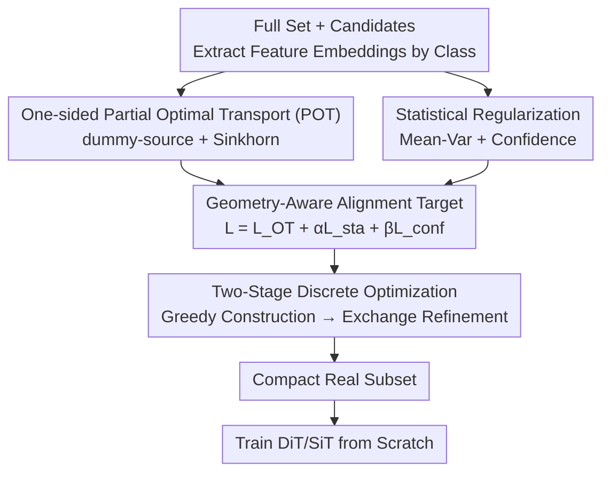

# Geometry-Aware Dataset Condensation for Diffusion Model Training

**Conference**: ICML2026  
**arXiv**: [2606.05883](https://arxiv.org/abs/2606.05883)  
**Code**: https://github.com/2018cx/GADC  
**Area**: Diffusion Models / Dataset Condensation  
**Keywords**: Dataset Condensation, Real Subset Selection, Partial Optimal Transport, Distribution Alignment, Diffusion Training

## TL;DR
Addressing the limitation where existing dataset condensation methods are unsuitable for training diffusion models, this paper reformulates real subset selection as a **geometry-aware distribution alignment problem**. It defines the alignment target via one-sided Partial Optimal Transport (POT) combined with statistical regularization, and solves it through a two-stage discrete optimization (greedy + exchange). On ImageNet, training DiT/SiT with only 0.8% of the data achieves an FID significantly lower than the previous strongest baseline D2C (3.43 vs. 4.20 under a 10K budget).

## Background & Motivation

**Background**: Dataset condensation aims to preserve the knowledge of an entire dataset using fewer samples. Approaches are divided into two categories: **synthetic** (gradient optimization of images in pixel space) and **real subset selection** (selecting a small subset of real samples from the original data). Most methods are designed for discriminative tasks like classification.

**Limitations of Prior Work**: The goal of diffusion model training is to **model the data distribution itself** (maximizing likelihood/ELBO) rather than learning decision boundaries. Synthetic condensation performs gradient optimization in continuous pixel space, which introduces high variance, noise, and distorts fine-grained structures and distribution characteristics—artifacts to which diffusion models are extremely sensitive. Real subset selection preserves high-fidelity structures of real samples, but existing methods (K-center, Herding, CCS, Dataset Quantization, etc.) rely on **fixed or heuristic criteria** for one-time selection without optimizing an objective aligned with diffusion training. The only work specifically for diffusion, D2C, assigns a scalar score based on "diffusion difficulty" and samples intervals along this one-dimensional axis—however, one-dimensional ranking collapses multi-modal distributions into scalars, ignoring the manifold structure of the data.

**Key Challenge**: Diffusion training requires **distribution-level alignment** (preserving geometry and global diversity of the data support), while existing selection strategies provide **scalar-level ranking or heuristic coverage**. This mismatch leads to subsets that are misaligned with the real distribution, biasing the likelihood objective. Furthermore, even with an alignment target, the "one-pass greedy" approaches used in most methods lack the capability to reliably optimize it in a discrete combinatorial space.

**Goal**: (i) How to perform principled distribution matching in the feature space; (ii) how to prevent alignment degradation when a severe capacity mismatch exists between a tiny budget and the full set; (iii) the extent to which auxiliary constraints can enhance the geometric shaping of Optimal Transport (OT).

**Key Insight**: The authors define "geometry" as the **geometry of the distribution support in the representation space** and utilize OT for principled distribution matching—OT naturally captures both global coverage and local geometric structures.

**Core Idea**: Real subset selection is reformulated as a "geometry-aware distribution alignment + discrete selection constraint" problem. One-sided **Partial OT (POT)** is used to concentrate transport quality on high-density core manifolds, while statistical/semantic regularization completes distribution fidelity. Finally, a two-stage discrete optimization solves this combinatorial problem at scale.

## Method

### Overall Architecture

The workflow starts by encoding the full set and candidate subset samples into feature embeddings (processed independently per class to ensure balanced coverage); a **distribution alignment objective** is defined in the feature space, consisting of three components: one-sided Partial OT (geometric alignment), mean-variance regularization (statistical fidelity), and confidence regularization (semantic reliability). Since this objective is discrete regarding sample selection, it is solved using **two-stage discrete optimization**—starting with a greedy construction to establish wide manifold coverage for initialization, followed by swap-based refinement to correct early short-sighted selections. The resulting compact real subset is used to train diffusion models (DiT/SiT) from scratch. For efficiency, the POT cost is computed in parallel using entropy-regularized Sinkhorn iterations in a mini-batch format.

### Key Designs

**1. One-sided Partial Optimal Transport (POT): Concentrating Transport Quality on the Core Manifold**

To address the issue where "classical OT forces full alignment, pushing the subset away from the core manifold," the authors relax the target-side constraints. The mass of the source samples (selected subset) must be fully transported, but the target side (full set) only needs to be partially satisfied under capacity constraints:

$$\min_{\bm{\pi}\ge0}\langle\mathbf{C},\bm{\pi}\rangle\quad\text{s.t.}\quad\bm{\pi}\mathbf{1}_n=\bm{\mu},\ \bm{\pi}^\top\mathbf{1}_m\le\kappa\bar{\bm{\nu}}$$

where cost $\mathbf{C}_{ij}=\|\mathbf{x}_i-\mathbf{y}_j\|_2^2$ and $\kappa$ is the capacity scaling factor. $\kappa=1$ degrades to balanced OT, while $\kappa>1$ allows part of the target mass to remain unmatched, thereby concentrating transport on high-density, geometrically stable regions. This directly addresses the problem where balanced matching under severe capacity mismatch spreads mass to peripheral low-density areas, making the alignment uninformative. To solve this efficiently, the authors use a **dummy-source trick** to convert the unbalanced problem back to balanced OT: the cost matrix is augmented with a row $\mathbf{C}_{\mathrm{aug}}=[\mathbf{C};\delta\mathbf{1}_n^\top]$ (where $\delta=\mathrm{median}(\mathbf{C})\cdot\gamma$), introducing a dummy row providing $s=\kappa-1$ mass to absorb excess target capacity. Entropy regularization and **Sinkhorn iterations** are then applied, and the transport loss $\mathcal{L}_{\mathrm{OT}}=\langle\mathbf{C},\mathbf{T}_{\mathrm{real}}\rangle$ is calculated by discarding the dummy row. This approach preserves geometric alignment with the core manifold while allowing batch-parallel computation on candidate subsets, ensuring scalability.

**2. Statistical Regularization: Complementing Distribution Fidelity and Semantic Reliability**

While OT cost handles geometric alignment, it does not explicitly guarantee distribution statistics or semantic clarity. Thus, the authors add two lightweight regularizers. **Mean-variance regularization** $\mathcal{L}_{\mathrm{sta}}=\|\bm{\mu}_\mathcal{S}-\bm{\mu}_\mathcal{T}\|_2^2+\|\bm{\sigma}_\mathcal{S}-\bm{\sigma}_\mathcal{T}\|_1^2$ forces the selected subset's first and second-order feature statistics to approximate the full set, preserving the global distribution shape. **Confidence regularization** $\mathcal{L}_{\mathrm{conf}}=\frac{1}{m}\sum_i-\log p(c|\mathbf{x}_i)$ uses predicted class probabilities to penalize low-confidence or off-category samples, which would otherwise act as unreliable geometric anchors. The final objective is $\mathcal{L}=\mathcal{L}_{\mathrm{OT}}+\alpha\mathcal{L}_{\mathrm{sta}}+\beta\mathcal{L}_{\mathrm{conf}}$. Ablations show both are useful; notably, removing $\mathcal{L}_{\mathrm{sta}}$ degrades FID from 3.43 to 4.62, proving that geometric alignment alone is insufficient.

**3. Two-Stage Discrete Optimization: Greedy Coverage + Exchange Refinement**

To solve the problem where "one-pass greedy selection cannot reliably optimize alignment in the discrete space $\binom{|\mathcal{T}_c|}{m}$," the authors design a two-stage solver **directly optimizing the same alignment objective** $\mathcal{L}$. **Stage I: Greedy Geometric-Guided Selection**: Starting from an empty set, each step evaluates the marginal gain $\Delta\mathcal{L}(x_k)=\mathcal{L}(\mathcal{S}_c^{(t-1)}\cup\{x_k\})-\mathcal{L}(\mathcal{S}_c^{(t-1)})$ for each unselected candidate $x_k$, adding the sample that minimizes incremental cost until $m$ samples are chosen. This quickly establishes an initialization with wide manifold coverage. **Stage II: Exchange-based Refinement**: For each selected $x_i$ and unselected $x_j$, the algorithm attempts to swap $x_i$ with $x_j$ and calculates the improvement $\Delta_{i\to j}=\mathcal{L}(\mathcal{S}_c')-\mathcal{L}(\mathcal{S}_c)$. If $\Delta_{i\to j}<0$, the swap is accepted (choosing the best candidate if multiple exist) until no further improvements are possible. Stage II specifically corrects short-sighted errors made during the early greedy stages. Ablations show that under a 50K budget, adding Stage II reduces FID from 12.87 to 11.01.

### Loss & Training

The alignment objective is $\mathcal{L}=\mathcal{L}_{\mathrm{OT}}+\alpha\mathcal{L}_{\mathrm{sta}}+\beta\mathcal{L}_{\mathrm{conf}}$, with $\alpha,\beta$ balancing the terms. POT is solved internally using entropy-regularized Sinkhorn (Gibbs kernel $\mathbf{K}=\exp(-\mathbf{C}_{\mathrm{aug}}/\varepsilon)$, alternating updates for scaling vectors $\mathbf{u},\mathbf{v}$). Key hyperparameters are capacity scaling $\kappa$ and dummy-source coefficient $\gamma$. Once the subset is selected, DiT-L/2 or SiT-L/2 is trained from scratch using standard diffusion objectives. This method only modifies the training data without changing the model architecture.

## Key Experimental Results

### Main Results

Evaluated on ImageNet-1K with 10K/50K/100K subsets (approx. 0.8%/4%/8%), at 256×256 and 512×512 resolutions. DiT-L/2 and SiT-L/2 were trained from scratch for 100K iterations. FID/IS/Precision/Recall were calculated using 50K generated samples. Baselines include Random, K-Center, Herding, CCS, DQ, and D2C.

DiT-L/2 metrics at 256×256 with 10K budget (100K iterations):

| Method | FID↓ | IS↑ | Precision↑ | Recall↑ |
|------|------|-----|-----------|---------|
| Random† | 4.63 | 263.1 | 0.70 | 0.26 |
| CCS | 5.45 | 364.9 | 0.77 | 0.21 |
| DQ | 4.56 | 267.8 | 0.72 | 0.25 |
| D2C | 4.20 | 283.6 | 0.72 | 0.24 |
| **Ours** | **3.43** | **414.3** | **0.78** | **0.28** |

FID-50K across budgets (DiT-L/2, 256×256, 100K iterations):

| Data Budget | Random | K-Center | Herding | D2C | Ours |
|----------|--------|----------|---------|-----|------|
| 0.8% (10K) | 35.86 | 50.77 | 40.75 | 4.20 | **3.43** |
| 4.0% (50K) | 36.78 | 69.86 | 32.38 | 14.81 | **11.01** |
| 8.0% (100K) | 41.02 | 71.31 | 36.37 | 22.55 | **17.09** |

Improvements are even more significant at 512×512 (10K budget): FID drops from D2C's 14.8 to 6.17, while IS jumps from 109.2 to 451.0. Results for SiT-L/2 show a similar lead (FID 11.21→7.26 at 50K budget).

### Ablation Study

Component ablation (256×256, 10K budget, 100K iterations):

| Configuration | FID↓ | IS↑ | Description |
|------|------|-----|------|
| w/o $\mathcal{L}_{\mathrm{OT}}$ | 3.82 | 414.1 | Removing geometric alignment drops Recall to 0.26 |
| w/o $\mathcal{L}_{\mathrm{sta}}$ | 4.62 | 451.6 | Removing statistical regularization has most impact on FID |
| w/o $\mathcal{L}_{\mathrm{conf}}$ | 3.55 | 337.0 | Removing semantic regularization slightly raises FID |
| balanced OT (no partial) | 3.54 | 413.9 | Using standard balanced OT |
| **Ours (full)** | **3.43** | 414.3 | Complete model |

Stage II ablation: Improving FID from 3.82 to 3.43 (10K) and 12.87 to 11.01 (50K). Exchange refinement consistently provides a 0.4–1.9 FID gain.

### Key Findings
- **$\mathcal{L}_{\mathrm{sta}}$ is the largest contributor**: Removing statistical regularization degrades FID from 3.43 to 4.62, proving that global moment matching is essential alongside OT.
- **One-sided partial > balanced OT**: Balanced OT (3.54) underperforms the partial version (3.43), confirming that relaxing the target side to concentrate mass on the core manifold is effective.
- **Lower budgets benefit more from selection**: For a fixed 100K iterations, a 10K subset sample is seen ~1280 times v.s. ~128 times for a 100K subset. High-quality selection on a small budget accelerates convergence by focusing on a geometrically consistent manifold.
- **Robust across resolutions/variants**: Stability across 256→512 and DiT→SiT indicates the selected subset captures scale-consistent intrinsic semantics.

## Highlights & Insights
- **Reframing Selection as Alignment**: Recognizes that diffusion training needs distribution matching rather than scalar ranking, using OT—a tool natively designed for distribution matching—to replace D2C's 1D axis.
- **Engineering of One-sided POT + Dummy-source**: Transforming unbalanced POT to balanced OT allows batch Sinkhorn processing, making the "core manifold" geometric motivation computationally feasible at ImageNet scale.
- **Two-stage Discrete Solver**: The "greedy-then-exchange" paradigm directly optimizes an alignment target, providing a transferable discrete optimization framework for other coreset selection tasks.

## Limitations & Future Work
- **Dependency on Encoders/Classifiers**: Requires a classifier for probabilities and an encoder for feature space alignment; quality depends on the pre-trained representation (though sensitivity tests suggest relative robustness).
- **Class-independent Processing**: POT is performed per class for balanced coverage, meaning inter-class geometric relations are not explicitly modeled, which may require adjustment for extremely imbalanced or fine-grained datasets.
- **Hyperparameter Sensitivity**: $\kappa, \gamma, \alpha, \beta$ require tuning. While the paper provides analysis, re-calibration might be needed when transferring to new datasets.

## Related Work & Insights
- **vs. D2C**: D2C samples along a 1D difficulty axis, collapsing multi-modal structures. Ours uses OT in representation space to preserve both geometric and distributional structures.
- **vs. Synthetic Condensation**: Synthetic methods optimize in pixel space, suffering from high variance and mode collapse. Ours selects real images, preserving high-fidelity structures crucial for diffusion.
- **vs. Classic Selection (K-Center/Herding/CCS/DQ)**: These use fixed criteria—K-Center favors outliers, Herding overfits the global mean, and DQ's binning collapses internal geometry. Ours explicitly optimizes a distribution alignment target aligned with training goals.

## Rating
- Novelty: ⭐⭐⭐⭐ Reframing diffusion condensation as geometry-aware alignment via one-sided POT is a novel perspective.
- Experimental Thoroughness: ⭐⭐⭐⭐⭐ Comprehensive across budgets, resolutions, variants, and detailed ablations.
- Writing Quality: ⭐⭐⭐⭐ Clear motivation and complete formulations, though OT derivations may be dense for some readers.
- Value: ⭐⭐⭐⭐ Significantly reduces FID with only 0.8% data, practical for resource-constrained diffusion training.

<!-- RELATED:START -->

## Related Papers

- [\[CVPR 2026\] D2C: Accelerating Diffusion Model Training under Minimal Budgets via Condensation](../../CVPR2026/image_generation/d2c_diffusion_dataset_condensation.md)
- [\[ICML 2026\] Geometry-Aware Tabular Diffusion](geometry-aware_tabular_diffusion.md)
- [\[ICML 2026\] Rethinking FID Through the Geometry of the Reference Dataset](rethinking_fid_through_the_geometry_of_the_reference_dataset.md)
- [\[CVPR 2026\] SPREAD: Spatial-Physical REasoning via geometry Aware Diffusion](../../CVPR2026/image_generation/spread_spatial-physical_reasoning_via_geometry_aware_diffusion.md)
- [\[ICML 2026\] GASS: Geometry-Aware Spherical Sampling for Disentangled Diversity Enhancement in Text-to-Image Generation](gass_geometry-aware_spherical_sampling_for_disentangled_diversity_enhancement_in.md)

<!-- RELATED:END -->
